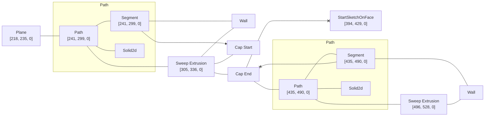

```mermaid
flowchart LR
  subgraph path2 [Path]
    2["Path<br>[241, 299, 0]"]
    3["Segment<br>[241, 299, 0]"]
    4[Solid2d]
  end
  subgraph path9 [Path]
    9["Path<br>[435, 490, 0]"]
    10["Segment<br>[435, 490, 0]"]
    11[Solid2d]
  end
  1["Plane<br>[218, 235, 0]"]
  5["Sweep Extrusion<br>[305, 336, 0]"]
  6[Wall]
  7["Cap Start"]
  8["Cap End"]
  12["Sweep Extrusion<br>[496, 528, 0]"]
  13[Wall]
  14["StartSketchOnFace<br>[394, 429, 0]"]
  1 --- 2
  2 --- 3
  2 ---- 5
  2 --- 4
  3 --- 6
  3 x--> 7
  5 --- 6
  5 --- 7
  5 --- 8
  8 --- 9
  9 --- 10
  9 ---- 12
  9 --- 11
  10 --- 13
  10 <--x 8
  12 --- 13
  8 <--x 14
```
