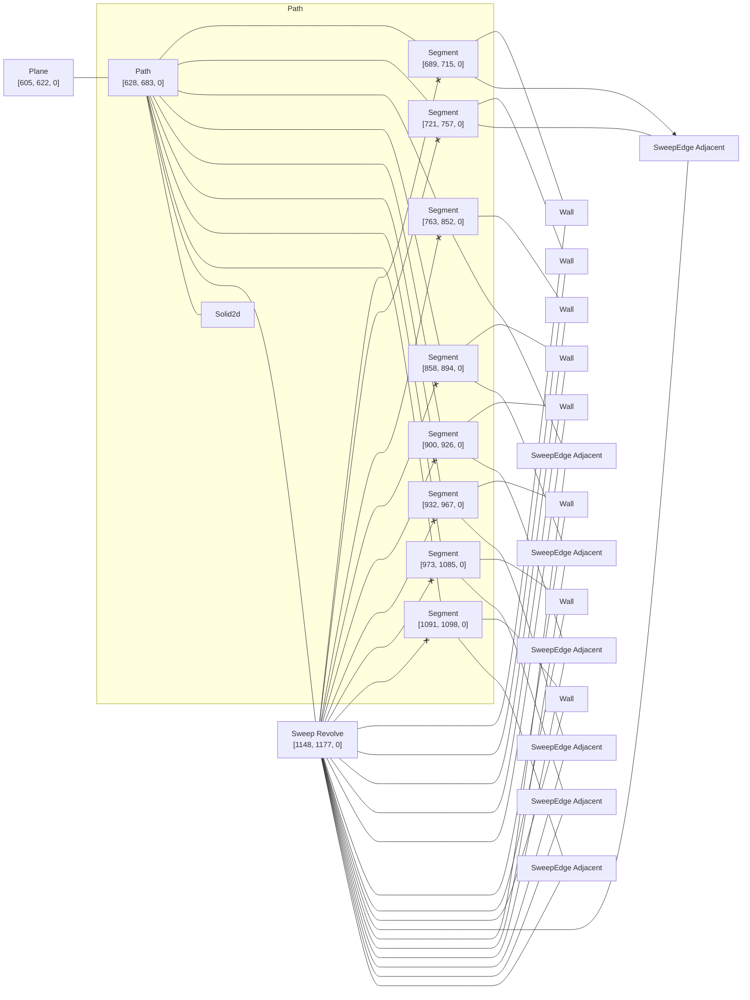

```mermaid
flowchart LR
  subgraph path2 [Path]
    2["Path<br>[628, 683, 0]"]
    3["Segment<br>[689, 715, 0]"]
    4["Segment<br>[721, 757, 0]"]
    5["Segment<br>[763, 852, 0]"]
    6["Segment<br>[858, 894, 0]"]
    7["Segment<br>[900, 926, 0]"]
    8["Segment<br>[932, 967, 0]"]
    9["Segment<br>[973, 1085, 0]"]
    10["Segment<br>[1091, 1098, 0]"]
    11[Solid2d]
  end
  1["Plane<br>[605, 622, 0]"]
  12["Sweep Revolve<br>[1148, 1177, 0]"]
  13[Wall]
  14[Wall]
  15[Wall]
  16[Wall]
  17[Wall]
  18[Wall]
  19[Wall]
  20[Wall]
  21["SweepEdge Adjacent"]
  22["SweepEdge Adjacent"]
  23["SweepEdge Adjacent"]
  24["SweepEdge Adjacent"]
  25["SweepEdge Adjacent"]
  26["SweepEdge Adjacent"]
  27["SweepEdge Adjacent"]
  1 --- 2
  2 --- 3
  2 --- 4
  2 --- 5
  2 --- 6
  2 --- 7
  2 --- 8
  2 --- 9
  2 --- 10
  2 ---- 12
  2 --- 11
  3 --- 13
  3 x--> 21
  4 --- 14
  4 --- 21
  5 --- 15
  5 --- 22
  6 --- 16
  6 --- 23
  7 --- 17
  7 --- 24
  8 --- 18
  8 --- 25
  9 --- 19
  9 --- 26
  10 --- 20
  10 --- 27
  12 --- 13
  12 --- 14
  12 --- 15
  12 --- 16
  12 --- 17
  12 --- 18
  12 --- 19
  12 --- 20
  12 <--x 3
  12 --- 21
  12 <--x 4
  12 <--x 5
  12 --- 22
  12 <--x 6
  12 --- 23
  12 <--x 7
  12 --- 24
  12 <--x 8
  12 --- 25
  12 <--x 9
  12 --- 26
  12 <--x 10
  12 --- 27
```
