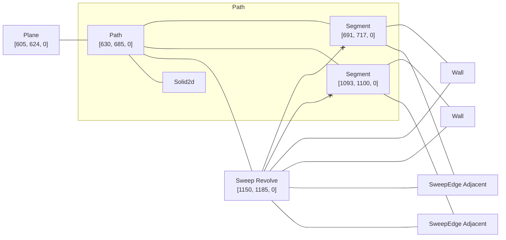

```mermaid
flowchart LR
  subgraph path2 [Path]
    2["Path<br>[630, 685, 0]"]
    3["Segment<br>[691, 717, 0]"]
    4["Segment<br>[1093, 1100, 0]"]
    5[Solid2d]
  end
  1["Plane<br>[605, 624, 0]"]
  6["Sweep Revolve<br>[1150, 1185, 0]"]
  7[Wall]
  8[Wall]
  9["SweepEdge Adjacent"]
  10["SweepEdge Adjacent"]
  1 --- 2
  2 --- 3
  2 --- 4
  2 ---- 6
  2 --- 5
  3 --- 7
  3 --- 9
  4 --- 8
  4 --- 10
  6 --- 7
  6 --- 8
  6 <--x 3
  6 --- 9
  6 <--x 4
  6 --- 10
```
