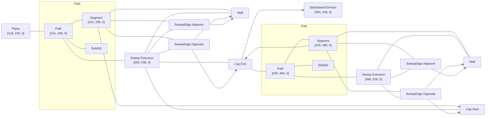

```mermaid
flowchart LR
  subgraph path2 [Path]
    2["Path<br>[241, 299, 0]"]
    3["Segment<br>[241, 299, 0]"]
    4[Solid2d]
  end
  subgraph path11 [Path]
    11["Path<br>[435, 490, 0]"]
    12["Segment<br>[435, 490, 0]"]
    13[Solid2d]
  end
  1["Plane<br>[218, 235, 0]"]
  5["Sweep Extrusion<br>[305, 336, 0]"]
  6[Wall]
  7["Cap Start"]
  8["Cap End"]
  9["SweepEdge Opposite"]
  10["SweepEdge Adjacent"]
  14["Sweep Extrusion<br>[496, 528, 0]"]
  15[Wall]
  16["SweepEdge Opposite"]
  17["SweepEdge Adjacent"]
  18["StartSketchOnFace<br>[394, 429, 0]"]
  1 --- 2
  2 --- 3
  2 ---- 5
  2 --- 4
  3 --- 6
  3 --- 9
  3 --- 10
  3 x--> 7
  5 --- 6
  5 --- 7
  5 --- 8
  5 --- 9
  5 --- 10
  8 --- 11
  9 <--x 6
  9 <--x 8
  10 <--x 6
  11 --- 12
  11 ---- 14
  11 --- 13
  12 --- 15
  12 --- 16
  12 --- 17
  12 <--x 8
  14 --- 15
  14 --- 16
  14 --- 17
  16 <--x 15
  16 <--x 7
  17 <--x 15
  8 <--x 18
```
