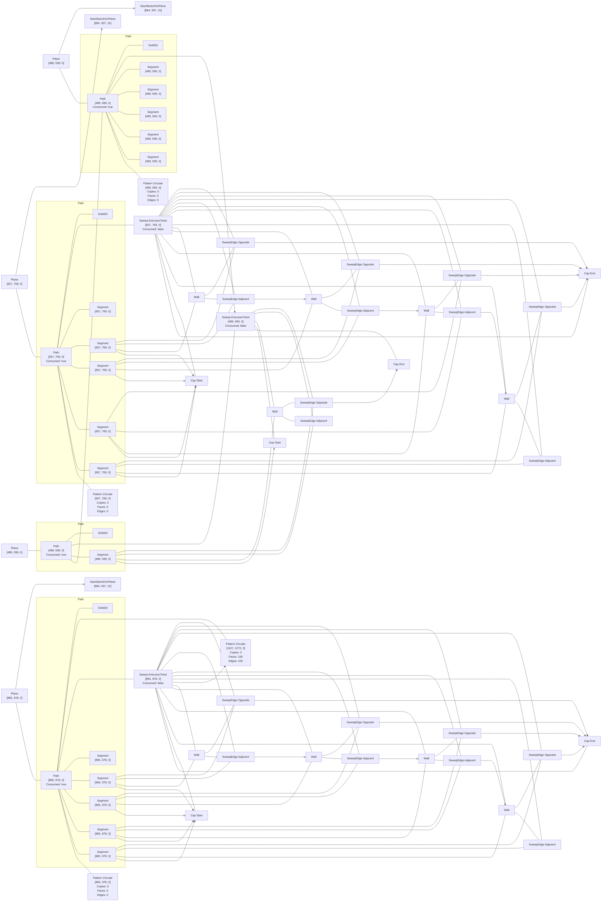

```mermaid
flowchart LR
  subgraph path16 [Path]
    16["Path<br>[489, 599, 0]<br>Consumed: true"]
      %% [ProgramBodyItem { index: 0 }, ExpressionStatementExpr]
    22["Segment<br>[489, 599, 0]"]
      %% [ProgramBodyItem { index: 0 }, ExpressionStatementExpr]
    23["Segment<br>[489, 599, 0]"]
      %% [ProgramBodyItem { index: 0 }, ExpressionStatementExpr]
    24["Segment<br>[489, 599, 0]"]
      %% [ProgramBodyItem { index: 0 }, ExpressionStatementExpr]
    25["Segment<br>[489, 599, 0]"]
      %% [ProgramBodyItem { index: 0 }, ExpressionStatementExpr]
    26["Segment<br>[489, 599, 0]"]
      %% [ProgramBodyItem { index: 0 }, ExpressionStatementExpr]
    50[Solid2d]
  end
  subgraph path17 [Path]
    17["Path<br>[489, 599, 0]<br>Consumed: true"]
      %% [ProgramBodyItem { index: 0 }, ExpressionStatementExpr]
    21["Segment<br>[489, 599, 0]"]
      %% [ProgramBodyItem { index: 0 }, ExpressionStatementExpr]
    51[Solid2d]
  end
  subgraph path28 [Path]
    28["Path<br>[657, 769, 0]<br>Consumed: true"]
      %% [ProgramBodyItem { index: 1 }, ExpressionStatementExpr, PipeBodyItem { index: 0 }]
    31["Segment<br>[657, 769, 0]"]
      %% [ProgramBodyItem { index: 1 }, ExpressionStatementExpr, PipeBodyItem { index: 0 }]
    32["Segment<br>[657, 769, 0]"]
      %% [ProgramBodyItem { index: 1 }, ExpressionStatementExpr, PipeBodyItem { index: 0 }]
    33["Segment<br>[657, 769, 0]"]
      %% [ProgramBodyItem { index: 1 }, ExpressionStatementExpr, PipeBodyItem { index: 0 }]
    34["Segment<br>[657, 769, 0]"]
      %% [ProgramBodyItem { index: 1 }, ExpressionStatementExpr, PipeBodyItem { index: 0 }]
    35["Segment<br>[657, 769, 0]"]
      %% [ProgramBodyItem { index: 1 }, ExpressionStatementExpr, PipeBodyItem { index: 0 }]
    52[Solid2d]
  end
  subgraph path37 [Path]
    37["Path<br>[865, 978, 0]<br>Consumed: true"]
      %% [ProgramBodyItem { index: 3 }, VariableDeclarationDeclaration, VariableDeclarationInit]
    40["Segment<br>[865, 978, 0]"]
      %% [ProgramBodyItem { index: 3 }, VariableDeclarationDeclaration, VariableDeclarationInit]
    41["Segment<br>[865, 978, 0]"]
      %% [ProgramBodyItem { index: 3 }, VariableDeclarationDeclaration, VariableDeclarationInit]
    42["Segment<br>[865, 978, 0]"]
      %% [ProgramBodyItem { index: 3 }, VariableDeclarationDeclaration, VariableDeclarationInit]
    43["Segment<br>[865, 978, 0]"]
      %% [ProgramBodyItem { index: 3 }, VariableDeclarationDeclaration, VariableDeclarationInit]
    44["Segment<br>[865, 978, 0]"]
      %% [ProgramBodyItem { index: 3 }, VariableDeclarationDeclaration, VariableDeclarationInit]
    53[Solid2d]
  end
  1["Cap End"]
    %% face_code_ref=Missing NodePath
  2["Cap End"]
    %% face_code_ref=Missing NodePath
  3["Cap End"]
    %% face_code_ref=Missing NodePath
  4["Cap Start"]
    %% face_code_ref=Missing NodePath
  5["Cap Start"]
    %% face_code_ref=Missing NodePath
  6["Cap Start"]
    %% face_code_ref=Missing NodePath
  7[Wall]
    %% face_code_ref=Missing NodePath
  8[Wall]
    %% face_code_ref=Missing NodePath
  9[Wall]
    %% face_code_ref=Missing NodePath
  10[Wall]
    %% face_code_ref=Missing NodePath
  11[Wall]
    %% face_code_ref=Missing NodePath
  12[Wall]
    %% face_code_ref=Missing NodePath
  13[Wall]
    %% face_code_ref=Missing NodePath
  14[Wall]
    %% face_code_ref=Missing NodePath
  15[Wall]
    %% face_code_ref=Missing NodePath
  18["Pattern Circular<br>[489, 599, 0]<br>Copies: 0<br>Faces: 0<br>Edges: 0"]
    %% [ProgramBodyItem { index: 0 }, ExpressionStatementExpr]
  19["Plane<br>[489, 599, 0]"]
    %% [ProgramBodyItem { index: 0 }, ExpressionStatementExpr]
  20["Plane<br>[489, 599, 0]"]
    %% [ProgramBodyItem { index: 0 }, ExpressionStatementExpr]
  27["Sweep ExtrusionTwist<br>[489, 599, 0]<br>Consumed: false"]
    %% [ProgramBodyItem { index: 0 }, ExpressionStatementExpr]
  29["Pattern Circular<br>[657, 769, 0]<br>Copies: 0<br>Faces: 0<br>Edges: 0"]
    %% [ProgramBodyItem { index: 1 }, ExpressionStatementExpr, PipeBodyItem { index: 0 }]
  30["Plane<br>[657, 769, 0]"]
    %% [ProgramBodyItem { index: 1 }, ExpressionStatementExpr, PipeBodyItem { index: 0 }]
  36["Sweep ExtrusionTwist<br>[657, 769, 0]<br>Consumed: false"]
    %% [ProgramBodyItem { index: 1 }, ExpressionStatementExpr, PipeBodyItem { index: 0 }]
  38["Pattern Circular<br>[865, 978, 0]<br>Copies: 0<br>Faces: 0<br>Edges: 0"]
    %% [ProgramBodyItem { index: 3 }, VariableDeclarationDeclaration, VariableDeclarationInit]
  39["Plane<br>[865, 978, 0]"]
    %% [ProgramBodyItem { index: 3 }, VariableDeclarationDeclaration, VariableDeclarationInit]
  45["Sweep ExtrusionTwist<br>[865, 978, 0]<br>Consumed: false"]
    %% [ProgramBodyItem { index: 3 }, VariableDeclarationDeclaration, VariableDeclarationInit]
  46["Pattern Circular<br>[1107, 1272, 0]<br>Copies: 3<br>Faces: 150<br>Edges: 432"]
    %% [ProgramBodyItem { index: 4 }, ExpressionStatementExpr, PipeBodyItem { index: 1 }]
  47["StartSketchOnPlane<br>[884, 937, 15]"]
    %% [ProgramBodyItem { index: 0 }, VariableDeclarationDeclaration, VariableDeclarationInit, FunctionExpressionBody, FunctionExpressionBodyItem { index: 8 }, ReturnStatementArg, PipeBodyItem { index: 0 }]
  48["StartSketchOnPlane<br>[884, 937, 15]"]
    %% [ProgramBodyItem { index: 0 }, VariableDeclarationDeclaration, VariableDeclarationInit, FunctionExpressionBody, FunctionExpressionBodyItem { index: 8 }, ReturnStatementArg, PipeBodyItem { index: 0 }]
  49["StartSketchOnPlane<br>[884, 937, 15]"]
    %% [ProgramBodyItem { index: 0 }, VariableDeclarationDeclaration, VariableDeclarationInit, FunctionExpressionBody, FunctionExpressionBodyItem { index: 8 }, ReturnStatementArg, PipeBodyItem { index: 0 }]
  54["SweepEdge Adjacent"]
  55["SweepEdge Adjacent"]
  56["SweepEdge Adjacent"]
  57["SweepEdge Adjacent"]
  58["SweepEdge Adjacent"]
  59["SweepEdge Adjacent"]
  60["SweepEdge Adjacent"]
  61["SweepEdge Adjacent"]
  62["SweepEdge Adjacent"]
  63["SweepEdge Opposite"]
  64["SweepEdge Opposite"]
  65["SweepEdge Opposite"]
  66["SweepEdge Opposite"]
  67["SweepEdge Opposite"]
  68["SweepEdge Opposite"]
  69["SweepEdge Opposite"]
  70["SweepEdge Opposite"]
  71["SweepEdge Opposite"]
  27 --- 1
  63 <--x 1
  36 --- 2
  64 <--x 2
  65 <--x 2
  66 <--x 2
  67 <--x 2
  45 --- 3
  68 <--x 3
  69 <--x 3
  70 <--x 3
  71 <--x 3
  21 <--x 4
  27 --- 4
  31 <--x 5
  32 <--x 5
  33 <--x 5
  34 <--x 5
  36 --- 5
  40 <--x 6
  41 <--x 6
  42 <--x 6
  43 <--x 6
  45 --- 6
  21 --- 7
  27 --- 7
  7 --- 54
  7 --- 63
  31 --- 8
  36 --- 8
  8 --- 55
  56 <--x 8
  8 --- 64
  32 --- 9
  36 --- 9
  9 --- 56
  57 <--x 9
  9 --- 65
  33 --- 10
  36 --- 10
  10 --- 57
  58 <--x 10
  10 --- 66
  34 --- 11
  36 --- 11
  11 --- 58
  11 --- 67
  40 --- 12
  45 --- 12
  12 --- 59
  60 <--x 12
  12 --- 68
  41 --- 13
  45 --- 13
  13 --- 60
  61 <--x 13
  13 --- 69
  42 --- 14
  45 --- 14
  14 --- 61
  62 <--x 14
  14 --- 70
  43 --- 15
  45 --- 15
  15 --- 62
  15 --- 71
  17 --- 16
  16 --- 18
  19 --- 16
  16 --- 22
  16 --- 23
  16 --- 24
  16 --- 25
  16 --- 26
  16 x---> 27
  16 --- 50
  20 --- 17
  17 --- 21
  17 ---- 27
  17 --- 51
  19 <--x 47
  21 --- 54
  21 --- 63
  27 --- 54
  27 --- 63
  28 --- 29
  30 --- 28
  28 --- 31
  28 --- 32
  28 --- 33
  28 --- 34
  28 --- 35
  28 ---- 36
  28 --- 52
  30 <--x 48
  31 --- 55
  31 --- 64
  32 --- 56
  32 --- 65
  33 --- 57
  33 --- 66
  34 --- 58
  34 --- 67
  36 --- 55
  36 --- 56
  36 --- 57
  36 --- 58
  36 --- 64
  36 --- 65
  36 --- 66
  36 --- 67
  37 --- 38
  39 --- 37
  37 --- 40
  37 --- 41
  37 --- 42
  37 --- 43
  37 --- 44
  37 ---- 45
  37 --- 46
  37 --- 53
  39 <--x 49
  40 --- 59
  40 --- 68
  41 --- 60
  41 --- 69
  42 --- 61
  42 --- 70
  43 --- 62
  43 --- 71
  45 x--> 46
  45 --- 59
  45 --- 60
  45 --- 61
  45 --- 62
  45 --- 68
  45 --- 69
  45 --- 70
  45 --- 71
```
