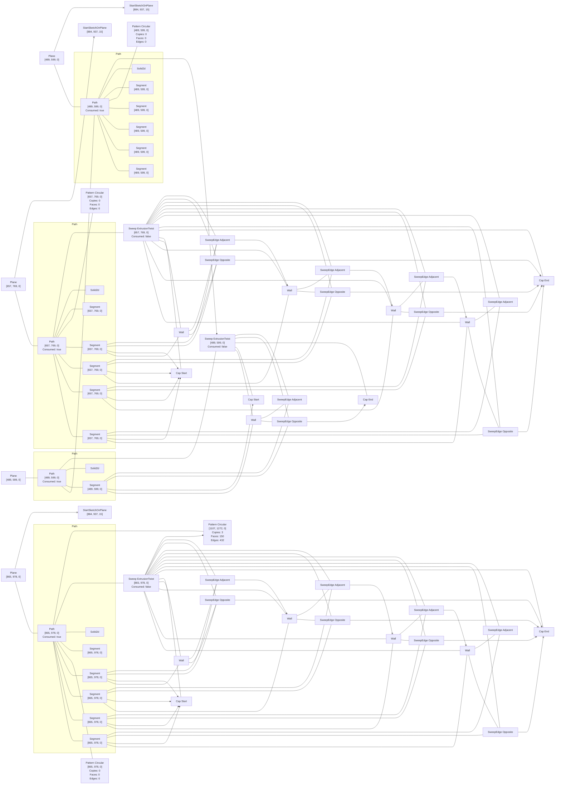

```mermaid
flowchart LR
  subgraph path2 [Path]
    2["Path<br>[489, 599, 0]<br>Consumed: true"]
      %% [ProgramBodyItem { index: 0 }, ExpressionStatementExpr]
    3["Segment<br>[489, 599, 0]"]
      %% [ProgramBodyItem { index: 0 }, ExpressionStatementExpr]
    4["Segment<br>[489, 599, 0]"]
      %% [ProgramBodyItem { index: 0 }, ExpressionStatementExpr]
    5["Segment<br>[489, 599, 0]"]
      %% [ProgramBodyItem { index: 0 }, ExpressionStatementExpr]
    6["Segment<br>[489, 599, 0]"]
      %% [ProgramBodyItem { index: 0 }, ExpressionStatementExpr]
    8["Segment<br>[489, 599, 0]"]
      %% [ProgramBodyItem { index: 0 }, ExpressionStatementExpr]
    9[Solid2d]
  end
  subgraph path11 [Path]
    11["Path<br>[489, 599, 0]<br>Consumed: true"]
      %% [ProgramBodyItem { index: 0 }, ExpressionStatementExpr]
    12["Segment<br>[489, 599, 0]"]
      %% [ProgramBodyItem { index: 0 }, ExpressionStatementExpr]
    13[Solid2d]
  end
  subgraph path21 [Path]
    21["Path<br>[657, 769, 0]<br>Consumed: true"]
      %% [ProgramBodyItem { index: 1 }, ExpressionStatementExpr, PipeBodyItem { index: 0 }]
    22["Segment<br>[657, 769, 0]"]
      %% [ProgramBodyItem { index: 1 }, ExpressionStatementExpr, PipeBodyItem { index: 0 }]
    23["Segment<br>[657, 769, 0]"]
      %% [ProgramBodyItem { index: 1 }, ExpressionStatementExpr, PipeBodyItem { index: 0 }]
    24["Segment<br>[657, 769, 0]"]
      %% [ProgramBodyItem { index: 1 }, ExpressionStatementExpr, PipeBodyItem { index: 0 }]
    25["Segment<br>[657, 769, 0]"]
      %% [ProgramBodyItem { index: 1 }, ExpressionStatementExpr, PipeBodyItem { index: 0 }]
    27["Segment<br>[657, 769, 0]"]
      %% [ProgramBodyItem { index: 1 }, ExpressionStatementExpr, PipeBodyItem { index: 0 }]
    28[Solid2d]
  end
  subgraph path45 [Path]
    45["Path<br>[865, 978, 0]<br>Consumed: true"]
      %% [ProgramBodyItem { index: 3 }, VariableDeclarationDeclaration, VariableDeclarationInit]
    46["Segment<br>[865, 978, 0]"]
      %% [ProgramBodyItem { index: 3 }, VariableDeclarationDeclaration, VariableDeclarationInit]
    47["Segment<br>[865, 978, 0]"]
      %% [ProgramBodyItem { index: 3 }, VariableDeclarationDeclaration, VariableDeclarationInit]
    48["Segment<br>[865, 978, 0]"]
      %% [ProgramBodyItem { index: 3 }, VariableDeclarationDeclaration, VariableDeclarationInit]
    49["Segment<br>[865, 978, 0]"]
      %% [ProgramBodyItem { index: 3 }, VariableDeclarationDeclaration, VariableDeclarationInit]
    51["Segment<br>[865, 978, 0]"]
      %% [ProgramBodyItem { index: 3 }, VariableDeclarationDeclaration, VariableDeclarationInit]
    52[Solid2d]
  end
  1["Plane<br>[489, 599, 0]"]
    %% [ProgramBodyItem { index: 0 }, ExpressionStatementExpr]
  7["Pattern Circular<br>[489, 599, 0]<br>Copies: 0<br>Faces: 0<br>Edges: 0"]
    %% [ProgramBodyItem { index: 0 }, ExpressionStatementExpr]
  10["Plane<br>[489, 599, 0]"]
    %% [ProgramBodyItem { index: 0 }, ExpressionStatementExpr]
  14["Sweep ExtrusionTwist<br>[489, 599, 0]<br>Consumed: false"]
    %% [ProgramBodyItem { index: 0 }, ExpressionStatementExpr]
  15[Wall]
    %% face_code_ref=Missing NodePath
  16["Cap Start"]
    %% face_code_ref=Missing NodePath
  17["Cap End"]
    %% face_code_ref=Missing NodePath
  18["SweepEdge Opposite"]
  19["SweepEdge Adjacent"]
  20["Plane<br>[657, 769, 0]"]
    %% [ProgramBodyItem { index: 1 }, ExpressionStatementExpr, PipeBodyItem { index: 0 }]
  26["Pattern Circular<br>[657, 769, 0]<br>Copies: 0<br>Faces: 0<br>Edges: 0"]
    %% [ProgramBodyItem { index: 1 }, ExpressionStatementExpr, PipeBodyItem { index: 0 }]
  29["Sweep ExtrusionTwist<br>[657, 769, 0]<br>Consumed: false"]
    %% [ProgramBodyItem { index: 1 }, ExpressionStatementExpr, PipeBodyItem { index: 0 }]
  30[Wall]
    %% face_code_ref=Missing NodePath
  31[Wall]
    %% face_code_ref=Missing NodePath
  32[Wall]
    %% face_code_ref=Missing NodePath
  33[Wall]
    %% face_code_ref=Missing NodePath
  34["Cap Start"]
    %% face_code_ref=Missing NodePath
  35["Cap End"]
    %% face_code_ref=Missing NodePath
  36["SweepEdge Opposite"]
  37["SweepEdge Adjacent"]
  38["SweepEdge Opposite"]
  39["SweepEdge Adjacent"]
  40["SweepEdge Opposite"]
  41["SweepEdge Adjacent"]
  42["SweepEdge Opposite"]
  43["SweepEdge Adjacent"]
  44["Plane<br>[865, 978, 0]"]
    %% [ProgramBodyItem { index: 3 }, VariableDeclarationDeclaration, VariableDeclarationInit]
  50["Pattern Circular<br>[865, 978, 0]<br>Copies: 0<br>Faces: 0<br>Edges: 0"]
    %% [ProgramBodyItem { index: 3 }, VariableDeclarationDeclaration, VariableDeclarationInit]
  53["Sweep ExtrusionTwist<br>[865, 978, 0]<br>Consumed: false"]
    %% [ProgramBodyItem { index: 3 }, VariableDeclarationDeclaration, VariableDeclarationInit]
  54[Wall]
    %% face_code_ref=Missing NodePath
  55[Wall]
    %% face_code_ref=Missing NodePath
  56[Wall]
    %% face_code_ref=Missing NodePath
  57[Wall]
    %% face_code_ref=Missing NodePath
  58["Cap Start"]
    %% face_code_ref=Missing NodePath
  59["Cap End"]
    %% face_code_ref=Missing NodePath
  60["SweepEdge Opposite"]
  61["SweepEdge Adjacent"]
  62["SweepEdge Opposite"]
  63["SweepEdge Adjacent"]
  64["SweepEdge Opposite"]
  65["SweepEdge Adjacent"]
  66["SweepEdge Opposite"]
  67["SweepEdge Adjacent"]
  68["Pattern Circular<br>[1107, 1272, 0]<br>Copies: 3<br>Faces: 150<br>Edges: 432"]
    %% [ProgramBodyItem { index: 4 }, ExpressionStatementExpr, PipeBodyItem { index: 1 }]
  69["StartSketchOnPlane<br>[884, 937, 15]"]
    %% [ProgramBodyItem { index: 0 }, VariableDeclarationDeclaration, VariableDeclarationInit, FunctionExpressionBody, FunctionExpressionBodyItem { index: 8 }, ReturnStatementArg, PipeBodyItem { index: 0 }]
  70["StartSketchOnPlane<br>[884, 937, 15]"]
    %% [ProgramBodyItem { index: 0 }, VariableDeclarationDeclaration, VariableDeclarationInit, FunctionExpressionBody, FunctionExpressionBodyItem { index: 8 }, ReturnStatementArg, PipeBodyItem { index: 0 }]
  71["StartSketchOnPlane<br>[884, 937, 15]"]
    %% [ProgramBodyItem { index: 0 }, VariableDeclarationDeclaration, VariableDeclarationInit, FunctionExpressionBody, FunctionExpressionBodyItem { index: 8 }, ReturnStatementArg, PipeBodyItem { index: 0 }]
  1 --- 2
  1 <--x 69
  2 --- 3
  2 --- 4
  2 --- 5
  2 --- 6
  2 --- 7
  2 --- 8
  2 --- 9
  11 --- 2
  2 x---> 14
  10 --- 11
  11 --- 12
  11 --- 13
  11 ---- 14
  12 --- 15
  12 x--> 16
  12 --- 18
  12 --- 19
  14 --- 15
  14 --- 16
  14 --- 17
  14 --- 18
  14 --- 19
  15 --- 18
  15 --- 19
  18 <--x 17
  20 --- 21
  20 <--x 70
  21 --- 22
  21 --- 23
  21 --- 24
  21 --- 25
  21 --- 26
  21 --- 27
  21 --- 28
  21 ---- 29
  22 --- 30
  22 x--> 34
  22 --- 36
  22 --- 37
  23 --- 31
  23 x--> 34
  23 --- 38
  23 --- 39
  24 --- 32
  24 x--> 34
  24 --- 40
  24 --- 41
  25 --- 33
  25 x--> 34
  25 --- 42
  25 --- 43
  29 --- 30
  29 --- 31
  29 --- 32
  29 --- 33
  29 --- 34
  29 --- 35
  29 --- 36
  29 --- 37
  29 --- 38
  29 --- 39
  29 --- 40
  29 --- 41
  29 --- 42
  29 --- 43
  30 --- 36
  30 --- 37
  39 <--x 30
  31 --- 38
  31 --- 39
  41 <--x 31
  32 --- 40
  32 --- 41
  43 <--x 32
  33 --- 42
  33 --- 43
  36 <--x 35
  38 <--x 35
  40 <--x 35
  42 <--x 35
  44 --- 45
  44 <--x 71
  45 --- 46
  45 --- 47
  45 --- 48
  45 --- 49
  45 --- 50
  45 --- 51
  45 --- 52
  45 ---- 53
  45 --- 68
  46 --- 54
  46 x--> 58
  46 --- 60
  46 --- 61
  47 --- 55
  47 x--> 58
  47 --- 62
  47 --- 63
  48 --- 56
  48 x--> 58
  48 --- 64
  48 --- 65
  49 --- 57
  49 x--> 58
  49 --- 66
  49 --- 67
  53 --- 54
  53 --- 55
  53 --- 56
  53 --- 57
  53 --- 58
  53 --- 59
  53 --- 60
  53 --- 61
  53 --- 62
  53 --- 63
  53 --- 64
  53 --- 65
  53 --- 66
  53 --- 67
  53 x--> 68
  54 --- 60
  54 --- 61
  63 <--x 54
  55 --- 62
  55 --- 63
  65 <--x 55
  56 --- 64
  56 --- 65
  67 <--x 56
  57 --- 66
  57 --- 67
  60 <--x 59
  62 <--x 59
  64 <--x 59
  66 <--x 59
```
