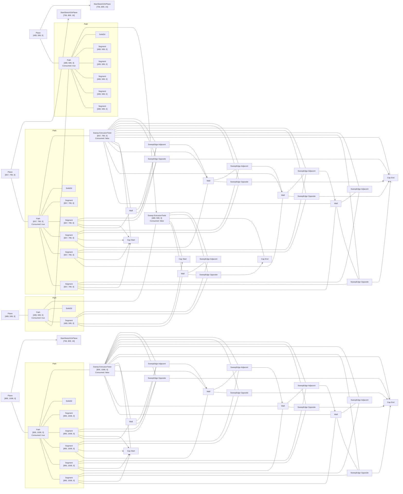

```mermaid
flowchart LR
  subgraph path2 [Path]
    2["Path<br>[489, 599, 0]<br>Consumed: true"]
      %% [ProgramBodyItem { index: 0 }, ExpressionStatementExpr]
    3["Segment<br>[489, 599, 0]"]
      %% [ProgramBodyItem { index: 0 }, ExpressionStatementExpr]
    4["Segment<br>[489, 599, 0]"]
      %% [ProgramBodyItem { index: 0 }, ExpressionStatementExpr]
    5["Segment<br>[489, 599, 0]"]
      %% [ProgramBodyItem { index: 0 }, ExpressionStatementExpr]
    6["Segment<br>[489, 599, 0]"]
      %% [ProgramBodyItem { index: 0 }, ExpressionStatementExpr]
    7["Segment<br>[489, 599, 0]"]
      %% [ProgramBodyItem { index: 0 }, ExpressionStatementExpr]
    8[Solid2d]
  end
  subgraph path10 [Path]
    10["Path<br>[489, 599, 0]<br>Consumed: true"]
      %% [ProgramBodyItem { index: 0 }, ExpressionStatementExpr]
    11["Segment<br>[489, 599, 0]"]
      %% [ProgramBodyItem { index: 0 }, ExpressionStatementExpr]
    12[Solid2d]
  end
  subgraph path20 [Path]
    20["Path<br>[657, 799, 0]<br>Consumed: true"]
      %% [ProgramBodyItem { index: 1 }, ExpressionStatementExpr, PipeBodyItem { index: 0 }]
    21["Segment<br>[657, 799, 0]"]
      %% [ProgramBodyItem { index: 1 }, ExpressionStatementExpr, PipeBodyItem { index: 0 }]
    22["Segment<br>[657, 799, 0]"]
      %% [ProgramBodyItem { index: 1 }, ExpressionStatementExpr, PipeBodyItem { index: 0 }]
    23["Segment<br>[657, 799, 0]"]
      %% [ProgramBodyItem { index: 1 }, ExpressionStatementExpr, PipeBodyItem { index: 0 }]
    24["Segment<br>[657, 799, 0]"]
      %% [ProgramBodyItem { index: 1 }, ExpressionStatementExpr, PipeBodyItem { index: 0 }]
    25["Segment<br>[657, 799, 0]"]
      %% [ProgramBodyItem { index: 1 }, ExpressionStatementExpr, PipeBodyItem { index: 0 }]
    26[Solid2d]
  end
  subgraph path43 [Path]
    43["Path<br>[895, 1008, 0]<br>Consumed: true"]
      %% [ProgramBodyItem { index: 3 }, VariableDeclarationDeclaration, VariableDeclarationInit]
    44["Segment<br>[895, 1008, 0]"]
      %% [ProgramBodyItem { index: 3 }, VariableDeclarationDeclaration, VariableDeclarationInit]
    45["Segment<br>[895, 1008, 0]"]
      %% [ProgramBodyItem { index: 3 }, VariableDeclarationDeclaration, VariableDeclarationInit]
    46["Segment<br>[895, 1008, 0]"]
      %% [ProgramBodyItem { index: 3 }, VariableDeclarationDeclaration, VariableDeclarationInit]
    47["Segment<br>[895, 1008, 0]"]
      %% [ProgramBodyItem { index: 3 }, VariableDeclarationDeclaration, VariableDeclarationInit]
    48["Segment<br>[895, 1008, 0]"]
      %% [ProgramBodyItem { index: 3 }, VariableDeclarationDeclaration, VariableDeclarationInit]
    49[Solid2d]
  end
  1["Plane<br>[489, 599, 0]"]
    %% [ProgramBodyItem { index: 0 }, ExpressionStatementExpr]
  9["Plane<br>[489, 599, 0]"]
    %% [ProgramBodyItem { index: 0 }, ExpressionStatementExpr]
  13["Sweep ExtrusionTwist<br>[489, 599, 0]<br>Consumed: false"]
    %% [ProgramBodyItem { index: 0 }, ExpressionStatementExpr]
  14[Wall]
    %% face_code_ref=Missing NodePath
  15["Cap Start"]
    %% face_code_ref=Missing NodePath
  16["Cap End"]
    %% face_code_ref=Missing NodePath
  17["SweepEdge Opposite"]
  18["SweepEdge Adjacent"]
  19["Plane<br>[657, 799, 0]"]
    %% [ProgramBodyItem { index: 1 }, ExpressionStatementExpr, PipeBodyItem { index: 0 }]
  27["Sweep ExtrusionTwist<br>[657, 799, 0]<br>Consumed: false"]
    %% [ProgramBodyItem { index: 1 }, ExpressionStatementExpr, PipeBodyItem { index: 0 }]
  28[Wall]
    %% face_code_ref=Missing NodePath
  29[Wall]
    %% face_code_ref=Missing NodePath
  30[Wall]
    %% face_code_ref=Missing NodePath
  31[Wall]
    %% face_code_ref=Missing NodePath
  32["Cap Start"]
    %% face_code_ref=Missing NodePath
  33["Cap End"]
    %% face_code_ref=Missing NodePath
  34["SweepEdge Opposite"]
  35["SweepEdge Adjacent"]
  36["SweepEdge Opposite"]
  37["SweepEdge Adjacent"]
  38["SweepEdge Opposite"]
  39["SweepEdge Adjacent"]
  40["SweepEdge Opposite"]
  41["SweepEdge Adjacent"]
  42["Plane<br>[895, 1008, 0]"]
    %% [ProgramBodyItem { index: 3 }, VariableDeclarationDeclaration, VariableDeclarationInit]
  50["Sweep ExtrusionTwist<br>[895, 1008, 0]<br>Consumed: false"]
    %% [ProgramBodyItem { index: 3 }, VariableDeclarationDeclaration, VariableDeclarationInit]
  51[Wall]
    %% face_code_ref=Missing NodePath
  52[Wall]
    %% face_code_ref=Missing NodePath
  53[Wall]
    %% face_code_ref=Missing NodePath
  54[Wall]
    %% face_code_ref=Missing NodePath
  55["Cap Start"]
    %% face_code_ref=Missing NodePath
  56["Cap End"]
    %% face_code_ref=Missing NodePath
  57["SweepEdge Opposite"]
  58["SweepEdge Adjacent"]
  59["SweepEdge Opposite"]
  60["SweepEdge Adjacent"]
  61["SweepEdge Opposite"]
  62["SweepEdge Adjacent"]
  63["SweepEdge Opposite"]
  64["SweepEdge Adjacent"]
  65["StartSketchOnPlane<br>[756, 809, 16]"]
    %% [ProgramBodyItem { index: 0 }, VariableDeclarationDeclaration, VariableDeclarationInit, FunctionExpressionBody, FunctionExpressionBodyItem { index: 7 }, ReturnStatementArg, PipeBodyItem { index: 0 }]
  66["StartSketchOnPlane<br>[756, 809, 16]"]
    %% [ProgramBodyItem { index: 0 }, VariableDeclarationDeclaration, VariableDeclarationInit, FunctionExpressionBody, FunctionExpressionBodyItem { index: 7 }, ReturnStatementArg, PipeBodyItem { index: 0 }]
  67["StartSketchOnPlane<br>[756, 809, 16]"]
    %% [ProgramBodyItem { index: 0 }, VariableDeclarationDeclaration, VariableDeclarationInit, FunctionExpressionBody, FunctionExpressionBodyItem { index: 7 }, ReturnStatementArg, PipeBodyItem { index: 0 }]
  1 --- 2
  1 <--x 65
  2 --- 3
  2 --- 4
  2 --- 5
  2 --- 6
  2 --- 7
  2 --- 8
  10 --- 2
  2 x---> 13
  9 --- 10
  10 --- 11
  10 --- 12
  10 ---- 13
  11 --- 14
  11 x--> 15
  11 --- 17
  11 --- 18
  13 --- 14
  13 --- 15
  13 --- 16
  13 --- 17
  13 --- 18
  14 --- 17
  14 --- 18
  17 <--x 16
  19 --- 20
  19 <--x 66
  20 --- 21
  20 --- 22
  20 --- 23
  20 --- 24
  20 --- 25
  20 --- 26
  20 ---- 27
  21 --- 28
  21 x--> 32
  21 --- 34
  21 --- 35
  22 --- 29
  22 x--> 32
  22 --- 36
  22 --- 37
  23 --- 30
  23 x--> 32
  23 --- 38
  23 --- 39
  24 --- 31
  24 x--> 32
  24 --- 40
  24 --- 41
  27 --- 28
  27 --- 29
  27 --- 30
  27 --- 31
  27 --- 32
  27 --- 33
  27 --- 34
  27 --- 35
  27 --- 36
  27 --- 37
  27 --- 38
  27 --- 39
  27 --- 40
  27 --- 41
  28 --- 34
  28 --- 35
  37 <--x 28
  29 --- 36
  29 --- 37
  39 <--x 29
  30 --- 38
  30 --- 39
  41 <--x 30
  31 --- 40
  31 --- 41
  34 <--x 33
  36 <--x 33
  38 <--x 33
  40 <--x 33
  42 --- 43
  42 <--x 67
  43 --- 44
  43 --- 45
  43 --- 46
  43 --- 47
  43 --- 48
  43 --- 49
  43 ---- 50
  44 --- 51
  44 x--> 55
  44 --- 57
  44 --- 58
  45 --- 52
  45 x--> 55
  45 --- 59
  45 --- 60
  46 --- 53
  46 x--> 55
  46 --- 61
  46 --- 62
  47 --- 54
  47 x--> 55
  47 --- 63
  47 --- 64
  50 --- 51
  50 --- 52
  50 --- 53
  50 --- 54
  50 --- 55
  50 --- 56
  50 --- 57
  50 --- 58
  50 --- 59
  50 --- 60
  50 --- 61
  50 --- 62
  50 --- 63
  50 --- 64
  51 --- 57
  51 --- 58
  60 <--x 51
  52 --- 59
  52 --- 60
  62 <--x 52
  53 --- 61
  53 --- 62
  64 <--x 53
  54 --- 63
  54 --- 64
  57 <--x 56
  59 <--x 56
  61 <--x 56
  63 <--x 56
```
