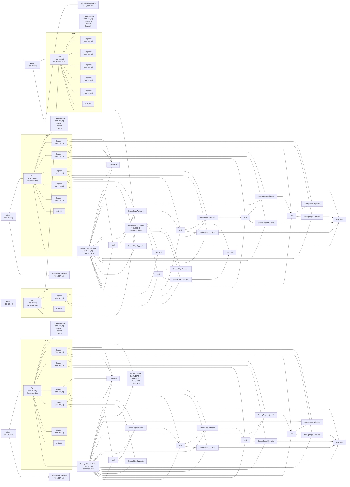

```mermaid
flowchart LR
  subgraph path7 [Path]
    7["Path<br>[489, 599, 0]<br>Consumed: true"]
      %% [ProgramBodyItem { index: 0 }, ExpressionStatementExpr]
    20["Segment<br>[489, 599, 0]"]
      %% [ProgramBodyItem { index: 0 }, ExpressionStatementExpr]
    21["Segment<br>[489, 599, 0]"]
      %% [ProgramBodyItem { index: 0 }, ExpressionStatementExpr]
    22["Segment<br>[489, 599, 0]"]
      %% [ProgramBodyItem { index: 0 }, ExpressionStatementExpr]
    23["Segment<br>[489, 599, 0]"]
      %% [ProgramBodyItem { index: 0 }, ExpressionStatementExpr]
    24["Segment<br>[489, 599, 0]"]
      %% [ProgramBodyItem { index: 0 }, ExpressionStatementExpr]
    35[Solid2d]
  end
  subgraph path8 [Path]
    8["Path<br>[489, 599, 0]<br>Consumed: true"]
      %% [ProgramBodyItem { index: 0 }, ExpressionStatementExpr]
    19["Segment<br>[489, 599, 0]"]
      %% [ProgramBodyItem { index: 0 }, ExpressionStatementExpr]
    36[Solid2d]
  end
  subgraph path9 [Path]
    9["Path<br>[657, 769, 0]<br>Consumed: true"]
      %% [ProgramBodyItem { index: 1 }, ExpressionStatementExpr, PipeBodyItem { index: 0 }]
    25["Segment<br>[657, 769, 0]"]
      %% [ProgramBodyItem { index: 1 }, ExpressionStatementExpr, PipeBodyItem { index: 0 }]
    26["Segment<br>[657, 769, 0]"]
      %% [ProgramBodyItem { index: 1 }, ExpressionStatementExpr, PipeBodyItem { index: 0 }]
    27["Segment<br>[657, 769, 0]"]
      %% [ProgramBodyItem { index: 1 }, ExpressionStatementExpr, PipeBodyItem { index: 0 }]
    28["Segment<br>[657, 769, 0]"]
      %% [ProgramBodyItem { index: 1 }, ExpressionStatementExpr, PipeBodyItem { index: 0 }]
    29["Segment<br>[657, 769, 0]"]
      %% [ProgramBodyItem { index: 1 }, ExpressionStatementExpr, PipeBodyItem { index: 0 }]
    37[Solid2d]
  end
  subgraph path10 [Path]
    10["Path<br>[865, 978, 0]<br>Consumed: true"]
      %% [ProgramBodyItem { index: 3 }, VariableDeclarationDeclaration, VariableDeclarationInit]
    30["Segment<br>[865, 978, 0]"]
      %% [ProgramBodyItem { index: 3 }, VariableDeclarationDeclaration, VariableDeclarationInit]
    31["Segment<br>[865, 978, 0]"]
      %% [ProgramBodyItem { index: 3 }, VariableDeclarationDeclaration, VariableDeclarationInit]
    32["Segment<br>[865, 978, 0]"]
      %% [ProgramBodyItem { index: 3 }, VariableDeclarationDeclaration, VariableDeclarationInit]
    33["Segment<br>[865, 978, 0]"]
      %% [ProgramBodyItem { index: 3 }, VariableDeclarationDeclaration, VariableDeclarationInit]
    34["Segment<br>[865, 978, 0]"]
      %% [ProgramBodyItem { index: 3 }, VariableDeclarationDeclaration, VariableDeclarationInit]
    38[Solid2d]
  end
  1["Cap End"]
    %% face_code_ref=Missing NodePath
  2["Cap End"]
    %% face_code_ref=Missing NodePath
  3["Cap End"]
    %% face_code_ref=Missing NodePath
  4["Cap Start"]
    %% face_code_ref=Missing NodePath
  5["Cap Start"]
    %% face_code_ref=Missing NodePath
  6["Cap Start"]
    %% face_code_ref=Missing NodePath
  11["Pattern Circular<br>[1107, 1272, 0]<br>Copies: 3<br>Faces: 150<br>Edges: 432"]
    %% [ProgramBodyItem { index: 4 }, ExpressionStatementExpr, PipeBodyItem { index: 1 }]
  12["Pattern Circular<br>[489, 599, 0]<br>Copies: 0<br>Faces: 0<br>Edges: 0"]
    %% [ProgramBodyItem { index: 0 }, ExpressionStatementExpr]
  13["Pattern Circular<br>[657, 769, 0]<br>Copies: 0<br>Faces: 0<br>Edges: 0"]
    %% [ProgramBodyItem { index: 1 }, ExpressionStatementExpr, PipeBodyItem { index: 0 }]
  14["Pattern Circular<br>[865, 978, 0]<br>Copies: 0<br>Faces: 0<br>Edges: 0"]
    %% [ProgramBodyItem { index: 3 }, VariableDeclarationDeclaration, VariableDeclarationInit]
  15["Plane<br>[489, 599, 0]"]
    %% [ProgramBodyItem { index: 0 }, ExpressionStatementExpr]
  16["Plane<br>[489, 599, 0]"]
    %% [ProgramBodyItem { index: 0 }, ExpressionStatementExpr]
  17["Plane<br>[657, 769, 0]"]
    %% [ProgramBodyItem { index: 1 }, ExpressionStatementExpr, PipeBodyItem { index: 0 }]
  18["Plane<br>[865, 978, 0]"]
    %% [ProgramBodyItem { index: 3 }, VariableDeclarationDeclaration, VariableDeclarationInit]
  39["StartSketchOnPlane<br>[884, 937, 15]"]
    %% [ProgramBodyItem { index: 0 }, VariableDeclarationDeclaration, VariableDeclarationInit, FunctionExpressionBody, FunctionExpressionBodyItem { index: 8 }, ReturnStatementArg, PipeBodyItem { index: 0 }]
  40["StartSketchOnPlane<br>[884, 937, 15]"]
    %% [ProgramBodyItem { index: 0 }, VariableDeclarationDeclaration, VariableDeclarationInit, FunctionExpressionBody, FunctionExpressionBodyItem { index: 8 }, ReturnStatementArg, PipeBodyItem { index: 0 }]
  41["StartSketchOnPlane<br>[884, 937, 15]"]
    %% [ProgramBodyItem { index: 0 }, VariableDeclarationDeclaration, VariableDeclarationInit, FunctionExpressionBody, FunctionExpressionBodyItem { index: 8 }, ReturnStatementArg, PipeBodyItem { index: 0 }]
  42["Sweep ExtrusionTwist<br>[489, 599, 0]<br>Consumed: false"]
    %% [ProgramBodyItem { index: 0 }, ExpressionStatementExpr]
  43["Sweep ExtrusionTwist<br>[657, 769, 0]<br>Consumed: false"]
    %% [ProgramBodyItem { index: 1 }, ExpressionStatementExpr, PipeBodyItem { index: 0 }]
  44["Sweep ExtrusionTwist<br>[865, 978, 0]<br>Consumed: false"]
    %% [ProgramBodyItem { index: 3 }, VariableDeclarationDeclaration, VariableDeclarationInit]
  45["SweepEdge Adjacent"]
  46["SweepEdge Adjacent"]
  47["SweepEdge Adjacent"]
  48["SweepEdge Adjacent"]
  49["SweepEdge Adjacent"]
  50["SweepEdge Adjacent"]
  51["SweepEdge Adjacent"]
  52["SweepEdge Adjacent"]
  53["SweepEdge Adjacent"]
  54["SweepEdge Opposite"]
  55["SweepEdge Opposite"]
  56["SweepEdge Opposite"]
  57["SweepEdge Opposite"]
  58["SweepEdge Opposite"]
  59["SweepEdge Opposite"]
  60["SweepEdge Opposite"]
  61["SweepEdge Opposite"]
  62["SweepEdge Opposite"]
  63[Wall]
    %% face_code_ref=Missing NodePath
  64[Wall]
    %% face_code_ref=Missing NodePath
  65[Wall]
    %% face_code_ref=Missing NodePath
  66[Wall]
    %% face_code_ref=Missing NodePath
  67[Wall]
    %% face_code_ref=Missing NodePath
  68[Wall]
    %% face_code_ref=Missing NodePath
  69[Wall]
    %% face_code_ref=Missing NodePath
  70[Wall]
    %% face_code_ref=Missing NodePath
  71[Wall]
    %% face_code_ref=Missing NodePath
  42 --- 1
  54 <--x 1
  43 --- 2
  55 <--x 2
  56 <--x 2
  57 <--x 2
  58 <--x 2
  44 --- 3
  59 <--x 3
  60 <--x 3
  61 <--x 3
  62 <--x 3
  19 <--x 4
  42 --- 4
  25 <--x 5
  26 <--x 5
  27 <--x 5
  28 <--x 5
  43 --- 5
  30 <--x 6
  31 <--x 6
  32 <--x 6
  33 <--x 6
  44 --- 6
  8 --- 7
  7 --- 12
  15 --- 7
  7 --- 20
  7 --- 21
  7 --- 22
  7 --- 23
  7 --- 24
  7 --- 35
  7 x---> 42
  16 --- 8
  8 --- 19
  8 --- 36
  8 ---- 42
  9 --- 13
  17 --- 9
  9 --- 25
  9 --- 26
  9 --- 27
  9 --- 28
  9 --- 29
  9 --- 37
  9 ---- 43
  10 --- 11
  10 --- 14
  18 --- 10
  10 --- 30
  10 --- 31
  10 --- 32
  10 --- 33
  10 --- 34
  10 --- 38
  10 ---- 44
  44 <--x 11
  15 <--x 39
  17 <--x 40
  18 <--x 41
  19 --- 45
  19 --- 54
  19 --- 63
  25 --- 46
  25 --- 55
  25 --- 64
  26 --- 47
  26 --- 56
  26 --- 65
  27 --- 48
  27 --- 57
  27 --- 66
  28 --- 49
  28 --- 58
  28 --- 67
  30 --- 50
  30 --- 59
  30 --- 68
  31 --- 51
  31 --- 60
  31 --- 69
  32 --- 52
  32 --- 61
  32 --- 70
  33 --- 53
  33 --- 62
  33 --- 71
  42 --- 45
  42 --- 54
  42 --- 63
  43 --- 46
  43 --- 47
  43 --- 48
  43 --- 49
  43 --- 55
  43 --- 56
  43 --- 57
  43 --- 58
  43 --- 64
  43 --- 65
  43 --- 66
  43 --- 67
  44 --- 50
  44 --- 51
  44 --- 52
  44 --- 53
  44 --- 59
  44 --- 60
  44 --- 61
  44 --- 62
  44 --- 68
  44 --- 69
  44 --- 70
  44 --- 71
  63 --- 45
  64 --- 46
  47 x--> 64
  65 --- 47
  48 x--> 65
  66 --- 48
  49 x--> 66
  67 --- 49
  68 --- 50
  51 x--> 68
  69 --- 51
  52 x--> 69
  70 --- 52
  53 x--> 70
  71 --- 53
  63 --- 54
  64 --- 55
  65 --- 56
  66 --- 57
  67 --- 58
  68 --- 59
  69 --- 60
  70 --- 61
  71 --- 62
```
