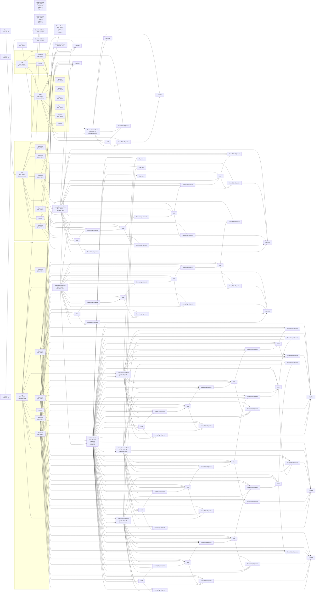

```mermaid
flowchart LR
  subgraph path2 [Path]
    2["Path<br>[489, 599, 0]<br>Consumed: true"]
      %% [ProgramBodyItem { index: 0 }, ExpressionStatementExpr]
    3["Segment<br>[489, 599, 0]"]
      %% [ProgramBodyItem { index: 0 }, ExpressionStatementExpr]
    4["Segment<br>[489, 599, 0]"]
      %% [ProgramBodyItem { index: 0 }, ExpressionStatementExpr]
    5["Segment<br>[489, 599, 0]"]
      %% [ProgramBodyItem { index: 0 }, ExpressionStatementExpr]
    6["Segment<br>[489, 599, 0]"]
      %% [ProgramBodyItem { index: 0 }, ExpressionStatementExpr]
    8["Segment<br>[489, 599, 0]"]
      %% [ProgramBodyItem { index: 0 }, ExpressionStatementExpr]
    9[Solid2d]
  end
  subgraph path11 [Path]
    11["Path<br>[489, 599, 0]<br>Consumed: true"]
      %% [ProgramBodyItem { index: 0 }, ExpressionStatementExpr]
    12["Segment<br>[489, 599, 0]"]
      %% [ProgramBodyItem { index: 0 }, ExpressionStatementExpr]
    13[Solid2d]
  end
  subgraph path21 [Path]
    21["Path<br>[657, 769, 0]<br>Consumed: true"]
      %% [ProgramBodyItem { index: 1 }, ExpressionStatementExpr, PipeBodyItem { index: 0 }]
    22["Segment<br>[657, 769, 0]"]
      %% [ProgramBodyItem { index: 1 }, ExpressionStatementExpr, PipeBodyItem { index: 0 }]
    23["Segment<br>[657, 769, 0]"]
      %% [ProgramBodyItem { index: 1 }, ExpressionStatementExpr, PipeBodyItem { index: 0 }]
    24["Segment<br>[657, 769, 0]"]
      %% [ProgramBodyItem { index: 1 }, ExpressionStatementExpr, PipeBodyItem { index: 0 }]
    25["Segment<br>[657, 769, 0]"]
      %% [ProgramBodyItem { index: 1 }, ExpressionStatementExpr, PipeBodyItem { index: 0 }]
    27["Segment<br>[657, 769, 0]"]
      %% [ProgramBodyItem { index: 1 }, ExpressionStatementExpr, PipeBodyItem { index: 0 }]
    28[Solid2d]
  end
  subgraph path45 [Path]
    45["Path<br>[865, 978, 0]<br>Consumed: true"]
      %% [ProgramBodyItem { index: 3 }, VariableDeclarationDeclaration, VariableDeclarationInit]
    46["Segment<br>[865, 978, 0]"]
      %% [ProgramBodyItem { index: 3 }, VariableDeclarationDeclaration, VariableDeclarationInit]
    47["Segment<br>[865, 978, 0]"]
      %% [ProgramBodyItem { index: 3 }, VariableDeclarationDeclaration, VariableDeclarationInit]
    48["Segment<br>[865, 978, 0]"]
      %% [ProgramBodyItem { index: 3 }, VariableDeclarationDeclaration, VariableDeclarationInit]
    49["Segment<br>[865, 978, 0]"]
      %% [ProgramBodyItem { index: 3 }, VariableDeclarationDeclaration, VariableDeclarationInit]
    51["Segment<br>[865, 978, 0]"]
      %% [ProgramBodyItem { index: 3 }, VariableDeclarationDeclaration, VariableDeclarationInit]
    52[Solid2d]
  end
  1["Plane<br>[489, 599, 0]"]
    %% [ProgramBodyItem { index: 0 }, ExpressionStatementExpr]
  7["Pattern Circular<br>[489, 599, 0]<br>Copies: 0<br>Faces: 0<br>Edges: 0"]
    %% [ProgramBodyItem { index: 0 }, ExpressionStatementExpr]
  10["Plane<br>[489, 599, 0]"]
    %% [ProgramBodyItem { index: 0 }, ExpressionStatementExpr]
  14["Sweep ExtrusionTwist<br>[489, 599, 0]<br>Consumed: false"]
    %% [ProgramBodyItem { index: 0 }, ExpressionStatementExpr]
  15[Wall]
    %% face_code_ref=Missing NodePath
  16["Cap Start"]
    %% face_code_ref=Missing NodePath
  17["Cap End"]
    %% face_code_ref=Missing NodePath
  18["SweepEdge Opposite"]
  19["SweepEdge Adjacent"]
  20["Plane<br>[657, 769, 0]"]
    %% [ProgramBodyItem { index: 1 }, ExpressionStatementExpr, PipeBodyItem { index: 0 }]
  26["Pattern Circular<br>[657, 769, 0]<br>Copies: 0<br>Faces: 0<br>Edges: 0"]
    %% [ProgramBodyItem { index: 1 }, ExpressionStatementExpr, PipeBodyItem { index: 0 }]
  29["Sweep ExtrusionTwist<br>[657, 769, 0]<br>Consumed: false"]
    %% [ProgramBodyItem { index: 1 }, ExpressionStatementExpr, PipeBodyItem { index: 0 }]
  30[Wall]
    %% face_code_ref=Missing NodePath
  31[Wall]
    %% face_code_ref=Missing NodePath
  32[Wall]
    %% face_code_ref=Missing NodePath
  33[Wall]
    %% face_code_ref=Missing NodePath
  34["Cap Start"]
    %% face_code_ref=Missing NodePath
  35["Cap End"]
    %% face_code_ref=Missing NodePath
  36["SweepEdge Opposite"]
  37["SweepEdge Adjacent"]
  38["SweepEdge Opposite"]
  39["SweepEdge Adjacent"]
  40["SweepEdge Opposite"]
  41["SweepEdge Adjacent"]
  42["SweepEdge Opposite"]
  43["SweepEdge Adjacent"]
  44["Plane<br>[865, 978, 0]"]
    %% [ProgramBodyItem { index: 3 }, VariableDeclarationDeclaration, VariableDeclarationInit]
  50["Pattern Circular<br>[865, 978, 0]<br>Copies: 0<br>Faces: 0<br>Edges: 0"]
    %% [ProgramBodyItem { index: 3 }, VariableDeclarationDeclaration, VariableDeclarationInit]
  53["Sweep ExtrusionTwist<br>[865, 978, 0]<br>Consumed: false"]
    %% [ProgramBodyItem { index: 3 }, VariableDeclarationDeclaration, VariableDeclarationInit]
  54[Wall]
    %% face_code_ref=Missing NodePath
  55[Wall]
    %% face_code_ref=Missing NodePath
  56[Wall]
    %% face_code_ref=Missing NodePath
  57[Wall]
    %% face_code_ref=Missing NodePath
  58["Cap Start"]
    %% face_code_ref=Missing NodePath
  59["Cap End"]
    %% face_code_ref=Missing NodePath
  60["SweepEdge Opposite"]
  61["SweepEdge Adjacent"]
  62["SweepEdge Opposite"]
  63["SweepEdge Adjacent"]
  64["SweepEdge Opposite"]
  65["SweepEdge Adjacent"]
  66["SweepEdge Opposite"]
  67["SweepEdge Adjacent"]
  68["Pattern Circular<br>[1107, 1272, 0]<br>Copies: 3<br>Faces: 150<br>Edges: 432"]
    %% [ProgramBodyItem { index: 4 }, ExpressionStatementExpr, PipeBodyItem { index: 1 }]
  69["Sweep ExtrusionTwist<br>[1107, 1272, 0]<br>Consumed: false"]
    %% [ProgramBodyItem { index: 4 }, ExpressionStatementExpr, PipeBodyItem { index: 1 }]
  70[Wall]
    %% face_code_ref=Missing NodePath
  71[Wall]
    %% face_code_ref=Missing NodePath
  72[Wall]
    %% face_code_ref=Missing NodePath
  73[Wall]
    %% face_code_ref=Missing NodePath
  74["Cap Start"]
    %% face_code_ref=Missing NodePath
  75["Cap End"]
    %% face_code_ref=Missing NodePath
  76["SweepEdge Opposite"]
  77["SweepEdge Adjacent"]
  78["SweepEdge Opposite"]
  79["SweepEdge Adjacent"]
  80["SweepEdge Opposite"]
  81["SweepEdge Adjacent"]
  82["SweepEdge Opposite"]
  83["SweepEdge Adjacent"]
  84["Sweep ExtrusionTwist<br>[1107, 1272, 0]<br>Consumed: false"]
    %% [ProgramBodyItem { index: 4 }, ExpressionStatementExpr, PipeBodyItem { index: 1 }]
  85[Wall]
    %% face_code_ref=Missing NodePath
  86[Wall]
    %% face_code_ref=Missing NodePath
  87[Wall]
    %% face_code_ref=Missing NodePath
  88[Wall]
    %% face_code_ref=Missing NodePath
  89["Cap Start"]
    %% face_code_ref=Missing NodePath
  90["Cap End"]
    %% face_code_ref=Missing NodePath
  91["SweepEdge Opposite"]
  92["SweepEdge Adjacent"]
  93["SweepEdge Opposite"]
  94["SweepEdge Adjacent"]
  95["SweepEdge Opposite"]
  96["SweepEdge Adjacent"]
  97["SweepEdge Opposite"]
  98["SweepEdge Adjacent"]
  99["Sweep ExtrusionTwist<br>[1107, 1272, 0]<br>Consumed: false"]
    %% [ProgramBodyItem { index: 4 }, ExpressionStatementExpr, PipeBodyItem { index: 1 }]
  100[Wall]
    %% face_code_ref=Missing NodePath
  101[Wall]
    %% face_code_ref=Missing NodePath
  102[Wall]
    %% face_code_ref=Missing NodePath
  103[Wall]
    %% face_code_ref=Missing NodePath
  104["Cap Start"]
    %% face_code_ref=Missing NodePath
  105["Cap End"]
    %% face_code_ref=Missing NodePath
  106["SweepEdge Opposite"]
  107["SweepEdge Adjacent"]
  108["SweepEdge Opposite"]
  109["SweepEdge Adjacent"]
  110["SweepEdge Opposite"]
  111["SweepEdge Adjacent"]
  112["SweepEdge Opposite"]
  113["SweepEdge Adjacent"]
  114["StartSketchOnPlane<br>[884, 937, 15]"]
    %% [ProgramBodyItem { index: 0 }, VariableDeclarationDeclaration, VariableDeclarationInit, FunctionExpressionBody, FunctionExpressionBodyItem { index: 8 }, ReturnStatementArg, PipeBodyItem { index: 0 }]
  115["StartSketchOnPlane<br>[884, 937, 15]"]
    %% [ProgramBodyItem { index: 0 }, VariableDeclarationDeclaration, VariableDeclarationInit, FunctionExpressionBody, FunctionExpressionBodyItem { index: 8 }, ReturnStatementArg, PipeBodyItem { index: 0 }]
  116["StartSketchOnPlane<br>[884, 937, 15]"]
    %% [ProgramBodyItem { index: 0 }, VariableDeclarationDeclaration, VariableDeclarationInit, FunctionExpressionBody, FunctionExpressionBodyItem { index: 8 }, ReturnStatementArg, PipeBodyItem { index: 0 }]
  1 --- 2
  1 <--x 114
  2 --- 3
  2 --- 4
  2 --- 5
  2 --- 6
  2 --- 7
  2 --- 8
  2 --- 9
  11 --- 2
  2 x---> 14
  10 --- 11
  11 --- 12
  11 --- 13
  11 ---- 14
  12 --- 15
  12 x--> 16
  12 --- 18
  12 --- 19
  14 --- 15
  14 --- 16
  14 --- 17
  14 --- 18
  14 --- 19
  15 --- 18
  15 --- 19
  18 <--x 17
  20 --- 21
  20 <--x 115
  21 --- 22
  21 --- 23
  21 --- 24
  21 --- 25
  21 --- 26
  21 --- 27
  21 --- 28
  21 ---- 29
  23 --- 31
  23 x--> 34
  23 --- 38
  23 --- 39
  24 --- 32
  24 x--> 34
  24 --- 40
  24 --- 41
  25 --- 33
  25 x--> 34
  25 --- 42
  25 --- 43
  27 --- 30
  27 x--> 34
  27 --- 36
  27 --- 37
  29 --- 30
  29 --- 31
  29 --- 32
  29 --- 33
  29 --- 34
  29 --- 35
  29 --- 36
  29 --- 37
  29 --- 38
  29 --- 39
  29 --- 40
  29 --- 41
  29 --- 42
  29 --- 43
  30 --- 36
  30 --- 37
  39 <--x 30
  31 --- 38
  31 --- 39
  41 <--x 31
  32 --- 40
  32 --- 41
  43 <--x 32
  33 --- 42
  33 --- 43
  36 <--x 35
  38 <--x 35
  40 <--x 35
  42 <--x 35
  44 --- 45
  44 <--x 116
  45 --- 46
  45 --- 47
  45 --- 48
  45 --- 49
  45 --- 50
  45 --- 51
  45 --- 52
  45 ---- 53
  45 --- 68
  45 <---x 69
  45 <---x 84
  45 <---x 99
  47 --- 55
  47 x--> 58
  47 --- 62
  47 --- 63
  47 <--x 71
  47 <--x 78
  47 <--x 79
  47 <--x 86
  47 <--x 93
  47 <--x 94
  47 <--x 101
  47 <--x 108
  47 <--x 109
  48 --- 56
  48 x--> 58
  48 --- 64
  48 --- 65
  48 <--x 72
  48 <--x 80
  48 <--x 81
  48 <--x 87
  48 <--x 95
  48 <--x 96
  48 <--x 102
  48 <--x 110
  48 <--x 111
  49 --- 57
  49 x--> 58
  49 --- 66
  49 --- 67
  49 <--x 73
  49 <--x 82
  49 <--x 83
  49 <--x 88
  49 <--x 97
  49 <--x 98
  49 <--x 103
  49 <--x 112
  49 <--x 113
  51 --- 54
  51 x--> 58
  51 --- 60
  51 --- 61
  51 <--x 70
  51 <--x 76
  51 <--x 77
  51 <--x 85
  51 <--x 91
  51 <--x 92
  51 <--x 100
  51 <--x 106
  51 <--x 107
  53 --- 54
  53 --- 55
  53 --- 56
  53 --- 57
  53 --- 58
  53 --- 59
  53 --- 60
  53 --- 61
  53 --- 62
  53 --- 63
  53 --- 64
  53 --- 65
  53 --- 66
  53 --- 67
  53 x--> 68
  54 --- 60
  54 --- 61
  63 <--x 54
  55 --- 62
  55 --- 63
  65 <--x 55
  56 --- 64
  56 --- 65
  67 <--x 56
  57 --- 66
  57 --- 67
  60 <--x 59
  62 <--x 59
  64 <--x 59
  66 <--x 59
  68 x--> 69
  68 x--> 70
  68 x--> 71
  68 x--> 72
  68 x--> 73
  68 x--> 74
  68 x--> 75
  68 x--> 76
  68 x--> 77
  68 x--> 78
  68 x--> 79
  68 x--> 80
  68 x--> 81
  68 x--> 82
  68 x--> 83
  68 x--> 84
  68 x--> 85
  68 x--> 86
  68 x--> 87
  68 x--> 88
  68 x--> 89
  68 x--> 90
  68 x--> 91
  68 x--> 92
  68 x--> 93
  68 x--> 94
  68 x--> 95
  68 x--> 96
  68 x--> 97
  68 x--> 98
  68 x--> 99
  68 x--> 100
  68 x--> 101
  68 x--> 102
  68 x--> 103
  68 x--> 104
  68 x--> 105
  68 x--> 106
  68 x--> 107
  68 x--> 108
  68 x--> 109
  68 x--> 110
  68 x--> 111
  68 x--> 112
  68 x--> 113
  69 --- 70
  69 --- 71
  69 --- 72
  69 --- 73
  69 --- 74
  69 --- 75
  69 --- 76
  69 --- 77
  69 --- 78
  69 --- 79
  69 --- 80
  69 --- 81
  69 --- 82
  69 --- 83
  70 --- 76
  70 --- 77
  79 <--x 70
  71 --- 78
  71 --- 79
  81 <--x 71
  72 --- 80
  72 --- 81
  83 <--x 72
  73 --- 82
  73 --- 83
  76 <--x 75
  78 <--x 75
  80 <--x 75
  82 <--x 75
  84 --- 85
  84 --- 86
  84 --- 87
  84 --- 88
  84 --- 89
  84 --- 90
  84 --- 91
  84 --- 92
  84 --- 93
  84 --- 94
  84 --- 95
  84 --- 96
  84 --- 97
  84 --- 98
  85 --- 91
  85 --- 92
  94 <--x 85
  86 --- 93
  86 --- 94
  96 <--x 86
  87 --- 95
  87 --- 96
  98 <--x 87
  88 --- 97
  88 --- 98
  91 <--x 90
  93 <--x 90
  95 <--x 90
  97 <--x 90
  99 --- 100
  99 --- 101
  99 --- 102
  99 --- 103
  99 --- 104
  99 --- 105
  99 --- 106
  99 --- 107
  99 --- 108
  99 --- 109
  99 --- 110
  99 --- 111
  99 --- 112
  99 --- 113
  100 --- 106
  100 --- 107
  109 <--x 100
  101 --- 108
  101 --- 109
  111 <--x 101
  102 --- 110
  102 --- 111
  113 <--x 102
  103 --- 112
  103 --- 113
  106 <--x 105
  108 <--x 105
  110 <--x 105
  112 <--x 105
```
