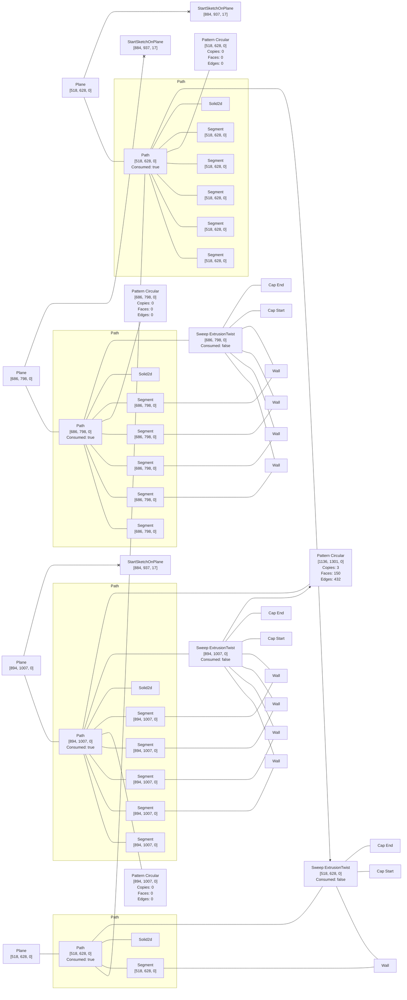

```mermaid
flowchart LR
  subgraph path2 [Path]
    2["Path<br>[518, 628, 0]<br>Consumed: true"]
      %% [ProgramBodyItem { index: 0 }, ExpressionStatementExpr]
    3["Segment<br>[518, 628, 0]"]
      %% [ProgramBodyItem { index: 0 }, ExpressionStatementExpr]
    4["Segment<br>[518, 628, 0]"]
      %% [ProgramBodyItem { index: 0 }, ExpressionStatementExpr]
    5["Segment<br>[518, 628, 0]"]
      %% [ProgramBodyItem { index: 0 }, ExpressionStatementExpr]
    6["Segment<br>[518, 628, 0]"]
      %% [ProgramBodyItem { index: 0 }, ExpressionStatementExpr]
    8["Segment<br>[518, 628, 0]"]
      %% [ProgramBodyItem { index: 0 }, ExpressionStatementExpr]
    9[Solid2d]
  end
  subgraph path11 [Path]
    11["Path<br>[518, 628, 0]<br>Consumed: true"]
      %% [ProgramBodyItem { index: 0 }, ExpressionStatementExpr]
    12["Segment<br>[518, 628, 0]"]
      %% [ProgramBodyItem { index: 0 }, ExpressionStatementExpr]
    13[Solid2d]
  end
  subgraph path19 [Path]
    19["Path<br>[686, 798, 0]<br>Consumed: true"]
      %% [ProgramBodyItem { index: 1 }, ExpressionStatementExpr, PipeBodyItem { index: 0 }]
    20["Segment<br>[686, 798, 0]"]
      %% [ProgramBodyItem { index: 1 }, ExpressionStatementExpr, PipeBodyItem { index: 0 }]
    21["Segment<br>[686, 798, 0]"]
      %% [ProgramBodyItem { index: 1 }, ExpressionStatementExpr, PipeBodyItem { index: 0 }]
    22["Segment<br>[686, 798, 0]"]
      %% [ProgramBodyItem { index: 1 }, ExpressionStatementExpr, PipeBodyItem { index: 0 }]
    23["Segment<br>[686, 798, 0]"]
      %% [ProgramBodyItem { index: 1 }, ExpressionStatementExpr, PipeBodyItem { index: 0 }]
    25["Segment<br>[686, 798, 0]"]
      %% [ProgramBodyItem { index: 1 }, ExpressionStatementExpr, PipeBodyItem { index: 0 }]
    26[Solid2d]
  end
  subgraph path35 [Path]
    35["Path<br>[894, 1007, 0]<br>Consumed: true"]
      %% [ProgramBodyItem { index: 3 }, VariableDeclarationDeclaration, VariableDeclarationInit]
    36["Segment<br>[894, 1007, 0]"]
      %% [ProgramBodyItem { index: 3 }, VariableDeclarationDeclaration, VariableDeclarationInit]
    37["Segment<br>[894, 1007, 0]"]
      %% [ProgramBodyItem { index: 3 }, VariableDeclarationDeclaration, VariableDeclarationInit]
    38["Segment<br>[894, 1007, 0]"]
      %% [ProgramBodyItem { index: 3 }, VariableDeclarationDeclaration, VariableDeclarationInit]
    39["Segment<br>[894, 1007, 0]"]
      %% [ProgramBodyItem { index: 3 }, VariableDeclarationDeclaration, VariableDeclarationInit]
    41["Segment<br>[894, 1007, 0]"]
      %% [ProgramBodyItem { index: 3 }, VariableDeclarationDeclaration, VariableDeclarationInit]
    42[Solid2d]
  end
  1["Plane<br>[518, 628, 0]"]
    %% [ProgramBodyItem { index: 0 }, ExpressionStatementExpr]
  7["Pattern Circular<br>[518, 628, 0]<br>Copies: 0<br>Faces: 0<br>Edges: 0"]
    %% [ProgramBodyItem { index: 0 }, ExpressionStatementExpr]
  10["Plane<br>[518, 628, 0]"]
    %% [ProgramBodyItem { index: 0 }, ExpressionStatementExpr]
  14["Sweep ExtrusionTwist<br>[518, 628, 0]<br>Consumed: false"]
    %% [ProgramBodyItem { index: 0 }, ExpressionStatementExpr]
  15[Wall]
    %% face_code_ref=Missing NodePath
  16["Cap Start"]
    %% face_code_ref=Missing NodePath
  17["Cap End"]
    %% face_code_ref=Missing NodePath
  18["Plane<br>[686, 798, 0]"]
    %% [ProgramBodyItem { index: 1 }, ExpressionStatementExpr, PipeBodyItem { index: 0 }]
  24["Pattern Circular<br>[686, 798, 0]<br>Copies: 0<br>Faces: 0<br>Edges: 0"]
    %% [ProgramBodyItem { index: 1 }, ExpressionStatementExpr, PipeBodyItem { index: 0 }]
  27["Sweep ExtrusionTwist<br>[686, 798, 0]<br>Consumed: false"]
    %% [ProgramBodyItem { index: 1 }, ExpressionStatementExpr, PipeBodyItem { index: 0 }]
  28[Wall]
    %% face_code_ref=Missing NodePath
  29[Wall]
    %% face_code_ref=Missing NodePath
  30[Wall]
    %% face_code_ref=Missing NodePath
  31[Wall]
    %% face_code_ref=Missing NodePath
  32["Cap Start"]
    %% face_code_ref=Missing NodePath
  33["Cap End"]
    %% face_code_ref=Missing NodePath
  34["Plane<br>[894, 1007, 0]"]
    %% [ProgramBodyItem { index: 3 }, VariableDeclarationDeclaration, VariableDeclarationInit]
  40["Pattern Circular<br>[894, 1007, 0]<br>Copies: 0<br>Faces: 0<br>Edges: 0"]
    %% [ProgramBodyItem { index: 3 }, VariableDeclarationDeclaration, VariableDeclarationInit]
  43["Sweep ExtrusionTwist<br>[894, 1007, 0]<br>Consumed: false"]
    %% [ProgramBodyItem { index: 3 }, VariableDeclarationDeclaration, VariableDeclarationInit]
  44[Wall]
    %% face_code_ref=Missing NodePath
  45[Wall]
    %% face_code_ref=Missing NodePath
  46[Wall]
    %% face_code_ref=Missing NodePath
  47[Wall]
    %% face_code_ref=Missing NodePath
  48["Cap Start"]
    %% face_code_ref=Missing NodePath
  49["Cap End"]
    %% face_code_ref=Missing NodePath
  50["Pattern Circular<br>[1136, 1301, 0]<br>Copies: 3<br>Faces: 150<br>Edges: 432"]
    %% [ProgramBodyItem { index: 4 }, ExpressionStatementExpr, PipeBodyItem { index: 1 }]
  51["StartSketchOnPlane<br>[884, 937, 17]"]
    %% [ProgramBodyItem { index: 0 }, VariableDeclarationDeclaration, VariableDeclarationInit, FunctionExpressionBody, FunctionExpressionBodyItem { index: 8 }, ReturnStatementArg, PipeBodyItem { index: 0 }]
  52["StartSketchOnPlane<br>[884, 937, 17]"]
    %% [ProgramBodyItem { index: 0 }, VariableDeclarationDeclaration, VariableDeclarationInit, FunctionExpressionBody, FunctionExpressionBodyItem { index: 8 }, ReturnStatementArg, PipeBodyItem { index: 0 }]
  53["StartSketchOnPlane<br>[884, 937, 17]"]
    %% [ProgramBodyItem { index: 0 }, VariableDeclarationDeclaration, VariableDeclarationInit, FunctionExpressionBody, FunctionExpressionBodyItem { index: 8 }, ReturnStatementArg, PipeBodyItem { index: 0 }]
  1 --- 2
  1 <--x 51
  2 --- 3
  2 --- 4
  2 --- 5
  2 --- 6
  2 --- 7
  2 --- 8
  2 --- 9
  11 --- 2
  2 x---> 14
  10 --- 11
  11 --- 12
  11 --- 13
  11 ---- 14
  12 --- 15
  14 --- 15
  14 --- 16
  14 --- 17
  18 --- 19
  18 <--x 52
  19 --- 20
  19 --- 21
  19 --- 22
  19 --- 23
  19 --- 24
  19 --- 25
  19 --- 26
  19 ---- 27
  21 --- 28
  22 --- 29
  23 --- 30
  25 --- 31
  27 --- 28
  27 --- 29
  27 --- 30
  27 --- 31
  27 --- 32
  27 --- 33
  34 --- 35
  34 <--x 53
  35 --- 36
  35 --- 37
  35 --- 38
  35 --- 39
  35 --- 40
  35 --- 41
  35 --- 42
  35 ---- 43
  35 --- 50
  37 --- 44
  38 --- 45
  39 --- 46
  41 --- 47
  43 --- 44
  43 --- 45
  43 --- 46
  43 --- 47
  43 --- 48
  43 --- 49
  43 x--> 50
```
