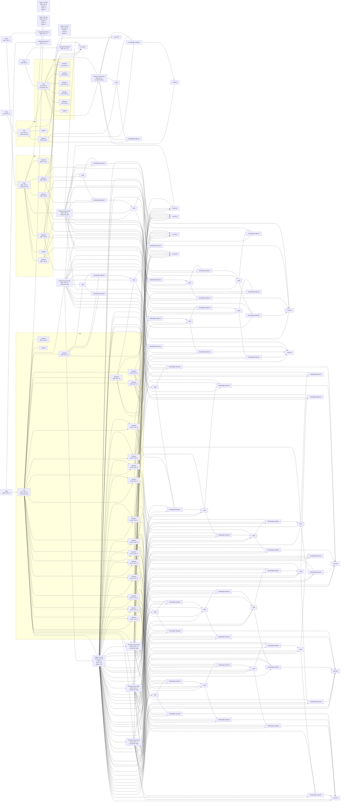

```mermaid
flowchart LR
  subgraph path2 [Path]
    2["Path<br>[518, 628, 0]<br>Consumed: true"]
      %% [ProgramBodyItem { index: 0 }, ExpressionStatementExpr]
    3["Segment<br>[518, 628, 0]"]
      %% [ProgramBodyItem { index: 0 }, ExpressionStatementExpr]
    4["Segment<br>[518, 628, 0]"]
      %% [ProgramBodyItem { index: 0 }, ExpressionStatementExpr]
    5["Segment<br>[518, 628, 0]"]
      %% [ProgramBodyItem { index: 0 }, ExpressionStatementExpr]
    6["Segment<br>[518, 628, 0]"]
      %% [ProgramBodyItem { index: 0 }, ExpressionStatementExpr]
    8["Segment<br>[518, 628, 0]"]
      %% [ProgramBodyItem { index: 0 }, ExpressionStatementExpr]
    9[Solid2d]
  end
  subgraph path11 [Path]
    11["Path<br>[518, 628, 0]<br>Consumed: true"]
      %% [ProgramBodyItem { index: 0 }, ExpressionStatementExpr]
    12["Segment<br>[518, 628, 0]"]
      %% [ProgramBodyItem { index: 0 }, ExpressionStatementExpr]
    13[Solid2d]
  end
  subgraph path21 [Path]
    21["Path<br>[686, 798, 0]<br>Consumed: true"]
      %% [ProgramBodyItem { index: 1 }, ExpressionStatementExpr, PipeBodyItem { index: 0 }]
    22["Segment<br>[686, 798, 0]"]
      %% [ProgramBodyItem { index: 1 }, ExpressionStatementExpr, PipeBodyItem { index: 0 }]
    23["Segment<br>[686, 798, 0]"]
      %% [ProgramBodyItem { index: 1 }, ExpressionStatementExpr, PipeBodyItem { index: 0 }]
    24["Segment<br>[686, 798, 0]"]
      %% [ProgramBodyItem { index: 1 }, ExpressionStatementExpr, PipeBodyItem { index: 0 }]
    25["Segment<br>[686, 798, 0]"]
      %% [ProgramBodyItem { index: 1 }, ExpressionStatementExpr, PipeBodyItem { index: 0 }]
    27["Segment<br>[686, 798, 0]"]
      %% [ProgramBodyItem { index: 1 }, ExpressionStatementExpr, PipeBodyItem { index: 0 }]
    28[Solid2d]
  end
  subgraph path45 [Path]
    45["Path<br>[894, 1007, 0]<br>Consumed: true"]
      %% [ProgramBodyItem { index: 3 }, VariableDeclarationDeclaration, VariableDeclarationInit]
    46["Segment<br>[894, 1007, 0]"]
      %% [ProgramBodyItem { index: 3 }, VariableDeclarationDeclaration, VariableDeclarationInit]
    47["Segment<br>[894, 1007, 0]"]
      %% [ProgramBodyItem { index: 3 }, VariableDeclarationDeclaration, VariableDeclarationInit]
    48["Segment<br>[894, 1007, 0]"]
      %% [ProgramBodyItem { index: 3 }, VariableDeclarationDeclaration, VariableDeclarationInit]
    49["Segment<br>[894, 1007, 0]"]
      %% [ProgramBodyItem { index: 3 }, VariableDeclarationDeclaration, VariableDeclarationInit]
    51["Segment<br>[894, 1007, 0]"]
      %% [ProgramBodyItem { index: 3 }, VariableDeclarationDeclaration, VariableDeclarationInit]
    52[Solid2d]
    70["Segment<br>[1136, 1301, 0]"]
      %% [ProgramBodyItem { index: 4 }, ExpressionStatementExpr, PipeBodyItem { index: 1 }]
    71["Segment<br>[1136, 1301, 0]"]
      %% [ProgramBodyItem { index: 4 }, ExpressionStatementExpr, PipeBodyItem { index: 1 }]
    72["Segment<br>[1136, 1301, 0]"]
      %% [ProgramBodyItem { index: 4 }, ExpressionStatementExpr, PipeBodyItem { index: 1 }]
    73["Segment<br>[1136, 1301, 0]"]
      %% [ProgramBodyItem { index: 4 }, ExpressionStatementExpr, PipeBodyItem { index: 1 }]
    89["Segment<br>[1136, 1301, 0]"]
      %% [ProgramBodyItem { index: 4 }, ExpressionStatementExpr, PipeBodyItem { index: 1 }]
    90["Segment<br>[1136, 1301, 0]"]
      %% [ProgramBodyItem { index: 4 }, ExpressionStatementExpr, PipeBodyItem { index: 1 }]
    91["Segment<br>[1136, 1301, 0]"]
      %% [ProgramBodyItem { index: 4 }, ExpressionStatementExpr, PipeBodyItem { index: 1 }]
    92["Segment<br>[1136, 1301, 0]"]
      %% [ProgramBodyItem { index: 4 }, ExpressionStatementExpr, PipeBodyItem { index: 1 }]
    108["Segment<br>[1136, 1301, 0]"]
      %% [ProgramBodyItem { index: 4 }, ExpressionStatementExpr, PipeBodyItem { index: 1 }]
    109["Segment<br>[1136, 1301, 0]"]
      %% [ProgramBodyItem { index: 4 }, ExpressionStatementExpr, PipeBodyItem { index: 1 }]
    110["Segment<br>[1136, 1301, 0]"]
      %% [ProgramBodyItem { index: 4 }, ExpressionStatementExpr, PipeBodyItem { index: 1 }]
    111["Segment<br>[1136, 1301, 0]"]
      %% [ProgramBodyItem { index: 4 }, ExpressionStatementExpr, PipeBodyItem { index: 1 }]
  end
  1["Plane<br>[518, 628, 0]"]
    %% [ProgramBodyItem { index: 0 }, ExpressionStatementExpr]
  7["Pattern Circular<br>[518, 628, 0]<br>Copies: 0<br>Faces: 0<br>Edges: 0"]
    %% [ProgramBodyItem { index: 0 }, ExpressionStatementExpr]
  10["Plane<br>[518, 628, 0]"]
    %% [ProgramBodyItem { index: 0 }, ExpressionStatementExpr]
  14["Sweep ExtrusionTwist<br>[518, 628, 0]<br>Consumed: false"]
    %% [ProgramBodyItem { index: 0 }, ExpressionStatementExpr]
  15[Wall]
    %% face_code_ref=Missing NodePath
  16["Cap Start"]
    %% face_code_ref=Missing NodePath
  17["Cap End"]
    %% face_code_ref=Missing NodePath
  18["SweepEdge Opposite"]
  19["SweepEdge Adjacent"]
  20["Plane<br>[686, 798, 0]"]
    %% [ProgramBodyItem { index: 1 }, ExpressionStatementExpr, PipeBodyItem { index: 0 }]
  26["Pattern Circular<br>[686, 798, 0]<br>Copies: 0<br>Faces: 0<br>Edges: 0"]
    %% [ProgramBodyItem { index: 1 }, ExpressionStatementExpr, PipeBodyItem { index: 0 }]
  29["Sweep ExtrusionTwist<br>[686, 798, 0]<br>Consumed: false"]
    %% [ProgramBodyItem { index: 1 }, ExpressionStatementExpr, PipeBodyItem { index: 0 }]
  30[Wall]
    %% face_code_ref=Missing NodePath
  31[Wall]
    %% face_code_ref=Missing NodePath
  32[Wall]
    %% face_code_ref=Missing NodePath
  33[Wall]
    %% face_code_ref=Missing NodePath
  34["Cap Start"]
    %% face_code_ref=Missing NodePath
  35["Cap End"]
    %% face_code_ref=Missing NodePath
  36["SweepEdge Opposite"]
  37["SweepEdge Adjacent"]
  38["SweepEdge Opposite"]
  39["SweepEdge Adjacent"]
  40["SweepEdge Opposite"]
  41["SweepEdge Adjacent"]
  42["SweepEdge Opposite"]
  43["SweepEdge Adjacent"]
  44["Plane<br>[894, 1007, 0]"]
    %% [ProgramBodyItem { index: 3 }, VariableDeclarationDeclaration, VariableDeclarationInit]
  50["Pattern Circular<br>[894, 1007, 0]<br>Copies: 0<br>Faces: 0<br>Edges: 0"]
    %% [ProgramBodyItem { index: 3 }, VariableDeclarationDeclaration, VariableDeclarationInit]
  53["Sweep ExtrusionTwist<br>[894, 1007, 0]<br>Consumed: false"]
    %% [ProgramBodyItem { index: 3 }, VariableDeclarationDeclaration, VariableDeclarationInit]
  54[Wall]
    %% face_code_ref=Missing NodePath
  55[Wall]
    %% face_code_ref=Missing NodePath
  56[Wall]
    %% face_code_ref=Missing NodePath
  57[Wall]
    %% face_code_ref=Missing NodePath
  58["Cap Start"]
    %% face_code_ref=Missing NodePath
  59["Cap End"]
    %% face_code_ref=Missing NodePath
  60["SweepEdge Opposite"]
  61["SweepEdge Adjacent"]
  62["SweepEdge Opposite"]
  63["SweepEdge Adjacent"]
  64["SweepEdge Opposite"]
  65["SweepEdge Adjacent"]
  66["SweepEdge Opposite"]
  67["SweepEdge Adjacent"]
  68["Pattern Circular<br>[1136, 1301, 0]<br>Copies: 3<br>Faces: 150<br>Edges: 432"]
    %% [ProgramBodyItem { index: 4 }, ExpressionStatementExpr, PipeBodyItem { index: 1 }]
  69["Sweep ExtrusionTwist<br>[1136, 1301, 0]<br>Consumed: false"]
    %% [ProgramBodyItem { index: 4 }, ExpressionStatementExpr, PipeBodyItem { index: 1 }]
  74[Wall]
    %% face_code_ref=Missing NodePath
  75[Wall]
    %% face_code_ref=Missing NodePath
  76[Wall]
    %% face_code_ref=Missing NodePath
  77[Wall]
    %% face_code_ref=Missing NodePath
  78["Cap Start"]
    %% face_code_ref=Missing NodePath
  79["Cap End"]
    %% face_code_ref=Missing NodePath
  80["SweepEdge Opposite"]
  81["SweepEdge Adjacent"]
  82["SweepEdge Opposite"]
  83["SweepEdge Adjacent"]
  84["SweepEdge Opposite"]
  85["SweepEdge Adjacent"]
  86["SweepEdge Opposite"]
  87["SweepEdge Adjacent"]
  88["Sweep ExtrusionTwist<br>[1136, 1301, 0]<br>Consumed: false"]
    %% [ProgramBodyItem { index: 4 }, ExpressionStatementExpr, PipeBodyItem { index: 1 }]
  93[Wall]
    %% face_code_ref=Missing NodePath
  94[Wall]
    %% face_code_ref=Missing NodePath
  95[Wall]
    %% face_code_ref=Missing NodePath
  96[Wall]
    %% face_code_ref=Missing NodePath
  97["Cap Start"]
    %% face_code_ref=Missing NodePath
  98["Cap End"]
    %% face_code_ref=Missing NodePath
  99["SweepEdge Opposite"]
  100["SweepEdge Adjacent"]
  101["SweepEdge Opposite"]
  102["SweepEdge Adjacent"]
  103["SweepEdge Opposite"]
  104["SweepEdge Adjacent"]
  105["SweepEdge Opposite"]
  106["SweepEdge Adjacent"]
  107["Sweep ExtrusionTwist<br>[1136, 1301, 0]<br>Consumed: false"]
    %% [ProgramBodyItem { index: 4 }, ExpressionStatementExpr, PipeBodyItem { index: 1 }]
  112[Wall]
    %% face_code_ref=Missing NodePath
  113[Wall]
    %% face_code_ref=Missing NodePath
  114[Wall]
    %% face_code_ref=Missing NodePath
  115[Wall]
    %% face_code_ref=Missing NodePath
  116["Cap Start"]
    %% face_code_ref=Missing NodePath
  117["Cap End"]
    %% face_code_ref=Missing NodePath
  118["SweepEdge Opposite"]
  119["SweepEdge Adjacent"]
  120["SweepEdge Opposite"]
  121["SweepEdge Adjacent"]
  122["SweepEdge Opposite"]
  123["SweepEdge Adjacent"]
  124["SweepEdge Opposite"]
  125["SweepEdge Adjacent"]
  126["StartSketchOnPlane<br>[884, 937, 17]"]
    %% [ProgramBodyItem { index: 0 }, VariableDeclarationDeclaration, VariableDeclarationInit, FunctionExpressionBody, FunctionExpressionBodyItem { index: 8 }, ReturnStatementArg, PipeBodyItem { index: 0 }]
  127["StartSketchOnPlane<br>[884, 937, 17]"]
    %% [ProgramBodyItem { index: 0 }, VariableDeclarationDeclaration, VariableDeclarationInit, FunctionExpressionBody, FunctionExpressionBodyItem { index: 8 }, ReturnStatementArg, PipeBodyItem { index: 0 }]
  128["StartSketchOnPlane<br>[884, 937, 17]"]
    %% [ProgramBodyItem { index: 0 }, VariableDeclarationDeclaration, VariableDeclarationInit, FunctionExpressionBody, FunctionExpressionBodyItem { index: 8 }, ReturnStatementArg, PipeBodyItem { index: 0 }]
  1 --- 2
  1 <--x 126
  2 --- 3
  2 --- 4
  2 --- 5
  2 --- 6
  2 --- 7
  2 --- 8
  2 --- 9
  11 --- 2
  2 x---> 14
  10 --- 11
  11 --- 12
  11 --- 13
  11 ---- 14
  12 --- 15
  12 x--> 16
  12 --- 18
  12 --- 19
  14 --- 15
  14 --- 16
  14 --- 17
  14 --- 18
  14 --- 19
  15 --- 18
  15 --- 19
  18 <--x 17
  20 --- 21
  20 <--x 127
  21 --- 22
  21 --- 23
  21 --- 24
  21 --- 25
  21 --- 26
  21 --- 27
  21 --- 28
  21 ---- 29
  23 --- 31
  23 x--> 34
  23 --- 38
  23 --- 39
  24 --- 32
  24 x--> 34
  24 --- 40
  24 --- 41
  25 --- 33
  25 x--> 34
  25 --- 42
  25 --- 43
  27 --- 30
  27 x--> 34
  27 --- 36
  27 --- 37
  29 --- 30
  29 --- 31
  29 --- 32
  29 --- 33
  29 --- 34
  29 --- 35
  29 --- 36
  29 --- 37
  29 --- 38
  29 --- 39
  29 --- 40
  29 --- 41
  29 --- 42
  29 --- 43
  30 --- 36
  30 --- 37
  39 <--x 30
  31 --- 38
  31 --- 39
  41 <--x 31
  32 --- 40
  32 --- 41
  43 <--x 32
  33 --- 42
  33 --- 43
  36 <--x 35
  38 <--x 35
  40 <--x 35
  42 <--x 35
  44 --- 45
  44 <--x 128
  45 --- 46
  45 --- 47
  45 --- 48
  45 --- 49
  45 --- 50
  45 --- 51
  45 --- 52
  45 ---- 53
  45 --- 68
  45 <---x 69
  45 <--x 70
  45 <--x 71
  45 <--x 72
  45 <--x 73
  45 <---x 88
  45 <--x 89
  45 <--x 90
  45 <--x 91
  45 <--x 92
  45 <---x 107
  45 <--x 108
  45 <--x 109
  45 <--x 110
  45 <--x 111
  47 --- 55
  47 x--> 58
  47 --- 62
  47 --- 63
  48 --- 56
  48 x--> 58
  48 --- 64
  48 --- 65
  49 --- 57
  49 x--> 58
  49 --- 66
  49 --- 67
  51 --- 54
  51 x--> 58
  51 --- 60
  51 --- 61
  53 --- 54
  53 --- 55
  53 --- 56
  53 --- 57
  53 --- 58
  53 --- 59
  53 --- 60
  53 --- 61
  53 --- 62
  53 --- 63
  53 --- 64
  53 --- 65
  53 --- 66
  53 --- 67
  53 x--> 68
  54 --- 60
  54 --- 61
  63 <--x 54
  55 --- 62
  55 --- 63
  65 <--x 55
  56 --- 64
  56 --- 65
  67 <--x 56
  57 --- 66
  57 --- 67
  60 <--x 59
  62 <--x 59
  64 <--x 59
  66 <--x 59
  68 x--> 69
  68 x--> 70
  68 x--> 71
  68 x--> 72
  68 x--> 73
  68 x--> 74
  68 x--> 75
  68 x--> 76
  68 x--> 77
  68 x--> 78
  68 x--> 79
  68 x--> 80
  68 x--> 81
  68 x--> 82
  68 x--> 83
  68 x--> 84
  68 x--> 85
  68 x--> 86
  68 x--> 87
  68 x--> 88
  68 x--> 89
  68 x--> 90
  68 x--> 91
  68 x--> 92
  68 x--> 93
  68 x--> 94
  68 x--> 95
  68 x--> 96
  68 x--> 97
  68 x--> 98
  68 x--> 99
  68 x--> 100
  68 x--> 101
  68 x--> 102
  68 x--> 103
  68 x--> 104
  68 x--> 105
  68 x--> 106
  68 x--> 107
  68 x--> 108
  68 x--> 109
  68 x--> 110
  68 x--> 111
  68 x--> 112
  68 x--> 113
  68 x--> 114
  68 x--> 115
  68 x--> 116
  68 x--> 117
  68 x--> 118
  68 x--> 119
  68 x--> 120
  68 x--> 121
  68 x--> 122
  68 x--> 123
  68 x--> 124
  68 x--> 125
  69 --- 74
  69 --- 75
  69 --- 76
  69 --- 77
  69 --- 78
  69 --- 79
  69 --- 80
  69 --- 81
  69 --- 82
  69 --- 83
  69 --- 84
  69 --- 85
  69 --- 86
  69 --- 87
  70 --- 94
  70 x--> 97
  70 --- 101
  70 --- 102
  71 --- 95
  71 x--> 97
  71 --- 103
  71 --- 104
  72 --- 113
  72 x--> 116
  72 --- 120
  72 --- 121
  73 --- 114
  73 x--> 116
  73 --- 122
  73 --- 123
  74 --- 80
  74 --- 81
  83 <--x 74
  75 --- 82
  75 --- 83
  85 <--x 75
  76 --- 84
  76 --- 85
  87 <--x 76
  77 --- 86
  77 --- 87
  80 <--x 79
  82 <--x 79
  84 <--x 79
  86 <--x 79
  88 --- 93
  88 --- 94
  88 --- 95
  88 --- 96
  88 --- 97
  88 --- 98
  88 --- 99
  88 --- 100
  88 --- 101
  88 --- 102
  88 --- 103
  88 --- 104
  88 --- 105
  88 --- 106
  89 --- 75
  89 x--> 78
  89 --- 82
  89 --- 83
  90 --- 76
  90 x--> 78
  90 --- 84
  90 --- 85
  91 --- 96
  91 x--> 97
  91 --- 105
  91 --- 106
  92 --- 115
  92 x--> 116
  92 --- 124
  92 --- 125
  93 --- 99
  93 --- 100
  102 <--x 93
  94 --- 101
  94 --- 102
  104 <--x 94
  95 --- 103
  95 --- 104
  106 <--x 95
  96 --- 105
  96 --- 106
  99 <--x 98
  101 <--x 98
  103 <--x 98
  105 <--x 98
  107 --- 112
  107 --- 113
  107 --- 114
  107 --- 115
  107 --- 116
  107 --- 117
  107 --- 118
  107 --- 119
  107 --- 120
  107 --- 121
  107 --- 122
  107 --- 123
  107 --- 124
  107 --- 125
  108 --- 77
  108 x--> 78
  108 --- 86
  108 --- 87
  109 --- 93
  109 x--> 97
  109 --- 99
  109 --- 100
  110 --- 112
  110 x--> 116
  110 --- 118
  110 --- 119
  111 --- 74
  111 x--> 78
  111 --- 80
  111 --- 81
  112 --- 118
  112 --- 119
  121 <--x 112
  113 --- 120
  113 --- 121
  123 <--x 113
  114 --- 122
  114 --- 123
  125 <--x 114
  115 --- 124
  115 --- 125
  118 <--x 117
  120 <--x 117
  122 <--x 117
  124 <--x 117
```
