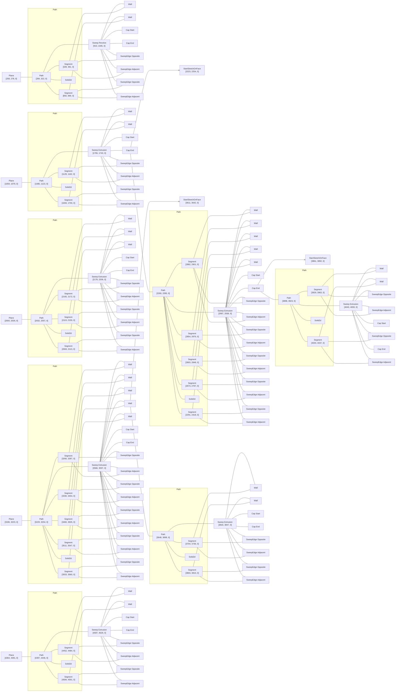

```mermaid
flowchart LR
  subgraph path2 [Path]
    2["Path<br>[284, 322, 0]"]
    3["Segment<br>[328, 361, 0]"]
    4["Segment<br>[892, 899, 0]"]
    5[Solid2d]
  end
  subgraph path16 [Path]
    16["Path<br>[1085, 1123, 0]"]
    17["Segment<br>[1129, 1162, 0]"]
    18["Segment<br>[1693, 1700, 0]"]
    19[Solid2d]
  end
  subgraph path30 [Path]
    30["Path<br>[2032, 2057, 0]"]
    31["Segment<br>[2063, 2113, 0]"]
    32["Segment<br>[2119, 2159, 0]"]
    33["Segment<br>[2165, 2172, 0]"]
    34[Solid2d]
  end
  subgraph path47 [Path]
    47["Path<br>[2260, 2285, 0]"]
    48["Segment<br>[2291, 2318, 0]"]
    49["Segment<br>[2673, 2797, 0]"]
    50["Segment<br>[2803, 2848, 0]"]
    51["Segment<br>[2854, 2876, 0]"]
    52["Segment<br>[2882, 2901, 0]"]
    53[Solid2d]
  end
  subgraph path73 [Path]
    73["Path<br>[3229, 3254, 0]"]
    74["Segment<br>[3260, 3287, 0]"]
    75["Segment<br>[3330, 3454, 0]"]
    76["Segment<br>[3460, 3505, 0]"]
    77["Segment<br>[3511, 3547, 0]"]
    78["Segment<br>[3553, 3560, 0]"]
    79[Solid2d]
  end
  subgraph path98 [Path]
    98["Path<br>[3648, 3698, 0]"]
    99["Segment<br>[3704, 3736, 0]"]
    100["Segment<br>[3803, 3810, 0]"]
    101[Solid2d]
  end
  subgraph path111 [Path]
    111["Path<br>[3898, 3923, 0]"]
    112["Segment<br>[3929, 3963, 0]"]
    113["Segment<br>[4030, 4037, 0]"]
    114[Solid2d]
  end
  subgraph path125 [Path]
    125["Path<br>[4397, 4446, 0]"]
    126["Segment<br>[4452, 4484, 0]"]
    127["Segment<br>[4584, 4591, 0]"]
    128[Solid2d]
  end
  1["Plane<br>[258, 278, 0]"]
  6["Sweep Revolve<br>[910, 1045, 0]"]
  7[Wall]
  8[Wall]
  9["Cap Start"]
  10["Cap End"]
  11["SweepEdge Opposite"]
  12["SweepEdge Adjacent"]
  13["SweepEdge Opposite"]
  14["SweepEdge Adjacent"]
  15["Plane<br>[1059, 1079, 0]"]
  20["Sweep Extrusion<br>[1706, 1743, 0]"]
  21[Wall]
  22[Wall]
  23["Cap Start"]
  24["Cap End"]
  25["SweepEdge Opposite"]
  26["SweepEdge Adjacent"]
  27["SweepEdge Opposite"]
  28["SweepEdge Adjacent"]
  29["Plane<br>[2000, 2026, 0]"]
  35["Sweep Extrusion<br>[2178, 2209, 0]"]
  36[Wall]
  37[Wall]
  38[Wall]
  39["Cap Start"]
  40["Cap End"]
  41["SweepEdge Opposite"]
  42["SweepEdge Adjacent"]
  43["SweepEdge Opposite"]
  44["SweepEdge Adjacent"]
  45["SweepEdge Opposite"]
  46["SweepEdge Adjacent"]
  54["Sweep Extrusion<br>[2907, 2938, 0]"]
  55[Wall]
  56[Wall]
  57[Wall]
  58[Wall]
  59[Wall]
  60["Cap Start"]
  61["Cap End"]
  62["SweepEdge Opposite"]
  63["SweepEdge Adjacent"]
  64["SweepEdge Opposite"]
  65["SweepEdge Adjacent"]
  66["SweepEdge Opposite"]
  67["SweepEdge Adjacent"]
  68["SweepEdge Opposite"]
  69["SweepEdge Adjacent"]
  70["SweepEdge Opposite"]
  71["SweepEdge Adjacent"]
  72["Plane<br>[3196, 3223, 0]"]
  80["Sweep Extrusion<br>[3566, 3597, 0]"]
  81[Wall]
  82[Wall]
  83[Wall]
  84[Wall]
  85[Wall]
  86["Cap Start"]
  87["Cap End"]
  88["SweepEdge Opposite"]
  89["SweepEdge Adjacent"]
  90["SweepEdge Opposite"]
  91["SweepEdge Adjacent"]
  92["SweepEdge Opposite"]
  93["SweepEdge Adjacent"]
  94["SweepEdge Opposite"]
  95["SweepEdge Adjacent"]
  96["SweepEdge Opposite"]
  97["SweepEdge Adjacent"]
  102["Sweep Extrusion<br>[3816, 3847, 0]"]
  103[Wall]
  104[Wall]
  105["Cap Start"]
  106["Cap End"]
  107["SweepEdge Opposite"]
  108["SweepEdge Adjacent"]
  109["SweepEdge Opposite"]
  110["SweepEdge Adjacent"]
  115["Sweep Extrusion<br>[4043, 4093, 0]"]
  116[Wall]
  117[Wall]
  118["Cap Start"]
  119["Cap End"]
  120["SweepEdge Opposite"]
  121["SweepEdge Adjacent"]
  122["SweepEdge Opposite"]
  123["SweepEdge Adjacent"]
  124["Plane<br>[4364, 4391, 0]"]
  129["Sweep Extrusion<br>[4597, 4629, 0]"]
  130[Wall]
  131[Wall]
  132["Cap Start"]
  133["Cap End"]
  134["SweepEdge Opposite"]
  135["SweepEdge Adjacent"]
  136["SweepEdge Opposite"]
  137["SweepEdge Adjacent"]
  138["StartSketchOnFace<br>[2223, 2254, 0]"]
  139["StartSketchOnFace<br>[3611, 3642, 0]"]
  140["StartSketchOnFace<br>[3861, 3892, 0]"]
  1 --- 2
  2 --- 3
  2 --- 4
  2 ---- 6
  2 --- 5
  3 --- 7
  3 --- 11
  3 --- 12
  4 --- 8
  4 --- 13
  4 --- 14
  6 --- 7
  6 --- 8
  6 --- 9
  6 --- 10
  6 --- 11
  6 --- 12
  6 --- 13
  6 --- 14
  15 --- 16
  16 --- 17
  16 --- 18
  16 ---- 20
  16 --- 19
  17 --- 21
  17 --- 25
  17 --- 26
  18 --- 22
  18 --- 27
  18 --- 28
  20 --- 21
  20 --- 22
  20 --- 23
  20 --- 24
  20 --- 25
  20 --- 26
  20 --- 27
  20 --- 28
  24 --- 47
  29 --- 30
  30 --- 31
  30 --- 32
  30 --- 33
  30 ---- 35
  30 --- 34
  31 --- 38
  31 --- 45
  31 --- 46
  32 --- 37
  32 --- 43
  32 --- 44
  33 --- 36
  33 --- 41
  33 --- 42
  35 --- 36
  35 --- 37
  35 --- 38
  35 --- 39
  35 --- 40
  35 --- 41
  35 --- 42
  35 --- 43
  35 --- 44
  35 --- 45
  35 --- 46
  47 --- 48
  47 --- 49
  47 --- 50
  47 --- 51
  47 --- 52
  47 ---- 54
  47 --- 53
  48 --- 59
  48 --- 70
  48 --- 71
  49 --- 58
  49 --- 68
  49 --- 69
  50 --- 57
  50 --- 66
  50 --- 67
  51 --- 56
  51 --- 64
  51 --- 65
  52 --- 55
  52 --- 62
  52 --- 63
  54 --- 55
  54 --- 56
  54 --- 57
  54 --- 58
  54 --- 59
  54 --- 60
  54 --- 61
  54 --- 62
  54 --- 63
  54 --- 64
  54 --- 65
  54 --- 66
  54 --- 67
  54 --- 68
  54 --- 69
  54 --- 70
  54 --- 71
  61 --- 111
  72 --- 73
  73 --- 74
  73 --- 75
  73 --- 76
  73 --- 77
  73 --- 78
  73 ---- 80
  73 --- 79
  74 --- 81
  74 --- 88
  74 --- 89
  75 --- 82
  75 --- 90
  75 --- 91
  76 --- 83
  76 --- 92
  76 --- 93
  77 --- 84
  77 --- 94
  77 --- 95
  78 --- 85
  78 --- 96
  78 --- 97
  80 --- 81
  80 --- 82
  80 --- 83
  80 --- 84
  80 --- 85
  80 --- 86
  80 --- 87
  80 --- 88
  80 --- 89
  80 --- 90
  80 --- 91
  80 --- 92
  80 --- 93
  80 --- 94
  80 --- 95
  80 --- 96
  80 --- 97
  84 --- 98
  98 --- 99
  98 --- 100
  98 ---- 102
  98 --- 101
  99 --- 103
  99 --- 107
  99 --- 108
  100 --- 104
  100 --- 109
  100 --- 110
  102 --- 103
  102 --- 104
  102 --- 105
  102 --- 106
  102 --- 107
  102 --- 108
  102 --- 109
  102 --- 110
  111 --- 112
  111 --- 113
  111 ---- 115
  111 --- 114
  112 --- 116
  112 --- 120
  112 --- 121
  113 --- 117
  113 --- 122
  113 --- 123
  115 --- 116
  115 --- 117
  115 --- 118
  115 --- 119
  115 --- 120
  115 --- 121
  115 --- 122
  115 --- 123
  124 --- 125
  125 --- 126
  125 --- 127
  125 ---- 129
  125 --- 128
  126 --- 130
  126 --- 134
  126 --- 135
  127 --- 131
  127 --- 136
  127 --- 137
  129 --- 130
  129 --- 131
  129 --- 132
  129 --- 133
  129 --- 134
  129 --- 135
  129 --- 136
  129 --- 137
  24 <--x 138
  84 <--x 139
  61 <--x 140
```
