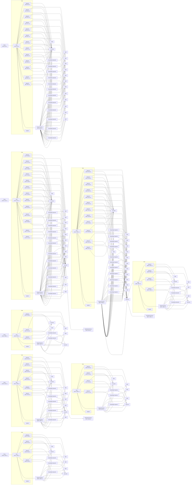

```mermaid
flowchart LR
  subgraph path2 [Path]
    2["Path<br>[362, 400, 0]"]
    3["Segment<br>[406, 439, 0]"]
    4["Segment<br>[445, 508, 0]"]
    5["Segment<br>[514, 541, 0]"]
    6["Segment<br>[547, 577, 0]"]
    7["Segment<br>[583, 618, 0]"]
    8["Segment<br>[624, 697, 0]"]
    9["Segment<br>[703, 733, 0]"]
    10["Segment<br>[739, 797, 0]"]
    11["Segment<br>[803, 830, 0]"]
    12["Segment<br>[836, 858, 0]"]
    13["Segment<br>[864, 899, 0]"]
    14["Segment<br>[905, 951, 0]"]
    15["Segment<br>[957, 964, 0]"]
    16[Solid2d]
  end
  subgraph path45 [Path]
    45["Path<br>[1129, 1167, 0]"]
    46["Segment<br>[1173, 1206, 0]"]
    47["Segment<br>[1212, 1275, 0]"]
    48["Segment<br>[1281, 1308, 0]"]
    49["Segment<br>[1314, 1344, 0]"]
    50["Segment<br>[1350, 1385, 0]"]
    51["Segment<br>[1391, 1464, 0]"]
    52["Segment<br>[1470, 1500, 0]"]
    53["Segment<br>[1506, 1564, 0]"]
    54["Segment<br>[1570, 1597, 0]"]
    55["Segment<br>[1603, 1625, 0]"]
    56["Segment<br>[1631, 1666, 0]"]
    57["Segment<br>[1672, 1718, 0]"]
    58["Segment<br>[1724, 1731, 0]"]
    59[Solid2d]
  end
  subgraph path89 [Path]
    89["Path<br>[1995, 2020, 0]"]
    90["Segment<br>[2026, 2068, 0]"]
    91["Segment<br>[2074, 2114, 0]"]
    92["Segment<br>[2120, 2127, 0]"]
    93[Solid2d]
  end
  subgraph path102 [Path]
    102["Path<br>[2261, 2286, 0]"]
    103["Segment<br>[2292, 2319, 0]"]
    104["Segment<br>[2325, 2359, 0]"]
    105["Segment<br>[2365, 2400, 0]"]
    106["Segment<br>[2406, 2487, 0]"]
    107["Segment<br>[2493, 2522, 0]"]
    108["Segment<br>[2528, 2581, 0]"]
    109["Segment<br>[2587, 2614, 0]"]
    110["Segment<br>[2620, 2649, 0]"]
    111["Segment<br>[2655, 2788, 0]"]
    112["Segment<br>[2794, 2848, 0]"]
    113["Segment<br>[2854, 2876, 0]"]
    114["Segment<br>[2882, 2901, 0]"]
    115[Solid2d]
  end
  subgraph path143 [Path]
    143["Path<br>[3161, 3186, 0]"]
    144["Segment<br>[3192, 3219, 0]"]
    145["Segment<br>[3225, 3257, 0]"]
    146["Segment<br>[3263, 3403, 0]"]
    147["Segment<br>[3409, 3464, 0]"]
    148["Segment<br>[3470, 3506, 0]"]
    149["Segment<br>[3512, 3519, 0]"]
    150[Solid2d]
  end
  subgraph path165 [Path]
    165["Path<br>[3614, 3664, 0]"]
    166["Segment<br>[3670, 3702, 0]"]
    167["Segment<br>[3708, 3735, 0]"]
    168["Segment<br>[3741, 3763, 0]"]
    169["Segment<br>[3769, 3776, 0]"]
    170[Solid2d]
  end
  subgraph path181 [Path]
    181["Path<br>[3869, 3894, 0]"]
    182["Segment<br>[3900, 3934, 0]"]
    183["Segment<br>[3940, 3967, 0]"]
    184["Segment<br>[3973, 3995, 0]"]
    185["Segment<br>[4001, 4008, 0]"]
    186[Solid2d]
  end
  subgraph path198 [Path]
    198["Path<br>[4301, 4350, 0]"]
    199["Segment<br>[4356, 4388, 0]"]
    200["Segment<br>[4394, 4442, 0]"]
    201["Segment<br>[4448, 4482, 0]"]
    202["Segment<br>[4488, 4495, 0]"]
    203[Solid2d]
  end
  1["Plane<br>[338, 356, 0]"]
  17["Sweep Revolve<br>[975, 1091, 0]"]
  18[Wall]
  19[Wall]
  20[Wall]
  21[Wall]
  22[Wall]
  23[Wall]
  24[Wall]
  25[Wall]
  26[Wall]
  27[Wall]
  28[Wall]
  29[Wall]
  30[Wall]
  31["Cap Start"]
  32["SweepEdge Opposite"]
  33["SweepEdge Opposite"]
  34["SweepEdge Opposite"]
  35["SweepEdge Opposite"]
  36["SweepEdge Opposite"]
  37["SweepEdge Opposite"]
  38["SweepEdge Opposite"]
  39["SweepEdge Opposite"]
  40["SweepEdge Opposite"]
  41["SweepEdge Opposite"]
  42["SweepEdge Opposite"]
  43["SweepEdge Opposite"]
  44["Plane<br>[1105, 1123, 0]"]
  60["Sweep Extrusion<br>[1737, 1774, 0]"]
  61[Wall]
  62[Wall]
  63[Wall]
  64[Wall]
  65[Wall]
  66[Wall]
  67[Wall]
  68[Wall]
  69[Wall]
  70[Wall]
  71[Wall]
  72[Wall]
  73[Wall]
  74["Cap Start"]
  75["Cap End"]
  76["SweepEdge Opposite"]
  77["SweepEdge Opposite"]
  78["SweepEdge Opposite"]
  79["SweepEdge Opposite"]
  80["SweepEdge Opposite"]
  81["SweepEdge Opposite"]
  82["SweepEdge Opposite"]
  83["SweepEdge Opposite"]
  84["SweepEdge Opposite"]
  85["SweepEdge Opposite"]
  86["SweepEdge Opposite"]
  87["SweepEdge Opposite"]
  88["Plane<br>[1963, 1989, 0]"]
  94["Sweep Extrusion<br>[2133, 2164, 0]"]
  95[Wall]
  96[Wall]
  97[Wall]
  98["Cap Start"]
  99["Cap End"]
  100["SweepEdge Opposite"]
  101["SweepEdge Opposite"]
  116["Sweep Extrusion<br>[2907, 2938, 0]"]
  117[Wall]
  118[Wall]
  119[Wall]
  120[Wall]
  121[Wall]
  122[Wall]
  123[Wall]
  124[Wall]
  125[Wall]
  126[Wall]
  127[Wall]
  128[Wall]
  129["Cap Start"]
  130["Cap End"]
  131["SweepEdge Opposite"]
  132["SweepEdge Opposite"]
  133["SweepEdge Opposite"]
  134["SweepEdge Opposite"]
  135["SweepEdge Opposite"]
  136["SweepEdge Opposite"]
  137["SweepEdge Opposite"]
  138["SweepEdge Opposite"]
  139["SweepEdge Opposite"]
  140["SweepEdge Opposite"]
  141["SweepEdge Opposite"]
  142["Plane<br>[3128, 3155, 0]"]
  151["Sweep Extrusion<br>[3525, 3556, 0]"]
  152[Wall]
  153[Wall]
  154[Wall]
  155[Wall]
  156[Wall]
  157[Wall]
  158["Cap Start"]
  159["Cap End"]
  160["SweepEdge Opposite"]
  161["SweepEdge Opposite"]
  162["SweepEdge Opposite"]
  163["SweepEdge Opposite"]
  164["SweepEdge Opposite"]
  171["Sweep Extrusion<br>[3782, 3813, 0]"]
  172[Wall]
  173[Wall]
  174[Wall]
  175[Wall]
  176["Cap Start"]
  177["Cap End"]
  178["SweepEdge Opposite"]
  179["SweepEdge Opposite"]
  180["SweepEdge Opposite"]
  187["Sweep Extrusion<br>[4014, 4064, 0]"]
  188[Wall]
  189[Wall]
  190[Wall]
  191[Wall]
  192["Cap Start"]
  193["Cap End"]
  194["SweepEdge Opposite"]
  195["SweepEdge Opposite"]
  196["SweepEdge Opposite"]
  197["Plane<br>[4268, 4295, 0]"]
  204["Sweep Extrusion<br>[4501, 4533, 0]"]
  205[Wall]
  206[Wall]
  207[Wall]
  208[Wall]
  209["Cap Start"]
  210["Cap End"]
  211["SweepEdge Opposite"]
  212["SweepEdge Opposite"]
  213["SweepEdge Opposite"]
  214["StartSketchOnFace<br>[2219, 2255, 0]"]
  215["StartSketchOnFace<br>[3570, 3608, 0]"]
  216["StartSketchOnFace<br>[3827, 3863, 0]"]
  1 --- 2
  2 --- 3
  2 --- 4
  2 --- 5
  2 --- 6
  2 --- 7
  2 --- 8
  2 --- 9
  2 --- 10
  2 --- 11
  2 --- 12
  2 --- 13
  2 --- 14
  2 --- 15
  2 ---- 17
  2 --- 16
  3 --- 18
  3 x--> 31
  4 --- 19
  4 --- 32
  4 x--> 31
  5 --- 20
  5 --- 33
  5 x--> 31
  6 --- 21
  6 --- 34
  6 x--> 31
  7 --- 22
  7 --- 35
  7 x--> 31
  8 --- 23
  8 --- 36
  8 x--> 31
  9 --- 24
  9 --- 37
  9 x--> 31
  10 --- 25
  10 --- 38
  10 x--> 31
  11 --- 26
  11 --- 39
  11 x--> 31
  12 --- 27
  12 --- 40
  12 x--> 31
  13 --- 28
  13 --- 41
  13 x--> 31
  14 --- 29
  14 --- 42
  14 x--> 31
  15 --- 30
  15 --- 43
  15 x--> 31
  17 --- 18
  17 --- 19
  17 --- 20
  17 --- 21
  17 --- 22
  17 --- 23
  17 --- 24
  17 --- 25
  17 --- 26
  17 --- 27
  17 --- 28
  17 --- 29
  17 --- 30
  17 --- 31
  17 --- 32
  17 --- 33
  17 --- 34
  17 --- 35
  17 --- 36
  17 --- 37
  17 --- 38
  17 --- 39
  17 --- 40
  17 --- 41
  17 --- 42
  17 --- 43
  32 <--x 19
  33 <--x 20
  34 <--x 21
  35 <--x 22
  36 <--x 23
  37 <--x 24
  38 <--x 25
  39 <--x 26
  40 <--x 27
  41 <--x 28
  42 <--x 29
  43 <--x 30
  44 --- 45
  45 --- 46
  45 --- 47
  45 --- 48
  45 --- 49
  45 --- 50
  45 --- 51
  45 --- 52
  45 --- 53
  45 --- 54
  45 --- 55
  45 --- 56
  45 --- 57
  45 --- 58
  45 ---- 60
  45 --- 59
  46 --- 61
  46 x--> 74
  47 --- 62
  47 --- 76
  47 x--> 74
  48 --- 63
  48 --- 77
  48 x--> 74
  49 --- 64
  49 --- 78
  49 x--> 74
  50 --- 65
  50 --- 79
  50 x--> 74
  51 --- 66
  51 --- 80
  51 x--> 74
  52 --- 67
  52 --- 81
  52 x--> 74
  53 --- 68
  53 --- 82
  53 x--> 74
  54 --- 69
  54 --- 83
  54 x--> 74
  55 --- 70
  55 --- 84
  55 x--> 74
  56 --- 71
  56 --- 85
  56 x--> 74
  57 --- 72
  57 --- 86
  57 x--> 74
  58 --- 73
  58 --- 87
  58 x--> 74
  60 --- 61
  60 --- 62
  60 --- 63
  60 --- 64
  60 --- 65
  60 --- 66
  60 --- 67
  60 --- 68
  60 --- 69
  60 --- 70
  60 --- 71
  60 --- 72
  60 --- 73
  60 --- 74
  60 --- 75
  60 --- 76
  60 --- 77
  60 --- 78
  60 --- 79
  60 --- 80
  60 --- 81
  60 --- 82
  60 --- 83
  60 --- 84
  60 --- 85
  60 --- 86
  60 --- 87
  75 --- 102
  76 <--x 62
  76 <--x 75
  77 <--x 63
  77 <--x 75
  78 <--x 64
  78 <--x 75
  79 <--x 65
  79 <--x 75
  80 <--x 66
  80 <--x 75
  81 <--x 67
  81 <--x 75
  82 <--x 68
  82 <--x 75
  83 <--x 69
  83 <--x 75
  84 <--x 70
  84 <--x 75
  85 <--x 71
  85 <--x 75
  86 <--x 72
  86 <--x 75
  87 <--x 73
  87 <--x 75
  88 --- 89
  89 --- 90
  89 --- 91
  89 --- 92
  89 ---- 94
  89 --- 93
  90 --- 97
  90 --- 101
  90 x--> 98
  91 --- 96
  91 --- 100
  91 x--> 98
  92 --- 95
  92 x--> 98
  94 --- 95
  94 --- 96
  94 --- 97
  94 --- 98
  94 --- 99
  94 --- 100
  94 --- 101
  100 <--x 96
  100 <--x 99
  101 <--x 97
  101 <--x 99
  102 --- 103
  102 --- 104
  102 --- 105
  102 --- 106
  102 --- 107
  102 --- 108
  102 --- 109
  102 --- 110
  102 --- 111
  102 --- 112
  102 --- 113
  102 --- 114
  102 ---- 116
  102 --- 115
  103 --- 128
  103 --- 141
  103 x--> 129
  104 --- 127
  104 --- 140
  104 x--> 129
  105 --- 126
  105 --- 139
  105 x--> 129
  106 --- 125
  106 --- 138
  106 x--> 129
  107 --- 124
  107 --- 137
  107 x--> 129
  108 --- 123
  108 --- 136
  108 x--> 129
  109 --- 122
  109 --- 135
  109 x--> 129
  110 --- 121
  110 --- 134
  110 x--> 129
  111 --- 120
  111 --- 133
  111 x--> 129
  112 --- 119
  112 --- 132
  112 x--> 129
  113 --- 118
  113 --- 131
  113 x--> 129
  114 --- 117
  114 x--> 129
  116 --- 117
  116 --- 118
  116 --- 119
  116 --- 120
  116 --- 121
  116 --- 122
  116 --- 123
  116 --- 124
  116 --- 125
  116 --- 126
  116 --- 127
  116 --- 128
  116 --- 129
  116 --- 130
  116 --- 131
  116 --- 132
  116 --- 133
  116 --- 134
  116 --- 135
  116 --- 136
  116 --- 137
  116 --- 138
  116 --- 139
  116 --- 140
  116 --- 141
  130 --- 181
  131 <--x 118
  131 <--x 130
  132 <--x 119
  132 <--x 130
  133 <--x 120
  133 <--x 130
  134 <--x 121
  134 <--x 130
  135 <--x 122
  135 <--x 130
  136 <--x 123
  136 <--x 130
  137 <--x 124
  137 <--x 130
  138 <--x 125
  138 <--x 130
  139 <--x 126
  139 <--x 130
  140 <--x 127
  140 <--x 130
  141 <--x 128
  141 <--x 130
  142 --- 143
  143 --- 144
  143 --- 145
  143 --- 146
  143 --- 147
  143 --- 148
  143 --- 149
  143 ---- 151
  143 --- 150
  144 --- 152
  144 x--> 158
  145 --- 153
  145 --- 160
  145 x--> 158
  146 --- 154
  146 --- 161
  146 x--> 158
  147 --- 155
  147 --- 162
  147 x--> 158
  148 --- 156
  148 --- 163
  148 x--> 158
  149 --- 157
  149 --- 164
  149 x--> 158
  151 --- 152
  151 --- 153
  151 --- 154
  151 --- 155
  151 --- 156
  151 --- 157
  151 --- 158
  151 --- 159
  151 --- 160
  151 --- 161
  151 --- 162
  151 --- 163
  151 --- 164
  156 --- 165
  160 <--x 153
  160 <--x 159
  161 <--x 154
  161 <--x 159
  162 <--x 155
  162 <--x 159
  163 <--x 156
  163 <--x 159
  164 <--x 157
  164 <--x 159
  165 --- 166
  165 --- 167
  165 --- 168
  165 --- 169
  165 ---- 171
  165 --- 170
  166 --- 172
  166 x--> 176
  167 --- 173
  167 --- 178
  167 x--> 176
  168 --- 174
  168 --- 179
  168 x--> 176
  169 --- 175
  169 --- 180
  169 x--> 176
  171 --- 172
  171 --- 173
  171 --- 174
  171 --- 175
  171 --- 176
  171 --- 177
  171 --- 178
  171 --- 179
  171 --- 180
  178 <--x 173
  178 <--x 177
  179 <--x 174
  179 <--x 177
  180 <--x 175
  180 <--x 177
  181 --- 182
  181 --- 183
  181 --- 184
  181 --- 185
  181 ---- 187
  181 --- 186
  182 --- 188
  182 x--> 192
  183 --- 189
  183 --- 194
  183 x--> 192
  184 --- 190
  184 --- 195
  184 x--> 192
  185 --- 191
  185 --- 196
  185 x--> 192
  187 --- 188
  187 --- 189
  187 --- 190
  187 --- 191
  187 --- 192
  187 --- 193
  187 --- 194
  187 --- 195
  187 --- 196
  194 <--x 189
  194 <--x 193
  195 <--x 190
  195 <--x 193
  196 <--x 191
  196 <--x 193
  197 --- 198
  198 --- 199
  198 --- 200
  198 --- 201
  198 --- 202
  198 ---- 204
  198 --- 203
  199 --- 205
  199 x--> 210
  200 --- 206
  200 --- 211
  200 x--> 210
  201 --- 207
  201 --- 212
  201 x--> 210
  202 --- 208
  202 --- 213
  202 x--> 210
  204 --- 205
  204 --- 206
  204 --- 207
  204 --- 208
  204 --- 209
  204 --- 210
  204 --- 211
  204 --- 212
  204 --- 213
  211 <--x 206
  211 <--x 209
  212 <--x 207
  212 <--x 209
  213 <--x 208
  213 <--x 209
  75 <--x 214
  156 <--x 215
  130 <--x 216
```
