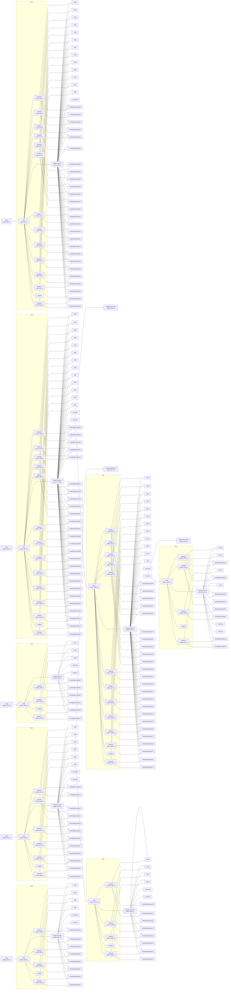

```mermaid
flowchart LR
  subgraph path2 [Path]
    2["Path<br>[362, 400, 0]"]
    3["Segment<br>[406, 439, 0]"]
    4["Segment<br>[445, 508, 0]"]
    5["Segment<br>[514, 541, 0]"]
    6["Segment<br>[547, 577, 0]"]
    7["Segment<br>[583, 618, 0]"]
    8["Segment<br>[624, 697, 0]"]
    9["Segment<br>[703, 733, 0]"]
    10["Segment<br>[739, 797, 0]"]
    11["Segment<br>[803, 830, 0]"]
    12["Segment<br>[836, 858, 0]"]
    13["Segment<br>[864, 899, 0]"]
    14["Segment<br>[905, 951, 0]"]
    15["Segment<br>[957, 964, 0]"]
    16[Solid2d]
  end
  subgraph path59 [Path]
    59["Path<br>[1129, 1167, 0]"]
    60["Segment<br>[1173, 1206, 0]"]
    61["Segment<br>[1212, 1275, 0]"]
    62["Segment<br>[1281, 1308, 0]"]
    63["Segment<br>[1314, 1344, 0]"]
    64["Segment<br>[1350, 1385, 0]"]
    65["Segment<br>[1391, 1464, 0]"]
    66["Segment<br>[1470, 1500, 0]"]
    67["Segment<br>[1506, 1564, 0]"]
    68["Segment<br>[1570, 1597, 0]"]
    69["Segment<br>[1603, 1625, 0]"]
    70["Segment<br>[1631, 1666, 0]"]
    71["Segment<br>[1672, 1718, 0]"]
    72["Segment<br>[1724, 1731, 0]"]
    73[Solid2d]
  end
  subgraph path117 [Path]
    117["Path<br>[2031, 2056, 0]"]
    118["Segment<br>[2062, 2104, 0]"]
    119["Segment<br>[2110, 2150, 0]"]
    120["Segment<br>[2156, 2163, 0]"]
    121[Solid2d]
  end
  subgraph path134 [Path]
    134["Path<br>[2297, 2322, 0]"]
    135["Segment<br>[2328, 2355, 0]"]
    136["Segment<br>[2361, 2395, 0]"]
    137["Segment<br>[2401, 2436, 0]"]
    138["Segment<br>[2442, 2523, 0]"]
    139["Segment<br>[2529, 2558, 0]"]
    140["Segment<br>[2564, 2617, 0]"]
    141["Segment<br>[2623, 2650, 0]"]
    142["Segment<br>[2656, 2685, 0]"]
    143["Segment<br>[2691, 2824, 0]"]
    144["Segment<br>[2830, 2884, 0]"]
    145["Segment<br>[2890, 2912, 0]"]
    146["Segment<br>[2918, 2937, 0]"]
    147[Solid2d]
  end
  subgraph path188 [Path]
    188["Path<br>[3233, 3258, 0]"]
    189["Segment<br>[3264, 3291, 0]"]
    190["Segment<br>[3297, 3328, 0]"]
    191["Segment<br>[3334, 3467, 0]"]
    192["Segment<br>[3473, 3527, 0]"]
    193["Segment<br>[3533, 3569, 0]"]
    194["Segment<br>[3575, 3582, 0]"]
    195[Solid2d]
  end
  subgraph path217 [Path]
    217["Path<br>[3677, 3727, 0]"]
    218["Segment<br>[3733, 3765, 0]"]
    219["Segment<br>[3771, 3798, 0]"]
    220["Segment<br>[3804, 3826, 0]"]
    221["Segment<br>[3832, 3839, 0]"]
    222[Solid2d]
  end
  subgraph path238 [Path]
    238["Path<br>[3932, 3957, 0]"]
    239["Segment<br>[3963, 3997, 0]"]
    240["Segment<br>[4003, 4030, 0]"]
    241["Segment<br>[4036, 4058, 0]"]
    242["Segment<br>[4064, 4071, 0]"]
    243[Solid2d]
  end
  subgraph path260 [Path]
    260["Path<br>[4399, 4448, 0]"]
    261["Segment<br>[4454, 4486, 0]"]
    262["Segment<br>[4492, 4540, 0]"]
    263["Segment<br>[4546, 4580, 0]"]
    264["Segment<br>[4586, 4593, 0]"]
    265[Solid2d]
  end
  1["Plane<br>[338, 356, 0]"]
  17["Sweep Revolve<br>[975, 1091, 0]"]
  18[Wall]
  19[Wall]
  20[Wall]
  21[Wall]
  22[Wall]
  23[Wall]
  24[Wall]
  25[Wall]
  26[Wall]
  27[Wall]
  28[Wall]
  29[Wall]
  30[Wall]
  31["Cap Start"]
  32["SweepEdge Opposite"]
  33["SweepEdge Adjacent"]
  34["SweepEdge Opposite"]
  35["SweepEdge Adjacent"]
  36["SweepEdge Opposite"]
  37["SweepEdge Adjacent"]
  38["SweepEdge Opposite"]
  39["SweepEdge Adjacent"]
  40["SweepEdge Opposite"]
  41["SweepEdge Adjacent"]
  42["SweepEdge Opposite"]
  43["SweepEdge Adjacent"]
  44["SweepEdge Opposite"]
  45["SweepEdge Adjacent"]
  46["SweepEdge Opposite"]
  47["SweepEdge Adjacent"]
  48["SweepEdge Opposite"]
  49["SweepEdge Adjacent"]
  50["SweepEdge Opposite"]
  51["SweepEdge Adjacent"]
  52["SweepEdge Opposite"]
  53["SweepEdge Adjacent"]
  54["SweepEdge Opposite"]
  55["SweepEdge Adjacent"]
  56["SweepEdge Opposite"]
  57["SweepEdge Adjacent"]
  58["Plane<br>[1105, 1123, 0]"]
  74["Sweep Extrusion<br>[1737, 1774, 0]"]
  75[Wall]
  76[Wall]
  77[Wall]
  78[Wall]
  79[Wall]
  80[Wall]
  81[Wall]
  82[Wall]
  83[Wall]
  84[Wall]
  85[Wall]
  86[Wall]
  87[Wall]
  88["Cap Start"]
  89["Cap End"]
  90["SweepEdge Opposite"]
  91["SweepEdge Adjacent"]
  92["SweepEdge Opposite"]
  93["SweepEdge Adjacent"]
  94["SweepEdge Opposite"]
  95["SweepEdge Adjacent"]
  96["SweepEdge Opposite"]
  97["SweepEdge Adjacent"]
  98["SweepEdge Opposite"]
  99["SweepEdge Adjacent"]
  100["SweepEdge Opposite"]
  101["SweepEdge Adjacent"]
  102["SweepEdge Opposite"]
  103["SweepEdge Adjacent"]
  104["SweepEdge Opposite"]
  105["SweepEdge Adjacent"]
  106["SweepEdge Opposite"]
  107["SweepEdge Adjacent"]
  108["SweepEdge Opposite"]
  109["SweepEdge Adjacent"]
  110["SweepEdge Opposite"]
  111["SweepEdge Adjacent"]
  112["SweepEdge Opposite"]
  113["SweepEdge Adjacent"]
  114["SweepEdge Opposite"]
  115["SweepEdge Adjacent"]
  116["Plane<br>[1999, 2025, 0]"]
  122["Sweep Extrusion<br>[2169, 2200, 0]"]
  123[Wall]
  124[Wall]
  125[Wall]
  126["Cap Start"]
  127["Cap End"]
  128["SweepEdge Opposite"]
  129["SweepEdge Adjacent"]
  130["SweepEdge Opposite"]
  131["SweepEdge Adjacent"]
  132["SweepEdge Opposite"]
  133["SweepEdge Adjacent"]
  148["Sweep Extrusion<br>[2943, 2974, 0]"]
  149[Wall]
  150[Wall]
  151[Wall]
  152[Wall]
  153[Wall]
  154[Wall]
  155[Wall]
  156[Wall]
  157[Wall]
  158[Wall]
  159[Wall]
  160[Wall]
  161["Cap Start"]
  162["Cap End"]
  163["SweepEdge Opposite"]
  164["SweepEdge Adjacent"]
  165["SweepEdge Opposite"]
  166["SweepEdge Adjacent"]
  167["SweepEdge Opposite"]
  168["SweepEdge Adjacent"]
  169["SweepEdge Opposite"]
  170["SweepEdge Adjacent"]
  171["SweepEdge Opposite"]
  172["SweepEdge Adjacent"]
  173["SweepEdge Opposite"]
  174["SweepEdge Adjacent"]
  175["SweepEdge Opposite"]
  176["SweepEdge Adjacent"]
  177["SweepEdge Opposite"]
  178["SweepEdge Adjacent"]
  179["SweepEdge Opposite"]
  180["SweepEdge Adjacent"]
  181["SweepEdge Opposite"]
  182["SweepEdge Adjacent"]
  183["SweepEdge Opposite"]
  184["SweepEdge Adjacent"]
  185["SweepEdge Opposite"]
  186["SweepEdge Adjacent"]
  187["Plane<br>[3200, 3227, 0]"]
  196["Sweep Extrusion<br>[3588, 3619, 0]"]
  197[Wall]
  198[Wall]
  199[Wall]
  200[Wall]
  201[Wall]
  202[Wall]
  203["Cap Start"]
  204["Cap End"]
  205["SweepEdge Opposite"]
  206["SweepEdge Adjacent"]
  207["SweepEdge Opposite"]
  208["SweepEdge Adjacent"]
  209["SweepEdge Opposite"]
  210["SweepEdge Adjacent"]
  211["SweepEdge Opposite"]
  212["SweepEdge Adjacent"]
  213["SweepEdge Opposite"]
  214["SweepEdge Adjacent"]
  215["SweepEdge Opposite"]
  216["SweepEdge Adjacent"]
  223["Sweep Extrusion<br>[3845, 3876, 0]"]
  224[Wall]
  225[Wall]
  226[Wall]
  227[Wall]
  228["Cap Start"]
  229["Cap End"]
  230["SweepEdge Opposite"]
  231["SweepEdge Adjacent"]
  232["SweepEdge Opposite"]
  233["SweepEdge Adjacent"]
  234["SweepEdge Opposite"]
  235["SweepEdge Adjacent"]
  236["SweepEdge Opposite"]
  237["SweepEdge Adjacent"]
  244["Sweep Extrusion<br>[4077, 4127, 0]"]
  245[Wall]
  246[Wall]
  247[Wall]
  248[Wall]
  249["Cap Start"]
  250["Cap End"]
  251["SweepEdge Opposite"]
  252["SweepEdge Adjacent"]
  253["SweepEdge Opposite"]
  254["SweepEdge Adjacent"]
  255["SweepEdge Opposite"]
  256["SweepEdge Adjacent"]
  257["SweepEdge Opposite"]
  258["SweepEdge Adjacent"]
  259["Plane<br>[4366, 4393, 0]"]
  266["Sweep Extrusion<br>[4599, 4631, 0]"]
  267[Wall]
  268[Wall]
  269[Wall]
  270[Wall]
  271["Cap Start"]
  272["Cap End"]
  273["SweepEdge Opposite"]
  274["SweepEdge Adjacent"]
  275["SweepEdge Opposite"]
  276["SweepEdge Adjacent"]
  277["SweepEdge Opposite"]
  278["SweepEdge Adjacent"]
  279["SweepEdge Opposite"]
  280["SweepEdge Adjacent"]
  281["StartSketchOnFace<br>[2255, 2291, 0]"]
  282["StartSketchOnFace<br>[3633, 3671, 0]"]
  283["StartSketchOnFace<br>[3890, 3926, 0]"]
  1 --- 2
  2 --- 3
  2 --- 4
  2 --- 5
  2 --- 6
  2 --- 7
  2 --- 8
  2 --- 9
  2 --- 10
  2 --- 11
  2 --- 12
  2 --- 13
  2 --- 14
  2 --- 15
  2 ---- 17
  2 --- 16
  3 --- 18
  3 --- 32
  3 --- 33
  4 --- 19
  4 --- 34
  4 --- 35
  5 --- 20
  5 --- 36
  5 --- 37
  6 --- 21
  6 --- 38
  6 --- 39
  7 --- 22
  7 --- 40
  7 --- 41
  8 --- 23
  8 --- 42
  8 --- 43
  9 --- 24
  9 --- 44
  9 --- 45
  10 --- 25
  10 --- 46
  10 --- 47
  11 --- 26
  11 --- 48
  11 --- 49
  12 --- 27
  12 --- 50
  12 --- 51
  13 --- 28
  13 --- 52
  13 --- 53
  14 --- 29
  14 --- 54
  14 --- 55
  15 --- 30
  15 --- 56
  15 --- 57
  17 --- 18
  17 --- 19
  17 --- 20
  17 --- 21
  17 --- 22
  17 --- 23
  17 --- 24
  17 --- 25
  17 --- 26
  17 --- 27
  17 --- 28
  17 --- 29
  17 --- 30
  17 --- 31
  17 --- 32
  17 --- 33
  17 --- 34
  17 --- 35
  17 --- 36
  17 --- 37
  17 --- 38
  17 --- 39
  17 --- 40
  17 --- 41
  17 --- 42
  17 --- 43
  17 --- 44
  17 --- 45
  17 --- 46
  17 --- 47
  17 --- 48
  17 --- 49
  17 --- 50
  17 --- 51
  17 --- 52
  17 --- 53
  17 --- 54
  17 --- 55
  17 --- 56
  17 --- 57
  58 --- 59
  59 --- 60
  59 --- 61
  59 --- 62
  59 --- 63
  59 --- 64
  59 --- 65
  59 --- 66
  59 --- 67
  59 --- 68
  59 --- 69
  59 --- 70
  59 --- 71
  59 --- 72
  59 ---- 74
  59 --- 73
  60 --- 75
  60 --- 90
  60 --- 91
  61 --- 76
  61 --- 92
  61 --- 93
  62 --- 77
  62 --- 94
  62 --- 95
  63 --- 78
  63 --- 96
  63 --- 97
  64 --- 79
  64 --- 98
  64 --- 99
  65 --- 80
  65 --- 100
  65 --- 101
  66 --- 81
  66 --- 102
  66 --- 103
  67 --- 82
  67 --- 104
  67 --- 105
  68 --- 83
  68 --- 106
  68 --- 107
  69 --- 84
  69 --- 108
  69 --- 109
  70 --- 85
  70 --- 110
  70 --- 111
  71 --- 86
  71 --- 112
  71 --- 113
  72 --- 87
  72 --- 114
  72 --- 115
  74 --- 75
  74 --- 76
  74 --- 77
  74 --- 78
  74 --- 79
  74 --- 80
  74 --- 81
  74 --- 82
  74 --- 83
  74 --- 84
  74 --- 85
  74 --- 86
  74 --- 87
  74 --- 88
  74 --- 89
  74 --- 90
  74 --- 91
  74 --- 92
  74 --- 93
  74 --- 94
  74 --- 95
  74 --- 96
  74 --- 97
  74 --- 98
  74 --- 99
  74 --- 100
  74 --- 101
  74 --- 102
  74 --- 103
  74 --- 104
  74 --- 105
  74 --- 106
  74 --- 107
  74 --- 108
  74 --- 109
  74 --- 110
  74 --- 111
  74 --- 112
  74 --- 113
  74 --- 114
  74 --- 115
  89 --- 134
  116 --- 117
  117 --- 118
  117 --- 119
  117 --- 120
  117 ---- 122
  117 --- 121
  118 --- 125
  118 --- 132
  118 --- 133
  119 --- 124
  119 --- 130
  119 --- 131
  120 --- 123
  120 --- 128
  120 --- 129
  122 --- 123
  122 --- 124
  122 --- 125
  122 --- 126
  122 --- 127
  122 --- 128
  122 --- 129
  122 --- 130
  122 --- 131
  122 --- 132
  122 --- 133
  134 --- 135
  134 --- 136
  134 --- 137
  134 --- 138
  134 --- 139
  134 --- 140
  134 --- 141
  134 --- 142
  134 --- 143
  134 --- 144
  134 --- 145
  134 --- 146
  134 ---- 148
  134 --- 147
  135 --- 160
  135 --- 185
  135 --- 186
  136 --- 159
  136 --- 183
  136 --- 184
  137 --- 158
  137 --- 181
  137 --- 182
  138 --- 157
  138 --- 179
  138 --- 180
  139 --- 156
  139 --- 177
  139 --- 178
  140 --- 155
  140 --- 175
  140 --- 176
  141 --- 154
  141 --- 173
  141 --- 174
  142 --- 153
  142 --- 171
  142 --- 172
  143 --- 152
  143 --- 169
  143 --- 170
  144 --- 151
  144 --- 167
  144 --- 168
  145 --- 150
  145 --- 165
  145 --- 166
  146 --- 149
  146 --- 163
  146 --- 164
  148 --- 149
  148 --- 150
  148 --- 151
  148 --- 152
  148 --- 153
  148 --- 154
  148 --- 155
  148 --- 156
  148 --- 157
  148 --- 158
  148 --- 159
  148 --- 160
  148 --- 161
  148 --- 162
  148 --- 163
  148 --- 164
  148 --- 165
  148 --- 166
  148 --- 167
  148 --- 168
  148 --- 169
  148 --- 170
  148 --- 171
  148 --- 172
  148 --- 173
  148 --- 174
  148 --- 175
  148 --- 176
  148 --- 177
  148 --- 178
  148 --- 179
  148 --- 180
  148 --- 181
  148 --- 182
  148 --- 183
  148 --- 184
  148 --- 185
  148 --- 186
  162 --- 238
  187 --- 188
  188 --- 189
  188 --- 190
  188 --- 191
  188 --- 192
  188 --- 193
  188 --- 194
  188 ---- 196
  188 --- 195
  189 --- 197
  189 --- 205
  189 --- 206
  190 --- 198
  190 --- 207
  190 --- 208
  191 --- 199
  191 --- 209
  191 --- 210
  192 --- 200
  192 --- 211
  192 --- 212
  193 --- 201
  193 --- 213
  193 --- 214
  194 --- 202
  194 --- 215
  194 --- 216
  196 --- 197
  196 --- 198
  196 --- 199
  196 --- 200
  196 --- 201
  196 --- 202
  196 --- 203
  196 --- 204
  196 --- 205
  196 --- 206
  196 --- 207
  196 --- 208
  196 --- 209
  196 --- 210
  196 --- 211
  196 --- 212
  196 --- 213
  196 --- 214
  196 --- 215
  196 --- 216
  201 --- 217
  217 --- 218
  217 --- 219
  217 --- 220
  217 --- 221
  217 ---- 223
  217 --- 222
  218 --- 224
  218 --- 230
  218 --- 231
  219 --- 225
  219 --- 232
  219 --- 233
  220 --- 226
  220 --- 234
  220 --- 235
  221 --- 227
  221 --- 236
  221 --- 237
  223 --- 224
  223 --- 225
  223 --- 226
  223 --- 227
  223 --- 228
  223 --- 229
  223 --- 230
  223 --- 231
  223 --- 232
  223 --- 233
  223 --- 234
  223 --- 235
  223 --- 236
  223 --- 237
  238 --- 239
  238 --- 240
  238 --- 241
  238 --- 242
  238 ---- 244
  238 --- 243
  239 --- 245
  239 --- 251
  239 --- 252
  240 --- 246
  240 --- 253
  240 --- 254
  241 --- 247
  241 --- 255
  241 --- 256
  242 --- 248
  242 --- 257
  242 --- 258
  244 --- 245
  244 --- 246
  244 --- 247
  244 --- 248
  244 --- 249
  244 --- 250
  244 --- 251
  244 --- 252
  244 --- 253
  244 --- 254
  244 --- 255
  244 --- 256
  244 --- 257
  244 --- 258
  259 --- 260
  260 --- 261
  260 --- 262
  260 --- 263
  260 --- 264
  260 ---- 266
  260 --- 265
  261 --- 267
  261 --- 273
  261 --- 274
  262 --- 268
  262 --- 275
  262 --- 276
  263 --- 269
  263 --- 277
  263 --- 278
  264 --- 270
  264 --- 279
  264 --- 280
  266 --- 267
  266 --- 268
  266 --- 269
  266 --- 270
  266 --- 271
  266 --- 272
  266 --- 273
  266 --- 274
  266 --- 275
  266 --- 276
  266 --- 277
  266 --- 278
  266 --- 279
  266 --- 280
  89 <--x 281
  201 <--x 282
  162 <--x 283
```
