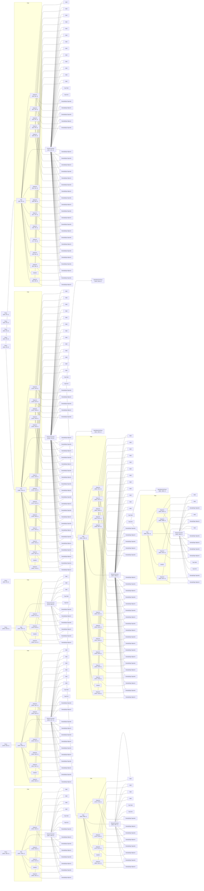

```mermaid
flowchart LR
  subgraph path7 [Path]
    7["Path<br>[284, 322, 0]"]
    8["Segment<br>[328, 361, 0]"]
    9["Segment<br>[367, 424, 0]"]
    10["Segment<br>[430, 457, 0]"]
    11["Segment<br>[463, 493, 0]"]
    12["Segment<br>[499, 534, 0]"]
    13["Segment<br>[540, 632, 0]"]
    14["Segment<br>[638, 668, 0]"]
    15["Segment<br>[674, 732, 0]"]
    16["Segment<br>[738, 765, 0]"]
    17["Segment<br>[771, 793, 0]"]
    18["Segment<br>[799, 834, 0]"]
    19["Segment<br>[840, 886, 0]"]
    20["Segment<br>[892, 899, 0]"]
    21[Solid2d]
  end
  subgraph path64 [Path]
    64["Path<br>[1085, 1123, 0]"]
    65["Segment<br>[1129, 1162, 0]"]
    66["Segment<br>[1168, 1225, 0]"]
    67["Segment<br>[1231, 1258, 0]"]
    68["Segment<br>[1264, 1294, 0]"]
    69["Segment<br>[1300, 1335, 0]"]
    70["Segment<br>[1341, 1433, 0]"]
    71["Segment<br>[1439, 1469, 0]"]
    72["Segment<br>[1475, 1533, 0]"]
    73["Segment<br>[1539, 1566, 0]"]
    74["Segment<br>[1572, 1594, 0]"]
    75["Segment<br>[1600, 1635, 0]"]
    76["Segment<br>[1641, 1687, 0]"]
    77["Segment<br>[1693, 1700, 0]"]
    78[Solid2d]
  end
  subgraph path122 [Path]
    122["Path<br>[2032, 2057, 0]"]
    123["Segment<br>[2063, 2113, 0]"]
    124["Segment<br>[2119, 2159, 0]"]
    125["Segment<br>[2165, 2172, 0]"]
    126[Solid2d]
  end
  subgraph path139 [Path]
    139["Path<br>[2260, 2285, 0]"]
    140["Segment<br>[2291, 2318, 0]"]
    141["Segment<br>[2324, 2358, 0]"]
    142["Segment<br>[2364, 2399, 0]"]
    143["Segment<br>[2405, 2505, 0]"]
    144["Segment<br>[2511, 2540, 0]"]
    145["Segment<br>[2546, 2599, 0]"]
    146["Segment<br>[2605, 2632, 0]"]
    147["Segment<br>[2638, 2667, 0]"]
    148["Segment<br>[2673, 2797, 0]"]
    149["Segment<br>[2803, 2848, 0]"]
    150["Segment<br>[2854, 2876, 0]"]
    151["Segment<br>[2882, 2901, 0]"]
    152[Solid2d]
  end
  subgraph path193 [Path]
    193["Path<br>[3229, 3254, 0]"]
    194["Segment<br>[3260, 3287, 0]"]
    195["Segment<br>[3293, 3324, 0]"]
    196["Segment<br>[3330, 3454, 0]"]
    197["Segment<br>[3460, 3505, 0]"]
    198["Segment<br>[3511, 3547, 0]"]
    199["Segment<br>[3553, 3560, 0]"]
    200[Solid2d]
  end
  subgraph path222 [Path]
    222["Path<br>[3648, 3698, 0]"]
    223["Segment<br>[3704, 3736, 0]"]
    224["Segment<br>[3742, 3769, 0]"]
    225["Segment<br>[3775, 3797, 0]"]
    226["Segment<br>[3803, 3810, 0]"]
    227[Solid2d]
  end
  subgraph path243 [Path]
    243["Path<br>[3898, 3923, 0]"]
    244["Segment<br>[3929, 3963, 0]"]
    245["Segment<br>[3969, 3996, 0]"]
    246["Segment<br>[4002, 4024, 0]"]
    247["Segment<br>[4030, 4037, 0]"]
    248[Solid2d]
  end
  subgraph path265 [Path]
    265["Path<br>[4397, 4446, 0]"]
    266["Segment<br>[4452, 4484, 0]"]
    267["Segment<br>[4490, 4538, 0]"]
    268["Segment<br>[4544, 4578, 0]"]
    269["Segment<br>[4584, 4591, 0]"]
    270[Solid2d]
  end
  1["Plane<br>[258, 278, 0]"]
  2["Plane<br>[258, 278, 0]"]
  3["Plane<br>[258, 278, 0]"]
  4["Plane<br>[258, 278, 0]"]
  5["Plane<br>[258, 278, 0]"]
  6["Plane<br>[258, 278, 0]"]
  22["Sweep Revolve<br>[910, 1045, 0]"]
  23[Wall]
  24[Wall]
  25[Wall]
  26[Wall]
  27[Wall]
  28[Wall]
  29[Wall]
  30[Wall]
  31[Wall]
  32[Wall]
  33[Wall]
  34[Wall]
  35[Wall]
  36["Cap Start"]
  37["Cap End"]
  38["SweepEdge Opposite"]
  39["SweepEdge Adjacent"]
  40["SweepEdge Opposite"]
  41["SweepEdge Adjacent"]
  42["SweepEdge Opposite"]
  43["SweepEdge Adjacent"]
  44["SweepEdge Opposite"]
  45["SweepEdge Adjacent"]
  46["SweepEdge Opposite"]
  47["SweepEdge Adjacent"]
  48["SweepEdge Opposite"]
  49["SweepEdge Adjacent"]
  50["SweepEdge Opposite"]
  51["SweepEdge Adjacent"]
  52["SweepEdge Opposite"]
  53["SweepEdge Adjacent"]
  54["SweepEdge Opposite"]
  55["SweepEdge Adjacent"]
  56["SweepEdge Opposite"]
  57["SweepEdge Adjacent"]
  58["SweepEdge Opposite"]
  59["SweepEdge Adjacent"]
  60["SweepEdge Opposite"]
  61["SweepEdge Adjacent"]
  62["SweepEdge Opposite"]
  63["SweepEdge Adjacent"]
  79["Sweep Extrusion<br>[1706, 1743, 0]"]
  80[Wall]
  81[Wall]
  82[Wall]
  83[Wall]
  84[Wall]
  85[Wall]
  86[Wall]
  87[Wall]
  88[Wall]
  89[Wall]
  90[Wall]
  91[Wall]
  92[Wall]
  93["Cap Start"]
  94["Cap End"]
  95["SweepEdge Opposite"]
  96["SweepEdge Adjacent"]
  97["SweepEdge Opposite"]
  98["SweepEdge Adjacent"]
  99["SweepEdge Opposite"]
  100["SweepEdge Adjacent"]
  101["SweepEdge Opposite"]
  102["SweepEdge Adjacent"]
  103["SweepEdge Opposite"]
  104["SweepEdge Adjacent"]
  105["SweepEdge Opposite"]
  106["SweepEdge Adjacent"]
  107["SweepEdge Opposite"]
  108["SweepEdge Adjacent"]
  109["SweepEdge Opposite"]
  110["SweepEdge Adjacent"]
  111["SweepEdge Opposite"]
  112["SweepEdge Adjacent"]
  113["SweepEdge Opposite"]
  114["SweepEdge Adjacent"]
  115["SweepEdge Opposite"]
  116["SweepEdge Adjacent"]
  117["SweepEdge Opposite"]
  118["SweepEdge Adjacent"]
  119["SweepEdge Opposite"]
  120["SweepEdge Adjacent"]
  121["Plane<br>[2000, 2026, 0]"]
  127["Sweep Extrusion<br>[2178, 2209, 0]"]
  128[Wall]
  129[Wall]
  130[Wall]
  131["Cap Start"]
  132["Cap End"]
  133["SweepEdge Opposite"]
  134["SweepEdge Adjacent"]
  135["SweepEdge Opposite"]
  136["SweepEdge Adjacent"]
  137["SweepEdge Opposite"]
  138["SweepEdge Adjacent"]
  153["Sweep Extrusion<br>[2907, 2938, 0]"]
  154[Wall]
  155[Wall]
  156[Wall]
  157[Wall]
  158[Wall]
  159[Wall]
  160[Wall]
  161[Wall]
  162[Wall]
  163[Wall]
  164[Wall]
  165[Wall]
  166["Cap Start"]
  167["Cap End"]
  168["SweepEdge Opposite"]
  169["SweepEdge Adjacent"]
  170["SweepEdge Opposite"]
  171["SweepEdge Adjacent"]
  172["SweepEdge Opposite"]
  173["SweepEdge Adjacent"]
  174["SweepEdge Opposite"]
  175["SweepEdge Adjacent"]
  176["SweepEdge Opposite"]
  177["SweepEdge Adjacent"]
  178["SweepEdge Opposite"]
  179["SweepEdge Adjacent"]
  180["SweepEdge Opposite"]
  181["SweepEdge Adjacent"]
  182["SweepEdge Opposite"]
  183["SweepEdge Adjacent"]
  184["SweepEdge Opposite"]
  185["SweepEdge Adjacent"]
  186["SweepEdge Opposite"]
  187["SweepEdge Adjacent"]
  188["SweepEdge Opposite"]
  189["SweepEdge Adjacent"]
  190["SweepEdge Opposite"]
  191["SweepEdge Adjacent"]
  192["Plane<br>[3196, 3223, 0]"]
  201["Sweep Extrusion<br>[3566, 3597, 0]"]
  202[Wall]
  203[Wall]
  204[Wall]
  205[Wall]
  206[Wall]
  207[Wall]
  208["Cap Start"]
  209["Cap End"]
  210["SweepEdge Opposite"]
  211["SweepEdge Adjacent"]
  212["SweepEdge Opposite"]
  213["SweepEdge Adjacent"]
  214["SweepEdge Opposite"]
  215["SweepEdge Adjacent"]
  216["SweepEdge Opposite"]
  217["SweepEdge Adjacent"]
  218["SweepEdge Opposite"]
  219["SweepEdge Adjacent"]
  220["SweepEdge Opposite"]
  221["SweepEdge Adjacent"]
  228["Sweep Extrusion<br>[3816, 3847, 0]"]
  229[Wall]
  230[Wall]
  231[Wall]
  232[Wall]
  233["Cap Start"]
  234["Cap End"]
  235["SweepEdge Opposite"]
  236["SweepEdge Adjacent"]
  237["SweepEdge Opposite"]
  238["SweepEdge Adjacent"]
  239["SweepEdge Opposite"]
  240["SweepEdge Adjacent"]
  241["SweepEdge Opposite"]
  242["SweepEdge Adjacent"]
  249["Sweep Extrusion<br>[4043, 4093, 0]"]
  250[Wall]
  251[Wall]
  252[Wall]
  253[Wall]
  254["Cap Start"]
  255["Cap End"]
  256["SweepEdge Opposite"]
  257["SweepEdge Adjacent"]
  258["SweepEdge Opposite"]
  259["SweepEdge Adjacent"]
  260["SweepEdge Opposite"]
  261["SweepEdge Adjacent"]
  262["SweepEdge Opposite"]
  263["SweepEdge Adjacent"]
  264["Plane<br>[4364, 4391, 0]"]
  271["Sweep Extrusion<br>[4597, 4629, 0]"]
  272[Wall]
  273[Wall]
  274[Wall]
  275[Wall]
  276["Cap Start"]
  277["Cap End"]
  278["SweepEdge Opposite"]
  279["SweepEdge Adjacent"]
  280["SweepEdge Opposite"]
  281["SweepEdge Adjacent"]
  282["SweepEdge Opposite"]
  283["SweepEdge Adjacent"]
  284["SweepEdge Opposite"]
  285["SweepEdge Adjacent"]
  286["StartSketchOnFace<br>[2223, 2254, 0]"]
  287["StartSketchOnFace<br>[3611, 3642, 0]"]
  288["StartSketchOnFace<br>[3861, 3892, 0]"]
  5 --- 7
  5 --- 64
  7 --- 8
  7 --- 9
  7 --- 10
  7 --- 11
  7 --- 12
  7 --- 13
  7 --- 14
  7 --- 15
  7 --- 16
  7 --- 17
  7 --- 18
  7 --- 19
  7 --- 20
  7 ---- 22
  7 --- 21
  8 --- 23
  8 --- 38
  8 --- 39
  9 --- 24
  9 --- 40
  9 --- 41
  10 --- 25
  10 --- 42
  10 --- 43
  11 --- 26
  11 --- 44
  11 --- 45
  12 --- 27
  12 --- 46
  12 --- 47
  13 --- 28
  13 --- 48
  13 --- 49
  14 --- 29
  14 --- 50
  14 --- 51
  15 --- 30
  15 --- 52
  15 --- 53
  16 --- 31
  16 --- 54
  16 --- 55
  17 --- 32
  17 --- 56
  17 --- 57
  18 --- 33
  18 --- 58
  18 --- 59
  19 --- 34
  19 --- 60
  19 --- 61
  20 --- 35
  20 --- 62
  20 --- 63
  22 --- 23
  22 --- 24
  22 --- 25
  22 --- 26
  22 --- 27
  22 --- 28
  22 --- 29
  22 --- 30
  22 --- 31
  22 --- 32
  22 --- 33
  22 --- 34
  22 --- 35
  22 --- 36
  22 --- 37
  22 --- 38
  22 --- 39
  22 --- 40
  22 --- 41
  22 --- 42
  22 --- 43
  22 --- 44
  22 --- 45
  22 --- 46
  22 --- 47
  22 --- 48
  22 --- 49
  22 --- 50
  22 --- 51
  22 --- 52
  22 --- 53
  22 --- 54
  22 --- 55
  22 --- 56
  22 --- 57
  22 --- 58
  22 --- 59
  22 --- 60
  22 --- 61
  22 --- 62
  22 --- 63
  64 --- 65
  64 --- 66
  64 --- 67
  64 --- 68
  64 --- 69
  64 --- 70
  64 --- 71
  64 --- 72
  64 --- 73
  64 --- 74
  64 --- 75
  64 --- 76
  64 --- 77
  64 ---- 79
  64 --- 78
  65 --- 80
  65 --- 95
  65 --- 96
  66 --- 81
  66 --- 97
  66 --- 98
  67 --- 82
  67 --- 99
  67 --- 100
  68 --- 83
  68 --- 101
  68 --- 102
  69 --- 84
  69 --- 103
  69 --- 104
  70 --- 85
  70 --- 105
  70 --- 106
  71 --- 86
  71 --- 107
  71 --- 108
  72 --- 87
  72 --- 109
  72 --- 110
  73 --- 88
  73 --- 111
  73 --- 112
  74 --- 89
  74 --- 113
  74 --- 114
  75 --- 90
  75 --- 115
  75 --- 116
  76 --- 91
  76 --- 117
  76 --- 118
  77 --- 92
  77 --- 119
  77 --- 120
  79 --- 80
  79 --- 81
  79 --- 82
  79 --- 83
  79 --- 84
  79 --- 85
  79 --- 86
  79 --- 87
  79 --- 88
  79 --- 89
  79 --- 90
  79 --- 91
  79 --- 92
  79 --- 93
  79 --- 94
  79 --- 95
  79 --- 96
  79 --- 97
  79 --- 98
  79 --- 99
  79 --- 100
  79 --- 101
  79 --- 102
  79 --- 103
  79 --- 104
  79 --- 105
  79 --- 106
  79 --- 107
  79 --- 108
  79 --- 109
  79 --- 110
  79 --- 111
  79 --- 112
  79 --- 113
  79 --- 114
  79 --- 115
  79 --- 116
  79 --- 117
  79 --- 118
  79 --- 119
  79 --- 120
  94 --- 139
  121 --- 122
  122 --- 123
  122 --- 124
  122 --- 125
  122 ---- 127
  122 --- 126
  123 --- 130
  123 --- 137
  123 --- 138
  124 --- 129
  124 --- 135
  124 --- 136
  125 --- 128
  125 --- 133
  125 --- 134
  127 --- 128
  127 --- 129
  127 --- 130
  127 --- 131
  127 --- 132
  127 --- 133
  127 --- 134
  127 --- 135
  127 --- 136
  127 --- 137
  127 --- 138
  139 --- 140
  139 --- 141
  139 --- 142
  139 --- 143
  139 --- 144
  139 --- 145
  139 --- 146
  139 --- 147
  139 --- 148
  139 --- 149
  139 --- 150
  139 --- 151
  139 ---- 153
  139 --- 152
  140 --- 165
  140 --- 190
  140 --- 191
  141 --- 164
  141 --- 188
  141 --- 189
  142 --- 163
  142 --- 186
  142 --- 187
  143 --- 162
  143 --- 184
  143 --- 185
  144 --- 161
  144 --- 182
  144 --- 183
  145 --- 160
  145 --- 180
  145 --- 181
  146 --- 159
  146 --- 178
  146 --- 179
  147 --- 158
  147 --- 176
  147 --- 177
  148 --- 157
  148 --- 174
  148 --- 175
  149 --- 156
  149 --- 172
  149 --- 173
  150 --- 155
  150 --- 170
  150 --- 171
  151 --- 154
  151 --- 168
  151 --- 169
  153 --- 154
  153 --- 155
  153 --- 156
  153 --- 157
  153 --- 158
  153 --- 159
  153 --- 160
  153 --- 161
  153 --- 162
  153 --- 163
  153 --- 164
  153 --- 165
  153 --- 166
  153 --- 167
  153 --- 168
  153 --- 169
  153 --- 170
  153 --- 171
  153 --- 172
  153 --- 173
  153 --- 174
  153 --- 175
  153 --- 176
  153 --- 177
  153 --- 178
  153 --- 179
  153 --- 180
  153 --- 181
  153 --- 182
  153 --- 183
  153 --- 184
  153 --- 185
  153 --- 186
  153 --- 187
  153 --- 188
  153 --- 189
  153 --- 190
  153 --- 191
  167 --- 243
  192 --- 193
  193 --- 194
  193 --- 195
  193 --- 196
  193 --- 197
  193 --- 198
  193 --- 199
  193 ---- 201
  193 --- 200
  194 --- 202
  194 --- 210
  194 --- 211
  195 --- 203
  195 --- 212
  195 --- 213
  196 --- 204
  196 --- 214
  196 --- 215
  197 --- 205
  197 --- 216
  197 --- 217
  198 --- 206
  198 --- 218
  198 --- 219
  199 --- 207
  199 --- 220
  199 --- 221
  201 --- 202
  201 --- 203
  201 --- 204
  201 --- 205
  201 --- 206
  201 --- 207
  201 --- 208
  201 --- 209
  201 --- 210
  201 --- 211
  201 --- 212
  201 --- 213
  201 --- 214
  201 --- 215
  201 --- 216
  201 --- 217
  201 --- 218
  201 --- 219
  201 --- 220
  201 --- 221
  206 --- 222
  222 --- 223
  222 --- 224
  222 --- 225
  222 --- 226
  222 ---- 228
  222 --- 227
  223 --- 229
  223 --- 235
  223 --- 236
  224 --- 230
  224 --- 237
  224 --- 238
  225 --- 231
  225 --- 239
  225 --- 240
  226 --- 232
  226 --- 241
  226 --- 242
  228 --- 229
  228 --- 230
  228 --- 231
  228 --- 232
  228 --- 233
  228 --- 234
  228 --- 235
  228 --- 236
  228 --- 237
  228 --- 238
  228 --- 239
  228 --- 240
  228 --- 241
  228 --- 242
  243 --- 244
  243 --- 245
  243 --- 246
  243 --- 247
  243 ---- 249
  243 --- 248
  244 --- 250
  244 --- 256
  244 --- 257
  245 --- 251
  245 --- 258
  245 --- 259
  246 --- 252
  246 --- 260
  246 --- 261
  247 --- 253
  247 --- 262
  247 --- 263
  249 --- 250
  249 --- 251
  249 --- 252
  249 --- 253
  249 --- 254
  249 --- 255
  249 --- 256
  249 --- 257
  249 --- 258
  249 --- 259
  249 --- 260
  249 --- 261
  249 --- 262
  249 --- 263
  264 --- 265
  265 --- 266
  265 --- 267
  265 --- 268
  265 --- 269
  265 ---- 271
  265 --- 270
  266 --- 272
  266 --- 278
  266 --- 279
  267 --- 273
  267 --- 280
  267 --- 281
  268 --- 274
  268 --- 282
  268 --- 283
  269 --- 275
  269 --- 284
  269 --- 285
  271 --- 272
  271 --- 273
  271 --- 274
  271 --- 275
  271 --- 276
  271 --- 277
  271 --- 278
  271 --- 279
  271 --- 280
  271 --- 281
  271 --- 282
  271 --- 283
  271 --- 284
  271 --- 285
  94 <--x 286
  206 <--x 287
  167 <--x 288
```
