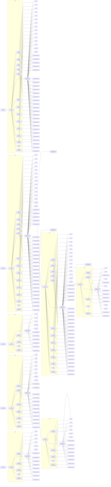

```mermaid
flowchart LR
  subgraph path2 [Path]
    2["Path<br>[284, 322, 0]"]
    3["Segment<br>[328, 361, 0]"]
    4["Segment<br>[367, 424, 0]"]
    5["Segment<br>[430, 457, 0]"]
    6["Segment<br>[463, 493, 0]"]
    7["Segment<br>[499, 534, 0]"]
    8["Segment<br>[540, 632, 0]"]
    9["Segment<br>[638, 668, 0]"]
    10["Segment<br>[674, 732, 0]"]
    11["Segment<br>[738, 765, 0]"]
    12["Segment<br>[771, 793, 0]"]
    13["Segment<br>[799, 834, 0]"]
    14["Segment<br>[840, 886, 0]"]
    15["Segment<br>[892, 899, 0]"]
    16[Solid2d]
  end
  subgraph path60 [Path]
    60["Path<br>[1085, 1123, 0]"]
    61["Segment<br>[1129, 1162, 0]"]
    62["Segment<br>[1168, 1225, 0]"]
    63["Segment<br>[1231, 1258, 0]"]
    64["Segment<br>[1264, 1294, 0]"]
    65["Segment<br>[1300, 1335, 0]"]
    66["Segment<br>[1341, 1433, 0]"]
    67["Segment<br>[1439, 1469, 0]"]
    68["Segment<br>[1475, 1533, 0]"]
    69["Segment<br>[1539, 1566, 0]"]
    70["Segment<br>[1572, 1594, 0]"]
    71["Segment<br>[1600, 1635, 0]"]
    72["Segment<br>[1641, 1687, 0]"]
    73["Segment<br>[1693, 1700, 0]"]
    74[Solid2d]
  end
  subgraph path118 [Path]
    118["Path<br>[2032, 2057, 0]"]
    119["Segment<br>[2063, 2113, 0]"]
    120["Segment<br>[2119, 2159, 0]"]
    121["Segment<br>[2165, 2172, 0]"]
    122[Solid2d]
  end
  subgraph path135 [Path]
    135["Path<br>[2260, 2285, 0]"]
    136["Segment<br>[2291, 2318, 0]"]
    137["Segment<br>[2324, 2358, 0]"]
    138["Segment<br>[2364, 2399, 0]"]
    139["Segment<br>[2405, 2505, 0]"]
    140["Segment<br>[2511, 2540, 0]"]
    141["Segment<br>[2546, 2599, 0]"]
    142["Segment<br>[2605, 2632, 0]"]
    143["Segment<br>[2638, 2667, 0]"]
    144["Segment<br>[2673, 2797, 0]"]
    145["Segment<br>[2803, 2848, 0]"]
    146["Segment<br>[2854, 2876, 0]"]
    147["Segment<br>[2882, 2901, 0]"]
    148[Solid2d]
  end
  subgraph path189 [Path]
    189["Path<br>[3229, 3254, 0]"]
    190["Segment<br>[3260, 3287, 0]"]
    191["Segment<br>[3293, 3324, 0]"]
    192["Segment<br>[3330, 3454, 0]"]
    193["Segment<br>[3460, 3505, 0]"]
    194["Segment<br>[3511, 3547, 0]"]
    195["Segment<br>[3553, 3560, 0]"]
    196[Solid2d]
  end
  subgraph path218 [Path]
    218["Path<br>[3648, 3698, 0]"]
    219["Segment<br>[3704, 3736, 0]"]
    220["Segment<br>[3742, 3769, 0]"]
    221["Segment<br>[3775, 3797, 0]"]
    222["Segment<br>[3803, 3810, 0]"]
    223[Solid2d]
  end
  subgraph path239 [Path]
    239["Path<br>[3898, 3923, 0]"]
    240["Segment<br>[3929, 3963, 0]"]
    241["Segment<br>[3969, 3996, 0]"]
    242["Segment<br>[4002, 4024, 0]"]
    243["Segment<br>[4030, 4037, 0]"]
    244[Solid2d]
  end
  subgraph path261 [Path]
    261["Path<br>[4397, 4446, 0]"]
    262["Segment<br>[4452, 4484, 0]"]
    263["Segment<br>[4490, 4538, 0]"]
    264["Segment<br>[4544, 4578, 0]"]
    265["Segment<br>[4584, 4591, 0]"]
    266[Solid2d]
  end
  1["Plane<br>[258, 278, 0]"]
  17["Sweep Revolve<br>[910, 1045, 0]"]
  18[Wall]
  19[Wall]
  20[Wall]
  21[Wall]
  22[Wall]
  23[Wall]
  24[Wall]
  25[Wall]
  26[Wall]
  27[Wall]
  28[Wall]
  29[Wall]
  30[Wall]
  31["Cap Start"]
  32["Cap End"]
  33["SweepEdge Opposite"]
  34["SweepEdge Adjacent"]
  35["SweepEdge Opposite"]
  36["SweepEdge Adjacent"]
  37["SweepEdge Opposite"]
  38["SweepEdge Adjacent"]
  39["SweepEdge Opposite"]
  40["SweepEdge Adjacent"]
  41["SweepEdge Opposite"]
  42["SweepEdge Adjacent"]
  43["SweepEdge Opposite"]
  44["SweepEdge Adjacent"]
  45["SweepEdge Opposite"]
  46["SweepEdge Adjacent"]
  47["SweepEdge Opposite"]
  48["SweepEdge Adjacent"]
  49["SweepEdge Opposite"]
  50["SweepEdge Adjacent"]
  51["SweepEdge Opposite"]
  52["SweepEdge Adjacent"]
  53["SweepEdge Opposite"]
  54["SweepEdge Adjacent"]
  55["SweepEdge Opposite"]
  56["SweepEdge Adjacent"]
  57["SweepEdge Opposite"]
  58["SweepEdge Adjacent"]
  59["Plane<br>[1059, 1079, 0]"]
  75["Sweep Extrusion<br>[1706, 1743, 0]"]
  76[Wall]
  77[Wall]
  78[Wall]
  79[Wall]
  80[Wall]
  81[Wall]
  82[Wall]
  83[Wall]
  84[Wall]
  85[Wall]
  86[Wall]
  87[Wall]
  88[Wall]
  89["Cap Start"]
  90["Cap End"]
  91["SweepEdge Opposite"]
  92["SweepEdge Adjacent"]
  93["SweepEdge Opposite"]
  94["SweepEdge Adjacent"]
  95["SweepEdge Opposite"]
  96["SweepEdge Adjacent"]
  97["SweepEdge Opposite"]
  98["SweepEdge Adjacent"]
  99["SweepEdge Opposite"]
  100["SweepEdge Adjacent"]
  101["SweepEdge Opposite"]
  102["SweepEdge Adjacent"]
  103["SweepEdge Opposite"]
  104["SweepEdge Adjacent"]
  105["SweepEdge Opposite"]
  106["SweepEdge Adjacent"]
  107["SweepEdge Opposite"]
  108["SweepEdge Adjacent"]
  109["SweepEdge Opposite"]
  110["SweepEdge Adjacent"]
  111["SweepEdge Opposite"]
  112["SweepEdge Adjacent"]
  113["SweepEdge Opposite"]
  114["SweepEdge Adjacent"]
  115["SweepEdge Opposite"]
  116["SweepEdge Adjacent"]
  117["Plane<br>[2000, 2026, 0]"]
  123["Sweep Extrusion<br>[2178, 2209, 0]"]
  124[Wall]
  125[Wall]
  126[Wall]
  127["Cap Start"]
  128["Cap End"]
  129["SweepEdge Opposite"]
  130["SweepEdge Adjacent"]
  131["SweepEdge Opposite"]
  132["SweepEdge Adjacent"]
  133["SweepEdge Opposite"]
  134["SweepEdge Adjacent"]
  149["Sweep Extrusion<br>[2907, 2938, 0]"]
  150[Wall]
  151[Wall]
  152[Wall]
  153[Wall]
  154[Wall]
  155[Wall]
  156[Wall]
  157[Wall]
  158[Wall]
  159[Wall]
  160[Wall]
  161[Wall]
  162["Cap Start"]
  163["Cap End"]
  164["SweepEdge Opposite"]
  165["SweepEdge Adjacent"]
  166["SweepEdge Opposite"]
  167["SweepEdge Adjacent"]
  168["SweepEdge Opposite"]
  169["SweepEdge Adjacent"]
  170["SweepEdge Opposite"]
  171["SweepEdge Adjacent"]
  172["SweepEdge Opposite"]
  173["SweepEdge Adjacent"]
  174["SweepEdge Opposite"]
  175["SweepEdge Adjacent"]
  176["SweepEdge Opposite"]
  177["SweepEdge Adjacent"]
  178["SweepEdge Opposite"]
  179["SweepEdge Adjacent"]
  180["SweepEdge Opposite"]
  181["SweepEdge Adjacent"]
  182["SweepEdge Opposite"]
  183["SweepEdge Adjacent"]
  184["SweepEdge Opposite"]
  185["SweepEdge Adjacent"]
  186["SweepEdge Opposite"]
  187["SweepEdge Adjacent"]
  188["Plane<br>[3196, 3223, 0]"]
  197["Sweep Extrusion<br>[3566, 3597, 0]"]
  198[Wall]
  199[Wall]
  200[Wall]
  201[Wall]
  202[Wall]
  203[Wall]
  204["Cap Start"]
  205["Cap End"]
  206["SweepEdge Opposite"]
  207["SweepEdge Adjacent"]
  208["SweepEdge Opposite"]
  209["SweepEdge Adjacent"]
  210["SweepEdge Opposite"]
  211["SweepEdge Adjacent"]
  212["SweepEdge Opposite"]
  213["SweepEdge Adjacent"]
  214["SweepEdge Opposite"]
  215["SweepEdge Adjacent"]
  216["SweepEdge Opposite"]
  217["SweepEdge Adjacent"]
  224["Sweep Extrusion<br>[3816, 3847, 0]"]
  225[Wall]
  226[Wall]
  227[Wall]
  228[Wall]
  229["Cap Start"]
  230["Cap End"]
  231["SweepEdge Opposite"]
  232["SweepEdge Adjacent"]
  233["SweepEdge Opposite"]
  234["SweepEdge Adjacent"]
  235["SweepEdge Opposite"]
  236["SweepEdge Adjacent"]
  237["SweepEdge Opposite"]
  238["SweepEdge Adjacent"]
  245["Sweep Extrusion<br>[4043, 4093, 0]"]
  246[Wall]
  247[Wall]
  248[Wall]
  249[Wall]
  250["Cap Start"]
  251["Cap End"]
  252["SweepEdge Opposite"]
  253["SweepEdge Adjacent"]
  254["SweepEdge Opposite"]
  255["SweepEdge Adjacent"]
  256["SweepEdge Opposite"]
  257["SweepEdge Adjacent"]
  258["SweepEdge Opposite"]
  259["SweepEdge Adjacent"]
  260["Plane<br>[4364, 4391, 0]"]
  267["Sweep Extrusion<br>[4597, 4629, 0]"]
  268[Wall]
  269[Wall]
  270[Wall]
  271[Wall]
  272["Cap Start"]
  273["Cap End"]
  274["SweepEdge Opposite"]
  275["SweepEdge Adjacent"]
  276["SweepEdge Opposite"]
  277["SweepEdge Adjacent"]
  278["SweepEdge Opposite"]
  279["SweepEdge Adjacent"]
  280["SweepEdge Opposite"]
  281["SweepEdge Adjacent"]
  282["StartSketchOnFace<br>[2223, 2254, 0]"]
  283["StartSketchOnFace<br>[3611, 3642, 0]"]
  284["StartSketchOnFace<br>[3861, 3892, 0]"]
  1 --- 2
  2 --- 3
  2 --- 4
  2 --- 5
  2 --- 6
  2 --- 7
  2 --- 8
  2 --- 9
  2 --- 10
  2 --- 11
  2 --- 12
  2 --- 13
  2 --- 14
  2 --- 15
  2 ---- 17
  2 --- 16
  3 --- 18
  3 --- 33
  3 --- 34
  4 --- 19
  4 --- 35
  4 --- 36
  5 --- 20
  5 --- 37
  5 --- 38
  6 --- 21
  6 --- 39
  6 --- 40
  7 --- 22
  7 --- 41
  7 --- 42
  8 --- 23
  8 --- 43
  8 --- 44
  9 --- 24
  9 --- 45
  9 --- 46
  10 --- 25
  10 --- 47
  10 --- 48
  11 --- 26
  11 --- 49
  11 --- 50
  12 --- 27
  12 --- 51
  12 --- 52
  13 --- 28
  13 --- 53
  13 --- 54
  14 --- 29
  14 --- 55
  14 --- 56
  15 --- 30
  15 --- 57
  15 --- 58
  17 --- 18
  17 --- 19
  17 --- 20
  17 --- 21
  17 --- 22
  17 --- 23
  17 --- 24
  17 --- 25
  17 --- 26
  17 --- 27
  17 --- 28
  17 --- 29
  17 --- 30
  17 --- 31
  17 --- 32
  17 --- 33
  17 --- 34
  17 --- 35
  17 --- 36
  17 --- 37
  17 --- 38
  17 --- 39
  17 --- 40
  17 --- 41
  17 --- 42
  17 --- 43
  17 --- 44
  17 --- 45
  17 --- 46
  17 --- 47
  17 --- 48
  17 --- 49
  17 --- 50
  17 --- 51
  17 --- 52
  17 --- 53
  17 --- 54
  17 --- 55
  17 --- 56
  17 --- 57
  17 --- 58
  59 --- 60
  60 --- 61
  60 --- 62
  60 --- 63
  60 --- 64
  60 --- 65
  60 --- 66
  60 --- 67
  60 --- 68
  60 --- 69
  60 --- 70
  60 --- 71
  60 --- 72
  60 --- 73
  60 ---- 75
  60 --- 74
  61 --- 76
  61 --- 91
  61 --- 92
  62 --- 77
  62 --- 93
  62 --- 94
  63 --- 78
  63 --- 95
  63 --- 96
  64 --- 79
  64 --- 97
  64 --- 98
  65 --- 80
  65 --- 99
  65 --- 100
  66 --- 81
  66 --- 101
  66 --- 102
  67 --- 82
  67 --- 103
  67 --- 104
  68 --- 83
  68 --- 105
  68 --- 106
  69 --- 84
  69 --- 107
  69 --- 108
  70 --- 85
  70 --- 109
  70 --- 110
  71 --- 86
  71 --- 111
  71 --- 112
  72 --- 87
  72 --- 113
  72 --- 114
  73 --- 88
  73 --- 115
  73 --- 116
  75 --- 76
  75 --- 77
  75 --- 78
  75 --- 79
  75 --- 80
  75 --- 81
  75 --- 82
  75 --- 83
  75 --- 84
  75 --- 85
  75 --- 86
  75 --- 87
  75 --- 88
  75 --- 89
  75 --- 90
  75 --- 91
  75 --- 92
  75 --- 93
  75 --- 94
  75 --- 95
  75 --- 96
  75 --- 97
  75 --- 98
  75 --- 99
  75 --- 100
  75 --- 101
  75 --- 102
  75 --- 103
  75 --- 104
  75 --- 105
  75 --- 106
  75 --- 107
  75 --- 108
  75 --- 109
  75 --- 110
  75 --- 111
  75 --- 112
  75 --- 113
  75 --- 114
  75 --- 115
  75 --- 116
  90 --- 135
  117 --- 118
  118 --- 119
  118 --- 120
  118 --- 121
  118 ---- 123
  118 --- 122
  119 --- 126
  119 --- 133
  119 --- 134
  120 --- 125
  120 --- 131
  120 --- 132
  121 --- 124
  121 --- 129
  121 --- 130
  123 --- 124
  123 --- 125
  123 --- 126
  123 --- 127
  123 --- 128
  123 --- 129
  123 --- 130
  123 --- 131
  123 --- 132
  123 --- 133
  123 --- 134
  135 --- 136
  135 --- 137
  135 --- 138
  135 --- 139
  135 --- 140
  135 --- 141
  135 --- 142
  135 --- 143
  135 --- 144
  135 --- 145
  135 --- 146
  135 --- 147
  135 ---- 149
  135 --- 148
  136 --- 161
  136 --- 186
  136 --- 187
  137 --- 160
  137 --- 184
  137 --- 185
  138 --- 159
  138 --- 182
  138 --- 183
  139 --- 158
  139 --- 180
  139 --- 181
  140 --- 157
  140 --- 178
  140 --- 179
  141 --- 156
  141 --- 176
  141 --- 177
  142 --- 155
  142 --- 174
  142 --- 175
  143 --- 154
  143 --- 172
  143 --- 173
  144 --- 153
  144 --- 170
  144 --- 171
  145 --- 152
  145 --- 168
  145 --- 169
  146 --- 151
  146 --- 166
  146 --- 167
  147 --- 150
  147 --- 164
  147 --- 165
  149 --- 150
  149 --- 151
  149 --- 152
  149 --- 153
  149 --- 154
  149 --- 155
  149 --- 156
  149 --- 157
  149 --- 158
  149 --- 159
  149 --- 160
  149 --- 161
  149 --- 162
  149 --- 163
  149 --- 164
  149 --- 165
  149 --- 166
  149 --- 167
  149 --- 168
  149 --- 169
  149 --- 170
  149 --- 171
  149 --- 172
  149 --- 173
  149 --- 174
  149 --- 175
  149 --- 176
  149 --- 177
  149 --- 178
  149 --- 179
  149 --- 180
  149 --- 181
  149 --- 182
  149 --- 183
  149 --- 184
  149 --- 185
  149 --- 186
  149 --- 187
  163 --- 239
  188 --- 189
  189 --- 190
  189 --- 191
  189 --- 192
  189 --- 193
  189 --- 194
  189 --- 195
  189 ---- 197
  189 --- 196
  190 --- 198
  190 --- 206
  190 --- 207
  191 --- 199
  191 --- 208
  191 --- 209
  192 --- 200
  192 --- 210
  192 --- 211
  193 --- 201
  193 --- 212
  193 --- 213
  194 --- 202
  194 --- 214
  194 --- 215
  195 --- 203
  195 --- 216
  195 --- 217
  197 --- 198
  197 --- 199
  197 --- 200
  197 --- 201
  197 --- 202
  197 --- 203
  197 --- 204
  197 --- 205
  197 --- 206
  197 --- 207
  197 --- 208
  197 --- 209
  197 --- 210
  197 --- 211
  197 --- 212
  197 --- 213
  197 --- 214
  197 --- 215
  197 --- 216
  197 --- 217
  202 --- 218
  218 --- 219
  218 --- 220
  218 --- 221
  218 --- 222
  218 ---- 224
  218 --- 223
  219 --- 225
  219 --- 231
  219 --- 232
  220 --- 226
  220 --- 233
  220 --- 234
  221 --- 227
  221 --- 235
  221 --- 236
  222 --- 228
  222 --- 237
  222 --- 238
  224 --- 225
  224 --- 226
  224 --- 227
  224 --- 228
  224 --- 229
  224 --- 230
  224 --- 231
  224 --- 232
  224 --- 233
  224 --- 234
  224 --- 235
  224 --- 236
  224 --- 237
  224 --- 238
  239 --- 240
  239 --- 241
  239 --- 242
  239 --- 243
  239 ---- 245
  239 --- 244
  240 --- 246
  240 --- 252
  240 --- 253
  241 --- 247
  241 --- 254
  241 --- 255
  242 --- 248
  242 --- 256
  242 --- 257
  243 --- 249
  243 --- 258
  243 --- 259
  245 --- 246
  245 --- 247
  245 --- 248
  245 --- 249
  245 --- 250
  245 --- 251
  245 --- 252
  245 --- 253
  245 --- 254
  245 --- 255
  245 --- 256
  245 --- 257
  245 --- 258
  245 --- 259
  260 --- 261
  261 --- 262
  261 --- 263
  261 --- 264
  261 --- 265
  261 ---- 267
  261 --- 266
  262 --- 268
  262 --- 274
  262 --- 275
  263 --- 269
  263 --- 276
  263 --- 277
  264 --- 270
  264 --- 278
  264 --- 279
  265 --- 271
  265 --- 280
  265 --- 281
  267 --- 268
  267 --- 269
  267 --- 270
  267 --- 271
  267 --- 272
  267 --- 273
  267 --- 274
  267 --- 275
  267 --- 276
  267 --- 277
  267 --- 278
  267 --- 279
  267 --- 280
  267 --- 281
  90 <--x 282
  202 <--x 283
  163 <--x 284
```
