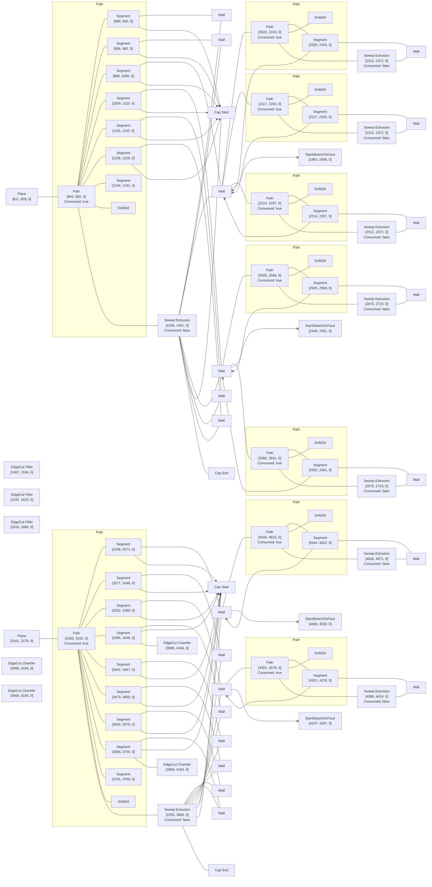

```mermaid
flowchart LR
  subgraph path2 [Path]
    2["Path<br>[842, 882, 0]<br>Consumed: true"]
      %% [ProgramBodyItem { index: 8 }, VariableDeclarationDeclaration, VariableDeclarationInit, PipeBodyItem { index: 0 }]
    3["Segment<br>[888, 930, 0]"]
      %% [ProgramBodyItem { index: 8 }, VariableDeclarationDeclaration, VariableDeclarationInit, PipeBodyItem { index: 1 }]
    4["Segment<br>[936, 982, 0]"]
      %% [ProgramBodyItem { index: 8 }, VariableDeclarationDeclaration, VariableDeclarationInit, PipeBodyItem { index: 2 }]
    5["Segment<br>[988, 1050, 0]"]
      %% [ProgramBodyItem { index: 8 }, VariableDeclarationDeclaration, VariableDeclarationInit, PipeBodyItem { index: 3 }]
    6["Segment<br>[1056, 1110, 0]"]
      %% [ProgramBodyItem { index: 8 }, VariableDeclarationDeclaration, VariableDeclarationInit, PipeBodyItem { index: 4 }]
    7["Segment<br>[1116, 1152, 0]"]
      %% [ProgramBodyItem { index: 8 }, VariableDeclarationDeclaration, VariableDeclarationInit, PipeBodyItem { index: 5 }]
    8["Segment<br>[1158, 1228, 0]"]
      %% [ProgramBodyItem { index: 8 }, VariableDeclarationDeclaration, VariableDeclarationInit, PipeBodyItem { index: 6 }]
    9["Segment<br>[1234, 1241, 0]"]
      %% [ProgramBodyItem { index: 8 }, VariableDeclarationDeclaration, VariableDeclarationInit, PipeBodyItem { index: 7 }]
    10[Solid2d]
  end
  subgraph path23 [Path]
    23["Path<br>[2020, 2103, 0]<br>Consumed: true"]
      %% [ProgramBodyItem { index: 11 }, VariableDeclarationDeclaration, VariableDeclarationInit]
    24["Segment<br>[2020, 2103, 0]"]
      %% [ProgramBodyItem { index: 11 }, VariableDeclarationDeclaration, VariableDeclarationInit]
    25[Solid2d]
  end
  subgraph path26 [Path]
    26["Path<br>[2117, 2200, 0]<br>Consumed: true"]
      %% [ProgramBodyItem { index: 12 }, VariableDeclarationDeclaration, VariableDeclarationInit]
    27["Segment<br>[2117, 2200, 0]"]
      %% [ProgramBodyItem { index: 12 }, VariableDeclarationDeclaration, VariableDeclarationInit]
    28[Solid2d]
  end
  subgraph path29 [Path]
    29["Path<br>[2214, 2297, 0]<br>Consumed: true"]
      %% [ProgramBodyItem { index: 13 }, VariableDeclarationDeclaration, VariableDeclarationInit]
    30["Segment<br>[2214, 2297, 0]"]
      %% [ProgramBodyItem { index: 13 }, VariableDeclarationDeclaration, VariableDeclarationInit]
    31[Solid2d]
  end
  subgraph path38 [Path]
    38["Path<br>[2505, 2568, 0]<br>Consumed: true"]
      %% [ProgramBodyItem { index: 16 }, VariableDeclarationDeclaration, VariableDeclarationInit]
    39["Segment<br>[2505, 2568, 0]"]
      %% [ProgramBodyItem { index: 16 }, VariableDeclarationDeclaration, VariableDeclarationInit]
    40[Solid2d]
  end
  subgraph path41 [Path]
    41["Path<br>[2582, 2661, 0]<br>Consumed: true"]
      %% [ProgramBodyItem { index: 17 }, VariableDeclarationDeclaration, VariableDeclarationInit]
    42["Segment<br>[2582, 2661, 0]"]
      %% [ProgramBodyItem { index: 17 }, VariableDeclarationDeclaration, VariableDeclarationInit]
    43[Solid2d]
  end
  subgraph path49 [Path]
    49["Path<br>[3193, 3232, 0]<br>Consumed: true"]
      %% [ProgramBodyItem { index: 23 }, VariableDeclarationDeclaration, VariableDeclarationInit, PipeBodyItem { index: 0 }]
    50["Segment<br>[3238, 3271, 0]"]
      %% [ProgramBodyItem { index: 23 }, VariableDeclarationDeclaration, VariableDeclarationInit, PipeBodyItem { index: 1 }]
    51["Segment<br>[3277, 3346, 0]"]
      %% [ProgramBodyItem { index: 23 }, VariableDeclarationDeclaration, VariableDeclarationInit, PipeBodyItem { index: 2 }]
    52["Segment<br>[3352, 3389, 0]"]
      %% [ProgramBodyItem { index: 23 }, VariableDeclarationDeclaration, VariableDeclarationInit, PipeBodyItem { index: 3 }]
    53["Segment<br>[3395, 3436, 0]"]
      %% [ProgramBodyItem { index: 23 }, VariableDeclarationDeclaration, VariableDeclarationInit, PipeBodyItem { index: 4 }]
    54["Segment<br>[3442, 3467, 0]"]
      %% [ProgramBodyItem { index: 23 }, VariableDeclarationDeclaration, VariableDeclarationInit, PipeBodyItem { index: 5 }]
    55["Segment<br>[3473, 3650, 0]"]
      %% [ProgramBodyItem { index: 23 }, VariableDeclarationDeclaration, VariableDeclarationInit, PipeBodyItem { index: 6 }]
    56["Segment<br>[3656, 3678, 0]"]
      %% [ProgramBodyItem { index: 23 }, VariableDeclarationDeclaration, VariableDeclarationInit, PipeBodyItem { index: 7 }]
    57["Segment<br>[3684, 3755, 0]"]
      %% [ProgramBodyItem { index: 23 }, VariableDeclarationDeclaration, VariableDeclarationInit, PipeBodyItem { index: 8 }]
    58["Segment<br>[3761, 3768, 0]"]
      %% [ProgramBodyItem { index: 23 }, VariableDeclarationDeclaration, VariableDeclarationInit, PipeBodyItem { index: 9 }]
    59[Solid2d]
  end
  subgraph path75 [Path]
    75["Path<br>[4301, 4378, 0]<br>Consumed: true"]
      %% [ProgramBodyItem { index: 26 }, VariableDeclarationDeclaration, VariableDeclarationInit]
    76["Segment<br>[4301, 4378, 0]"]
      %% [ProgramBodyItem { index: 26 }, VariableDeclarationDeclaration, VariableDeclarationInit]
    77[Solid2d]
  end
  subgraph path80 [Path]
    80["Path<br>[4544, 4622, 0]<br>Consumed: true"]
      %% [ProgramBodyItem { index: 29 }, VariableDeclarationDeclaration, VariableDeclarationInit]
    81["Segment<br>[4544, 4622, 0]"]
      %% [ProgramBodyItem { index: 29 }, VariableDeclarationDeclaration, VariableDeclarationInit]
    82[Solid2d]
  end
  1["Plane<br>[811, 828, 0]"]
    %% [ProgramBodyItem { index: 7 }, VariableDeclarationDeclaration, VariableDeclarationInit]
  11["Sweep Extrusion<br>[1336, 1461, 0]<br>Consumed: false"]
    %% [ProgramBodyItem { index: 9 }, VariableDeclarationDeclaration, VariableDeclarationInit, PipeBodyItem { index: 0 }]
  12[Wall]
    %% face_code_ref=Missing NodePath
  13[Wall]
    %% face_code_ref=Missing NodePath
  14[Wall]
    %% face_code_ref=[ProgramBodyItem { index: 10 }, VariableDeclarationDeclaration, VariableDeclarationInit]
  15[Wall]
    %% face_code_ref=[ProgramBodyItem { index: 15 }, VariableDeclarationDeclaration, VariableDeclarationInit]
  16[Wall]
    %% face_code_ref=Missing NodePath
  17[Wall]
    %% face_code_ref=Missing NodePath
  18["Cap Start"]
    %% face_code_ref=Missing NodePath
  19["Cap End"]
    %% face_code_ref=Missing NodePath
  20["EdgeCut Fillet<br>[1467, 1536, 0]"]
    %% [ProgramBodyItem { index: 9 }, VariableDeclarationDeclaration, VariableDeclarationInit, PipeBodyItem { index: 1 }]
  21["EdgeCut Fillet<br>[1542, 1610, 0]"]
    %% [ProgramBodyItem { index: 9 }, VariableDeclarationDeclaration, VariableDeclarationInit, PipeBodyItem { index: 2 }]
  22["EdgeCut Fillet<br>[1616, 1889, 0]"]
    %% [ProgramBodyItem { index: 9 }, VariableDeclarationDeclaration, VariableDeclarationInit, PipeBodyItem { index: 3 }]
  32["Sweep Extrusion<br>[2312, 2372, 0]<br>Consumed: false"]
    %% [ProgramBodyItem { index: 14 }, VariableDeclarationDeclaration, VariableDeclarationInit]
  33[Wall]
    %% face_code_ref=Missing NodePath
  34["Sweep Extrusion<br>[2312, 2372, 0]<br>Consumed: false"]
    %% [ProgramBodyItem { index: 14 }, VariableDeclarationDeclaration, VariableDeclarationInit]
  35[Wall]
    %% face_code_ref=Missing NodePath
  36["Sweep Extrusion<br>[2312, 2372, 0]<br>Consumed: false"]
    %% [ProgramBodyItem { index: 14 }, VariableDeclarationDeclaration, VariableDeclarationInit]
  37[Wall]
    %% face_code_ref=Missing NodePath
  44["Sweep Extrusion<br>[2675, 2723, 0]<br>Consumed: false"]
    %% [ProgramBodyItem { index: 18 }, VariableDeclarationDeclaration, VariableDeclarationInit, PipeBodyItem { index: 0 }]
  45[Wall]
    %% face_code_ref=Missing NodePath
  46["Sweep Extrusion<br>[2675, 2723, 0]<br>Consumed: false"]
    %% [ProgramBodyItem { index: 18 }, VariableDeclarationDeclaration, VariableDeclarationInit, PipeBodyItem { index: 0 }]
  47[Wall]
    %% face_code_ref=Missing NodePath
  48["Plane<br>[3161, 3179, 0]"]
    %% [ProgramBodyItem { index: 22 }, VariableDeclarationDeclaration, VariableDeclarationInit]
  60["Sweep Extrusion<br>[3783, 3900, 0]<br>Consumed: false"]
    %% [ProgramBodyItem { index: 24 }, VariableDeclarationDeclaration, VariableDeclarationInit, PipeBodyItem { index: 0 }]
  61[Wall]
    %% face_code_ref=Missing NodePath
  62[Wall]
    %% face_code_ref=Missing NodePath
  63[Wall]
    %% face_code_ref=Missing NodePath
  64[Wall]
    %% face_code_ref=Missing NodePath
  65[Wall]
    %% face_code_ref=Missing NodePath
  66[Wall]
    %% face_code_ref=[ProgramBodyItem { index: 25 }, VariableDeclarationDeclaration, VariableDeclarationInit]
  67[Wall]
    %% face_code_ref=Missing NodePath
  68[Wall]
    %% face_code_ref=[ProgramBodyItem { index: 28 }, VariableDeclarationDeclaration, VariableDeclarationInit]
  69["Cap Start"]
    %% face_code_ref=Missing NodePath
  70["Cap End"]
    %% face_code_ref=Missing NodePath
  71["EdgeCut Chamfer<br>[3906, 4184, 0]"]
    %% [ProgramBodyItem { index: 24 }, VariableDeclarationDeclaration, VariableDeclarationInit, PipeBodyItem { index: 1 }]
  72["EdgeCut Chamfer<br>[3906, 4184, 0]"]
    %% [ProgramBodyItem { index: 24 }, VariableDeclarationDeclaration, VariableDeclarationInit, PipeBodyItem { index: 1 }]
  73["EdgeCut Chamfer<br>[3906, 4184, 0]"]
    %% [ProgramBodyItem { index: 24 }, VariableDeclarationDeclaration, VariableDeclarationInit, PipeBodyItem { index: 1 }]
  74["EdgeCut Chamfer<br>[3906, 4184, 0]"]
    %% [ProgramBodyItem { index: 24 }, VariableDeclarationDeclaration, VariableDeclarationInit, PipeBodyItem { index: 1 }]
  78["Sweep Extrusion<br>[4389, 4424, 0]<br>Consumed: false"]
    %% [ProgramBodyItem { index: 27 }, VariableDeclarationDeclaration, VariableDeclarationInit]
  79[Wall]
    %% face_code_ref=Missing NodePath
  83["Sweep Extrusion<br>[4636, 4671, 0]<br>Consumed: false"]
    %% [ProgramBodyItem { index: 30 }, VariableDeclarationDeclaration, VariableDeclarationInit, PipeBodyItem { index: 0 }]
  84[Wall]
    %% face_code_ref=Missing NodePath
  85["StartSketchOnFace<br>[1963, 2006, 0]"]
    %% [ProgramBodyItem { index: 10 }, VariableDeclarationDeclaration, VariableDeclarationInit]
  86["StartSketchOnFace<br>[2448, 2491, 0]"]
    %% [ProgramBodyItem { index: 15 }, VariableDeclarationDeclaration, VariableDeclarationInit]
  87["StartSketchOnFace<br>[4247, 4287, 0]"]
    %% [ProgramBodyItem { index: 25 }, VariableDeclarationDeclaration, VariableDeclarationInit]
  88["StartSketchOnFace<br>[4490, 4530, 0]"]
    %% [ProgramBodyItem { index: 28 }, VariableDeclarationDeclaration, VariableDeclarationInit]
  1 --- 2
  2 --- 3
  2 --- 4
  2 --- 5
  2 --- 6
  2 --- 7
  2 --- 8
  2 --- 9
  2 --- 10
  2 ---- 11
  3 --- 12
  3 x--> 18
  4 --- 13
  4 x--> 18
  5 --- 14
  5 x--> 18
  6 --- 15
  6 x--> 18
  7 --- 16
  7 x--> 18
  8 --- 17
  8 x--> 18
  11 --- 12
  11 --- 13
  11 --- 14
  11 --- 15
  11 --- 16
  11 --- 17
  11 --- 18
  11 --- 19
  14 --- 23
  24 <--x 14
  14 --- 26
  27 <--x 14
  14 --- 29
  30 <--x 14
  14 <--x 85
  15 --- 38
  39 <--x 15
  15 --- 41
  42 <--x 15
  15 <--x 86
  23 --- 24
  23 --- 25
  23 ---- 32
  24 --- 33
  26 --- 27
  26 --- 28
  26 ---- 34
  27 --- 35
  29 --- 30
  29 --- 31
  29 ---- 36
  30 --- 37
  32 --- 33
  34 --- 35
  36 --- 37
  38 --- 39
  38 --- 40
  38 ---- 46
  39 --- 47
  41 --- 42
  41 --- 43
  41 ---- 44
  42 --- 45
  44 --- 45
  46 --- 47
  48 --- 49
  49 --- 50
  49 --- 51
  49 --- 52
  49 --- 53
  49 --- 54
  49 --- 55
  49 --- 56
  49 --- 57
  49 --- 58
  49 --- 59
  49 ---- 60
  50 --- 68
  50 x--> 69
  51 --- 67
  51 x--> 69
  52 --- 66
  52 x--> 69
  53 --- 65
  53 x--> 69
  53 --- 72
  54 --- 64
  54 x--> 69
  55 --- 63
  55 x--> 69
  56 --- 62
  56 x--> 69
  57 --- 61
  57 x--> 69
  57 --- 73
  60 --- 61
  60 --- 62
  60 --- 63
  60 --- 64
  60 --- 65
  60 --- 66
  60 --- 67
  60 --- 68
  60 --- 69
  60 --- 70
  66 --- 75
  76 <--x 66
  66 <--x 87
  68 --- 80
  81 <--x 68
  68 <--x 88
  75 --- 76
  75 --- 77
  75 ---- 78
  76 --- 79
  78 --- 79
  80 --- 81
  80 --- 82
  80 ---- 83
  81 --- 84
  83 --- 84
```
