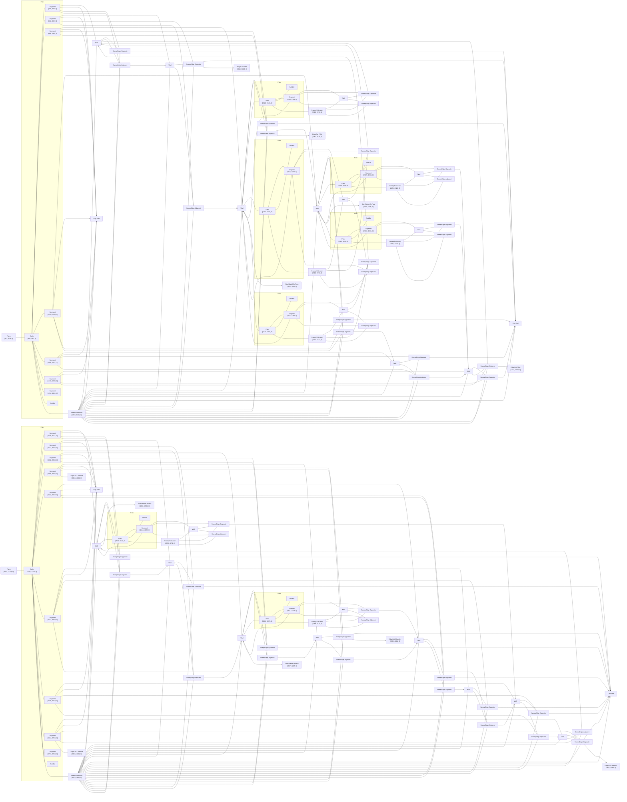

```mermaid
flowchart LR
  subgraph path2 [Path]
    2["Path<br>[842, 882, 0]"]
      %% [ProgramBodyItem { index: 8 }, VariableDeclarationDeclaration, VariableDeclarationInit, PipeBodyItem { index: 0 }]
    3["Segment<br>[888, 930, 0]"]
      %% [ProgramBodyItem { index: 8 }, VariableDeclarationDeclaration, VariableDeclarationInit, PipeBodyItem { index: 1 }]
    4["Segment<br>[936, 982, 0]"]
      %% [ProgramBodyItem { index: 8 }, VariableDeclarationDeclaration, VariableDeclarationInit, PipeBodyItem { index: 2 }]
    5["Segment<br>[988, 1050, 0]"]
      %% [ProgramBodyItem { index: 8 }, VariableDeclarationDeclaration, VariableDeclarationInit, PipeBodyItem { index: 3 }]
    6["Segment<br>[1056, 1110, 0]"]
      %% [ProgramBodyItem { index: 8 }, VariableDeclarationDeclaration, VariableDeclarationInit, PipeBodyItem { index: 4 }]
    7["Segment<br>[1116, 1152, 0]"]
      %% [ProgramBodyItem { index: 8 }, VariableDeclarationDeclaration, VariableDeclarationInit, PipeBodyItem { index: 5 }]
    8["Segment<br>[1158, 1228, 0]"]
      %% [ProgramBodyItem { index: 8 }, VariableDeclarationDeclaration, VariableDeclarationInit, PipeBodyItem { index: 6 }]
    9["Segment<br>[1234, 1241, 0]"]
      %% [ProgramBodyItem { index: 8 }, VariableDeclarationDeclaration, VariableDeclarationInit, PipeBodyItem { index: 7 }]
    10[Solid2d]
  end
  subgraph path35 [Path]
    35["Path<br>[2020, 2103, 0]"]
      %% [ProgramBodyItem { index: 11 }, VariableDeclarationDeclaration, VariableDeclarationInit]
    36["Segment<br>[2020, 2103, 0]"]
      %% [ProgramBodyItem { index: 11 }, VariableDeclarationDeclaration, VariableDeclarationInit]
    37[Solid2d]
  end
  subgraph path38 [Path]
    38["Path<br>[2117, 2200, 0]"]
      %% [ProgramBodyItem { index: 12 }, VariableDeclarationDeclaration, VariableDeclarationInit]
    39["Segment<br>[2117, 2200, 0]"]
      %% [ProgramBodyItem { index: 12 }, VariableDeclarationDeclaration, VariableDeclarationInit]
    40[Solid2d]
  end
  subgraph path41 [Path]
    41["Path<br>[2214, 2297, 0]"]
      %% [ProgramBodyItem { index: 13 }, VariableDeclarationDeclaration, VariableDeclarationInit]
    42["Segment<br>[2214, 2297, 0]"]
      %% [ProgramBodyItem { index: 13 }, VariableDeclarationDeclaration, VariableDeclarationInit]
    43[Solid2d]
  end
  subgraph path56 [Path]
    56["Path<br>[2505, 2568, 0]"]
      %% [ProgramBodyItem { index: 16 }, VariableDeclarationDeclaration, VariableDeclarationInit]
    57["Segment<br>[2505, 2568, 0]"]
      %% [ProgramBodyItem { index: 16 }, VariableDeclarationDeclaration, VariableDeclarationInit]
    58[Solid2d]
  end
  subgraph path59 [Path]
    59["Path<br>[2582, 2661, 0]"]
      %% [ProgramBodyItem { index: 17 }, VariableDeclarationDeclaration, VariableDeclarationInit]
    60["Segment<br>[2582, 2661, 0]"]
      %% [ProgramBodyItem { index: 17 }, VariableDeclarationDeclaration, VariableDeclarationInit]
    61[Solid2d]
  end
  subgraph path71 [Path]
    71["Path<br>[3193, 3232, 0]"]
      %% [ProgramBodyItem { index: 23 }, VariableDeclarationDeclaration, VariableDeclarationInit, PipeBodyItem { index: 0 }]
    72["Segment<br>[3238, 3271, 0]"]
      %% [ProgramBodyItem { index: 23 }, VariableDeclarationDeclaration, VariableDeclarationInit, PipeBodyItem { index: 1 }]
    73["Segment<br>[3277, 3346, 0]"]
      %% [ProgramBodyItem { index: 23 }, VariableDeclarationDeclaration, VariableDeclarationInit, PipeBodyItem { index: 2 }]
    74["Segment<br>[3352, 3389, 0]"]
      %% [ProgramBodyItem { index: 23 }, VariableDeclarationDeclaration, VariableDeclarationInit, PipeBodyItem { index: 3 }]
    75["Segment<br>[3395, 3436, 0]"]
      %% [ProgramBodyItem { index: 23 }, VariableDeclarationDeclaration, VariableDeclarationInit, PipeBodyItem { index: 4 }]
    76["Segment<br>[3442, 3467, 0]"]
      %% [ProgramBodyItem { index: 23 }, VariableDeclarationDeclaration, VariableDeclarationInit, PipeBodyItem { index: 5 }]
    77["Segment<br>[3473, 3650, 0]"]
      %% [ProgramBodyItem { index: 23 }, VariableDeclarationDeclaration, VariableDeclarationInit, PipeBodyItem { index: 6 }]
    78["Segment<br>[3656, 3678, 0]"]
      %% [ProgramBodyItem { index: 23 }, VariableDeclarationDeclaration, VariableDeclarationInit, PipeBodyItem { index: 7 }]
    79["Segment<br>[3684, 3755, 0]"]
      %% [ProgramBodyItem { index: 23 }, VariableDeclarationDeclaration, VariableDeclarationInit, PipeBodyItem { index: 8 }]
    80["Segment<br>[3761, 3768, 0]"]
      %% [ProgramBodyItem { index: 23 }, VariableDeclarationDeclaration, VariableDeclarationInit, PipeBodyItem { index: 9 }]
    81[Solid2d]
  end
  subgraph path113 [Path]
    113["Path<br>[4301, 4378, 0]"]
      %% [ProgramBodyItem { index: 26 }, VariableDeclarationDeclaration, VariableDeclarationInit]
    114["Segment<br>[4301, 4378, 0]"]
      %% [ProgramBodyItem { index: 26 }, VariableDeclarationDeclaration, VariableDeclarationInit]
    115[Solid2d]
  end
  subgraph path120 [Path]
    120["Path<br>[4544, 4622, 0]"]
      %% [ProgramBodyItem { index: 29 }, VariableDeclarationDeclaration, VariableDeclarationInit]
    121["Segment<br>[4544, 4622, 0]"]
      %% [ProgramBodyItem { index: 29 }, VariableDeclarationDeclaration, VariableDeclarationInit]
    122[Solid2d]
  end
  1["Plane<br>[811, 828, 0]"]
    %% [ProgramBodyItem { index: 7 }, VariableDeclarationDeclaration, VariableDeclarationInit]
  11["Sweep Extrusion<br>[1336, 1461, 0]"]
    %% [ProgramBodyItem { index: 9 }, VariableDeclarationDeclaration, VariableDeclarationInit, PipeBodyItem { index: 0 }]
  12[Wall]
    %% face_code_ref=Missing NodePath
  13[Wall]
    %% face_code_ref=Missing NodePath
  14[Wall]
    %% face_code_ref=[ProgramBodyItem { index: 10 }, VariableDeclarationDeclaration, VariableDeclarationInit]
  15[Wall]
    %% face_code_ref=[ProgramBodyItem { index: 15 }, VariableDeclarationDeclaration, VariableDeclarationInit]
  16[Wall]
    %% face_code_ref=Missing NodePath
  17[Wall]
    %% face_code_ref=Missing NodePath
  18["Cap Start"]
    %% face_code_ref=Missing NodePath
  19["Cap End"]
    %% face_code_ref=Missing NodePath
  20["SweepEdge Opposite"]
  21["SweepEdge Adjacent"]
  22["SweepEdge Opposite"]
  23["SweepEdge Adjacent"]
  24["SweepEdge Opposite"]
  25["SweepEdge Adjacent"]
  26["SweepEdge Opposite"]
  27["SweepEdge Adjacent"]
  28["SweepEdge Opposite"]
  29["SweepEdge Adjacent"]
  30["SweepEdge Opposite"]
  31["SweepEdge Adjacent"]
  32["EdgeCut Fillet<br>[1467, 1536, 0]"]
    %% [ProgramBodyItem { index: 9 }, VariableDeclarationDeclaration, VariableDeclarationInit, PipeBodyItem { index: 1 }]
  33["EdgeCut Fillet<br>[1542, 1610, 0]"]
    %% [ProgramBodyItem { index: 9 }, VariableDeclarationDeclaration, VariableDeclarationInit, PipeBodyItem { index: 2 }]
  34["EdgeCut Fillet<br>[1616, 1889, 0]"]
    %% [ProgramBodyItem { index: 9 }, VariableDeclarationDeclaration, VariableDeclarationInit, PipeBodyItem { index: 3 }]
  44["Sweep Extrusion<br>[2312, 2372, 0]"]
    %% [ProgramBodyItem { index: 14 }, VariableDeclarationDeclaration, VariableDeclarationInit]
  45[Wall]
    %% face_code_ref=Missing NodePath
  46["SweepEdge Opposite"]
  47["SweepEdge Adjacent"]
  48["Sweep Extrusion<br>[2312, 2372, 0]"]
    %% [ProgramBodyItem { index: 14 }, VariableDeclarationDeclaration, VariableDeclarationInit]
  49[Wall]
    %% face_code_ref=Missing NodePath
  50["SweepEdge Opposite"]
  51["SweepEdge Adjacent"]
  52["Sweep Extrusion<br>[2312, 2372, 0]"]
    %% [ProgramBodyItem { index: 14 }, VariableDeclarationDeclaration, VariableDeclarationInit]
  53[Wall]
    %% face_code_ref=Missing NodePath
  54["SweepEdge Opposite"]
  55["SweepEdge Adjacent"]
  62["Sweep Extrusion<br>[2675, 2723, 0]"]
    %% [ProgramBodyItem { index: 18 }, VariableDeclarationDeclaration, VariableDeclarationInit, PipeBodyItem { index: 0 }]
  63[Wall]
    %% face_code_ref=Missing NodePath
  64["SweepEdge Opposite"]
  65["SweepEdge Adjacent"]
  66["Sweep Extrusion<br>[2675, 2723, 0]"]
    %% [ProgramBodyItem { index: 18 }, VariableDeclarationDeclaration, VariableDeclarationInit, PipeBodyItem { index: 0 }]
  67[Wall]
    %% face_code_ref=Missing NodePath
  68["SweepEdge Opposite"]
  69["SweepEdge Adjacent"]
  70["Plane<br>[3161, 3179, 0]"]
    %% [ProgramBodyItem { index: 22 }, VariableDeclarationDeclaration, VariableDeclarationInit]
  82["Sweep Extrusion<br>[3783, 3900, 0]"]
    %% [ProgramBodyItem { index: 24 }, VariableDeclarationDeclaration, VariableDeclarationInit, PipeBodyItem { index: 0 }]
  83[Wall]
    %% face_code_ref=Missing NodePath
  84[Wall]
    %% face_code_ref=Missing NodePath
  85[Wall]
    %% face_code_ref=Missing NodePath
  86[Wall]
    %% face_code_ref=Missing NodePath
  87[Wall]
    %% face_code_ref=Missing NodePath
  88[Wall]
    %% face_code_ref=[ProgramBodyItem { index: 25 }, VariableDeclarationDeclaration, VariableDeclarationInit]
  89[Wall]
    %% face_code_ref=Missing NodePath
  90[Wall]
    %% face_code_ref=[ProgramBodyItem { index: 28 }, VariableDeclarationDeclaration, VariableDeclarationInit]
  91["Cap Start"]
    %% face_code_ref=Missing NodePath
  92["Cap End"]
    %% face_code_ref=Missing NodePath
  93["SweepEdge Opposite"]
  94["SweepEdge Adjacent"]
  95["SweepEdge Opposite"]
  96["SweepEdge Adjacent"]
  97["SweepEdge Opposite"]
  98["SweepEdge Adjacent"]
  99["SweepEdge Opposite"]
  100["SweepEdge Adjacent"]
  101["SweepEdge Opposite"]
  102["SweepEdge Adjacent"]
  103["SweepEdge Opposite"]
  104["SweepEdge Adjacent"]
  105["SweepEdge Opposite"]
  106["SweepEdge Adjacent"]
  107["SweepEdge Opposite"]
  108["SweepEdge Adjacent"]
  109["EdgeCut Chamfer<br>[3906, 4184, 0]"]
    %% [ProgramBodyItem { index: 24 }, VariableDeclarationDeclaration, VariableDeclarationInit, PipeBodyItem { index: 1 }]
  110["EdgeCut Chamfer<br>[3906, 4184, 0]"]
    %% [ProgramBodyItem { index: 24 }, VariableDeclarationDeclaration, VariableDeclarationInit, PipeBodyItem { index: 1 }]
  111["EdgeCut Chamfer<br>[3906, 4184, 0]"]
    %% [ProgramBodyItem { index: 24 }, VariableDeclarationDeclaration, VariableDeclarationInit, PipeBodyItem { index: 1 }]
  112["EdgeCut Chamfer<br>[3906, 4184, 0]"]
    %% [ProgramBodyItem { index: 24 }, VariableDeclarationDeclaration, VariableDeclarationInit, PipeBodyItem { index: 1 }]
  116["Sweep Extrusion<br>[4389, 4424, 0]"]
    %% [ProgramBodyItem { index: 27 }, VariableDeclarationDeclaration, VariableDeclarationInit]
  117[Wall]
    %% face_code_ref=Missing NodePath
  118["SweepEdge Opposite"]
  119["SweepEdge Adjacent"]
  123["Sweep Extrusion<br>[4636, 4671, 0]"]
    %% [ProgramBodyItem { index: 30 }, VariableDeclarationDeclaration, VariableDeclarationInit, PipeBodyItem { index: 0 }]
  124[Wall]
    %% face_code_ref=Missing NodePath
  125["SweepEdge Opposite"]
  126["SweepEdge Adjacent"]
  127["StartSketchOnFace<br>[1963, 2006, 0]"]
    %% [ProgramBodyItem { index: 10 }, VariableDeclarationDeclaration, VariableDeclarationInit]
  128["StartSketchOnFace<br>[2448, 2491, 0]"]
    %% [ProgramBodyItem { index: 15 }, VariableDeclarationDeclaration, VariableDeclarationInit]
  129["StartSketchOnFace<br>[4247, 4287, 0]"]
    %% [ProgramBodyItem { index: 25 }, VariableDeclarationDeclaration, VariableDeclarationInit]
  130["StartSketchOnFace<br>[4490, 4530, 0]"]
    %% [ProgramBodyItem { index: 28 }, VariableDeclarationDeclaration, VariableDeclarationInit]
  1 --- 2
  2 --- 3
  2 --- 4
  2 --- 5
  2 --- 6
  2 --- 7
  2 --- 8
  2 --- 9
  2 --- 10
  2 ---- 11
  3 --- 12
  3 x--> 18
  3 --- 20
  3 --- 21
  4 --- 13
  4 x--> 18
  4 --- 22
  4 --- 23
  5 --- 14
  5 x--> 18
  5 --- 24
  5 --- 25
  6 --- 15
  6 x--> 18
  6 --- 26
  6 --- 27
  7 --- 16
  7 x--> 18
  7 --- 28
  7 --- 29
  8 --- 17
  8 x--> 18
  8 --- 30
  8 --- 31
  11 --- 12
  11 --- 13
  11 --- 14
  11 --- 15
  11 --- 16
  11 --- 17
  11 --- 18
  11 --- 19
  11 --- 20
  11 --- 21
  11 --- 22
  11 --- 23
  11 --- 24
  11 --- 25
  11 --- 26
  11 --- 27
  11 --- 28
  11 --- 29
  11 --- 30
  11 --- 31
  12 --- 20
  12 --- 21
  31 <--x 12
  46 <--x 12
  50 <--x 12
  54 <--x 12
  21 <--x 13
  13 --- 22
  13 --- 23
  23 <--x 14
  14 --- 24
  14 --- 25
  14 --- 35
  36 <--x 14
  14 --- 38
  39 <--x 14
  14 --- 41
  42 <--x 14
  14 <--x 127
  25 <--x 15
  15 --- 26
  15 --- 27
  15 --- 56
  57 <--x 15
  15 --- 59
  60 <--x 15
  15 <--x 128
  27 <--x 16
  16 --- 28
  16 --- 29
  29 <--x 17
  17 --- 30
  17 --- 31
  64 <--x 17
  68 <--x 17
  20 <--x 19
  22 <--x 19
  24 <--x 19
  26 <--x 19
  28 <--x 19
  30 <--x 19
  22 <--x 34
  25 <--x 32
  31 <--x 33
  35 --- 36
  35 --- 37
  35 ---- 44
  36 --- 45
  36 --- 46
  36 --- 47
  38 --- 39
  38 --- 40
  38 ---- 48
  39 --- 49
  39 --- 50
  39 --- 51
  41 --- 42
  41 --- 43
  41 ---- 52
  42 --- 53
  42 --- 54
  42 --- 55
  44 --- 45
  44 --- 46
  44 --- 47
  45 --- 46
  45 --- 47
  48 --- 49
  48 --- 50
  48 --- 51
  49 --- 50
  49 --- 51
  52 --- 53
  52 --- 54
  52 --- 55
  53 --- 54
  53 --- 55
  56 --- 57
  56 --- 58
  56 ---- 66
  57 --- 67
  57 --- 68
  57 --- 69
  59 --- 60
  59 --- 61
  59 ---- 62
  60 --- 63
  60 --- 64
  60 --- 65
  62 --- 63
  62 --- 64
  62 --- 65
  63 --- 64
  63 --- 65
  66 --- 67
  66 --- 68
  66 --- 69
  67 --- 68
  67 --- 69
  70 --- 71
  71 --- 72
  71 --- 73
  71 --- 74
  71 --- 75
  71 --- 76
  71 --- 77
  71 --- 78
  71 --- 79
  71 --- 80
  71 --- 81
  71 ---- 82
  72 --- 90
  72 x--> 91
  72 --- 107
  72 --- 108
  73 --- 89
  73 x--> 91
  73 --- 105
  73 --- 106
  74 --- 88
  74 x--> 91
  74 --- 103
  74 --- 104
  75 --- 87
  75 x--> 91
  75 --- 101
  75 --- 102
  75 --- 110
  76 --- 86
  76 x--> 91
  76 --- 99
  76 --- 100
  77 --- 85
  77 x--> 91
  77 --- 97
  77 --- 98
  78 --- 84
  78 x--> 91
  78 --- 95
  78 --- 96
  79 --- 83
  79 x--> 91
  79 --- 93
  79 --- 94
  79 --- 111
  82 --- 83
  82 --- 84
  82 --- 85
  82 --- 86
  82 --- 87
  82 --- 88
  82 --- 89
  82 --- 90
  82 --- 91
  82 --- 92
  82 --- 93
  82 --- 94
  82 --- 95
  82 --- 96
  82 --- 97
  82 --- 98
  82 --- 99
  82 --- 100
  82 --- 101
  82 --- 102
  82 --- 103
  82 --- 104
  82 --- 105
  82 --- 106
  82 --- 107
  82 --- 108
  83 --- 93
  83 --- 94
  96 <--x 83
  84 --- 95
  84 --- 96
  98 <--x 84
  125 <--x 84
  85 --- 97
  85 --- 98
  100 <--x 85
  86 --- 99
  86 --- 100
  102 <--x 86
  118 <--x 86
  87 --- 101
  87 --- 102
  104 <--x 87
  88 --- 103
  88 --- 104
  106 <--x 88
  88 --- 113
  114 <--x 88
  88 <--x 129
  89 --- 105
  89 --- 106
  108 <--x 89
  94 <--x 90
  90 --- 107
  90 --- 108
  90 --- 120
  121 <--x 90
  90 <--x 130
  93 <--x 92
  95 <--x 92
  97 <--x 92
  99 <--x 92
  101 <--x 92
  103 <--x 92
  105 <--x 92
  107 <--x 92
  93 <--x 112
  101 <--x 109
  113 --- 114
  113 --- 115
  113 ---- 116
  114 --- 117
  114 --- 118
  114 --- 119
  116 --- 117
  116 --- 118
  116 --- 119
  117 --- 118
  117 --- 119
  120 --- 121
  120 --- 122
  120 ---- 123
  121 --- 124
  121 --- 125
  121 --- 126
  123 --- 124
  123 --- 125
  123 --- 126
  124 --- 125
  124 --- 126
```
