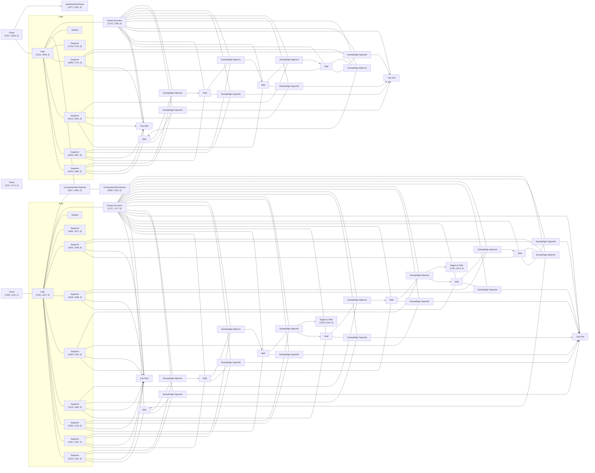

```mermaid
flowchart LR
  subgraph path3 [Path]
    3["Path<br>[1190, 1227, 0]"]
      %% [ProgramBodyItem { index: 15 }, VariableDeclarationDeclaration, VariableDeclarationInit, PipeBodyItem { index: 0 }]
    4["Segment<br>[1233, 1281, 0]"]
      %% [ProgramBodyItem { index: 15 }, VariableDeclarationDeclaration, VariableDeclarationInit, PipeBodyItem { index: 1 }]
    5["Segment<br>[1287, 1357, 0]"]
      %% [ProgramBodyItem { index: 15 }, VariableDeclarationDeclaration, VariableDeclarationInit, PipeBodyItem { index: 2 }]
    6["Segment<br>[1363, 1413, 0]"]
      %% [ProgramBodyItem { index: 15 }, VariableDeclarationDeclaration, VariableDeclarationInit, PipeBodyItem { index: 3 }]
    7["Segment<br>[1419, 1460, 0]"]
      %% [ProgramBodyItem { index: 15 }, VariableDeclarationDeclaration, VariableDeclarationInit, PipeBodyItem { index: 4 }]
    8["Segment<br>[1466, 1520, 0]"]
      %% [ProgramBodyItem { index: 15 }, VariableDeclarationDeclaration, VariableDeclarationInit, PipeBodyItem { index: 5 }]
    9["Segment<br>[1526, 1596, 0]"]
      %% [ProgramBodyItem { index: 15 }, VariableDeclarationDeclaration, VariableDeclarationInit, PipeBodyItem { index: 6 }]
    10["Segment<br>[1602, 1658, 0]"]
      %% [ProgramBodyItem { index: 15 }, VariableDeclarationDeclaration, VariableDeclarationInit, PipeBodyItem { index: 7 }]
    11["Segment<br>[1664, 1671, 0]"]
      %% [ProgramBodyItem { index: 15 }, VariableDeclarationDeclaration, VariableDeclarationInit, PipeBodyItem { index: 8 }]
    12[Solid2d]
  end
  subgraph path40 [Path]
    40["Path<br>[2316, 2439, 0]"]
      %% [ProgramBodyItem { index: 19 }, VariableDeclarationDeclaration, VariableDeclarationInit, PipeBodyItem { index: 0 }]
    41["Segment<br>[2445, 2484, 0]"]
      %% [ProgramBodyItem { index: 19 }, VariableDeclarationDeclaration, VariableDeclarationInit, PipeBodyItem { index: 1 }]
    42["Segment<br>[2549, 2607, 0]"]
      %% [ProgramBodyItem { index: 19 }, VariableDeclarationDeclaration, VariableDeclarationInit, PipeBodyItem { index: 2 }]
    43["Segment<br>[2613, 2650, 0]"]
      %% [ProgramBodyItem { index: 19 }, VariableDeclarationDeclaration, VariableDeclarationInit, PipeBodyItem { index: 3 }]
    44["Segment<br>[2656, 2712, 0]"]
      %% [ProgramBodyItem { index: 19 }, VariableDeclarationDeclaration, VariableDeclarationInit, PipeBodyItem { index: 4 }]
    45["Segment<br>[2718, 2725, 0]"]
      %% [ProgramBodyItem { index: 19 }, VariableDeclarationDeclaration, VariableDeclarationInit, PipeBodyItem { index: 5 }]
    46[Solid2d]
  end
  1["Plane<br>[1093, 1142, 0]"]
    %% [ProgramBodyItem { index: 13 }, VariableDeclarationDeclaration, VariableDeclarationInit]
  2["Plane<br>[1157, 1174, 0]"]
    %% [ProgramBodyItem { index: 14 }, VariableDeclarationDeclaration, VariableDeclarationInit]
  13["Sweep Extrusion<br>[1727, 1777, 0]"]
    %% [ProgramBodyItem { index: 16 }, VariableDeclarationDeclaration, VariableDeclarationInit, PipeBodyItem { index: 0 }]
  14[Wall]
    %% face_code_ref=Missing NodePath
  15[Wall]
    %% face_code_ref=Missing NodePath
  16[Wall]
    %% face_code_ref=Missing NodePath
  17[Wall]
    %% face_code_ref=Missing NodePath
  18[Wall]
    %% face_code_ref=Missing NodePath
  19[Wall]
    %% face_code_ref=Missing NodePath
  20[Wall]
    %% face_code_ref=Missing NodePath
  21["Cap Start"]
    %% face_code_ref=Missing NodePath
  22["Cap End"]
    %% face_code_ref=Missing NodePath
  23["SweepEdge Opposite"]
  24["SweepEdge Adjacent"]
  25["SweepEdge Opposite"]
  26["SweepEdge Adjacent"]
  27["SweepEdge Opposite"]
  28["SweepEdge Adjacent"]
  29["SweepEdge Opposite"]
  30["SweepEdge Adjacent"]
  31["SweepEdge Opposite"]
  32["SweepEdge Adjacent"]
  33["SweepEdge Opposite"]
  34["SweepEdge Adjacent"]
  35["SweepEdge Opposite"]
  36["SweepEdge Adjacent"]
  37["EdgeCut Fillet<br>[1783, 1973, 0]"]
    %% [ProgramBodyItem { index: 16 }, VariableDeclarationDeclaration, VariableDeclarationInit, PipeBodyItem { index: 1 }]
  38["EdgeCut Fillet<br>[1979, 2154, 0]"]
    %% [ProgramBodyItem { index: 16 }, VariableDeclarationDeclaration, VariableDeclarationInit, PipeBodyItem { index: 2 }]
  39["Plane<br>[2217, 2263, 0]"]
    %% [ProgramBodyItem { index: 17 }, VariableDeclarationDeclaration, VariableDeclarationInit]
  47["Sweep Extrusion<br>[2743, 2789, 0]"]
    %% [ProgramBodyItem { index: 20 }, VariableDeclarationDeclaration, VariableDeclarationInit, PipeBodyItem { index: 0 }]
  48[Wall]
    %% face_code_ref=Missing NodePath
  49[Wall]
    %% face_code_ref=Missing NodePath
  50[Wall]
    %% face_code_ref=Missing NodePath
  51[Wall]
    %% face_code_ref=Missing NodePath
  52["Cap Start"]
    %% face_code_ref=Missing NodePath
  53["Cap End"]
    %% face_code_ref=Missing NodePath
  54["SweepEdge Opposite"]
  55["SweepEdge Adjacent"]
  56["SweepEdge Opposite"]
  57["SweepEdge Adjacent"]
  58["SweepEdge Opposite"]
  59["SweepEdge Adjacent"]
  60["SweepEdge Opposite"]
  61["SweepEdge Adjacent"]
  62["CompositeSolid Subtract<br>[3017, 3064, 0]"]
    %% [ProgramBodyItem { index: 22 }, VariableDeclarationDeclaration, VariableDeclarationInit]
  63["CompositeSolid Subtract<br>[3082, 3135, 0]"]
    %% [ProgramBodyItem { index: 23 }, VariableDeclarationDeclaration, VariableDeclarationInit]
  64["StartSketchOnPlane<br>[2277, 2301, 0]"]
    %% [ProgramBodyItem { index: 18 }, VariableDeclarationDeclaration, VariableDeclarationInit]
  1 --- 3
  3 --- 4
  3 --- 5
  3 --- 6
  3 --- 7
  3 --- 8
  3 --- 9
  3 --- 10
  3 --- 11
  3 --- 12
  3 ---- 13
  3 --- 62
  4 --- 14
  4 x--> 21
  4 --- 23
  4 --- 24
  5 --- 15
  5 x--> 21
  5 --- 25
  5 --- 26
  6 --- 16
  6 x--> 21
  6 --- 27
  6 --- 28
  7 --- 17
  7 x--> 21
  7 --- 29
  7 --- 30
  8 --- 18
  8 x--> 21
  8 --- 31
  8 --- 32
  9 --- 19
  9 x--> 21
  9 --- 33
  9 --- 34
  10 --- 20
  10 x--> 21
  10 --- 35
  10 --- 36
  13 --- 14
  13 --- 15
  13 --- 16
  13 --- 17
  13 --- 18
  13 --- 19
  13 --- 20
  13 --- 21
  13 --- 22
  13 --- 23
  13 --- 24
  13 --- 25
  13 --- 26
  13 --- 27
  13 --- 28
  13 --- 29
  13 --- 30
  13 --- 31
  13 --- 32
  13 --- 33
  13 --- 34
  13 --- 35
  13 --- 36
  14 --- 23
  14 --- 24
  36 <--x 14
  24 <--x 15
  15 --- 25
  15 --- 26
  26 <--x 16
  16 --- 27
  16 --- 28
  28 <--x 17
  17 --- 29
  17 --- 30
  30 <--x 18
  18 --- 31
  18 --- 32
  32 <--x 19
  19 --- 33
  19 --- 34
  34 <--x 20
  20 --- 35
  20 --- 36
  23 <--x 22
  25 <--x 22
  27 <--x 22
  29 <--x 22
  31 <--x 22
  33 <--x 22
  35 <--x 22
  28 <--x 38
  32 <--x 37
  39 --- 40
  39 <--x 64
  40 --- 41
  40 --- 42
  40 --- 43
  40 --- 44
  40 --- 45
  40 --- 46
  40 ---- 47
  40 --- 62
  41 --- 51
  41 x--> 52
  41 --- 60
  41 --- 61
  42 --- 50
  42 x--> 52
  42 --- 58
  42 --- 59
  43 --- 49
  43 x--> 52
  43 --- 56
  43 --- 57
  44 --- 48
  44 x--> 52
  44 --- 54
  44 --- 55
  47 --- 48
  47 --- 49
  47 --- 50
  47 --- 51
  47 --- 52
  47 --- 53
  47 --- 54
  47 --- 55
  47 --- 56
  47 --- 57
  47 --- 58
  47 --- 59
  47 --- 60
  47 --- 61
  48 --- 54
  48 --- 55
  57 <--x 48
  49 --- 56
  49 --- 57
  59 <--x 49
  50 --- 58
  50 --- 59
  61 <--x 50
  55 <--x 51
  51 --- 60
  51 --- 61
  54 <--x 53
  56 <--x 53
  58 <--x 53
  60 <--x 53
  62 --- 63
```
