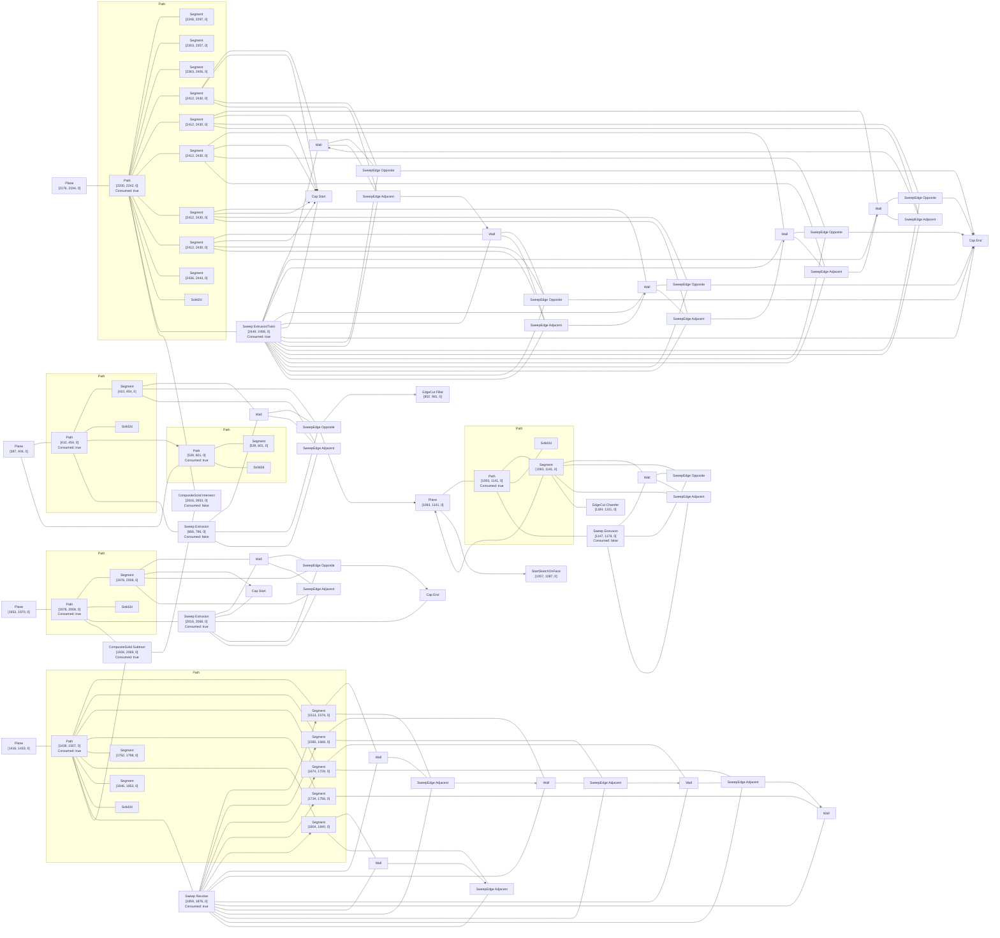

```mermaid
flowchart LR
  subgraph path2 [Path]
    2["Path<br>[410, 454, 0]<br>Consumed: true"]
      %% [ProgramBodyItem { index: 6 }, VariableDeclarationDeclaration, VariableDeclarationInit, PipeBodyItem { index: 1 }]
    3["Segment<br>[410, 454, 0]"]
      %% [ProgramBodyItem { index: 6 }, VariableDeclarationDeclaration, VariableDeclarationInit, PipeBodyItem { index: 1 }]
    4[Solid2d]
  end
  subgraph path5 [Path]
    5["Path<br>[539, 601, 0]<br>Consumed: true"]
      %% [ProgramBodyItem { index: 6 }, VariableDeclarationDeclaration, VariableDeclarationInit, PipeBodyItem { index: 2 }, CallKwArg { index: 0 }, PipeBodyItem { index: 0 }]
    6["Segment<br>[539, 601, 0]"]
      %% [ProgramBodyItem { index: 6 }, VariableDeclarationDeclaration, VariableDeclarationInit, PipeBodyItem { index: 2 }, CallKwArg { index: 0 }, PipeBodyItem { index: 0 }]
    7[Solid2d]
  end
  subgraph path14 [Path]
    14["Path<br>[1093, 1141, 0]<br>Consumed: true"]
      %% [ProgramBodyItem { index: 7 }, VariableDeclarationDeclaration, VariableDeclarationInit, PipeBodyItem { index: 1 }]
    15["Segment<br>[1093, 1141, 0]"]
      %% [ProgramBodyItem { index: 7 }, VariableDeclarationDeclaration, VariableDeclarationInit, PipeBodyItem { index: 1 }]
    16[Solid2d]
  end
  subgraph path23 [Path]
    23["Path<br>[1439, 1507, 0]<br>Consumed: true"]
      %% [ProgramBodyItem { index: 8 }, VariableDeclarationDeclaration, VariableDeclarationInit, PipeBodyItem { index: 1 }]
    24["Segment<br>[1513, 1579, 0]"]
      %% [ProgramBodyItem { index: 8 }, VariableDeclarationDeclaration, VariableDeclarationInit, PipeBodyItem { index: 2 }]
    25["Segment<br>[1585, 1668, 0]"]
      %% [ProgramBodyItem { index: 8 }, VariableDeclarationDeclaration, VariableDeclarationInit, PipeBodyItem { index: 3 }]
    26["Segment<br>[1674, 1728, 0]"]
      %% [ProgramBodyItem { index: 8 }, VariableDeclarationDeclaration, VariableDeclarationInit, PipeBodyItem { index: 4 }]
    27["Segment<br>[1734, 1756, 0]"]
      %% [ProgramBodyItem { index: 8 }, VariableDeclarationDeclaration, VariableDeclarationInit, PipeBodyItem { index: 5 }]
    28["Segment<br>[1762, 1798, 0]"]
      %% [ProgramBodyItem { index: 8 }, VariableDeclarationDeclaration, VariableDeclarationInit, PipeBodyItem { index: 6 }]
    29["Segment<br>[1804, 1840, 0]"]
      %% [ProgramBodyItem { index: 8 }, VariableDeclarationDeclaration, VariableDeclarationInit, PipeBodyItem { index: 7 }]
    30["Segment<br>[1846, 1853, 0]"]
      %% [ProgramBodyItem { index: 8 }, VariableDeclarationDeclaration, VariableDeclarationInit, PipeBodyItem { index: 8 }]
    31[Solid2d]
  end
  subgraph path43 [Path]
    43["Path<br>[1978, 2008, 0]<br>Consumed: true"]
      %% [ProgramBodyItem { index: 8 }, VariableDeclarationDeclaration, VariableDeclarationInit, PipeBodyItem { index: 10 }, CallKwArg { index: 0 }, PipeBodyItem { index: 1 }]
    44["Segment<br>[1978, 2008, 0]"]
      %% [ProgramBodyItem { index: 8 }, VariableDeclarationDeclaration, VariableDeclarationInit, PipeBodyItem { index: 10 }, CallKwArg { index: 0 }, PipeBodyItem { index: 1 }]
    45[Solid2d]
  end
  subgraph path54 [Path]
    54["Path<br>[2200, 2242, 0]<br>Consumed: true"]
      %% [ProgramBodyItem { index: 9 }, VariableDeclarationDeclaration, VariableDeclarationInit, PipeBodyItem { index: 1 }]
    55["Segment<br>[2248, 2297, 0]"]
      %% [ProgramBodyItem { index: 9 }, VariableDeclarationDeclaration, VariableDeclarationInit, PipeBodyItem { index: 2 }]
    56["Segment<br>[2303, 2357, 0]"]
      %% [ProgramBodyItem { index: 9 }, VariableDeclarationDeclaration, VariableDeclarationInit, PipeBodyItem { index: 3 }]
    57["Segment<br>[2363, 2406, 0]"]
      %% [ProgramBodyItem { index: 9 }, VariableDeclarationDeclaration, VariableDeclarationInit, PipeBodyItem { index: 4 }]
    58["Segment<br>[2412, 2430, 0]"]
      %% [ProgramBodyItem { index: 9 }, VariableDeclarationDeclaration, VariableDeclarationInit, PipeBodyItem { index: 5 }]
    59["Segment<br>[2412, 2430, 0]"]
      %% [ProgramBodyItem { index: 9 }, VariableDeclarationDeclaration, VariableDeclarationInit, PipeBodyItem { index: 5 }]
    60["Segment<br>[2412, 2430, 0]"]
      %% [ProgramBodyItem { index: 9 }, VariableDeclarationDeclaration, VariableDeclarationInit, PipeBodyItem { index: 5 }]
    61["Segment<br>[2412, 2430, 0]"]
      %% [ProgramBodyItem { index: 9 }, VariableDeclarationDeclaration, VariableDeclarationInit, PipeBodyItem { index: 5 }]
    62["Segment<br>[2412, 2430, 0]"]
      %% [ProgramBodyItem { index: 9 }, VariableDeclarationDeclaration, VariableDeclarationInit, PipeBodyItem { index: 5 }]
    63["Segment<br>[2436, 2443, 0]"]
      %% [ProgramBodyItem { index: 9 }, VariableDeclarationDeclaration, VariableDeclarationInit, PipeBodyItem { index: 6 }]
    64[Solid2d]
  end
  1["Plane<br>[387, 404, 0]"]
    %% [ProgramBodyItem { index: 6 }, VariableDeclarationDeclaration, VariableDeclarationInit, PipeBodyItem { index: 0 }]
  8["Sweep Extrusion<br>[666, 796, 0]<br>Consumed: false"]
    %% [ProgramBodyItem { index: 6 }, VariableDeclarationDeclaration, VariableDeclarationInit, PipeBodyItem { index: 3 }]
  9[Wall]
    %% face_code_ref=Missing NodePath
  10["SweepEdge Opposite"]
  11["SweepEdge Adjacent"]
  12["EdgeCut Fillet<br>[802, 981, 0]"]
    %% [ProgramBodyItem { index: 6 }, VariableDeclarationDeclaration, VariableDeclarationInit, PipeBodyItem { index: 4 }]
  13["Plane<br>[1093, 1141, 0]"]
    %% [ProgramBodyItem { index: 7 }, VariableDeclarationDeclaration, VariableDeclarationInit, PipeBodyItem { index: 1 }]
  17["Sweep Extrusion<br>[1147, 1178, 0]<br>Consumed: false"]
    %% [ProgramBodyItem { index: 7 }, VariableDeclarationDeclaration, VariableDeclarationInit, PipeBodyItem { index: 2 }]
  18[Wall]
    %% face_code_ref=Missing NodePath
  19["SweepEdge Opposite"]
  20["SweepEdge Adjacent"]
  21["EdgeCut Chamfer<br>[1184, 1311, 0]"]
    %% [ProgramBodyItem { index: 7 }, VariableDeclarationDeclaration, VariableDeclarationInit, PipeBodyItem { index: 3 }]
  22["Plane<br>[1416, 1433, 0]"]
    %% [ProgramBodyItem { index: 8 }, VariableDeclarationDeclaration, VariableDeclarationInit, PipeBodyItem { index: 0 }]
  32["Sweep Revolve<br>[1859, 1876, 0]<br>Consumed: true"]
    %% [ProgramBodyItem { index: 8 }, VariableDeclarationDeclaration, VariableDeclarationInit, PipeBodyItem { index: 9 }]
  33[Wall]
    %% face_code_ref=Missing NodePath
  34[Wall]
    %% face_code_ref=Missing NodePath
  35[Wall]
    %% face_code_ref=Missing NodePath
  36[Wall]
    %% face_code_ref=Missing NodePath
  37[Wall]
    %% face_code_ref=Missing NodePath
  38["SweepEdge Adjacent"]
  39["SweepEdge Adjacent"]
  40["SweepEdge Adjacent"]
  41["SweepEdge Adjacent"]
  42["Plane<br>[1953, 1970, 0]"]
    %% [ProgramBodyItem { index: 8 }, VariableDeclarationDeclaration, VariableDeclarationInit, PipeBodyItem { index: 10 }, CallKwArg { index: 0 }, PipeBodyItem { index: 0 }]
  46["Sweep Extrusion<br>[2016, 2068, 0]<br>Consumed: true"]
    %% [ProgramBodyItem { index: 8 }, VariableDeclarationDeclaration, VariableDeclarationInit, PipeBodyItem { index: 10 }, CallKwArg { index: 0 }, PipeBodyItem { index: 2 }]
  47[Wall]
    %% face_code_ref=Missing NodePath
  48["Cap Start"]
    %% face_code_ref=Missing NodePath
  49["Cap End"]
    %% face_code_ref=Missing NodePath
  50["SweepEdge Opposite"]
  51["SweepEdge Adjacent"]
  52["CompositeSolid Subtract<br>[1934, 2069, 0]<br>Consumed: true"]
    %% [ProgramBodyItem { index: 8 }, VariableDeclarationDeclaration, VariableDeclarationInit, PipeBodyItem { index: 10 }]
  53["Plane<br>[2176, 2194, 0]"]
    %% [ProgramBodyItem { index: 9 }, VariableDeclarationDeclaration, VariableDeclarationInit, PipeBodyItem { index: 0 }]
  65["Sweep ExtrusionTwist<br>[2449, 2498, 0]<br>Consumed: true"]
    %% [ProgramBodyItem { index: 9 }, VariableDeclarationDeclaration, VariableDeclarationInit, PipeBodyItem { index: 7 }]
  66[Wall]
    %% face_code_ref=Missing NodePath
  67[Wall]
    %% face_code_ref=Missing NodePath
  68[Wall]
    %% face_code_ref=Missing NodePath
  69[Wall]
    %% face_code_ref=Missing NodePath
  70[Wall]
    %% face_code_ref=Missing NodePath
  71["Cap Start"]
    %% face_code_ref=Missing NodePath
  72["Cap End"]
    %% face_code_ref=Missing NodePath
  73["SweepEdge Opposite"]
  74["SweepEdge Adjacent"]
  75["SweepEdge Opposite"]
  76["SweepEdge Adjacent"]
  77["SweepEdge Opposite"]
  78["SweepEdge Adjacent"]
  79["SweepEdge Opposite"]
  80["SweepEdge Adjacent"]
  81["SweepEdge Opposite"]
  82["SweepEdge Adjacent"]
  83["CompositeSolid Intersect<br>[2616, 2653, 0]<br>Consumed: false"]
    %% [ProgramBodyItem { index: 10 }, VariableDeclarationDeclaration, VariableDeclarationInit, PipeBodyItem { index: 0 }]
  84["StartSketchOnFace<br>[1057, 1087, 0]"]
    %% [ProgramBodyItem { index: 7 }, VariableDeclarationDeclaration, VariableDeclarationInit, PipeBodyItem { index: 0 }]
  1 --- 2
  1 --- 5
  2 --- 3
  2 --- 4
  2 <--x 5
  2 ---- 8
  3 --- 9
  3 --- 10
  3 --- 11
  5 --- 6
  5 --- 7
  8 --- 9
  8 --- 10
  8 --- 11
  9 --- 10
  9 --- 11
  10 <--x 12
  10 x--> 13
  13 --- 14
  15 <--x 13
  13 <--x 84
  14 --- 15
  14 --- 16
  14 ---- 17
  15 --- 18
  15 --- 19
  15 --- 20
  15 --- 21
  17 --- 18
  17 --- 19
  17 --- 20
  18 --- 19
  18 --- 20
  22 --- 23
  23 --- 24
  23 --- 25
  23 --- 26
  23 --- 27
  23 --- 28
  23 --- 29
  23 --- 30
  23 --- 31
  23 ---- 32
  23 --- 52
  32 <--x 24
  24 --- 33
  24 --- 38
  32 <--x 25
  25 --- 34
  25 --- 39
  32 <--x 26
  26 --- 35
  26 --- 40
  32 <--x 27
  27 --- 36
  32 <--x 29
  29 --- 37
  29 --- 41
  32 --- 33
  32 --- 34
  32 --- 35
  32 --- 36
  32 --- 37
  32 --- 38
  32 --- 39
  32 --- 40
  32 --- 41
  33 --- 38
  38 <--x 34
  34 --- 39
  39 <--x 35
  35 --- 40
  40 <--x 36
  37 x--> 41
  42 --- 43
  43 --- 44
  43 --- 45
  43 ---- 46
  43 --- 52
  44 --- 47
  44 x--> 48
  44 --- 50
  44 --- 51
  46 --- 47
  46 --- 48
  46 --- 49
  46 --- 50
  46 --- 51
  47 --- 50
  47 --- 51
  50 <--x 49
  52 --- 83
  53 --- 54
  54 --- 55
  54 --- 56
  54 --- 57
  54 --- 58
  54 --- 59
  54 --- 60
  54 --- 61
  54 --- 62
  54 --- 63
  54 --- 64
  54 ---- 65
  54 --- 83
  58 --- 66
  58 x--> 71
  58 --- 73
  58 --- 74
  59 --- 67
  59 x--> 71
  59 --- 75
  59 --- 76
  60 --- 68
  60 x--> 71
  60 --- 77
  60 --- 78
  61 --- 69
  61 x--> 71
  61 --- 79
  61 --- 80
  62 --- 70
  62 x--> 71
  62 --- 81
  62 --- 82
  65 --- 66
  65 --- 67
  65 --- 68
  65 --- 69
  65 --- 70
  65 --- 71
  65 --- 72
  65 --- 73
  65 --- 74
  65 --- 75
  65 --- 76
  65 --- 77
  65 --- 78
  65 --- 79
  65 --- 80
  65 --- 81
  65 --- 82
  66 --- 73
  66 --- 74
  76 <--x 66
  67 --- 75
  67 --- 76
  78 <--x 67
  68 --- 77
  68 --- 78
  80 <--x 68
  69 --- 79
  69 --- 80
  82 <--x 69
  74 <--x 70
  70 --- 81
  70 --- 82
  73 <--x 72
  75 <--x 72
  77 <--x 72
  79 <--x 72
  81 <--x 72
```
