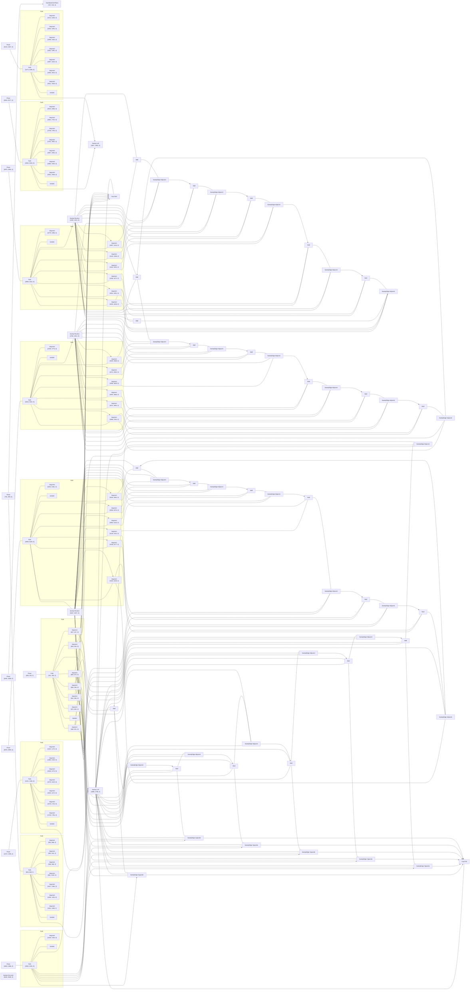

```mermaid
flowchart LR
  subgraph path11 [Path]
    11["Path<br>[331, 363, 0]"]
    20["Segment<br>[369, 401, 0]"]
    21["Segment<br>[407, 447, 0]"]
    22["Segment<br>[453, 500, 0]"]
    23["Segment<br>[506, 546, 0]"]
    24["Segment<br>[552, 599, 0]"]
    25["Segment<br>[605, 670, 0]"]
    26["Segment<br>[676, 683, 0]"]
    80[Solid2d]
  end
  subgraph path12 [Path]
    12["Path<br>[816, 848, 0]"]
    27["Segment<br>[854, 886, 0]"]
    28["Segment<br>[892, 932, 0]"]
    29["Segment<br>[938, 985, 0]"]
    30["Segment<br>[991, 1031, 0]"]
    31["Segment<br>[1037, 1084, 0]"]
    32["Segment<br>[1090, 1155, 0]"]
    33["Segment<br>[1161, 1168, 0]"]
    84[Solid2d]
  end
  subgraph path13 [Path]
    13["Path<br>[1401, 1436, 0]"]
    34["Segment<br>[1442, 1474, 0]"]
    35["Segment<br>[1480, 1520, 0]"]
    36["Segment<br>[1526, 1573, 0]"]
    37["Segment<br>[1579, 1619, 0]"]
    38["Segment<br>[1625, 1672, 0]"]
    39["Segment<br>[1678, 1743, 0]"]
    40["Segment<br>[1749, 1756, 0]"]
    77[Solid2d]
  end
  subgraph path14 [Path]
    14["Path<br>[1992, 2025, 0]"]
    41["Segment<br>[2338, 2345, 0]"]
    85[Solid2d]
  end
  subgraph path15 [Path]
    15["Path<br>[2583, 2618, 0]"]
    42["Segment<br>[2624, 2656, 0]"]
    43["Segment<br>[2662, 2702, 0]"]
    44["Segment<br>[2708, 2755, 0]"]
    45["Segment<br>[2761, 2801, 0]"]
    46["Segment<br>[2807, 2854, 0]"]
    47["Segment<br>[2860, 2925, 0]"]
    48["Segment<br>[2931, 2938, 0]"]
    79[Solid2d]
  end
  subgraph path16 [Path]
    16["Path<br>[3173, 3208, 0]"]
    49["Segment<br>[3214, 3246, 0]"]
    50["Segment<br>[3252, 3292, 0]"]
    51["Segment<br>[3298, 3345, 0]"]
    52["Segment<br>[3351, 3391, 0]"]
    53["Segment<br>[3397, 3444, 0]"]
    54["Segment<br>[3450, 3515, 0]"]
    55["Segment<br>[3521, 3528, 0]"]
    78[Solid2d]
  end
  subgraph path17 [Path]
    17["Path<br>[3998, 4023, 0]"]
    56["Segment<br>[4029, 4048, 0]"]
    57["Segment<br>[4054, 4091, 0]"]
    58["Segment<br>[4097, 4134, 0]"]
    59["Segment<br>[4140, 4158, 0]"]
    60["Segment<br>[4164, 4202, 0]"]
    61["Segment<br>[4208, 4273, 0]"]
    62["Segment<br>[4279, 4286, 0]"]
    81[Solid2d]
  end
  subgraph path18 [Path]
    18["Path<br>[4515, 4543, 0]"]
    63["Segment<br>[4549, 4568, 0]"]
    64["Segment<br>[4574, 4592, 0]"]
    65["Segment<br>[4598, 4639, 0]"]
    66["Segment<br>[4645, 4666, 0]"]
    67["Segment<br>[4672, 4692, 0]"]
    68["Segment<br>[4698, 4763, 0]"]
    69["Segment<br>[4769, 4776, 0]"]
    82[Solid2d]
  end
  subgraph path19 [Path]
    19["Path<br>[4999, 5029, 0]"]
    70["Segment<br>[5035, 5052, 0]"]
    71["Segment<br>[5058, 5076, 0]"]
    72["Segment<br>[5082, 5120, 0]"]
    73["Segment<br>[5126, 5152, 0]"]
    74["Segment<br>[5158, 5177, 0]"]
    75["Segment<br>[5183, 5248, 0]"]
    76["Segment<br>[5254, 5261, 0]"]
    83[Solid2d]
  end
  1["Plane<br>[308, 325, 0]"]
  2["Plane<br>[781, 809, 0]"]
  3["Plane<br>[1372, 1395, 0]"]
  4["Plane<br>[1963, 1986, 0]"]
  5["Plane<br>[2554, 2577, 0]"]
  6["Plane<br>[3144, 3167, 0]"]
  7["Plane<br>[3975, 3992, 0]"]
  8["Plane<br>[4492, 4509, 0]"]
  9["Plane<br>[4976, 4993, 0]"]
  10["StartSketchOnPlane<br>[767, 810, 0]"]
  86["Sweep Extrusion<br>[3616, 3638, 0]"]
  87["Sweep Loft<br>[3698, 3786, 0]"]
  88["Sweep Loft<br>[3827, 3902, 0]"]
  89["Sweep Revolve<br>[4292, 4322, 0]"]
  90["Sweep Revolve<br>[4782, 4812, 0]"]
  91["Sweep Revolve<br>[5267, 5297, 0]"]
  92[Wall]
  93[Wall]
  94[Wall]
  95[Wall]
  96[Wall]
  97[Wall]
  98[Wall]
  99[Wall]
  100[Wall]
  101[Wall]
  102[Wall]
  103[Wall]
  104[Wall]
  105[Wall]
  106[Wall]
  107[Wall]
  108[Wall]
  109[Wall]
  110[Wall]
  111[Wall]
  112[Wall]
  113[Wall]
  114[Wall]
  115[Wall]
  116["Cap Start"]
  117["Cap End"]
  118["SweepEdge Opposite"]
  119["SweepEdge Opposite"]
  120["SweepEdge Opposite"]
  121["SweepEdge Opposite"]
  122["SweepEdge Opposite"]
  123["SweepEdge Opposite"]
  124["SweepEdge Adjacent"]
  125["SweepEdge Adjacent"]
  126["SweepEdge Adjacent"]
  127["SweepEdge Adjacent"]
  128["SweepEdge Adjacent"]
  129["SweepEdge Adjacent"]
  130["SweepEdge Adjacent"]
  131["SweepEdge Adjacent"]
  132["SweepEdge Adjacent"]
  133["SweepEdge Adjacent"]
  134["SweepEdge Adjacent"]
  135["SweepEdge Adjacent"]
  136["SweepEdge Adjacent"]
  137["SweepEdge Adjacent"]
  138["SweepEdge Adjacent"]
  139["SweepEdge Adjacent"]
  140["SweepEdge Adjacent"]
  141["SweepEdge Adjacent"]
  142["SweepEdge Adjacent"]
  143["SweepEdge Adjacent"]
  144["SweepEdge Adjacent"]
  145["SweepEdge Adjacent"]
  146["SweepEdge Adjacent"]
  1 --- 11
  2 <--x 10
  2 --- 12
  3 --- 13
  4 --- 14
  5 --- 15
  6 --- 16
  7 --- 17
  8 --- 18
  9 --- 19
  11 --- 20
  11 --- 21
  11 --- 22
  11 --- 23
  11 --- 24
  11 --- 25
  11 --- 26
  11 --- 80
  11 ---- 87
  12 --- 27
  12 --- 28
  12 --- 29
  12 --- 30
  12 --- 31
  12 --- 32
  12 --- 33
  12 --- 84
  12 x---> 87
  13 --- 34
  13 --- 35
  13 --- 36
  13 --- 37
  13 --- 38
  13 --- 39
  13 --- 40
  13 --- 77
  13 x---> 87
  14 --- 41
  14 --- 85
  14 x---> 87
  14 x--> 118
  14 x--> 119
  14 x--> 120
  14 x--> 121
  14 x--> 122
  14 x--> 123
  15 --- 42
  15 --- 43
  15 --- 44
  15 --- 45
  15 --- 46
  15 --- 47
  15 --- 48
  15 --- 79
  15 x---> 88
  16 --- 49
  16 --- 50
  16 --- 51
  16 --- 52
  16 --- 53
  16 --- 54
  16 --- 55
  16 --- 78
  16 x---> 88
  17 --- 56
  17 --- 57
  17 --- 58
  17 --- 59
  17 --- 60
  17 --- 61
  17 --- 62
  17 --- 81
  17 ---- 89
  18 --- 63
  18 --- 64
  18 --- 65
  18 --- 66
  18 --- 67
  18 --- 68
  18 --- 69
  18 --- 82
  18 ---- 90
  19 --- 70
  19 --- 71
  19 --- 72
  19 --- 73
  19 --- 74
  19 --- 75
  19 --- 76
  19 --- 83
  19 ---- 91
  20 --- 103
  20 x--> 116
  20 --- 118
  20 --- 130
  21 --- 101
  21 x--> 116
  21 --- 119
  21 --- 131
  22 --- 100
  22 x--> 116
  22 --- 120
  22 --- 132
  23 --- 102
  23 x--> 116
  23 --- 121
  23 --- 133
  24 --- 99
  24 x--> 116
  24 --- 122
  24 --- 134
  25 --- 98
  25 x--> 116
  25 --- 123
  25 --- 135
  89 <--x 56
  56 --- 109
  56 x--> 136
  89 <--x 57
  57 --- 108
  57 --- 136
  89 <--x 58
  58 --- 104
  58 --- 137
  89 <--x 59
  59 --- 107
  59 --- 138
  89 <--x 60
  60 --- 106
  60 --- 139
  89 <--x 61
  61 --- 105
  61 --- 140
  90 <--x 63
  63 --- 96
  63 --- 124
  90 <--x 64
  64 --- 92
  64 --- 125
  90 <--x 65
  65 --- 93
  65 --- 126
  90 <--x 66
  66 --- 97
  66 --- 127
  90 <--x 67
  67 --- 95
  67 --- 128
  90 <--x 68
  68 --- 94
  68 --- 129
  91 <--x 70
  70 --- 112
  70 --- 141
  91 <--x 71
  71 --- 115
  71 --- 142
  91 <--x 72
  72 --- 114
  72 --- 143
  91 <--x 73
  73 --- 110
  73 --- 144
  91 <--x 74
  74 --- 113
  74 --- 145
  91 <--x 75
  75 --- 111
  75 --- 146
  87 --- 98
  87 --- 99
  87 --- 100
  87 --- 101
  87 --- 102
  87 --- 103
  87 --- 116
  87 --- 117
  87 --- 118
  87 --- 119
  87 --- 120
  87 --- 121
  87 --- 122
  87 --- 123
  87 --- 130
  87 --- 131
  87 --- 132
  87 --- 133
  87 --- 134
  87 --- 135
  89 --- 104
  89 --- 105
  89 --- 106
  89 --- 107
  89 --- 108
  89 --- 109
  89 --- 136
  89 --- 137
  89 --- 138
  89 --- 139
  89 --- 140
  90 --- 92
  90 --- 93
  90 --- 94
  90 --- 95
  90 --- 96
  90 --- 97
  90 --- 124
  90 --- 125
  90 --- 126
  90 --- 127
  90 --- 128
  90 --- 129
  91 --- 110
  91 --- 111
  91 --- 112
  91 --- 113
  91 --- 114
  91 --- 115
  91 --- 141
  91 --- 142
  91 --- 143
  91 --- 144
  91 --- 145
  91 --- 146
  124 <--x 92
  92 --- 125
  125 <--x 93
  93 --- 126
  128 <--x 94
  94 --- 129
  127 <--x 95
  95 --- 128
  96 --- 124
  129 <--x 96
  126 <--x 97
  97 --- 127
  98 --- 123
  130 <--x 98
  98 --- 135
  99 --- 122
  99 --- 134
  135 <--x 99
  100 --- 120
  100 --- 132
  133 <--x 100
  101 --- 119
  101 --- 131
  132 <--x 101
  102 --- 121
  102 --- 133
  134 <--x 102
  103 --- 118
  103 --- 130
  131 <--x 103
  104 --- 137
  139 <--x 105
  105 --- 140
  138 <--x 106
  106 --- 139
  137 <--x 107
  107 --- 138
  108 --- 136
  109 --- 136
  140 <--x 109
  143 <--x 110
  110 --- 144
  145 <--x 111
  111 --- 146
  112 --- 141
  146 <--x 112
  144 <--x 113
  113 --- 145
  142 <--x 114
  114 --- 143
  141 <--x 115
  115 --- 142
  118 <--x 117
  119 <--x 117
  120 <--x 117
  121 <--x 117
  122 <--x 117
  123 <--x 117
```
