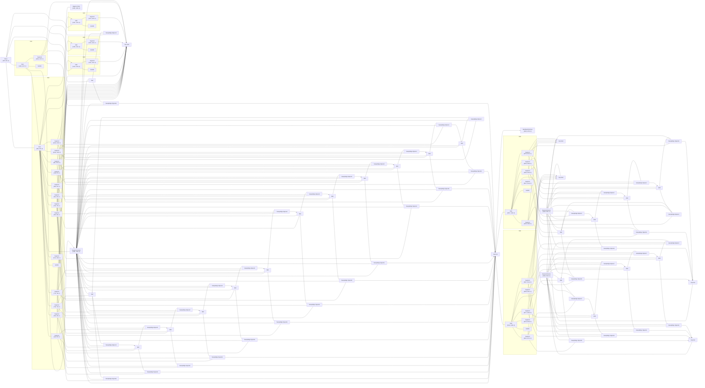

```mermaid
flowchart LR
  subgraph path2 [Path]
    2["Path<br>[555, 603, 0]"]
      %% [ProgramBodyItem { index: 9 }, VariableDeclarationDeclaration, VariableDeclarationInit, PipeBodyItem { index: 0 }]
    3["Segment<br>[609, 635, 0]"]
      %% [ProgramBodyItem { index: 9 }, VariableDeclarationDeclaration, VariableDeclarationInit, PipeBodyItem { index: 1 }]
    4["Segment<br>[641, 670, 0]"]
      %% [ProgramBodyItem { index: 9 }, VariableDeclarationDeclaration, VariableDeclarationInit, PipeBodyItem { index: 2 }]
    5["Segment<br>[676, 730, 0]"]
      %% [ProgramBodyItem { index: 9 }, VariableDeclarationDeclaration, VariableDeclarationInit, PipeBodyItem { index: 3 }]
    6["Segment<br>[736, 764, 0]"]
      %% [ProgramBodyItem { index: 9 }, VariableDeclarationDeclaration, VariableDeclarationInit, PipeBodyItem { index: 4 }]
    7["Segment<br>[770, 796, 0]"]
      %% [ProgramBodyItem { index: 9 }, VariableDeclarationDeclaration, VariableDeclarationInit, PipeBodyItem { index: 5 }]
    8["Segment<br>[802, 845, 0]"]
      %% [ProgramBodyItem { index: 9 }, VariableDeclarationDeclaration, VariableDeclarationInit, PipeBodyItem { index: 6 }]
    9["Segment<br>[851, 878, 0]"]
      %% [ProgramBodyItem { index: 9 }, VariableDeclarationDeclaration, VariableDeclarationInit, PipeBodyItem { index: 7 }]
    10["Segment<br>[884, 912, 0]"]
      %% [ProgramBodyItem { index: 9 }, VariableDeclarationDeclaration, VariableDeclarationInit, PipeBodyItem { index: 8 }]
    11["Segment<br>[918, 975, 0]"]
      %% [ProgramBodyItem { index: 9 }, VariableDeclarationDeclaration, VariableDeclarationInit, PipeBodyItem { index: 9 }]
    12["Segment<br>[981, 1010, 0]"]
      %% [ProgramBodyItem { index: 9 }, VariableDeclarationDeclaration, VariableDeclarationInit, PipeBodyItem { index: 10 }]
    13["Segment<br>[1016, 1043, 0]"]
      %% [ProgramBodyItem { index: 9 }, VariableDeclarationDeclaration, VariableDeclarationInit, PipeBodyItem { index: 11 }]
    14["Segment<br>[1049, 1105, 0]"]
      %% [ProgramBodyItem { index: 9 }, VariableDeclarationDeclaration, VariableDeclarationInit, PipeBodyItem { index: 12 }]
    15["Segment<br>[1111, 1118, 0]"]
      %% [ProgramBodyItem { index: 9 }, VariableDeclarationDeclaration, VariableDeclarationInit, PipeBodyItem { index: 13 }]
    16[Solid2d]
  end
  subgraph path17 [Path]
    17["Path<br>[1142, 1210, 0]"]
      %% [ProgramBodyItem { index: 9 }, VariableDeclarationDeclaration, VariableDeclarationInit, PipeBodyItem { index: 14 }, CallKwArg { index: 0 }]
    18["Segment<br>[1142, 1210, 0]"]
      %% [ProgramBodyItem { index: 9 }, VariableDeclarationDeclaration, VariableDeclarationInit, PipeBodyItem { index: 14 }, CallKwArg { index: 0 }]
    19[Solid2d]
  end
  subgraph path20 [Path]
    20["Path<br>[1235, 1312, 0]"]
      %% [ProgramBodyItem { index: 9 }, VariableDeclarationDeclaration, VariableDeclarationInit, PipeBodyItem { index: 15 }, CallKwArg { index: 0 }]
    21["Segment<br>[1235, 1312, 0]"]
      %% [ProgramBodyItem { index: 9 }, VariableDeclarationDeclaration, VariableDeclarationInit, PipeBodyItem { index: 15 }, CallKwArg { index: 0 }]
    22[Solid2d]
  end
  subgraph path23 [Path]
    23["Path<br>[1337, 1413, 0]"]
      %% [ProgramBodyItem { index: 9 }, VariableDeclarationDeclaration, VariableDeclarationInit, PipeBodyItem { index: 16 }, CallKwArg { index: 0 }]
    24["Segment<br>[1337, 1413, 0]"]
      %% [ProgramBodyItem { index: 9 }, VariableDeclarationDeclaration, VariableDeclarationInit, PipeBodyItem { index: 16 }, CallKwArg { index: 0 }]
    25[Solid2d]
  end
  subgraph path26 [Path]
    26["Path<br>[1438, 1572, 0]"]
      %% [ProgramBodyItem { index: 9 }, VariableDeclarationDeclaration, VariableDeclarationInit, PipeBodyItem { index: 17 }, CallKwArg { index: 0 }]
    27["Segment<br>[1438, 1572, 0]"]
      %% [ProgramBodyItem { index: 9 }, VariableDeclarationDeclaration, VariableDeclarationInit, PipeBodyItem { index: 17 }, CallKwArg { index: 0 }]
    28[Solid2d]
  end
  subgraph path72 [Path]
    72["Path<br>[1897, 1943, 0]"]
      %% [ProgramBodyItem { index: 12 }, VariableDeclarationDeclaration, VariableDeclarationInit, PipeBodyItem { index: 0 }]
    73["Segment<br>[1949, 1989, 0]"]
      %% [ProgramBodyItem { index: 12 }, VariableDeclarationDeclaration, VariableDeclarationInit, PipeBodyItem { index: 1 }]
    74["Segment<br>[1995, 2020, 0]"]
      %% [ProgramBodyItem { index: 12 }, VariableDeclarationDeclaration, VariableDeclarationInit, PipeBodyItem { index: 2 }]
    75["Segment<br>[2026, 2069, 0]"]
      %% [ProgramBodyItem { index: 12 }, VariableDeclarationDeclaration, VariableDeclarationInit, PipeBodyItem { index: 3 }]
    76["Segment<br>[2075, 2131, 0]"]
      %% [ProgramBodyItem { index: 12 }, VariableDeclarationDeclaration, VariableDeclarationInit, PipeBodyItem { index: 4 }]
    77["Segment<br>[2137, 2144, 0]"]
      %% [ProgramBodyItem { index: 12 }, VariableDeclarationDeclaration, VariableDeclarationInit, PipeBodyItem { index: 5 }]
    78[Solid2d]
  end
  subgraph path79 [Path]
    79["Path<br>[2162, 2225, 0]"]
      %% [ProgramBodyItem { index: 13 }, VariableDeclarationDeclaration, VariableDeclarationInit, PipeBodyItem { index: 0 }]
    80["Segment<br>[2231, 2271, 0]"]
      %% [ProgramBodyItem { index: 13 }, VariableDeclarationDeclaration, VariableDeclarationInit, PipeBodyItem { index: 1 }]
    81["Segment<br>[2277, 2302, 0]"]
      %% [ProgramBodyItem { index: 13 }, VariableDeclarationDeclaration, VariableDeclarationInit, PipeBodyItem { index: 2 }]
    82["Segment<br>[2308, 2351, 0]"]
      %% [ProgramBodyItem { index: 13 }, VariableDeclarationDeclaration, VariableDeclarationInit, PipeBodyItem { index: 3 }]
    83["Segment<br>[2357, 2413, 0]"]
      %% [ProgramBodyItem { index: 13 }, VariableDeclarationDeclaration, VariableDeclarationInit, PipeBodyItem { index: 4 }]
    84["Segment<br>[2419, 2426, 0]"]
      %% [ProgramBodyItem { index: 13 }, VariableDeclarationDeclaration, VariableDeclarationInit, PipeBodyItem { index: 5 }]
    85[Solid2d]
  end
  1["Plane<br>[523, 540, 0]"]
    %% [ProgramBodyItem { index: 8 }, VariableDeclarationDeclaration, VariableDeclarationInit]
  29["Sweep Extrusion<br>[1581, 1646, 0]"]
    %% [ProgramBodyItem { index: 10 }, VariableDeclarationDeclaration, VariableDeclarationInit, PipeBodyItem { index: 0 }]
  30[Wall]
    %% face_code_ref=Missing NodePath
  31[Wall]
    %% face_code_ref=Missing NodePath
  32[Wall]
    %% face_code_ref=Missing NodePath
  33[Wall]
    %% face_code_ref=Missing NodePath
  34[Wall]
    %% face_code_ref=Missing NodePath
  35[Wall]
    %% face_code_ref=Missing NodePath
  36[Wall]
    %% face_code_ref=Missing NodePath
  37[Wall]
    %% face_code_ref=Missing NodePath
  38[Wall]
    %% face_code_ref=Missing NodePath
  39[Wall]
    %% face_code_ref=Missing NodePath
  40[Wall]
    %% face_code_ref=Missing NodePath
  41[Wall]
    %% face_code_ref=Missing NodePath
  42[Wall]
    %% face_code_ref=Missing NodePath
  43["Cap Start"]
    %% face_code_ref=Missing NodePath
  44["Cap End"]
    %% face_code_ref=[ProgramBodyItem { index: 11 }, VariableDeclarationDeclaration, VariableDeclarationInit]
  45["SweepEdge Opposite"]
  46["SweepEdge Adjacent"]
  47["SweepEdge Opposite"]
  48["SweepEdge Adjacent"]
  49["SweepEdge Opposite"]
  50["SweepEdge Adjacent"]
  51["SweepEdge Opposite"]
  52["SweepEdge Adjacent"]
  53["SweepEdge Opposite"]
  54["SweepEdge Adjacent"]
  55["SweepEdge Opposite"]
  56["SweepEdge Adjacent"]
  57["SweepEdge Opposite"]
  58["SweepEdge Adjacent"]
  59["SweepEdge Opposite"]
  60["SweepEdge Adjacent"]
  61["SweepEdge Opposite"]
  62["SweepEdge Adjacent"]
  63["SweepEdge Opposite"]
  64["SweepEdge Adjacent"]
  65["SweepEdge Opposite"]
  66["SweepEdge Adjacent"]
  67["SweepEdge Opposite"]
  68["SweepEdge Adjacent"]
  69["SweepEdge Opposite"]
  70["SweepEdge Adjacent"]
  71["EdgeCut Fillet<br>[1652, 1830, 0]"]
    %% [ProgramBodyItem { index: 10 }, VariableDeclarationDeclaration, VariableDeclarationInit, PipeBodyItem { index: 1 }]
  86["Sweep Extrusion<br>[2440, 2487, 0]"]
    %% [ProgramBodyItem { index: 14 }, VariableDeclarationDeclaration, VariableDeclarationInit]
  87[Wall]
    %% face_code_ref=Missing NodePath
  88[Wall]
    %% face_code_ref=Missing NodePath
  89[Wall]
    %% face_code_ref=Missing NodePath
  90[Wall]
    %% face_code_ref=Missing NodePath
  91["Cap Start"]
    %% face_code_ref=Missing NodePath
  92["Cap End"]
    %% face_code_ref=Missing NodePath
  93["SweepEdge Opposite"]
  94["SweepEdge Adjacent"]
  95["SweepEdge Opposite"]
  96["SweepEdge Adjacent"]
  97["SweepEdge Opposite"]
  98["SweepEdge Adjacent"]
  99["SweepEdge Opposite"]
  100["SweepEdge Adjacent"]
  101["Sweep Extrusion<br>[2498, 2542, 0]"]
    %% [ProgramBodyItem { index: 15 }, VariableDeclarationDeclaration, VariableDeclarationInit]
  102[Wall]
    %% face_code_ref=Missing NodePath
  103[Wall]
    %% face_code_ref=Missing NodePath
  104[Wall]
    %% face_code_ref=Missing NodePath
  105[Wall]
    %% face_code_ref=Missing NodePath
  106["Cap Start"]
    %% face_code_ref=Missing NodePath
  107["Cap End"]
    %% face_code_ref=Missing NodePath
  108["SweepEdge Opposite"]
  109["SweepEdge Adjacent"]
  110["SweepEdge Opposite"]
  111["SweepEdge Adjacent"]
  112["SweepEdge Opposite"]
  113["SweepEdge Adjacent"]
  114["SweepEdge Opposite"]
  115["SweepEdge Adjacent"]
  116["StartSketchOnFace<br>[1845, 1876, 0]"]
    %% [ProgramBodyItem { index: 11 }, VariableDeclarationDeclaration, VariableDeclarationInit]
  1 --- 2
  1 --- 17
  1 --- 20
  1 --- 23
  1 --- 26
  2 --- 3
  2 --- 4
  2 --- 5
  2 --- 6
  2 --- 7
  2 --- 8
  2 --- 9
  2 --- 10
  2 --- 11
  2 --- 12
  2 --- 13
  2 --- 14
  2 --- 15
  2 --- 16
  2 <--x 17
  2 <--x 20
  2 <--x 23
  26 --- 2
  2 ---- 29
  3 --- 30
  3 x--> 43
  3 --- 45
  3 --- 46
  4 --- 31
  4 x--> 43
  4 --- 47
  4 --- 48
  5 --- 32
  5 x--> 43
  5 --- 49
  5 --- 50
  5 --- 71
  6 --- 33
  6 x--> 43
  6 --- 51
  6 --- 52
  7 --- 34
  7 x--> 43
  7 --- 53
  7 --- 54
  8 --- 35
  8 x--> 43
  8 --- 55
  8 --- 56
  9 --- 36
  9 x--> 43
  9 --- 57
  9 --- 58
  10 --- 37
  10 x--> 43
  10 --- 59
  10 --- 60
  11 --- 38
  11 x--> 43
  11 --- 61
  11 --- 62
  12 --- 39
  12 x--> 43
  12 --- 63
  12 --- 64
  13 --- 40
  13 x--> 43
  13 --- 65
  13 --- 66
  14 --- 41
  14 x--> 43
  14 --- 67
  14 --- 68
  17 --- 18
  17 --- 19
  18 x--> 43
  20 --- 21
  20 --- 22
  21 x--> 43
  23 --- 24
  23 --- 25
  24 x--> 43
  26 --- 27
  26 --- 28
  26 x---> 29
  27 --- 42
  27 x--> 43
  27 --- 69
  27 --- 70
  29 --- 30
  29 --- 31
  29 --- 32
  29 --- 33
  29 --- 34
  29 --- 35
  29 --- 36
  29 --- 37
  29 --- 38
  29 --- 39
  29 --- 40
  29 --- 41
  29 --- 42
  29 --- 43
  29 --- 44
  29 --- 45
  29 --- 46
  29 --- 47
  29 --- 48
  29 --- 49
  29 --- 50
  29 --- 51
  29 --- 52
  29 --- 53
  29 --- 54
  29 --- 55
  29 --- 56
  29 --- 57
  29 --- 58
  29 --- 59
  29 --- 60
  29 --- 61
  29 --- 62
  29 --- 63
  29 --- 64
  29 --- 65
  29 --- 66
  29 --- 67
  29 --- 68
  29 --- 69
  29 --- 70
  30 --- 45
  30 --- 46
  68 <--x 30
  46 <--x 31
  31 --- 47
  31 --- 48
  48 <--x 32
  32 --- 49
  32 --- 50
  50 <--x 33
  33 --- 51
  33 --- 52
  52 <--x 34
  34 --- 53
  34 --- 54
  54 <--x 35
  35 --- 55
  35 --- 56
  56 <--x 36
  36 --- 57
  36 --- 58
  58 <--x 37
  37 --- 59
  37 --- 60
  60 <--x 38
  38 --- 61
  38 --- 62
  62 <--x 39
  39 --- 63
  39 --- 64
  64 <--x 40
  40 --- 65
  40 --- 66
  66 <--x 41
  41 --- 67
  41 --- 68
  42 --- 69
  42 --- 70
  45 <--x 44
  47 <--x 44
  49 <--x 44
  51 <--x 44
  53 <--x 44
  55 <--x 44
  57 <--x 44
  59 <--x 44
  61 <--x 44
  63 <--x 44
  65 <--x 44
  67 <--x 44
  69 <--x 44
  44 --- 72
  44 --- 79
  44 <--x 116
  72 --- 73
  72 --- 74
  72 --- 75
  72 --- 76
  72 --- 77
  72 --- 78
  72 ---- 86
  73 --- 87
  73 x--> 91
  73 --- 93
  73 --- 94
  74 --- 88
  74 x--> 91
  74 --- 95
  74 --- 96
  75 --- 89
  75 x--> 91
  75 --- 97
  75 --- 98
  76 --- 90
  76 x--> 91
  76 --- 99
  76 --- 100
  79 --- 80
  79 --- 81
  79 --- 82
  79 --- 83
  79 --- 84
  79 --- 85
  79 ---- 101
  80 --- 102
  80 x--> 106
  80 --- 108
  80 --- 109
  81 --- 103
  81 x--> 106
  81 --- 110
  81 --- 111
  82 --- 104
  82 x--> 106
  82 --- 112
  82 --- 113
  83 --- 105
  83 x--> 106
  83 --- 114
  83 --- 115
  86 --- 87
  86 --- 88
  86 --- 89
  86 --- 90
  86 --- 91
  86 --- 92
  86 --- 93
  86 --- 94
  86 --- 95
  86 --- 96
  86 --- 97
  86 --- 98
  86 --- 99
  86 --- 100
  87 --- 93
  87 --- 94
  100 <--x 87
  94 <--x 88
  88 --- 95
  88 --- 96
  96 <--x 89
  89 --- 97
  89 --- 98
  98 <--x 90
  90 --- 99
  90 --- 100
  93 <--x 92
  95 <--x 92
  97 <--x 92
  99 <--x 92
  101 --- 102
  101 --- 103
  101 --- 104
  101 --- 105
  101 --- 106
  101 --- 107
  101 --- 108
  101 --- 109
  101 --- 110
  101 --- 111
  101 --- 112
  101 --- 113
  101 --- 114
  101 --- 115
  102 --- 108
  102 --- 109
  115 <--x 102
  109 <--x 103
  103 --- 110
  103 --- 111
  111 <--x 104
  104 --- 112
  104 --- 113
  113 <--x 105
  105 --- 114
  105 --- 115
  108 <--x 107
  110 <--x 107
  112 <--x 107
  114 <--x 107
```
