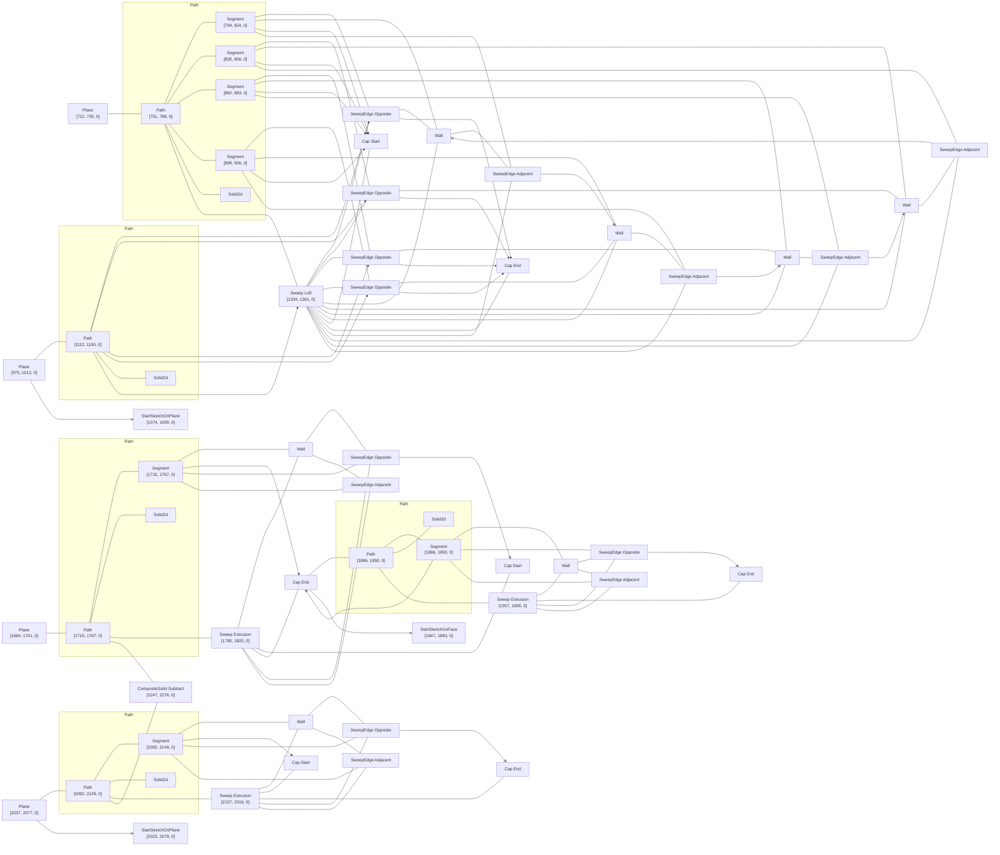

```mermaid
flowchart LR
  subgraph path2 [Path]
    2["Path<br>[751, 788, 0]"]
      %% [ProgramBodyItem { index: 13 }, VariableDeclarationDeclaration, VariableDeclarationInit, PipeBodyItem { index: 0 }]
    3["Segment<br>[794, 824, 0]"]
      %% [ProgramBodyItem { index: 13 }, VariableDeclarationDeclaration, VariableDeclarationInit, PipeBodyItem { index: 1 }]
    4["Segment<br>[830, 856, 0]"]
      %% [ProgramBodyItem { index: 13 }, VariableDeclarationDeclaration, VariableDeclarationInit, PipeBodyItem { index: 2 }]
    5["Segment<br>[862, 893, 0]"]
      %% [ProgramBodyItem { index: 13 }, VariableDeclarationDeclaration, VariableDeclarationInit, PipeBodyItem { index: 3 }]
    6["Segment<br>[899, 906, 0]"]
      %% [ProgramBodyItem { index: 13 }, VariableDeclarationDeclaration, VariableDeclarationInit, PipeBodyItem { index: 4 }]
    7[Solid2d]
  end
  subgraph path9 [Path]
    9["Path<br>[1112, 1150, 0]"]
      %% [ProgramBodyItem { index: 16 }, VariableDeclarationDeclaration, VariableDeclarationInit, PipeBodyItem { index: 0 }]
    14[Solid2d]
  end
  subgraph path27 [Path]
    27["Path<br>[1715, 1767, 0]"]
      %% [ProgramBodyItem { index: 21 }, VariableDeclarationDeclaration, VariableDeclarationInit]
    28["Segment<br>[1715, 1767, 0]"]
      %% [ProgramBodyItem { index: 21 }, VariableDeclarationDeclaration, VariableDeclarationInit]
    29[Solid2d]
  end
  subgraph path36 [Path]
    36["Path<br>[1896, 1950, 0]"]
      %% [ProgramBodyItem { index: 24 }, VariableDeclarationDeclaration, VariableDeclarationInit]
    37["Segment<br>[1896, 1950, 0]"]
      %% [ProgramBodyItem { index: 24 }, VariableDeclarationDeclaration, VariableDeclarationInit]
    38[Solid2d]
  end
  subgraph path45 [Path]
    45["Path<br>[2092, 2149, 0]"]
      %% [ProgramBodyItem { index: 27 }, VariableDeclarationDeclaration, VariableDeclarationInit]
    46["Segment<br>[2092, 2149, 0]"]
      %% [ProgramBodyItem { index: 27 }, VariableDeclarationDeclaration, VariableDeclarationInit]
    47[Solid2d]
  end
  1["Plane<br>[722, 739, 0]"]
    %% [ProgramBodyItem { index: 12 }, VariableDeclarationDeclaration, VariableDeclarationInit]
  8["Plane<br>[975, 1012, 0]"]
    %% [ProgramBodyItem { index: 14 }, VariableDeclarationDeclaration, VariableDeclarationInit]
  10["SweepEdge Opposite"]
  11["SweepEdge Opposite"]
  12["SweepEdge Opposite"]
  13["SweepEdge Opposite"]
  15["Sweep Loft<br>[1334, 1361, 0]"]
    %% [ProgramBodyItem { index: 17 }, VariableDeclarationDeclaration, VariableDeclarationInit]
  16[Wall]
    %% face_code_ref=Missing NodePath
  17[Wall]
    %% face_code_ref=Missing NodePath
  18[Wall]
    %% face_code_ref=Missing NodePath
  19[Wall]
    %% face_code_ref=Missing NodePath
  20["Cap Start"]
    %% face_code_ref=Missing NodePath
  21["Cap End"]
    %% face_code_ref=Missing NodePath
  22["SweepEdge Adjacent"]
  23["SweepEdge Adjacent"]
  24["SweepEdge Adjacent"]
  25["SweepEdge Adjacent"]
  26["Plane<br>[1684, 1701, 0]"]
    %% [ProgramBodyItem { index: 20 }, VariableDeclarationDeclaration, VariableDeclarationInit]
  30["Sweep Extrusion<br>[1780, 1820, 0]"]
    %% [ProgramBodyItem { index: 22 }, VariableDeclarationDeclaration, VariableDeclarationInit]
  31[Wall]
    %% face_code_ref=Missing NodePath
  32["Cap Start"]
    %% face_code_ref=Missing NodePath
  33["Cap End"]
    %% face_code_ref=[ProgramBodyItem { index: 23 }, VariableDeclarationDeclaration, VariableDeclarationInit]
  34["SweepEdge Opposite"]
  35["SweepEdge Adjacent"]
  39["Sweep Extrusion<br>[1957, 1995, 0]"]
    %% [ProgramBodyItem { index: 25 }, VariableDeclarationDeclaration, VariableDeclarationInit]
  40[Wall]
    %% face_code_ref=Missing NodePath
  41["Cap End"]
    %% face_code_ref=Missing NodePath
  42["SweepEdge Opposite"]
  43["SweepEdge Adjacent"]
  44["Plane<br>[2037, 2077, 0]"]
    %% [ProgramBodyItem { index: 26 }, VariableDeclarationDeclaration, VariableDeclarationInit, CallKwUnlabeledArg]
  48["Sweep Extrusion<br>[2157, 2216, 0]"]
    %% [ProgramBodyItem { index: 28 }, VariableDeclarationDeclaration, VariableDeclarationInit]
  49[Wall]
    %% face_code_ref=Missing NodePath
  50["Cap Start"]
    %% face_code_ref=Missing NodePath
  51["Cap End"]
    %% face_code_ref=Missing NodePath
  52["SweepEdge Opposite"]
  53["SweepEdge Adjacent"]
  54["CompositeSolid Subtract<br>[2247, 2276, 0]"]
    %% [ProgramBodyItem { index: 29 }, VariableDeclarationDeclaration, VariableDeclarationInit]
  55["StartSketchOnPlane<br>[1074, 1099, 0]"]
    %% [ProgramBodyItem { index: 15 }, VariableDeclarationDeclaration, VariableDeclarationInit]
  56["StartSketchOnFace<br>[1847, 1883, 0]"]
    %% [ProgramBodyItem { index: 23 }, VariableDeclarationDeclaration, VariableDeclarationInit]
  57["StartSketchOnPlane<br>[2023, 2078, 0]"]
    %% [ProgramBodyItem { index: 26 }, VariableDeclarationDeclaration, VariableDeclarationInit]
  1 --- 2
  2 --- 3
  2 --- 4
  2 --- 5
  2 --- 6
  2 --- 7
  2 ---- 15
  3 --- 10
  3 --- 16
  3 x--> 20
  3 --- 22
  4 --- 11
  4 --- 17
  4 x--> 20
  4 --- 23
  5 --- 12
  5 --- 18
  5 x--> 20
  5 --- 24
  6 --- 13
  6 --- 19
  6 x--> 20
  6 --- 25
  8 --- 9
  8 <--x 55
  9 x--> 10
  9 x--> 11
  9 x--> 12
  9 x--> 13
  9 --- 14
  9 x---> 15
  15 --- 10
  10 --- 16
  10 x--> 21
  15 --- 11
  11 --- 17
  11 x--> 21
  15 --- 12
  12 --- 18
  12 x--> 21
  15 --- 13
  13 --- 19
  13 x--> 21
  15 --- 16
  15 --- 17
  15 --- 18
  15 --- 19
  15 --- 20
  15 --- 21
  15 --- 22
  15 --- 23
  15 --- 24
  15 --- 25
  16 --- 22
  23 <--x 16
  17 --- 23
  24 <--x 17
  18 --- 24
  25 <--x 18
  22 <--x 19
  19 --- 25
  26 --- 27
  27 --- 28
  27 --- 29
  27 ---- 30
  27 --- 54
  28 --- 31
  28 x--> 33
  28 --- 34
  28 --- 35
  30 --- 31
  30 --- 32
  30 --- 33
  30 --- 34
  30 --- 35
  31 --- 34
  31 --- 35
  34 <--x 32
  33 --- 36
  37 <--x 33
  33 <--x 56
  36 --- 37
  36 --- 38
  36 ---- 39
  37 --- 40
  37 --- 42
  37 --- 43
  39 --- 40
  39 --- 41
  39 --- 42
  39 --- 43
  40 --- 42
  40 --- 43
  42 <--x 41
  44 --- 45
  44 <--x 57
  45 --- 46
  45 --- 47
  45 ---- 48
  45 --- 54
  46 --- 49
  46 x--> 50
  46 --- 52
  46 --- 53
  48 --- 49
  48 --- 50
  48 --- 51
  48 --- 52
  48 --- 53
  49 --- 52
  49 --- 53
  52 <--x 51
```
