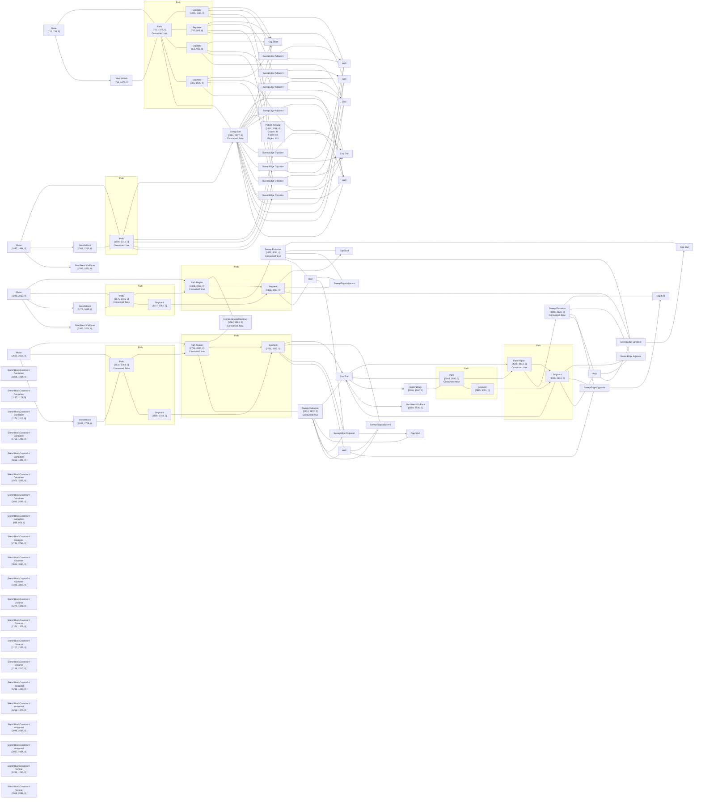

```mermaid
flowchart LR
  subgraph path9 [Path]
    9["Path Region<br>[2781, 2820, 0]<br>Consumed: true"]
      %% [ProgramBodyItem { index: 22 }, VariableDeclarationDeclaration, VariableDeclarationInit]
    24["Segment<br>[2781, 2820, 0]"]
      %% [ProgramBodyItem { index: 22 }, VariableDeclarationDeclaration, VariableDeclarationInit]
  end
  subgraph path10 [Path]
    10["Path Region<br>[3095, 3133, 0]<br>Consumed: true"]
      %% [ProgramBodyItem { index: 26 }, VariableDeclarationDeclaration, VariableDeclarationInit]
    26["Segment<br>[3095, 3133, 0]"]
      %% [ProgramBodyItem { index: 26 }, VariableDeclarationDeclaration, VariableDeclarationInit]
  end
  subgraph path11 [Path]
    11["Path Region<br>[3428, 3467, 0]<br>Consumed: true"]
      %% [ProgramBodyItem { index: 30 }, VariableDeclarationDeclaration, VariableDeclarationInit]
    28["Segment<br>[3428, 3467, 0]"]
      %% [ProgramBodyItem { index: 30 }, VariableDeclarationDeclaration, VariableDeclarationInit]
  end
  subgraph path12 [Path]
    12["Path<br>[1584, 2212, 0]<br>Consumed: true"]
      %% [ProgramBodyItem { index: 16 }, VariableDeclarationDeclaration, VariableDeclarationInit]
  end
  subgraph path13 [Path]
    13["Path<br>[2631, 2768, 0]<br>Consumed: false"]
      %% [ProgramBodyItem { index: 21 }, VariableDeclarationDeclaration, VariableDeclarationInit]
    23["Segment<br>[2669, 2740, 0]"]
      %% [ProgramBodyItem { index: 21 }, VariableDeclarationDeclaration, VariableDeclarationInit, SketchBlockBody, SketchBlockBodyItem { index: 0 }, VariableDeclarationDeclaration, VariableDeclarationInit]
  end
  subgraph path14 [Path]
    14["Path<br>[2948, 3082, 0]<br>Consumed: false"]
      %% [ProgramBodyItem { index: 25 }, VariableDeclarationDeclaration, VariableDeclarationInit]
    25["Segment<br>[2985, 3051, 0]"]
      %% [ProgramBodyItem { index: 25 }, VariableDeclarationDeclaration, VariableDeclarationInit, SketchBlockBody, SketchBlockBodyItem { index: 0 }, VariableDeclarationDeclaration, VariableDeclarationInit]
  end
  subgraph path15 [Path]
    15["Path<br>[3275, 3415, 0]<br>Consumed: false"]
      %% [ProgramBodyItem { index: 29 }, VariableDeclarationDeclaration, VariableDeclarationInit]
    27["Segment<br>[3313, 3382, 0]"]
      %% [ProgramBodyItem { index: 29 }, VariableDeclarationDeclaration, VariableDeclarationInit, SketchBlockBody, SketchBlockBodyItem { index: 0 }, VariableDeclarationDeclaration, VariableDeclarationInit]
  end
  subgraph path16 [Path]
    16["Path<br>[751, 1378, 0]<br>Consumed: true"]
      %% [ProgramBodyItem { index: 13 }, VariableDeclarationDeclaration, VariableDeclarationInit]
    22["Segment<br>[1075, 1134, 0]"]
      %% [ProgramBodyItem { index: 13 }, VariableDeclarationDeclaration, VariableDeclarationInit, SketchBlockBody, SketchBlockBodyItem { index: 5 }, VariableDeclarationDeclaration, VariableDeclarationInit]
    29["Segment<br>[787, 845, 0]"]
      %% [ProgramBodyItem { index: 13 }, VariableDeclarationDeclaration, VariableDeclarationInit, SketchBlockBody, SketchBlockBodyItem { index: 0 }, VariableDeclarationDeclaration, VariableDeclarationInit]
    30["Segment<br>[856, 915, 0]"]
      %% [ProgramBodyItem { index: 13 }, VariableDeclarationDeclaration, VariableDeclarationInit, SketchBlockBody, SketchBlockBodyItem { index: 1 }, VariableDeclarationDeclaration, VariableDeclarationInit]
    31["Segment<br>[965, 1025, 0]"]
      %% [ProgramBodyItem { index: 13 }, VariableDeclarationDeclaration, VariableDeclarationInit, SketchBlockBody, SketchBlockBodyItem { index: 3 }, VariableDeclarationDeclaration, VariableDeclarationInit]
  end
  1["Cap End"]
    %% face_code_ref=[ProgramBodyItem { index: 24 }, VariableDeclarationDeclaration, VariableDeclarationInit]
  2["Cap End"]
    %% face_code_ref=Missing NodePath
  3["Cap End"]
    %% face_code_ref=Missing NodePath
  4["Cap End"]
    %% face_code_ref=Missing NodePath
  5["Cap Start"]
    %% face_code_ref=Missing NodePath
  6["Cap Start"]
    %% face_code_ref=Missing NodePath
  7["Cap Start"]
    %% face_code_ref=Missing NodePath
  8["CompositeSolid Subtract<br>[3564, 3593, 0]<br>Consumed: false"]
    %% [ProgramBodyItem { index: 32 }, VariableDeclarationDeclaration, VariableDeclarationInit]
  17["Pattern Circular<br>[2443, 2566, 0]<br>Copies: 11<br>Faces: 66<br>Edges: 132"]
    %% [ProgramBodyItem { index: 19 }, VariableDeclarationDeclaration, VariableDeclarationInit]
  18["Plane<br>[1447, 1484, 0]"]
    %% [ProgramBodyItem { index: 14 }, VariableDeclarationDeclaration, VariableDeclarationInit]
  19["Plane<br>[2600, 2617, 0]"]
    %% [ProgramBodyItem { index: 20 }, VariableDeclarationDeclaration, VariableDeclarationInit]
  20["Plane<br>[3220, 3260, 0]"]
    %% [ProgramBodyItem { index: 28 }, VariableDeclarationDeclaration, VariableDeclarationInit, CallKwUnlabeledArg]
  21["Plane<br>[722, 739, 0]"]
    %% [ProgramBodyItem { index: 12 }, VariableDeclarationDeclaration, VariableDeclarationInit]
  32["SketchBlock<br>[1584, 2212, 0]"]
    %% [ProgramBodyItem { index: 16 }, VariableDeclarationDeclaration, VariableDeclarationInit]
  33["SketchBlock<br>[2631, 2768, 0]"]
    %% [ProgramBodyItem { index: 21 }, VariableDeclarationDeclaration, VariableDeclarationInit]
  34["SketchBlock<br>[2948, 3082, 0]"]
    %% [ProgramBodyItem { index: 25 }, VariableDeclarationDeclaration, VariableDeclarationInit]
  35["SketchBlock<br>[3275, 3415, 0]"]
    %% [ProgramBodyItem { index: 29 }, VariableDeclarationDeclaration, VariableDeclarationInit]
  36["SketchBlock<br>[751, 1378, 0]"]
    %% [ProgramBodyItem { index: 13 }, VariableDeclarationDeclaration, VariableDeclarationInit]
  37["SketchBlockConstraint Coincident<br>[1028, 1064, 0]"]
    %% [ProgramBodyItem { index: 13 }, VariableDeclarationDeclaration, VariableDeclarationInit, SketchBlockBody, SketchBlockBodyItem { index: 4 }, ExpressionStatementExpr]
  38["SketchBlockConstraint Coincident<br>[1137, 1173, 0]"]
    %% [ProgramBodyItem { index: 13 }, VariableDeclarationDeclaration, VariableDeclarationInit, SketchBlockBody, SketchBlockBodyItem { index: 6 }, ExpressionStatementExpr]
  39["SketchBlockConstraint Coincident<br>[1176, 1212, 0]"]
    %% [ProgramBodyItem { index: 13 }, VariableDeclarationDeclaration, VariableDeclarationInit, SketchBlockBody, SketchBlockBodyItem { index: 7 }, ExpressionStatementExpr]
  40["SketchBlockConstraint Coincident<br>[1752, 1788, 0]"]
    %% [ProgramBodyItem { index: 16 }, VariableDeclarationDeclaration, VariableDeclarationInit, SketchBlockBody, SketchBlockBodyItem { index: 2 }, ExpressionStatementExpr]
  41["SketchBlockConstraint Coincident<br>[1862, 1898, 0]"]
    %% [ProgramBodyItem { index: 16 }, VariableDeclarationDeclaration, VariableDeclarationInit, SketchBlockBody, SketchBlockBodyItem { index: 4 }, ExpressionStatementExpr]
  42["SketchBlockConstraint Coincident<br>[1971, 2007, 0]"]
    %% [ProgramBodyItem { index: 16 }, VariableDeclarationDeclaration, VariableDeclarationInit, SketchBlockBody, SketchBlockBodyItem { index: 6 }, ExpressionStatementExpr]
  43["SketchBlockConstraint Coincident<br>[2010, 2046, 0]"]
    %% [ProgramBodyItem { index: 16 }, VariableDeclarationDeclaration, VariableDeclarationInit, SketchBlockBody, SketchBlockBodyItem { index: 7 }, ExpressionStatementExpr]
  44["SketchBlockConstraint Coincident<br>[918, 954, 0]"]
    %% [ProgramBodyItem { index: 13 }, VariableDeclarationDeclaration, VariableDeclarationInit, SketchBlockBody, SketchBlockBodyItem { index: 2 }, ExpressionStatementExpr]
  45["SketchBlockConstraint Diameter<br>[2743, 2766, 0]"]
    %% [ProgramBodyItem { index: 21 }, VariableDeclarationDeclaration, VariableDeclarationInit, SketchBlockBody, SketchBlockBodyItem { index: 1 }, ExpressionStatementExpr]
  46["SketchBlockConstraint Diameter<br>[3054, 3080, 0]"]
    %% [ProgramBodyItem { index: 25 }, VariableDeclarationDeclaration, VariableDeclarationInit, SketchBlockBody, SketchBlockBodyItem { index: 1 }, ExpressionStatementExpr]
  47["SketchBlockConstraint Diameter<br>[3385, 3413, 0]"]
    %% [ProgramBodyItem { index: 29 }, VariableDeclarationDeclaration, VariableDeclarationInit, SketchBlockBody, SketchBlockBodyItem { index: 1 }, ExpressionStatementExpr]
  48["SketchBlockConstraint Distance<br>[1273, 1321, 0]"]
    %% [ProgramBodyItem { index: 13 }, VariableDeclarationDeclaration, VariableDeclarationInit, SketchBlockBody, SketchBlockBodyItem { index: 11 }, ExpressionStatementExpr]
  49["SketchBlockConstraint Distance<br>[1324, 1376, 0]"]
    %% [ProgramBodyItem { index: 13 }, VariableDeclarationDeclaration, VariableDeclarationInit, SketchBlockBody, SketchBlockBodyItem { index: 12 }, ExpressionStatementExpr]
  50["SketchBlockConstraint Distance<br>[2107, 2155, 0]"]
    %% [ProgramBodyItem { index: 16 }, VariableDeclarationDeclaration, VariableDeclarationInit, SketchBlockBody, SketchBlockBodyItem { index: 11 }, ExpressionStatementExpr]
  51["SketchBlockConstraint Distance<br>[2158, 2210, 0]"]
    %% [ProgramBodyItem { index: 16 }, VariableDeclarationDeclaration, VariableDeclarationInit, SketchBlockBody, SketchBlockBodyItem { index: 12 }, ExpressionStatementExpr]
  52["SketchBlockConstraint Horizontal<br>[1215, 1232, 0]"]
    %% [ProgramBodyItem { index: 13 }, VariableDeclarationDeclaration, VariableDeclarationInit, SketchBlockBody, SketchBlockBodyItem { index: 8 }, ExpressionStatementExpr]
  53["SketchBlockConstraint Horizontal<br>[1253, 1270, 0]"]
    %% [ProgramBodyItem { index: 13 }, VariableDeclarationDeclaration, VariableDeclarationInit, SketchBlockBody, SketchBlockBodyItem { index: 10 }, ExpressionStatementExpr]
  54["SketchBlockConstraint Horizontal<br>[2049, 2066, 0]"]
    %% [ProgramBodyItem { index: 16 }, VariableDeclarationDeclaration, VariableDeclarationInit, SketchBlockBody, SketchBlockBodyItem { index: 8 }, ExpressionStatementExpr]
  55["SketchBlockConstraint Horizontal<br>[2087, 2104, 0]"]
    %% [ProgramBodyItem { index: 16 }, VariableDeclarationDeclaration, VariableDeclarationInit, SketchBlockBody, SketchBlockBodyItem { index: 10 }, ExpressionStatementExpr]
  56["SketchBlockConstraint Vertical<br>[1235, 1250, 0]"]
    %% [ProgramBodyItem { index: 13 }, VariableDeclarationDeclaration, VariableDeclarationInit, SketchBlockBody, SketchBlockBodyItem { index: 9 }, ExpressionStatementExpr]
  57["SketchBlockConstraint Vertical<br>[2069, 2084, 0]"]
    %% [ProgramBodyItem { index: 16 }, VariableDeclarationDeclaration, VariableDeclarationInit, SketchBlockBody, SketchBlockBodyItem { index: 9 }, ExpressionStatementExpr]
  58["StartSketchOnFace<br>[2899, 2935, 0]"]
    %% [ProgramBodyItem { index: 24 }, VariableDeclarationDeclaration, VariableDeclarationInit]
  59["StartSketchOnPlane<br>[1546, 1571, 0]"]
    %% [ProgramBodyItem { index: 15 }, VariableDeclarationDeclaration, VariableDeclarationInit]
  60["StartSketchOnPlane<br>[3206, 3261, 0]"]
    %% [ProgramBodyItem { index: 28 }, VariableDeclarationDeclaration, VariableDeclarationInit]
  61["Sweep Extrusion<br>[2833, 2872, 0]<br>Consumed: true"]
    %% [ProgramBodyItem { index: 23 }, VariableDeclarationDeclaration, VariableDeclarationInit]
  62["Sweep Extrusion<br>[3140, 3178, 0]<br>Consumed: false"]
    %% [ProgramBodyItem { index: 27 }, VariableDeclarationDeclaration, VariableDeclarationInit]
  63["Sweep Extrusion<br>[3475, 3533, 0]<br>Consumed: true"]
    %% [ProgramBodyItem { index: 31 }, VariableDeclarationDeclaration, VariableDeclarationInit]
  64["Sweep Loft<br>[2250, 2277, 0]<br>Consumed: false"]
    %% [ProgramBodyItem { index: 17 }, VariableDeclarationDeclaration, VariableDeclarationInit]
  65["SweepEdge Adjacent"]
  66["SweepEdge Adjacent"]
  67["SweepEdge Adjacent"]
  68["SweepEdge Adjacent"]
  69["SweepEdge Adjacent"]
  70["SweepEdge Adjacent"]
  71["SweepEdge Adjacent"]
  72["SweepEdge Opposite"]
  73["SweepEdge Opposite"]
  74["SweepEdge Opposite"]
  75["SweepEdge Opposite"]
  76["SweepEdge Opposite"]
  77["SweepEdge Opposite"]
  78["SweepEdge Opposite"]
  79[Wall]
    %% face_code_ref=Missing NodePath
  80[Wall]
    %% face_code_ref=Missing NodePath
  81[Wall]
    %% face_code_ref=Missing NodePath
  82[Wall]
    %% face_code_ref=Missing NodePath
  83[Wall]
    %% face_code_ref=Missing NodePath
  84[Wall]
    %% face_code_ref=Missing NodePath
  85[Wall]
    %% face_code_ref=Missing NodePath
  1 <--x 10
  1 --- 14
  24 <--x 1
  26 <--x 1
  1 <--x 34
  1 <--x 58
  61 --- 1
  62 --- 2
  73 <--x 2
  63 --- 3
  74 <--x 3
  64 --- 4
  72 <--x 4
  75 <--x 4
  76 <--x 4
  77 <--x 4
  61 --- 5
  78 <--x 5
  28 <--x 6
  63 --- 6
  22 <--x 7
  29 <--x 7
  30 <--x 7
  31 <--x 7
  64 --- 7
  9 --- 8
  11 --- 8
  13 x--> 9
  19 x--> 9
  9 <--x 24
  9 ---- 61
  14 x--> 10
  10 <--x 26
  10 ---- 62
  15 x--> 11
  20 x--> 11
  11 <--x 28
  11 ---- 63
  18 --- 12
  32 --- 12
  12 x---> 64
  12 x--> 72
  12 x--> 75
  12 x--> 76
  12 x--> 77
  19 --- 13
  13 --- 23
  33 --- 13
  14 --- 25
  34 --- 14
  20 --- 15
  15 --- 27
  35 --- 15
  21 --- 16
  16 --- 22
  16 --- 29
  16 --- 30
  16 --- 31
  36 --- 16
  16 ---- 64
  64 --- 17
  18 <--x 32
  18 <--x 59
  19 <--x 33
  20 <--x 35
  20 <--x 60
  21 <--x 36
  22 --- 65
  22 --- 72
  22 --- 79
  23 <--x 24
  24 --- 66
  24 --- 78
  24 --- 80
  25 <--x 26
  26 --- 67
  26 --- 73
  26 --- 81
  27 <--x 28
  28 --- 68
  28 --- 74
  28 --- 82
  29 --- 69
  29 --- 75
  29 --- 83
  30 --- 70
  30 --- 76
  30 --- 84
  31 --- 71
  31 --- 77
  31 --- 85
  61 --- 66
  61 --- 78
  61 --- 80
  62 --- 67
  62 --- 73
  62 --- 81
  63 --- 68
  63 --- 74
  63 --- 82
  64 --- 65
  64 --- 69
  64 --- 70
  64 --- 71
  64 --- 72
  64 --- 75
  64 --- 76
  64 --- 77
  64 --- 79
  64 --- 83
  64 --- 84
  64 --- 85
  79 --- 65
  65 x--> 79
  80 --- 66
  81 --- 67
  82 --- 68
  69 x--> 83
  83 --- 69
  70 x--> 84
  84 --- 70
  71 x--> 85
  85 --- 71
  72 --- 79
  80 --- 73
  81 --- 74
  75 --- 83
  76 --- 84
  77 --- 85
  82 --- 78
```
