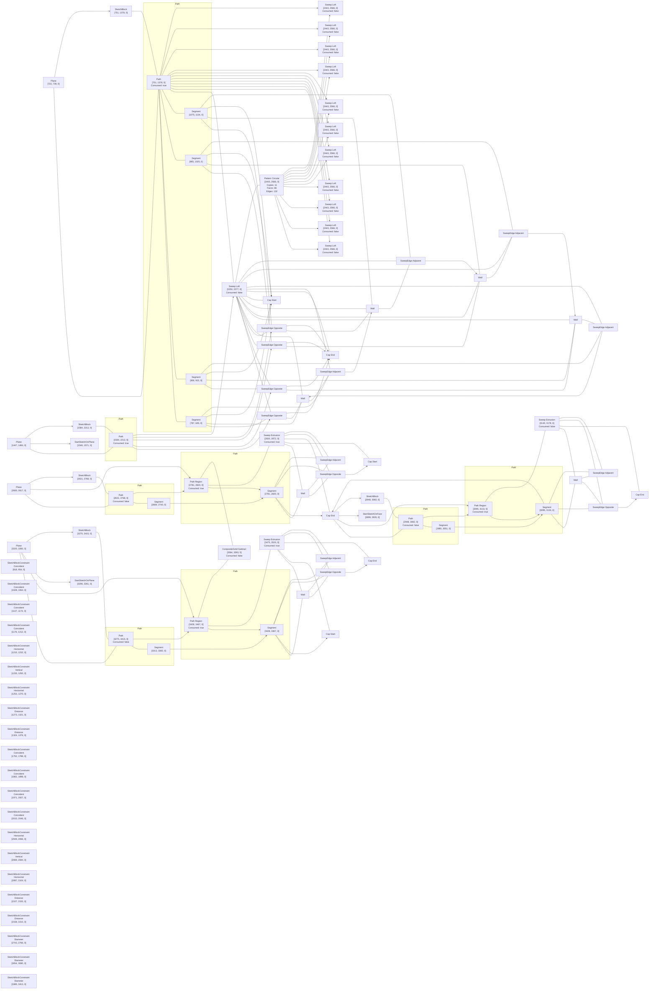

```mermaid
flowchart LR
  subgraph path2 [Path]
    2["Path<br>[751, 1378, 0]<br>Consumed: true"]
      %% [ProgramBodyItem { index: 13 }, VariableDeclarationDeclaration, VariableDeclarationInit]
    3["Segment<br>[787, 845, 0]"]
      %% [ProgramBodyItem { index: 13 }, VariableDeclarationDeclaration, VariableDeclarationInit, SketchBlockBody, SketchBlockBodyItem { index: 0 }, VariableDeclarationDeclaration, VariableDeclarationInit]
    4["Segment<br>[856, 915, 0]"]
      %% [ProgramBodyItem { index: 13 }, VariableDeclarationDeclaration, VariableDeclarationInit, SketchBlockBody, SketchBlockBodyItem { index: 1 }, VariableDeclarationDeclaration, VariableDeclarationInit]
    5["Segment<br>[965, 1025, 0]"]
      %% [ProgramBodyItem { index: 13 }, VariableDeclarationDeclaration, VariableDeclarationInit, SketchBlockBody, SketchBlockBodyItem { index: 3 }, VariableDeclarationDeclaration, VariableDeclarationInit]
    6["Segment<br>[1075, 1134, 0]"]
      %% [ProgramBodyItem { index: 13 }, VariableDeclarationDeclaration, VariableDeclarationInit, SketchBlockBody, SketchBlockBodyItem { index: 5 }, VariableDeclarationDeclaration, VariableDeclarationInit]
  end
  subgraph path8 [Path]
    8["Path<br>[1584, 2212, 0]<br>Consumed: true"]
      %% [ProgramBodyItem { index: 16 }, VariableDeclarationDeclaration, VariableDeclarationInit]
  end
  subgraph path37 [Path]
    37["Path<br>[2631, 2768, 0]<br>Consumed: false"]
      %% [ProgramBodyItem { index: 21 }, VariableDeclarationDeclaration, VariableDeclarationInit]
    38["Segment<br>[2669, 2740, 0]"]
      %% [ProgramBodyItem { index: 21 }, VariableDeclarationDeclaration, VariableDeclarationInit, SketchBlockBody, SketchBlockBodyItem { index: 0 }, VariableDeclarationDeclaration, VariableDeclarationInit]
  end
  subgraph path39 [Path]
    39["Path Region<br>[2781, 2820, 0]<br>Consumed: true"]
      %% [ProgramBodyItem { index: 22 }, VariableDeclarationDeclaration, VariableDeclarationInit]
    40["Segment<br>[2781, 2820, 0]"]
      %% [ProgramBodyItem { index: 22 }, VariableDeclarationDeclaration, VariableDeclarationInit]
  end
  subgraph path47 [Path]
    47["Path<br>[2948, 3082, 0]<br>Consumed: false"]
      %% [ProgramBodyItem { index: 25 }, VariableDeclarationDeclaration, VariableDeclarationInit]
    48["Segment<br>[2985, 3051, 0]"]
      %% [ProgramBodyItem { index: 25 }, VariableDeclarationDeclaration, VariableDeclarationInit, SketchBlockBody, SketchBlockBodyItem { index: 0 }, VariableDeclarationDeclaration, VariableDeclarationInit]
  end
  subgraph path49 [Path]
    49["Path Region<br>[3095, 3133, 0]<br>Consumed: true"]
      %% [ProgramBodyItem { index: 26 }, VariableDeclarationDeclaration, VariableDeclarationInit]
    50["Segment<br>[3095, 3133, 0]"]
      %% [ProgramBodyItem { index: 26 }, VariableDeclarationDeclaration, VariableDeclarationInit]
  end
  subgraph path57 [Path]
    57["Path<br>[3275, 3415, 0]<br>Consumed: false"]
      %% [ProgramBodyItem { index: 29 }, VariableDeclarationDeclaration, VariableDeclarationInit]
    58["Segment<br>[3313, 3382, 0]"]
      %% [ProgramBodyItem { index: 29 }, VariableDeclarationDeclaration, VariableDeclarationInit, SketchBlockBody, SketchBlockBodyItem { index: 0 }, VariableDeclarationDeclaration, VariableDeclarationInit]
  end
  subgraph path59 [Path]
    59["Path Region<br>[3428, 3467, 0]<br>Consumed: true"]
      %% [ProgramBodyItem { index: 30 }, VariableDeclarationDeclaration, VariableDeclarationInit]
    60["Segment<br>[3428, 3467, 0]"]
      %% [ProgramBodyItem { index: 30 }, VariableDeclarationDeclaration, VariableDeclarationInit]
  end
  1["Plane<br>[722, 739, 0]"]
    %% [ProgramBodyItem { index: 12 }, VariableDeclarationDeclaration, VariableDeclarationInit]
  7["Plane<br>[1447, 1484, 0]"]
    %% [ProgramBodyItem { index: 14 }, VariableDeclarationDeclaration, VariableDeclarationInit]
  9["SweepEdge Opposite"]
  10["SweepEdge Opposite"]
  11["SweepEdge Opposite"]
  12["SweepEdge Opposite"]
  13["Sweep Loft<br>[2250, 2277, 0]<br>Consumed: false"]
    %% [ProgramBodyItem { index: 17 }, VariableDeclarationDeclaration, VariableDeclarationInit]
  14[Wall]
    %% face_code_ref=Missing NodePath
  15[Wall]
    %% face_code_ref=Missing NodePath
  16[Wall]
    %% face_code_ref=Missing NodePath
  17[Wall]
    %% face_code_ref=Missing NodePath
  18["Cap Start"]
    %% face_code_ref=Missing NodePath
  19["Cap End"]
    %% face_code_ref=Missing NodePath
  20["SweepEdge Adjacent"]
  21["SweepEdge Adjacent"]
  22["SweepEdge Adjacent"]
  23["SweepEdge Adjacent"]
  24["Pattern Circular<br>[2443, 2566, 0]<br>Copies: 11<br>Faces: 66<br>Edges: 132"]
    %% [ProgramBodyItem { index: 19 }, VariableDeclarationDeclaration, VariableDeclarationInit]
  25["Sweep Loft<br>[2443, 2566, 0]<br>Consumed: false"]
    %% [ProgramBodyItem { index: 19 }, VariableDeclarationDeclaration, VariableDeclarationInit]
  26["Sweep Loft<br>[2443, 2566, 0]<br>Consumed: false"]
    %% [ProgramBodyItem { index: 19 }, VariableDeclarationDeclaration, VariableDeclarationInit]
  27["Sweep Loft<br>[2443, 2566, 0]<br>Consumed: false"]
    %% [ProgramBodyItem { index: 19 }, VariableDeclarationDeclaration, VariableDeclarationInit]
  28["Sweep Loft<br>[2443, 2566, 0]<br>Consumed: false"]
    %% [ProgramBodyItem { index: 19 }, VariableDeclarationDeclaration, VariableDeclarationInit]
  29["Sweep Loft<br>[2443, 2566, 0]<br>Consumed: false"]
    %% [ProgramBodyItem { index: 19 }, VariableDeclarationDeclaration, VariableDeclarationInit]
  30["Sweep Loft<br>[2443, 2566, 0]<br>Consumed: false"]
    %% [ProgramBodyItem { index: 19 }, VariableDeclarationDeclaration, VariableDeclarationInit]
  31["Sweep Loft<br>[2443, 2566, 0]<br>Consumed: false"]
    %% [ProgramBodyItem { index: 19 }, VariableDeclarationDeclaration, VariableDeclarationInit]
  32["Sweep Loft<br>[2443, 2566, 0]<br>Consumed: false"]
    %% [ProgramBodyItem { index: 19 }, VariableDeclarationDeclaration, VariableDeclarationInit]
  33["Sweep Loft<br>[2443, 2566, 0]<br>Consumed: false"]
    %% [ProgramBodyItem { index: 19 }, VariableDeclarationDeclaration, VariableDeclarationInit]
  34["Sweep Loft<br>[2443, 2566, 0]<br>Consumed: false"]
    %% [ProgramBodyItem { index: 19 }, VariableDeclarationDeclaration, VariableDeclarationInit]
  35["Sweep Loft<br>[2443, 2566, 0]<br>Consumed: false"]
    %% [ProgramBodyItem { index: 19 }, VariableDeclarationDeclaration, VariableDeclarationInit]
  36["Plane<br>[2600, 2617, 0]"]
    %% [ProgramBodyItem { index: 20 }, VariableDeclarationDeclaration, VariableDeclarationInit]
  41["Sweep Extrusion<br>[2833, 2872, 0]<br>Consumed: true"]
    %% [ProgramBodyItem { index: 23 }, VariableDeclarationDeclaration, VariableDeclarationInit]
  42[Wall]
    %% face_code_ref=Missing NodePath
  43["Cap Start"]
    %% face_code_ref=Missing NodePath
  44["Cap End"]
    %% face_code_ref=[ProgramBodyItem { index: 24 }, VariableDeclarationDeclaration, VariableDeclarationInit]
  45["SweepEdge Opposite"]
  46["SweepEdge Adjacent"]
  51["Sweep Extrusion<br>[3140, 3178, 0]<br>Consumed: false"]
    %% [ProgramBodyItem { index: 27 }, VariableDeclarationDeclaration, VariableDeclarationInit]
  52[Wall]
    %% face_code_ref=Missing NodePath
  53["Cap End"]
    %% face_code_ref=Missing NodePath
  54["SweepEdge Opposite"]
  55["SweepEdge Adjacent"]
  56["Plane<br>[3220, 3260, 0]"]
    %% [ProgramBodyItem { index: 28 }, VariableDeclarationDeclaration, VariableDeclarationInit, CallKwUnlabeledArg]
  61["Sweep Extrusion<br>[3475, 3533, 0]<br>Consumed: true"]
    %% [ProgramBodyItem { index: 31 }, VariableDeclarationDeclaration, VariableDeclarationInit]
  62[Wall]
    %% face_code_ref=Missing NodePath
  63["Cap Start"]
    %% face_code_ref=Missing NodePath
  64["Cap End"]
    %% face_code_ref=Missing NodePath
  65["SweepEdge Opposite"]
  66["SweepEdge Adjacent"]
  67["CompositeSolid Subtract<br>[3564, 3593, 0]<br>Consumed: false"]
    %% [ProgramBodyItem { index: 32 }, VariableDeclarationDeclaration, VariableDeclarationInit]
  68["SketchBlock<br>[751, 1378, 0]"]
    %% [ProgramBodyItem { index: 13 }, VariableDeclarationDeclaration, VariableDeclarationInit]
  69["SketchBlockConstraint Coincident<br>[918, 954, 0]"]
    %% [ProgramBodyItem { index: 13 }, VariableDeclarationDeclaration, VariableDeclarationInit, SketchBlockBody, SketchBlockBodyItem { index: 2 }, ExpressionStatementExpr]
  70["SketchBlockConstraint Coincident<br>[1028, 1064, 0]"]
    %% [ProgramBodyItem { index: 13 }, VariableDeclarationDeclaration, VariableDeclarationInit, SketchBlockBody, SketchBlockBodyItem { index: 4 }, ExpressionStatementExpr]
  71["SketchBlockConstraint Coincident<br>[1137, 1173, 0]"]
    %% [ProgramBodyItem { index: 13 }, VariableDeclarationDeclaration, VariableDeclarationInit, SketchBlockBody, SketchBlockBodyItem { index: 6 }, ExpressionStatementExpr]
  72["SketchBlockConstraint Coincident<br>[1176, 1212, 0]"]
    %% [ProgramBodyItem { index: 13 }, VariableDeclarationDeclaration, VariableDeclarationInit, SketchBlockBody, SketchBlockBodyItem { index: 7 }, ExpressionStatementExpr]
  73["SketchBlockConstraint Horizontal<br>[1215, 1232, 0]"]
    %% [ProgramBodyItem { index: 13 }, VariableDeclarationDeclaration, VariableDeclarationInit, SketchBlockBody, SketchBlockBodyItem { index: 8 }, ExpressionStatementExpr]
  74["SketchBlockConstraint Vertical<br>[1235, 1250, 0]"]
    %% [ProgramBodyItem { index: 13 }, VariableDeclarationDeclaration, VariableDeclarationInit, SketchBlockBody, SketchBlockBodyItem { index: 9 }, ExpressionStatementExpr]
  75["SketchBlockConstraint Horizontal<br>[1253, 1270, 0]"]
    %% [ProgramBodyItem { index: 13 }, VariableDeclarationDeclaration, VariableDeclarationInit, SketchBlockBody, SketchBlockBodyItem { index: 10 }, ExpressionStatementExpr]
  76["SketchBlockConstraint Distance<br>[1273, 1321, 0]"]
    %% [ProgramBodyItem { index: 13 }, VariableDeclarationDeclaration, VariableDeclarationInit, SketchBlockBody, SketchBlockBodyItem { index: 11 }, ExpressionStatementExpr]
  77["SketchBlockConstraint Distance<br>[1324, 1376, 0]"]
    %% [ProgramBodyItem { index: 13 }, VariableDeclarationDeclaration, VariableDeclarationInit, SketchBlockBody, SketchBlockBodyItem { index: 12 }, ExpressionStatementExpr]
  78["StartSketchOnPlane<br>[1546, 1571, 0]"]
    %% [ProgramBodyItem { index: 15 }, VariableDeclarationDeclaration, VariableDeclarationInit]
  79["SketchBlock<br>[1584, 2212, 0]"]
    %% [ProgramBodyItem { index: 16 }, VariableDeclarationDeclaration, VariableDeclarationInit]
  80["SketchBlockConstraint Coincident<br>[1752, 1788, 0]"]
    %% [ProgramBodyItem { index: 16 }, VariableDeclarationDeclaration, VariableDeclarationInit, SketchBlockBody, SketchBlockBodyItem { index: 2 }, ExpressionStatementExpr]
  81["SketchBlockConstraint Coincident<br>[1862, 1898, 0]"]
    %% [ProgramBodyItem { index: 16 }, VariableDeclarationDeclaration, VariableDeclarationInit, SketchBlockBody, SketchBlockBodyItem { index: 4 }, ExpressionStatementExpr]
  82["SketchBlockConstraint Coincident<br>[1971, 2007, 0]"]
    %% [ProgramBodyItem { index: 16 }, VariableDeclarationDeclaration, VariableDeclarationInit, SketchBlockBody, SketchBlockBodyItem { index: 6 }, ExpressionStatementExpr]
  83["SketchBlockConstraint Coincident<br>[2010, 2046, 0]"]
    %% [ProgramBodyItem { index: 16 }, VariableDeclarationDeclaration, VariableDeclarationInit, SketchBlockBody, SketchBlockBodyItem { index: 7 }, ExpressionStatementExpr]
  84["SketchBlockConstraint Horizontal<br>[2049, 2066, 0]"]
    %% [ProgramBodyItem { index: 16 }, VariableDeclarationDeclaration, VariableDeclarationInit, SketchBlockBody, SketchBlockBodyItem { index: 8 }, ExpressionStatementExpr]
  85["SketchBlockConstraint Vertical<br>[2069, 2084, 0]"]
    %% [ProgramBodyItem { index: 16 }, VariableDeclarationDeclaration, VariableDeclarationInit, SketchBlockBody, SketchBlockBodyItem { index: 9 }, ExpressionStatementExpr]
  86["SketchBlockConstraint Horizontal<br>[2087, 2104, 0]"]
    %% [ProgramBodyItem { index: 16 }, VariableDeclarationDeclaration, VariableDeclarationInit, SketchBlockBody, SketchBlockBodyItem { index: 10 }, ExpressionStatementExpr]
  87["SketchBlockConstraint Distance<br>[2107, 2155, 0]"]
    %% [ProgramBodyItem { index: 16 }, VariableDeclarationDeclaration, VariableDeclarationInit, SketchBlockBody, SketchBlockBodyItem { index: 11 }, ExpressionStatementExpr]
  88["SketchBlockConstraint Distance<br>[2158, 2210, 0]"]
    %% [ProgramBodyItem { index: 16 }, VariableDeclarationDeclaration, VariableDeclarationInit, SketchBlockBody, SketchBlockBodyItem { index: 12 }, ExpressionStatementExpr]
  89["SketchBlock<br>[2631, 2768, 0]"]
    %% [ProgramBodyItem { index: 21 }, VariableDeclarationDeclaration, VariableDeclarationInit]
  90["SketchBlockConstraint Diameter<br>[2743, 2766, 0]"]
    %% [ProgramBodyItem { index: 21 }, VariableDeclarationDeclaration, VariableDeclarationInit, SketchBlockBody, SketchBlockBodyItem { index: 1 }, ExpressionStatementExpr]
  91["StartSketchOnFace<br>[2899, 2935, 0]"]
    %% [ProgramBodyItem { index: 24 }, VariableDeclarationDeclaration, VariableDeclarationInit]
  92["SketchBlock<br>[2948, 3082, 0]"]
    %% [ProgramBodyItem { index: 25 }, VariableDeclarationDeclaration, VariableDeclarationInit]
  93["SketchBlockConstraint Diameter<br>[3054, 3080, 0]"]
    %% [ProgramBodyItem { index: 25 }, VariableDeclarationDeclaration, VariableDeclarationInit, SketchBlockBody, SketchBlockBodyItem { index: 1 }, ExpressionStatementExpr]
  94["StartSketchOnPlane<br>[3206, 3261, 0]"]
    %% [ProgramBodyItem { index: 28 }, VariableDeclarationDeclaration, VariableDeclarationInit]
  95["SketchBlock<br>[3275, 3415, 0]"]
    %% [ProgramBodyItem { index: 29 }, VariableDeclarationDeclaration, VariableDeclarationInit]
  96["SketchBlockConstraint Diameter<br>[3385, 3413, 0]"]
    %% [ProgramBodyItem { index: 29 }, VariableDeclarationDeclaration, VariableDeclarationInit, SketchBlockBody, SketchBlockBodyItem { index: 1 }, ExpressionStatementExpr]
  1 --- 2
  1 <--x 68
  2 --- 3
  2 --- 4
  2 --- 5
  2 --- 6
  2 ---- 13
  2 <---x 25
  2 <---x 26
  2 <---x 27
  2 <---x 28
  2 <---x 29
  2 <---x 30
  2 <---x 31
  2 <---x 32
  2 <---x 33
  2 <---x 34
  2 <---x 35
  68 --- 2
  3 --- 9
  3 --- 14
  3 x--> 18
  3 --- 20
  4 --- 10
  4 --- 15
  4 x--> 18
  4 --- 21
  5 --- 11
  5 --- 16
  5 x--> 18
  5 --- 22
  6 --- 12
  6 --- 17
  6 x--> 18
  6 --- 23
  7 --- 8
  7 <--x 78
  7 <--x 79
  8 x--> 9
  8 x--> 10
  8 x--> 11
  8 x--> 12
  8 x---> 13
  79 --- 8
  13 --- 9
  9 --- 14
  9 x--> 19
  13 --- 10
  10 --- 15
  10 x--> 19
  13 --- 11
  11 --- 16
  11 x--> 19
  13 --- 12
  12 --- 17
  12 x--> 19
  13 --- 14
  13 --- 15
  13 --- 16
  13 --- 17
  13 --- 18
  13 --- 19
  13 --- 20
  13 --- 21
  13 --- 22
  13 --- 23
  13 --- 24
  14 --- 20
  21 <--x 14
  15 --- 21
  22 <--x 15
  16 --- 22
  23 <--x 16
  20 <--x 17
  17 --- 23
  24 x--> 25
  24 x--> 26
  24 x--> 27
  24 x--> 28
  24 x--> 29
  24 x--> 30
  24 x--> 31
  24 x--> 32
  24 x--> 33
  24 x--> 34
  24 x--> 35
  36 --- 37
  36 <--x 39
  36 <--x 89
  37 --- 38
  37 <--x 39
  89 --- 37
  38 <--x 40
  39 <--x 40
  39 ---- 41
  39 --- 67
  40 --- 42
  40 x--> 44
  40 --- 45
  40 --- 46
  41 --- 42
  41 --- 43
  41 --- 44
  41 --- 45
  41 --- 46
  42 --- 45
  42 --- 46
  45 <--x 43
  44 --- 47
  44 <--x 49
  50 <--x 44
  44 <--x 91
  44 <--x 92
  47 --- 48
  47 <--x 49
  92 --- 47
  48 <--x 50
  49 <--x 50
  49 ---- 51
  50 --- 52
  50 --- 54
  50 --- 55
  51 --- 52
  51 --- 53
  51 --- 54
  51 --- 55
  52 --- 54
  52 --- 55
  54 <--x 53
  56 --- 57
  56 <--x 59
  56 <--x 94
  56 <--x 95
  57 --- 58
  57 <--x 59
  95 --- 57
  58 <--x 60
  59 <--x 60
  59 ---- 61
  59 --- 67
  60 --- 62
  60 x--> 63
  60 --- 65
  60 --- 66
  61 --- 62
  61 --- 63
  61 --- 64
  61 --- 65
  61 --- 66
  62 --- 65
  62 --- 66
  65 <--x 64
```
