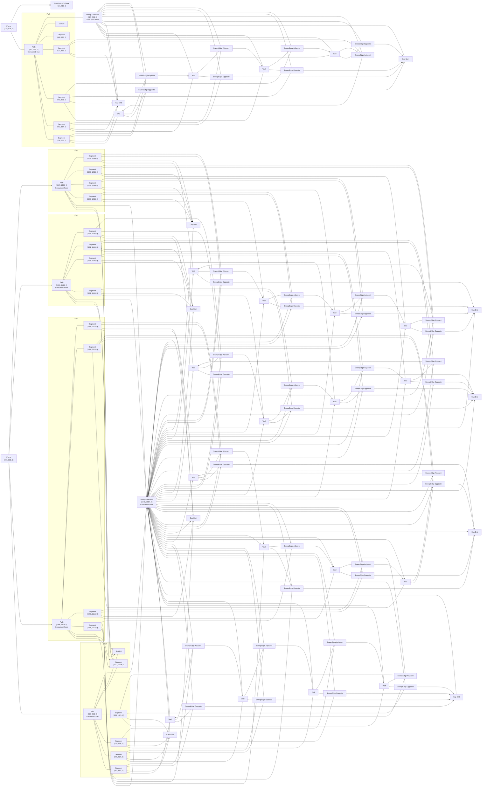

```mermaid
flowchart LR
  subgraph path2 [Path]
    2["Path<br>[481, 522, 0]<br>Consumed: true"]
      %% [ProgramBodyItem { index: 8 }, VariableDeclarationDeclaration, VariableDeclarationInit, PipeBodyItem { index: 0 }]
    3["Segment<br>[528, 555, 0]"]
      %% [ProgramBodyItem { index: 8 }, VariableDeclarationDeclaration, VariableDeclarationInit, PipeBodyItem { index: 1 }]
    4["Segment<br>[561, 587, 0]"]
      %% [ProgramBodyItem { index: 8 }, VariableDeclarationDeclaration, VariableDeclarationInit, PipeBodyItem { index: 2 }]
    5["Segment<br>[593, 621, 0]"]
      %% [ProgramBodyItem { index: 8 }, VariableDeclarationDeclaration, VariableDeclarationInit, PipeBodyItem { index: 3 }]
    6["Segment<br>[627, 683, 0]"]
      %% [ProgramBodyItem { index: 8 }, VariableDeclarationDeclaration, VariableDeclarationInit, PipeBodyItem { index: 4 }]
    7["Segment<br>[689, 696, 0]"]
      %% [ProgramBodyItem { index: 8 }, VariableDeclarationDeclaration, VariableDeclarationInit, PipeBodyItem { index: 5 }]
    8[Solid2d]
  end
  subgraph path25 [Path]
    25["Path<br>[820, 856, 0]<br>Consumed: true"]
      %% [ProgramBodyItem { index: 11 }, VariableDeclarationDeclaration, VariableDeclarationInit, PipeBodyItem { index: 0 }]
    26["Segment<br>[862, 890, 0]"]
      %% [ProgramBodyItem { index: 11 }, VariableDeclarationDeclaration, VariableDeclarationInit, PipeBodyItem { index: 1 }]
    27["Segment<br>[896, 924, 0]"]
      %% [ProgramBodyItem { index: 11 }, VariableDeclarationDeclaration, VariableDeclarationInit, PipeBodyItem { index: 2 }]
    28["Segment<br>[930, 959, 0]"]
      %% [ProgramBodyItem { index: 11 }, VariableDeclarationDeclaration, VariableDeclarationInit, PipeBodyItem { index: 3 }]
    29["Segment<br>[965, 1021, 0]"]
      %% [ProgramBodyItem { index: 11 }, VariableDeclarationDeclaration, VariableDeclarationInit, PipeBodyItem { index: 4 }]
    30["Segment<br>[1027, 1034, 0]"]
      %% [ProgramBodyItem { index: 11 }, VariableDeclarationDeclaration, VariableDeclarationInit, PipeBodyItem { index: 5 }]
    31[Solid2d]
  end
  subgraph path47 [Path]
    47["Path<br>[1096, 1113, 0]<br>Consumed: false"]
      %% [ProgramBodyItem { index: 13 }, VariableDeclarationDeclaration, VariableDeclarationInit, PipeBodyItem { index: 0 }]
    48["Segment<br>[1096, 1113, 0]"]
      %% [ProgramBodyItem { index: 13 }, VariableDeclarationDeclaration, VariableDeclarationInit, PipeBodyItem { index: 0 }]
    49["Segment<br>[1096, 1113, 0]"]
      %% [ProgramBodyItem { index: 13 }, VariableDeclarationDeclaration, VariableDeclarationInit, PipeBodyItem { index: 0 }]
    50["Segment<br>[1096, 1113, 0]"]
      %% [ProgramBodyItem { index: 13 }, VariableDeclarationDeclaration, VariableDeclarationInit, PipeBodyItem { index: 0 }]
    51["Segment<br>[1096, 1113, 0]"]
      %% [ProgramBodyItem { index: 13 }, VariableDeclarationDeclaration, VariableDeclarationInit, PipeBodyItem { index: 0 }]
  end
  subgraph path66 [Path]
    66["Path<br>[1181, 1198, 0]<br>Consumed: false"]
      %% [ProgramBodyItem { index: 14 }, VariableDeclarationDeclaration, VariableDeclarationInit, PipeBodyItem { index: 0 }]
    67["Segment<br>[1181, 1198, 0]"]
      %% [ProgramBodyItem { index: 14 }, VariableDeclarationDeclaration, VariableDeclarationInit, PipeBodyItem { index: 0 }]
    68["Segment<br>[1181, 1198, 0]"]
      %% [ProgramBodyItem { index: 14 }, VariableDeclarationDeclaration, VariableDeclarationInit, PipeBodyItem { index: 0 }]
    69["Segment<br>[1181, 1198, 0]"]
      %% [ProgramBodyItem { index: 14 }, VariableDeclarationDeclaration, VariableDeclarationInit, PipeBodyItem { index: 0 }]
    70["Segment<br>[1181, 1198, 0]"]
      %% [ProgramBodyItem { index: 14 }, VariableDeclarationDeclaration, VariableDeclarationInit, PipeBodyItem { index: 0 }]
  end
  subgraph path85 [Path]
    85["Path<br>[1267, 1284, 0]<br>Consumed: false"]
      %% [ProgramBodyItem { index: 15 }, VariableDeclarationDeclaration, VariableDeclarationInit, PipeBodyItem { index: 0 }]
    86["Segment<br>[1267, 1284, 0]"]
      %% [ProgramBodyItem { index: 15 }, VariableDeclarationDeclaration, VariableDeclarationInit, PipeBodyItem { index: 0 }]
    87["Segment<br>[1267, 1284, 0]"]
      %% [ProgramBodyItem { index: 15 }, VariableDeclarationDeclaration, VariableDeclarationInit, PipeBodyItem { index: 0 }]
    88["Segment<br>[1267, 1284, 0]"]
      %% [ProgramBodyItem { index: 15 }, VariableDeclarationDeclaration, VariableDeclarationInit, PipeBodyItem { index: 0 }]
    89["Segment<br>[1267, 1284, 0]"]
      %% [ProgramBodyItem { index: 15 }, VariableDeclarationDeclaration, VariableDeclarationInit, PipeBodyItem { index: 0 }]
  end
  1["Plane<br>[379, 416, 0]"]
    %% [ProgramBodyItem { index: 6 }, VariableDeclarationDeclaration, VariableDeclarationInit]
  9["Sweep Extrusion<br>[715, 768, 0]<br>Consumed: false"]
    %% [ProgramBodyItem { index: 9 }, VariableDeclarationDeclaration, VariableDeclarationInit]
  10[Wall]
    %% face_code_ref=Missing NodePath
  11[Wall]
    %% face_code_ref=Missing NodePath
  12[Wall]
    %% face_code_ref=Missing NodePath
  13[Wall]
    %% face_code_ref=Missing NodePath
  14["Cap Start"]
    %% face_code_ref=Missing NodePath
  15["Cap End"]
    %% face_code_ref=Missing NodePath
  16["SweepEdge Opposite"]
  17["SweepEdge Adjacent"]
  18["SweepEdge Opposite"]
  19["SweepEdge Adjacent"]
  20["SweepEdge Opposite"]
  21["SweepEdge Adjacent"]
  22["SweepEdge Opposite"]
  23["SweepEdge Adjacent"]
  24["Plane<br>[789, 806, 0]"]
    %% [ProgramBodyItem { index: 10 }, VariableDeclarationDeclaration, VariableDeclarationInit]
  32["Sweep Extrusion<br>[1048, 1087, 0]<br>Consumed: false"]
    %% [ProgramBodyItem { index: 12 }, VariableDeclarationDeclaration, VariableDeclarationInit]
  33[Wall]
    %% face_code_ref=Missing NodePath
  34[Wall]
    %% face_code_ref=Missing NodePath
  35[Wall]
    %% face_code_ref=Missing NodePath
  36[Wall]
    %% face_code_ref=Missing NodePath
  37["Cap Start"]
    %% face_code_ref=Missing NodePath
  38["Cap End"]
    %% face_code_ref=Missing NodePath
  39["SweepEdge Opposite"]
  40["SweepEdge Adjacent"]
  41["SweepEdge Opposite"]
  42["SweepEdge Adjacent"]
  43["SweepEdge Opposite"]
  44["SweepEdge Adjacent"]
  45["SweepEdge Opposite"]
  46["SweepEdge Adjacent"]
  52[Wall]
    %% face_code_ref=Missing NodePath
  53[Wall]
    %% face_code_ref=Missing NodePath
  54[Wall]
    %% face_code_ref=Missing NodePath
  55[Wall]
    %% face_code_ref=Missing NodePath
  56["Cap Start"]
    %% face_code_ref=Missing NodePath
  57["Cap End"]
    %% face_code_ref=Missing NodePath
  58["SweepEdge Opposite"]
  59["SweepEdge Adjacent"]
  60["SweepEdge Opposite"]
  61["SweepEdge Adjacent"]
  62["SweepEdge Opposite"]
  63["SweepEdge Adjacent"]
  64["SweepEdge Opposite"]
  65["SweepEdge Adjacent"]
  71[Wall]
    %% face_code_ref=Missing NodePath
  72[Wall]
    %% face_code_ref=Missing NodePath
  73[Wall]
    %% face_code_ref=Missing NodePath
  74[Wall]
    %% face_code_ref=Missing NodePath
  75["Cap Start"]
    %% face_code_ref=Missing NodePath
  76["Cap End"]
    %% face_code_ref=Missing NodePath
  77["SweepEdge Opposite"]
  78["SweepEdge Adjacent"]
  79["SweepEdge Opposite"]
  80["SweepEdge Adjacent"]
  81["SweepEdge Opposite"]
  82["SweepEdge Adjacent"]
  83["SweepEdge Opposite"]
  84["SweepEdge Adjacent"]
  90[Wall]
    %% face_code_ref=Missing NodePath
  91[Wall]
    %% face_code_ref=Missing NodePath
  92[Wall]
    %% face_code_ref=Missing NodePath
  93[Wall]
    %% face_code_ref=Missing NodePath
  94["Cap Start"]
    %% face_code_ref=Missing NodePath
  95["Cap End"]
    %% face_code_ref=Missing NodePath
  96["SweepEdge Opposite"]
  97["SweepEdge Adjacent"]
  98["SweepEdge Opposite"]
  99["SweepEdge Adjacent"]
  100["SweepEdge Opposite"]
  101["SweepEdge Adjacent"]
  102["SweepEdge Opposite"]
  103["SweepEdge Adjacent"]
  104["StartSketchOnPlane<br>[434, 462, 0]"]
    %% [ProgramBodyItem { index: 7 }, VariableDeclarationDeclaration, VariableDeclarationInit]
  1 --- 2
  1 <--x 104
  2 --- 3
  2 --- 4
  2 --- 5
  2 --- 6
  2 --- 7
  2 --- 8
  2 ---- 9
  3 --- 13
  3 x--> 15
  3 --- 22
  3 --- 23
  4 --- 12
  4 x--> 15
  4 --- 20
  4 --- 21
  5 --- 11
  5 x--> 15
  5 --- 18
  5 --- 19
  6 --- 10
  6 x--> 15
  6 --- 16
  6 --- 17
  9 --- 10
  9 --- 11
  9 --- 12
  9 --- 13
  9 --- 14
  9 --- 15
  9 --- 16
  9 --- 17
  9 --- 18
  9 --- 19
  9 --- 20
  9 --- 21
  9 --- 22
  9 --- 23
  10 --- 16
  10 --- 17
  19 <--x 10
  11 --- 18
  11 --- 19
  21 <--x 11
  12 --- 20
  12 --- 21
  23 <--x 12
  17 <--x 13
  13 --- 22
  13 --- 23
  16 <--x 14
  18 <--x 14
  20 <--x 14
  22 <--x 14
  24 --- 25
  24 <--x 47
  24 <--x 66
  24 <--x 85
  25 --- 26
  25 --- 27
  25 --- 28
  25 --- 29
  25 --- 30
  25 --- 31
  25 ---- 32
  26 --- 36
  26 x--> 37
  26 --- 45
  26 --- 46
  27 --- 35
  27 x--> 37
  27 --- 43
  27 --- 44
  28 --- 34
  28 x--> 37
  28 --- 41
  28 --- 42
  29 --- 33
  29 x--> 37
  29 --- 39
  29 --- 40
  47 <--x 30
  66 <--x 30
  85 <--x 30
  47 <--x 31
  66 <--x 31
  85 <--x 31
  32 --- 33
  32 --- 34
  32 --- 35
  32 --- 36
  32 --- 37
  32 --- 38
  32 --- 39
  32 --- 40
  32 --- 41
  32 --- 42
  32 --- 43
  32 --- 44
  32 --- 45
  32 --- 46
  47 <---x 32
  32 <--x 52
  32 <--x 53
  32 <--x 54
  32 <--x 55
  32 <--x 56
  32 <--x 57
  32 <--x 58
  32 <--x 59
  32 <--x 60
  32 <--x 61
  32 <--x 62
  32 <--x 63
  32 <--x 64
  32 <--x 65
  66 <---x 32
  32 <--x 71
  32 <--x 72
  32 <--x 73
  32 <--x 74
  32 <--x 75
  32 <--x 76
  32 <--x 77
  32 <--x 78
  32 <--x 79
  32 <--x 80
  32 <--x 81
  32 <--x 82
  32 <--x 83
  32 <--x 84
  85 <---x 32
  32 <--x 90
  32 <--x 91
  32 <--x 92
  32 <--x 93
  32 <--x 94
  32 <--x 95
  32 <--x 96
  32 <--x 97
  32 <--x 98
  32 <--x 99
  32 <--x 100
  32 <--x 101
  32 <--x 102
  32 <--x 103
  33 --- 39
  33 --- 40
  42 <--x 33
  34 --- 41
  34 --- 42
  44 <--x 34
  35 --- 43
  35 --- 44
  46 <--x 35
  40 <--x 36
  36 --- 45
  36 --- 46
  39 <--x 38
  41 <--x 38
  43 <--x 38
  45 <--x 38
  47 --- 48
  47 --- 49
  47 --- 50
  47 --- 51
  48 --- 55
  48 x--> 56
  48 --- 64
  48 --- 65
  49 --- 54
  49 x--> 56
  49 --- 62
  49 --- 63
  50 --- 53
  50 x--> 56
  50 --- 60
  50 --- 61
  51 --- 52
  51 x--> 56
  51 --- 58
  51 --- 59
  52 --- 58
  52 --- 59
  61 <--x 52
  53 --- 60
  53 --- 61
  63 <--x 53
  54 --- 62
  54 --- 63
  65 <--x 54
  59 <--x 55
  55 --- 64
  55 --- 65
  58 <--x 57
  60 <--x 57
  62 <--x 57
  64 <--x 57
  66 --- 67
  66 --- 68
  66 --- 69
  66 --- 70
  67 --- 74
  67 x--> 75
  67 --- 83
  67 --- 84
  68 --- 73
  68 x--> 75
  68 --- 81
  68 --- 82
  69 --- 72
  69 x--> 75
  69 --- 79
  69 --- 80
  70 --- 71
  70 x--> 75
  70 --- 77
  70 --- 78
  71 --- 77
  71 --- 78
  80 <--x 71
  72 --- 79
  72 --- 80
  82 <--x 72
  73 --- 81
  73 --- 82
  84 <--x 73
  78 <--x 74
  74 --- 83
  74 --- 84
  77 <--x 76
  79 <--x 76
  81 <--x 76
  83 <--x 76
  85 --- 86
  85 --- 87
  85 --- 88
  85 --- 89
  86 --- 93
  86 x--> 94
  86 --- 102
  86 --- 103
  87 --- 92
  87 x--> 94
  87 --- 100
  87 --- 101
  88 --- 91
  88 x--> 94
  88 --- 98
  88 --- 99
  89 --- 90
  89 x--> 94
  89 --- 96
  89 --- 97
  90 --- 96
  90 --- 97
  99 <--x 90
  91 --- 98
  91 --- 99
  101 <--x 91
  92 --- 100
  92 --- 101
  103 <--x 92
  97 <--x 93
  93 --- 102
  93 --- 103
  96 <--x 95
  98 <--x 95
  100 <--x 95
  102 <--x 95
```
