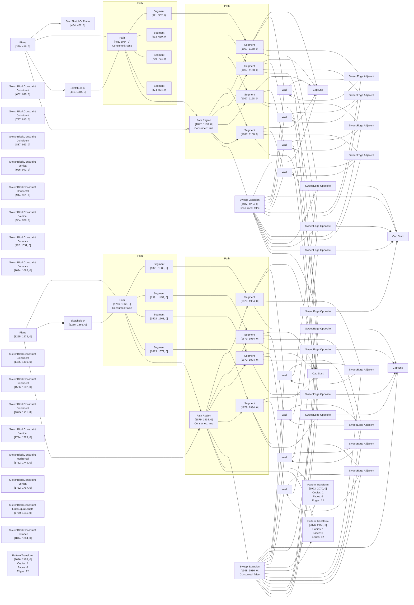

```mermaid
flowchart LR
  subgraph path15 [Path]
    15["Path<br>[481, 1084, 0]<br>Consumed: false"]
      %% [ProgramBodyItem { index: 8 }, VariableDeclarationDeclaration, VariableDeclarationInit]
    17["Segment<br>[521, 582, 0]"]
      %% [ProgramBodyItem { index: 8 }, VariableDeclarationDeclaration, VariableDeclarationInit, SketchBlockBody, SketchBlockBodyItem { index: 0 }, VariableDeclarationDeclaration, VariableDeclarationInit]
    18["Segment<br>[593, 659, 0]"]
      %% [ProgramBodyItem { index: 8 }, VariableDeclarationDeclaration, VariableDeclarationInit, SketchBlockBody, SketchBlockBodyItem { index: 1 }, VariableDeclarationDeclaration, VariableDeclarationInit]
    20["Segment<br>[709, 774, 0]"]
      %% [ProgramBodyItem { index: 8 }, VariableDeclarationDeclaration, VariableDeclarationInit, SketchBlockBody, SketchBlockBodyItem { index: 3 }, VariableDeclarationDeclaration, VariableDeclarationInit]
    22["Segment<br>[824, 884, 0]"]
      %% [ProgramBodyItem { index: 8 }, VariableDeclarationDeclaration, VariableDeclarationInit, SketchBlockBody, SketchBlockBodyItem { index: 5 }, VariableDeclarationDeclaration, VariableDeclarationInit]
  end
  subgraph path29 [Path]
    29["Path Region<br>[1097, 1168, 0]<br>Consumed: true"]
      %% [ProgramBodyItem { index: 9 }, VariableDeclarationDeclaration, VariableDeclarationInit]
    30["Segment<br>[1097, 1168, 0]"]
      %% [ProgramBodyItem { index: 9 }, VariableDeclarationDeclaration, VariableDeclarationInit]
    31["Segment<br>[1097, 1168, 0]"]
      %% [ProgramBodyItem { index: 9 }, VariableDeclarationDeclaration, VariableDeclarationInit]
    32["Segment<br>[1097, 1168, 0]"]
      %% [ProgramBodyItem { index: 9 }, VariableDeclarationDeclaration, VariableDeclarationInit]
    33["Segment<br>[1097, 1168, 0]"]
      %% [ProgramBodyItem { index: 9 }, VariableDeclarationDeclaration, VariableDeclarationInit]
  end
  subgraph path36 [Path]
    36["Path<br>[1286, 1866, 0]<br>Consumed: false"]
      %% [ProgramBodyItem { index: 12 }, VariableDeclarationDeclaration, VariableDeclarationInit]
    38["Segment<br>[1321, 1380, 0]"]
      %% [ProgramBodyItem { index: 12 }, VariableDeclarationDeclaration, VariableDeclarationInit, SketchBlockBody, SketchBlockBodyItem { index: 0 }, VariableDeclarationDeclaration, VariableDeclarationInit]
    39["Segment<br>[1391, 1452, 0]"]
      %% [ProgramBodyItem { index: 12 }, VariableDeclarationDeclaration, VariableDeclarationInit, SketchBlockBody, SketchBlockBodyItem { index: 1 }, VariableDeclarationDeclaration, VariableDeclarationInit]
    41["Segment<br>[1502, 1563, 0]"]
      %% [ProgramBodyItem { index: 12 }, VariableDeclarationDeclaration, VariableDeclarationInit, SketchBlockBody, SketchBlockBodyItem { index: 3 }, VariableDeclarationDeclaration, VariableDeclarationInit]
    43["Segment<br>[1613, 1672, 0]"]
      %% [ProgramBodyItem { index: 12 }, VariableDeclarationDeclaration, VariableDeclarationInit, SketchBlockBody, SketchBlockBodyItem { index: 5 }, VariableDeclarationDeclaration, VariableDeclarationInit]
  end
  subgraph path50 [Path]
    50["Path Region<br>[1879, 1934, 0]<br>Consumed: true"]
      %% [ProgramBodyItem { index: 13 }, VariableDeclarationDeclaration, VariableDeclarationInit]
    51["Segment<br>[1879, 1934, 0]"]
      %% [ProgramBodyItem { index: 13 }, VariableDeclarationDeclaration, VariableDeclarationInit]
    52["Segment<br>[1879, 1934, 0]"]
      %% [ProgramBodyItem { index: 13 }, VariableDeclarationDeclaration, VariableDeclarationInit]
    53["Segment<br>[1879, 1934, 0]"]
      %% [ProgramBodyItem { index: 13 }, VariableDeclarationDeclaration, VariableDeclarationInit]
    54["Segment<br>[1879, 1934, 0]"]
      %% [ProgramBodyItem { index: 13 }, VariableDeclarationDeclaration, VariableDeclarationInit]
  end
  1["Cap End"]
    %% face_code_ref=Missing NodePath
  2["Cap End"]
    %% face_code_ref=Missing NodePath
  3["Cap Start"]
    %% face_code_ref=Missing NodePath
  4["Cap Start"]
    %% face_code_ref=Missing NodePath
  5[Wall]
    %% face_code_ref=Missing NodePath
  6[Wall]
    %% face_code_ref=Missing NodePath
  7[Wall]
    %% face_code_ref=Missing NodePath
  8[Wall]
    %% face_code_ref=Missing NodePath
  9[Wall]
    %% face_code_ref=Missing NodePath
  10[Wall]
    %% face_code_ref=Missing NodePath
  11[Wall]
    %% face_code_ref=Missing NodePath
  12[Wall]
    %% face_code_ref=Missing NodePath
  13["Plane<br>[379, 416, 0]"]
    %% [ProgramBodyItem { index: 6 }, VariableDeclarationDeclaration, VariableDeclarationInit]
  14["StartSketchOnPlane<br>[434, 462, 0]"]
    %% [ProgramBodyItem { index: 7 }, VariableDeclarationDeclaration, VariableDeclarationInit]
  16["SketchBlock<br>[481, 1084, 0]"]
    %% [ProgramBodyItem { index: 8 }, VariableDeclarationDeclaration, VariableDeclarationInit]
  19["SketchBlockConstraint Coincident<br>[662, 698, 0]"]
    %% [ProgramBodyItem { index: 8 }, VariableDeclarationDeclaration, VariableDeclarationInit, SketchBlockBody, SketchBlockBodyItem { index: 2 }, ExpressionStatementExpr]
  21["SketchBlockConstraint Coincident<br>[777, 813, 0]"]
    %% [ProgramBodyItem { index: 8 }, VariableDeclarationDeclaration, VariableDeclarationInit, SketchBlockBody, SketchBlockBodyItem { index: 4 }, ExpressionStatementExpr]
  23["SketchBlockConstraint Coincident<br>[887, 923, 0]"]
    %% [ProgramBodyItem { index: 8 }, VariableDeclarationDeclaration, VariableDeclarationInit, SketchBlockBody, SketchBlockBodyItem { index: 6 }, ExpressionStatementExpr]
  24["SketchBlockConstraint Vertical<br>[926, 941, 0]"]
    %% [ProgramBodyItem { index: 8 }, VariableDeclarationDeclaration, VariableDeclarationInit, SketchBlockBody, SketchBlockBodyItem { index: 7 }, ExpressionStatementExpr]
  25["SketchBlockConstraint Horizontal<br>[944, 961, 0]"]
    %% [ProgramBodyItem { index: 8 }, VariableDeclarationDeclaration, VariableDeclarationInit, SketchBlockBody, SketchBlockBodyItem { index: 8 }, ExpressionStatementExpr]
  26["SketchBlockConstraint Vertical<br>[964, 979, 0]"]
    %% [ProgramBodyItem { index: 8 }, VariableDeclarationDeclaration, VariableDeclarationInit, SketchBlockBody, SketchBlockBodyItem { index: 9 }, ExpressionStatementExpr]
  27["SketchBlockConstraint Distance<br>[982, 1031, 0]"]
    %% [ProgramBodyItem { index: 8 }, VariableDeclarationDeclaration, VariableDeclarationInit, SketchBlockBody, SketchBlockBodyItem { index: 10 }, ExpressionStatementExpr]
  28["SketchBlockConstraint Distance<br>[1034, 1082, 0]"]
    %% [ProgramBodyItem { index: 8 }, VariableDeclarationDeclaration, VariableDeclarationInit, SketchBlockBody, SketchBlockBodyItem { index: 11 }, ExpressionStatementExpr]
  34["Sweep Extrusion<br>[1187, 1234, 0]<br>Consumed: false"]
    %% [ProgramBodyItem { index: 10 }, VariableDeclarationDeclaration, VariableDeclarationInit]
  35["Plane<br>[1255, 1272, 0]"]
    %% [ProgramBodyItem { index: 11 }, VariableDeclarationDeclaration, VariableDeclarationInit]
  37["SketchBlock<br>[1286, 1866, 0]"]
    %% [ProgramBodyItem { index: 12 }, VariableDeclarationDeclaration, VariableDeclarationInit]
  40["SketchBlockConstraint Coincident<br>[1455, 1491, 0]"]
    %% [ProgramBodyItem { index: 12 }, VariableDeclarationDeclaration, VariableDeclarationInit, SketchBlockBody, SketchBlockBodyItem { index: 2 }, ExpressionStatementExpr]
  42["SketchBlockConstraint Coincident<br>[1566, 1602, 0]"]
    %% [ProgramBodyItem { index: 12 }, VariableDeclarationDeclaration, VariableDeclarationInit, SketchBlockBody, SketchBlockBodyItem { index: 4 }, ExpressionStatementExpr]
  44["SketchBlockConstraint Coincident<br>[1675, 1711, 0]"]
    %% [ProgramBodyItem { index: 12 }, VariableDeclarationDeclaration, VariableDeclarationInit, SketchBlockBody, SketchBlockBodyItem { index: 6 }, ExpressionStatementExpr]
  45["SketchBlockConstraint Vertical<br>[1714, 1729, 0]"]
    %% [ProgramBodyItem { index: 12 }, VariableDeclarationDeclaration, VariableDeclarationInit, SketchBlockBody, SketchBlockBodyItem { index: 7 }, ExpressionStatementExpr]
  46["SketchBlockConstraint Horizontal<br>[1732, 1749, 0]"]
    %% [ProgramBodyItem { index: 12 }, VariableDeclarationDeclaration, VariableDeclarationInit, SketchBlockBody, SketchBlockBodyItem { index: 8 }, ExpressionStatementExpr]
  47["SketchBlockConstraint Vertical<br>[1752, 1767, 0]"]
    %% [ProgramBodyItem { index: 12 }, VariableDeclarationDeclaration, VariableDeclarationInit, SketchBlockBody, SketchBlockBodyItem { index: 9 }, ExpressionStatementExpr]
  48["SketchBlockConstraint LinesEqualLength<br>[1770, 1811, 0]"]
    %% [ProgramBodyItem { index: 12 }, VariableDeclarationDeclaration, VariableDeclarationInit, SketchBlockBody, SketchBlockBodyItem { index: 10 }, ExpressionStatementExpr]
  49["SketchBlockConstraint Distance<br>[1814, 1864, 0]"]
    %% [ProgramBodyItem { index: 12 }, VariableDeclarationDeclaration, VariableDeclarationInit, SketchBlockBody, SketchBlockBodyItem { index: 11 }, ExpressionStatementExpr]
  55["Sweep Extrusion<br>[1948, 1986, 0]<br>Consumed: false"]
    %% [ProgramBodyItem { index: 14 }, VariableDeclarationDeclaration, VariableDeclarationInit, PipeBodyItem { index: 0 }]
  56["Pattern Transform<br>[1992, 2070, 0]<br>Copies: 1<br>Faces: 6<br>Edges: 12"]
    %% [ProgramBodyItem { index: 14 }, VariableDeclarationDeclaration, VariableDeclarationInit, PipeBodyItem { index: 1 }]
  57["Pattern Transform<br>[2076, 2155, 0]<br>Copies: 1<br>Faces: 6<br>Edges: 12"]
    %% [ProgramBodyItem { index: 14 }, VariableDeclarationDeclaration, VariableDeclarationInit, PipeBodyItem { index: 2 }]
  58["Pattern Transform<br>[2076, 2155, 0]<br>Copies: 1<br>Faces: 6<br>Edges: 12"]
    %% [ProgramBodyItem { index: 14 }, VariableDeclarationDeclaration, VariableDeclarationInit, PipeBodyItem { index: 2 }]
  59["SweepEdge Adjacent"]
  60["SweepEdge Adjacent"]
  61["SweepEdge Adjacent"]
  62["SweepEdge Adjacent"]
  63["SweepEdge Adjacent"]
  64["SweepEdge Adjacent"]
  65["SweepEdge Adjacent"]
  66["SweepEdge Adjacent"]
  67["SweepEdge Opposite"]
  68["SweepEdge Opposite"]
  69["SweepEdge Opposite"]
  70["SweepEdge Opposite"]
  71["SweepEdge Opposite"]
  72["SweepEdge Opposite"]
  73["SweepEdge Opposite"]
  74["SweepEdge Opposite"]
  30 <--x 1
  31 <--x 1
  32 <--x 1
  33 <--x 1
  34 --- 1
  55 --- 2
  67 <--x 2
  68 <--x 2
  69 <--x 2
  70 <--x 2
  34 --- 3
  71 <--x 3
  72 <--x 3
  73 <--x 3
  74 <--x 3
  51 <--x 4
  52 <--x 4
  53 <--x 4
  54 <--x 4
  55 --- 4
  30 --- 5
  34 --- 5
  5 --- 59
  59 <--x 5
  5 --- 67
  31 --- 6
  34 --- 6
  6 --- 60
  60 <--x 6
  6 --- 68
  32 --- 7
  34 --- 7
  7 --- 61
  61 <--x 7
  7 --- 69
  33 --- 8
  34 --- 8
  8 --- 62
  62 <--x 8
  8 --- 70
  51 --- 9
  55 --- 9
  9 --- 63
  63 <--x 9
  9 --- 71
  52 --- 10
  55 --- 10
  10 --- 64
  64 <--x 10
  10 --- 72
  53 --- 11
  55 --- 11
  11 --- 65
  65 <--x 11
  11 --- 73
  54 --- 12
  55 --- 12
  12 --- 66
  66 <--x 12
  12 --- 74
  13 <--x 14
  13 --- 15
  13 <--x 16
  13 <--x 29
  16 --- 15
  15 --- 17
  15 --- 18
  15 --- 20
  15 --- 22
  15 <--x 29
  17 <--x 30
  18 <--x 31
  20 <--x 32
  22 <--x 33
  29 <--x 30
  29 <--x 31
  29 <--x 32
  29 <--x 33
  29 ---- 34
  30 --- 59
  30 --- 71
  31 --- 60
  31 --- 72
  32 --- 61
  32 --- 73
  33 --- 62
  33 --- 74
  34 --- 59
  34 --- 60
  34 --- 61
  34 --- 62
  34 --- 71
  34 --- 72
  34 --- 73
  34 --- 74
  35 --- 36
  35 <--x 37
  35 <--x 50
  37 --- 36
  36 --- 38
  36 --- 39
  36 --- 41
  36 --- 43
  36 <--x 50
  38 <--x 51
  39 <--x 52
  41 <--x 53
  43 <--x 54
  50 <--x 51
  50 <--x 52
  50 <--x 53
  50 <--x 54
  50 ---- 55
  50 --- 56
  50 --- 58
  51 --- 63
  51 --- 67
  52 --- 64
  52 --- 68
  53 --- 65
  53 --- 69
  54 --- 66
  54 --- 70
  55 x--> 56
  55 x--> 58
  55 --- 63
  55 --- 64
  55 --- 65
  55 --- 66
  55 --- 67
  55 --- 68
  55 --- 69
  55 --- 70
```
