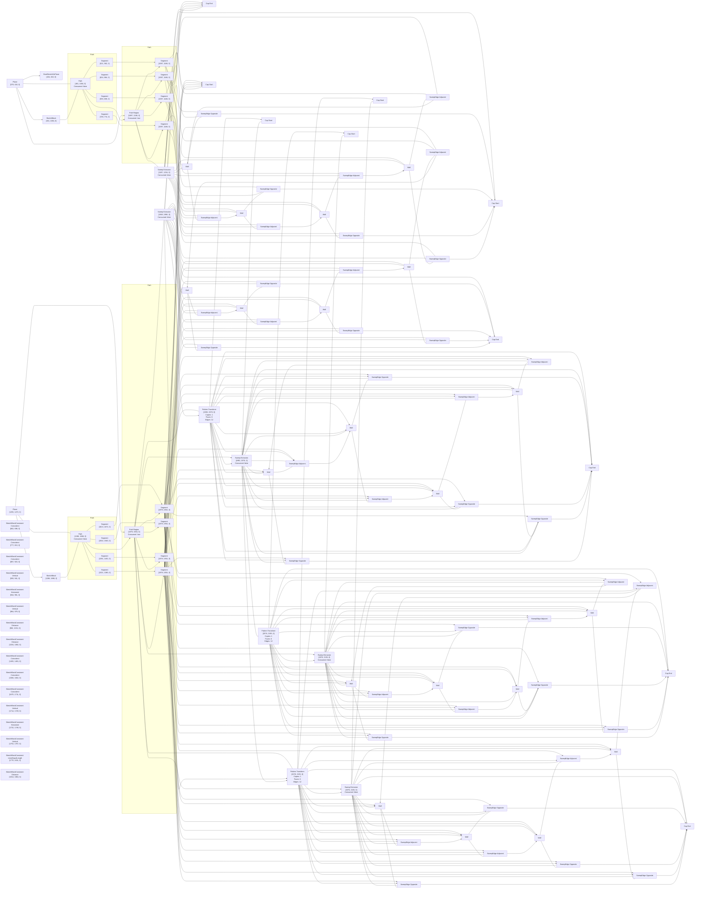

```mermaid
flowchart LR
  subgraph path2 [Path]
    2["Path<br>[481, 1084, 0]<br>Consumed: false"]
      %% [ProgramBodyItem { index: 8 }, VariableDeclarationDeclaration, VariableDeclarationInit]
    3["Segment<br>[521, 582, 0]"]
      %% [ProgramBodyItem { index: 8 }, VariableDeclarationDeclaration, VariableDeclarationInit, SketchBlockBody, SketchBlockBodyItem { index: 0 }, VariableDeclarationDeclaration, VariableDeclarationInit]
    4["Segment<br>[593, 659, 0]"]
      %% [ProgramBodyItem { index: 8 }, VariableDeclarationDeclaration, VariableDeclarationInit, SketchBlockBody, SketchBlockBodyItem { index: 1 }, VariableDeclarationDeclaration, VariableDeclarationInit]
    5["Segment<br>[709, 774, 0]"]
      %% [ProgramBodyItem { index: 8 }, VariableDeclarationDeclaration, VariableDeclarationInit, SketchBlockBody, SketchBlockBodyItem { index: 3 }, VariableDeclarationDeclaration, VariableDeclarationInit]
    6["Segment<br>[824, 884, 0]"]
      %% [ProgramBodyItem { index: 8 }, VariableDeclarationDeclaration, VariableDeclarationInit, SketchBlockBody, SketchBlockBodyItem { index: 5 }, VariableDeclarationDeclaration, VariableDeclarationInit]
  end
  subgraph path7 [Path]
    7["Path Region<br>[1097, 1168, 0]<br>Consumed: true"]
      %% [ProgramBodyItem { index: 9 }, VariableDeclarationDeclaration, VariableDeclarationInit]
    8["Segment<br>[1097, 1168, 0]"]
      %% [ProgramBodyItem { index: 9 }, VariableDeclarationDeclaration, VariableDeclarationInit]
    9["Segment<br>[1097, 1168, 0]"]
      %% [ProgramBodyItem { index: 9 }, VariableDeclarationDeclaration, VariableDeclarationInit]
    10["Segment<br>[1097, 1168, 0]"]
      %% [ProgramBodyItem { index: 9 }, VariableDeclarationDeclaration, VariableDeclarationInit]
    11["Segment<br>[1097, 1168, 0]"]
      %% [ProgramBodyItem { index: 9 }, VariableDeclarationDeclaration, VariableDeclarationInit]
  end
  subgraph path28 [Path]
    28["Path<br>[1286, 1866, 0]<br>Consumed: false"]
      %% [ProgramBodyItem { index: 12 }, VariableDeclarationDeclaration, VariableDeclarationInit]
    29["Segment<br>[1321, 1380, 0]"]
      %% [ProgramBodyItem { index: 12 }, VariableDeclarationDeclaration, VariableDeclarationInit, SketchBlockBody, SketchBlockBodyItem { index: 0 }, VariableDeclarationDeclaration, VariableDeclarationInit]
    30["Segment<br>[1391, 1452, 0]"]
      %% [ProgramBodyItem { index: 12 }, VariableDeclarationDeclaration, VariableDeclarationInit, SketchBlockBody, SketchBlockBodyItem { index: 1 }, VariableDeclarationDeclaration, VariableDeclarationInit]
    31["Segment<br>[1502, 1563, 0]"]
      %% [ProgramBodyItem { index: 12 }, VariableDeclarationDeclaration, VariableDeclarationInit, SketchBlockBody, SketchBlockBodyItem { index: 3 }, VariableDeclarationDeclaration, VariableDeclarationInit]
    32["Segment<br>[1613, 1672, 0]"]
      %% [ProgramBodyItem { index: 12 }, VariableDeclarationDeclaration, VariableDeclarationInit, SketchBlockBody, SketchBlockBodyItem { index: 5 }, VariableDeclarationDeclaration, VariableDeclarationInit]
  end
  subgraph path33 [Path]
    33["Path Region<br>[1879, 1934, 0]<br>Consumed: true"]
      %% [ProgramBodyItem { index: 13 }, VariableDeclarationDeclaration, VariableDeclarationInit]
    34["Segment<br>[1879, 1934, 0]"]
      %% [ProgramBodyItem { index: 13 }, VariableDeclarationDeclaration, VariableDeclarationInit]
    35["Segment<br>[1879, 1934, 0]"]
      %% [ProgramBodyItem { index: 13 }, VariableDeclarationDeclaration, VariableDeclarationInit]
    36["Segment<br>[1879, 1934, 0]"]
      %% [ProgramBodyItem { index: 13 }, VariableDeclarationDeclaration, VariableDeclarationInit]
    37["Segment<br>[1879, 1934, 0]"]
      %% [ProgramBodyItem { index: 13 }, VariableDeclarationDeclaration, VariableDeclarationInit]
  end
  1["Plane<br>[379, 416, 0]"]
    %% [ProgramBodyItem { index: 6 }, VariableDeclarationDeclaration, VariableDeclarationInit]
  12["Sweep Extrusion<br>[1187, 1234, 0]<br>Consumed: false"]
    %% [ProgramBodyItem { index: 10 }, VariableDeclarationDeclaration, VariableDeclarationInit]
  13[Wall]
    %% face_code_ref=Missing NodePath
  14[Wall]
    %% face_code_ref=Missing NodePath
  15[Wall]
    %% face_code_ref=Missing NodePath
  16[Wall]
    %% face_code_ref=Missing NodePath
  17["Cap Start"]
    %% face_code_ref=Missing NodePath
  18["Cap End"]
    %% face_code_ref=Missing NodePath
  19["SweepEdge Opposite"]
  20["SweepEdge Adjacent"]
  21["SweepEdge Opposite"]
  22["SweepEdge Adjacent"]
  23["SweepEdge Opposite"]
  24["SweepEdge Adjacent"]
  25["SweepEdge Opposite"]
  26["SweepEdge Adjacent"]
  27["Plane<br>[1255, 1272, 0]"]
    %% [ProgramBodyItem { index: 11 }, VariableDeclarationDeclaration, VariableDeclarationInit]
  38["Sweep Extrusion<br>[1948, 1986, 0]<br>Consumed: false"]
    %% [ProgramBodyItem { index: 14 }, VariableDeclarationDeclaration, VariableDeclarationInit, PipeBodyItem { index: 0 }]
  39[Wall]
    %% face_code_ref=Missing NodePath
  40[Wall]
    %% face_code_ref=Missing NodePath
  41[Wall]
    %% face_code_ref=Missing NodePath
  42[Wall]
    %% face_code_ref=Missing NodePath
  43["Cap Start"]
    %% face_code_ref=Missing NodePath
  44["Cap End"]
    %% face_code_ref=Missing NodePath
  45["SweepEdge Opposite"]
  46["SweepEdge Adjacent"]
  47["SweepEdge Opposite"]
  48["SweepEdge Adjacent"]
  49["SweepEdge Opposite"]
  50["SweepEdge Adjacent"]
  51["SweepEdge Opposite"]
  52["SweepEdge Adjacent"]
  53["Pattern Transform<br>[1992, 2070, 0]<br>Copies: 1<br>Faces: 6<br>Edges: 12"]
    %% [ProgramBodyItem { index: 14 }, VariableDeclarationDeclaration, VariableDeclarationInit, PipeBodyItem { index: 1 }]
  54["Sweep Extrusion<br>[1992, 2070, 0]<br>Consumed: false"]
    %% [ProgramBodyItem { index: 14 }, VariableDeclarationDeclaration, VariableDeclarationInit, PipeBodyItem { index: 1 }]
  55[Wall]
    %% face_code_ref=Missing NodePath
  56[Wall]
    %% face_code_ref=Missing NodePath
  57[Wall]
    %% face_code_ref=Missing NodePath
  58[Wall]
    %% face_code_ref=Missing NodePath
  59["Cap Start"]
    %% face_code_ref=Missing NodePath
  60["Cap End"]
    %% face_code_ref=Missing NodePath
  61["SweepEdge Opposite"]
  62["SweepEdge Adjacent"]
  63["SweepEdge Opposite"]
  64["SweepEdge Adjacent"]
  65["SweepEdge Opposite"]
  66["SweepEdge Adjacent"]
  67["SweepEdge Opposite"]
  68["SweepEdge Adjacent"]
  69["Pattern Transform<br>[2076, 2155, 0]<br>Copies: 1<br>Faces: 6<br>Edges: 12"]
    %% [ProgramBodyItem { index: 14 }, VariableDeclarationDeclaration, VariableDeclarationInit, PipeBodyItem { index: 2 }]
  70["Sweep Extrusion<br>[2076, 2155, 0]<br>Consumed: false"]
    %% [ProgramBodyItem { index: 14 }, VariableDeclarationDeclaration, VariableDeclarationInit, PipeBodyItem { index: 2 }]
  71[Wall]
    %% face_code_ref=Missing NodePath
  72[Wall]
    %% face_code_ref=Missing NodePath
  73[Wall]
    %% face_code_ref=Missing NodePath
  74[Wall]
    %% face_code_ref=Missing NodePath
  75["Cap Start"]
    %% face_code_ref=Missing NodePath
  76["Cap End"]
    %% face_code_ref=Missing NodePath
  77["SweepEdge Opposite"]
  78["SweepEdge Adjacent"]
  79["SweepEdge Opposite"]
  80["SweepEdge Adjacent"]
  81["SweepEdge Opposite"]
  82["SweepEdge Adjacent"]
  83["SweepEdge Opposite"]
  84["SweepEdge Adjacent"]
  85["Pattern Transform<br>[2076, 2155, 0]<br>Copies: 1<br>Faces: 6<br>Edges: 12"]
    %% [ProgramBodyItem { index: 14 }, VariableDeclarationDeclaration, VariableDeclarationInit, PipeBodyItem { index: 2 }]
  86["Sweep Extrusion<br>[2076, 2155, 0]<br>Consumed: false"]
    %% [ProgramBodyItem { index: 14 }, VariableDeclarationDeclaration, VariableDeclarationInit, PipeBodyItem { index: 2 }]
  87[Wall]
    %% face_code_ref=Missing NodePath
  88[Wall]
    %% face_code_ref=Missing NodePath
  89[Wall]
    %% face_code_ref=Missing NodePath
  90[Wall]
    %% face_code_ref=Missing NodePath
  91["Cap Start"]
    %% face_code_ref=Missing NodePath
  92["Cap End"]
    %% face_code_ref=Missing NodePath
  93["SweepEdge Opposite"]
  94["SweepEdge Adjacent"]
  95["SweepEdge Opposite"]
  96["SweepEdge Adjacent"]
  97["SweepEdge Opposite"]
  98["SweepEdge Adjacent"]
  99["SweepEdge Opposite"]
  100["SweepEdge Adjacent"]
  101["StartSketchOnPlane<br>[434, 462, 0]"]
    %% [ProgramBodyItem { index: 7 }, VariableDeclarationDeclaration, VariableDeclarationInit]
  102["SketchBlock<br>[481, 1084, 0]"]
    %% [ProgramBodyItem { index: 8 }, VariableDeclarationDeclaration, VariableDeclarationInit]
  103["SketchBlockConstraint Coincident<br>[662, 698, 0]"]
    %% [ProgramBodyItem { index: 8 }, VariableDeclarationDeclaration, VariableDeclarationInit, SketchBlockBody, SketchBlockBodyItem { index: 2 }, ExpressionStatementExpr]
  104["SketchBlockConstraint Coincident<br>[777, 813, 0]"]
    %% [ProgramBodyItem { index: 8 }, VariableDeclarationDeclaration, VariableDeclarationInit, SketchBlockBody, SketchBlockBodyItem { index: 4 }, ExpressionStatementExpr]
  105["SketchBlockConstraint Coincident<br>[887, 923, 0]"]
    %% [ProgramBodyItem { index: 8 }, VariableDeclarationDeclaration, VariableDeclarationInit, SketchBlockBody, SketchBlockBodyItem { index: 6 }, ExpressionStatementExpr]
  106["SketchBlockConstraint Vertical<br>[926, 941, 0]"]
    %% [ProgramBodyItem { index: 8 }, VariableDeclarationDeclaration, VariableDeclarationInit, SketchBlockBody, SketchBlockBodyItem { index: 7 }, ExpressionStatementExpr]
  107["SketchBlockConstraint Horizontal<br>[944, 961, 0]"]
    %% [ProgramBodyItem { index: 8 }, VariableDeclarationDeclaration, VariableDeclarationInit, SketchBlockBody, SketchBlockBodyItem { index: 8 }, ExpressionStatementExpr]
  108["SketchBlockConstraint Vertical<br>[964, 979, 0]"]
    %% [ProgramBodyItem { index: 8 }, VariableDeclarationDeclaration, VariableDeclarationInit, SketchBlockBody, SketchBlockBodyItem { index: 9 }, ExpressionStatementExpr]
  109["SketchBlockConstraint Distance<br>[982, 1031, 0]"]
    %% [ProgramBodyItem { index: 8 }, VariableDeclarationDeclaration, VariableDeclarationInit, SketchBlockBody, SketchBlockBodyItem { index: 10 }, ExpressionStatementExpr]
  110["SketchBlockConstraint Distance<br>[1034, 1082, 0]"]
    %% [ProgramBodyItem { index: 8 }, VariableDeclarationDeclaration, VariableDeclarationInit, SketchBlockBody, SketchBlockBodyItem { index: 11 }, ExpressionStatementExpr]
  111["SketchBlock<br>[1286, 1866, 0]"]
    %% [ProgramBodyItem { index: 12 }, VariableDeclarationDeclaration, VariableDeclarationInit]
  112["SketchBlockConstraint Coincident<br>[1455, 1491, 0]"]
    %% [ProgramBodyItem { index: 12 }, VariableDeclarationDeclaration, VariableDeclarationInit, SketchBlockBody, SketchBlockBodyItem { index: 2 }, ExpressionStatementExpr]
  113["SketchBlockConstraint Coincident<br>[1566, 1602, 0]"]
    %% [ProgramBodyItem { index: 12 }, VariableDeclarationDeclaration, VariableDeclarationInit, SketchBlockBody, SketchBlockBodyItem { index: 4 }, ExpressionStatementExpr]
  114["SketchBlockConstraint Coincident<br>[1675, 1711, 0]"]
    %% [ProgramBodyItem { index: 12 }, VariableDeclarationDeclaration, VariableDeclarationInit, SketchBlockBody, SketchBlockBodyItem { index: 6 }, ExpressionStatementExpr]
  115["SketchBlockConstraint Vertical<br>[1714, 1729, 0]"]
    %% [ProgramBodyItem { index: 12 }, VariableDeclarationDeclaration, VariableDeclarationInit, SketchBlockBody, SketchBlockBodyItem { index: 7 }, ExpressionStatementExpr]
  116["SketchBlockConstraint Horizontal<br>[1732, 1749, 0]"]
    %% [ProgramBodyItem { index: 12 }, VariableDeclarationDeclaration, VariableDeclarationInit, SketchBlockBody, SketchBlockBodyItem { index: 8 }, ExpressionStatementExpr]
  117["SketchBlockConstraint Vertical<br>[1752, 1767, 0]"]
    %% [ProgramBodyItem { index: 12 }, VariableDeclarationDeclaration, VariableDeclarationInit, SketchBlockBody, SketchBlockBodyItem { index: 9 }, ExpressionStatementExpr]
  118["SketchBlockConstraint LinesEqualLength<br>[1770, 1811, 0]"]
    %% [ProgramBodyItem { index: 12 }, VariableDeclarationDeclaration, VariableDeclarationInit, SketchBlockBody, SketchBlockBodyItem { index: 10 }, ExpressionStatementExpr]
  119["SketchBlockConstraint Distance<br>[1814, 1864, 0]"]
    %% [ProgramBodyItem { index: 12 }, VariableDeclarationDeclaration, VariableDeclarationInit, SketchBlockBody, SketchBlockBodyItem { index: 11 }, ExpressionStatementExpr]
  1 --- 2
  1 <--x 7
  1 <--x 101
  1 <--x 102
  2 --- 3
  2 --- 4
  2 --- 5
  2 --- 6
  2 <--x 7
  102 --- 2
  3 <--x 8
  4 <--x 9
  5 <--x 10
  6 <--x 11
  7 <--x 8
  7 <--x 9
  7 <--x 10
  7 <--x 11
  7 ---- 12
  8 --- 13
  8 x--> 18
  8 --- 19
  8 --- 20
  9 --- 14
  9 x--> 18
  9 --- 21
  9 --- 22
  10 --- 15
  10 x--> 18
  10 --- 23
  10 --- 24
  11 --- 16
  11 x--> 18
  11 --- 25
  11 --- 26
  12 --- 13
  12 --- 14
  12 --- 15
  12 --- 16
  12 --- 17
  12 --- 18
  12 --- 19
  12 --- 20
  12 --- 21
  12 --- 22
  12 --- 23
  12 --- 24
  12 --- 25
  12 --- 26
  13 --- 19
  13 --- 20
  26 <--x 13
  20 <--x 14
  14 --- 21
  14 --- 22
  22 <--x 15
  15 --- 23
  15 --- 24
  24 <--x 16
  16 --- 25
  16 --- 26
  19 <--x 17
  21 <--x 17
  23 <--x 17
  25 <--x 17
  27 --- 28
  27 <--x 33
  27 <--x 111
  28 --- 29
  28 --- 30
  28 --- 31
  28 --- 32
  28 <--x 33
  111 --- 28
  29 <--x 34
  30 <--x 35
  31 <--x 36
  32 <--x 37
  33 <--x 34
  33 <--x 35
  33 <--x 36
  33 <--x 37
  33 ---- 38
  33 --- 53
  33 <---x 54
  33 --- 69
  33 <---x 70
  33 <---x 86
  34 --- 42
  34 x--> 43
  34 --- 51
  34 --- 52
  34 <--x 58
  34 <--x 67
  34 <--x 68
  34 <--x 74
  34 <--x 83
  34 <--x 84
  34 <--x 90
  34 <--x 99
  34 <--x 100
  35 --- 39
  35 x--> 43
  35 --- 45
  35 --- 46
  35 <--x 55
  35 <--x 61
  35 <--x 62
  35 <--x 71
  35 <--x 77
  35 <--x 78
  35 <--x 87
  35 <--x 93
  35 <--x 94
  36 --- 40
  36 x--> 43
  36 --- 47
  36 --- 48
  36 <--x 56
  36 <--x 63
  36 <--x 64
  36 <--x 72
  36 <--x 79
  36 <--x 80
  36 <--x 88
  36 <--x 95
  36 <--x 96
  37 --- 41
  37 x--> 43
  37 --- 49
  37 --- 50
  37 <--x 57
  37 <--x 65
  37 <--x 66
  37 <--x 73
  37 <--x 81
  37 <--x 82
  37 <--x 89
  37 <--x 97
  37 <--x 98
  38 --- 39
  38 --- 40
  38 --- 41
  38 --- 42
  38 --- 43
  38 --- 44
  38 --- 45
  38 --- 46
  38 --- 47
  38 --- 48
  38 --- 49
  38 --- 50
  38 --- 51
  38 --- 52
  38 x--> 53
  38 x--> 69
  39 --- 45
  39 --- 46
  52 <--x 39
  46 <--x 40
  40 --- 47
  40 --- 48
  48 <--x 41
  41 --- 49
  41 --- 50
  50 <--x 42
  42 --- 51
  42 --- 52
  45 <--x 44
  47 <--x 44
  49 <--x 44
  51 <--x 44
  53 x--> 54
  53 x--> 55
  53 x--> 56
  53 x--> 57
  53 x--> 58
  53 x--> 59
  53 x--> 60
  53 x--> 61
  53 x--> 62
  53 x--> 63
  53 x--> 64
  53 x--> 65
  53 x--> 66
  53 x--> 67
  53 x--> 68
  54 --- 55
  54 --- 56
  54 --- 57
  54 --- 58
  54 --- 59
  54 --- 60
  54 --- 61
  54 --- 62
  54 --- 63
  54 --- 64
  54 --- 65
  54 --- 66
  54 --- 67
  54 --- 68
  54 x--> 69
  54 --- 85
  55 --- 61
  55 --- 62
  68 <--x 55
  62 <--x 56
  56 --- 63
  56 --- 64
  64 <--x 57
  57 --- 65
  57 --- 66
  66 <--x 58
  58 --- 67
  58 --- 68
  61 <--x 60
  63 <--x 60
  65 <--x 60
  67 <--x 60
  69 x--> 70
  69 x--> 71
  69 x--> 72
  69 x--> 73
  69 x--> 74
  69 x--> 75
  69 x--> 76
  69 x--> 77
  69 x--> 78
  69 x--> 79
  69 x--> 80
  69 x--> 81
  69 x--> 82
  69 x--> 83
  69 x--> 84
  70 --- 71
  70 --- 72
  70 --- 73
  70 --- 74
  70 --- 75
  70 --- 76
  70 --- 77
  70 --- 78
  70 --- 79
  70 --- 80
  70 --- 81
  70 --- 82
  70 --- 83
  70 --- 84
  71 --- 77
  71 --- 78
  84 <--x 71
  78 <--x 72
  72 --- 79
  72 --- 80
  80 <--x 73
  73 --- 81
  73 --- 82
  82 <--x 74
  74 --- 83
  74 --- 84
  77 <--x 76
  79 <--x 76
  81 <--x 76
  83 <--x 76
  85 x--> 86
  85 x--> 87
  85 x--> 88
  85 x--> 89
  85 x--> 90
  85 x--> 91
  85 x--> 92
  85 x--> 93
  85 x--> 94
  85 x--> 95
  85 x--> 96
  85 x--> 97
  85 x--> 98
  85 x--> 99
  85 x--> 100
  86 --- 87
  86 --- 88
  86 --- 89
  86 --- 90
  86 --- 91
  86 --- 92
  86 --- 93
  86 --- 94
  86 --- 95
  86 --- 96
  86 --- 97
  86 --- 98
  86 --- 99
  86 --- 100
  87 --- 93
  87 --- 94
  100 <--x 87
  94 <--x 88
  88 --- 95
  88 --- 96
  96 <--x 89
  89 --- 97
  89 --- 98
  98 <--x 90
  90 --- 99
  90 --- 100
  93 <--x 92
  95 <--x 92
  97 <--x 92
  99 <--x 92
```
