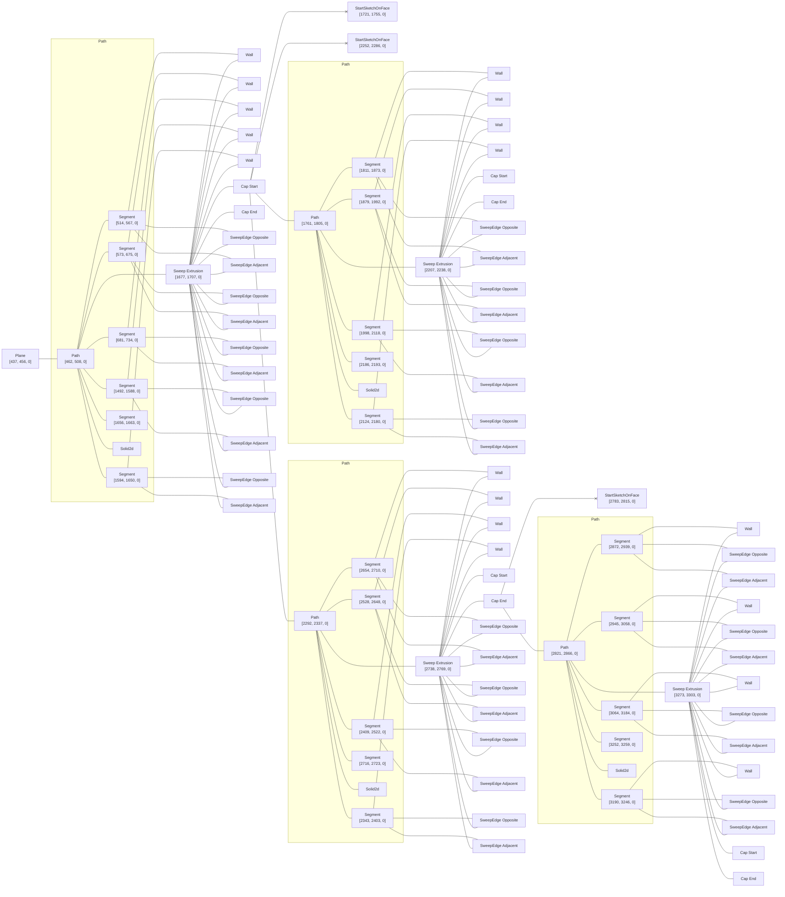

```mermaid
flowchart LR
  subgraph path2 [Path]
    2["Path<br>[462, 508, 0]"]
    3["Segment<br>[514, 567, 0]"]
    4["Segment<br>[573, 675, 0]"]
    5["Segment<br>[681, 734, 0]"]
    6["Segment<br>[1492, 1588, 0]"]
    7["Segment<br>[1594, 1650, 0]"]
    8["Segment<br>[1656, 1663, 0]"]
    9[Solid2d]
  end
  subgraph path28 [Path]
    28["Path<br>[1761, 1805, 0]"]
    29["Segment<br>[1811, 1873, 0]"]
    30["Segment<br>[1879, 1992, 0]"]
    31["Segment<br>[1998, 2118, 0]"]
    32["Segment<br>[2124, 2180, 0]"]
    33["Segment<br>[2186, 2193, 0]"]
    34[Solid2d]
  end
  subgraph path50 [Path]
    50["Path<br>[2292, 2337, 0]"]
    51["Segment<br>[2343, 2403, 0]"]
    52["Segment<br>[2409, 2522, 0]"]
    53["Segment<br>[2528, 2648, 0]"]
    54["Segment<br>[2654, 2710, 0]"]
    55["Segment<br>[2716, 2723, 0]"]
    56[Solid2d]
  end
  subgraph path72 [Path]
    72["Path<br>[2821, 2866, 0]"]
    73["Segment<br>[2872, 2939, 0]"]
    74["Segment<br>[2945, 3058, 0]"]
    75["Segment<br>[3064, 3184, 0]"]
    76["Segment<br>[3190, 3246, 0]"]
    77["Segment<br>[3252, 3259, 0]"]
    78[Solid2d]
  end
  1["Plane<br>[437, 456, 0]"]
  10["Sweep Extrusion<br>[1677, 1707, 0]"]
  11[Wall]
  12[Wall]
  13[Wall]
  14[Wall]
  15[Wall]
  16["Cap Start"]
  17["Cap End"]
  18["SweepEdge Opposite"]
  19["SweepEdge Adjacent"]
  20["SweepEdge Opposite"]
  21["SweepEdge Adjacent"]
  22["SweepEdge Opposite"]
  23["SweepEdge Adjacent"]
  24["SweepEdge Opposite"]
  25["SweepEdge Adjacent"]
  26["SweepEdge Opposite"]
  27["SweepEdge Adjacent"]
  35["Sweep Extrusion<br>[2207, 2238, 0]"]
  36[Wall]
  37[Wall]
  38[Wall]
  39[Wall]
  40["Cap Start"]
  41["Cap End"]
  42["SweepEdge Opposite"]
  43["SweepEdge Adjacent"]
  44["SweepEdge Opposite"]
  45["SweepEdge Adjacent"]
  46["SweepEdge Opposite"]
  47["SweepEdge Adjacent"]
  48["SweepEdge Opposite"]
  49["SweepEdge Adjacent"]
  57["Sweep Extrusion<br>[2738, 2769, 0]"]
  58[Wall]
  59[Wall]
  60[Wall]
  61[Wall]
  62["Cap Start"]
  63["Cap End"]
  64["SweepEdge Opposite"]
  65["SweepEdge Adjacent"]
  66["SweepEdge Opposite"]
  67["SweepEdge Adjacent"]
  68["SweepEdge Opposite"]
  69["SweepEdge Adjacent"]
  70["SweepEdge Opposite"]
  71["SweepEdge Adjacent"]
  79["Sweep Extrusion<br>[3273, 3303, 0]"]
  80[Wall]
  81[Wall]
  82[Wall]
  83[Wall]
  84["Cap Start"]
  85["Cap End"]
  86["SweepEdge Opposite"]
  87["SweepEdge Adjacent"]
  88["SweepEdge Opposite"]
  89["SweepEdge Adjacent"]
  90["SweepEdge Opposite"]
  91["SweepEdge Adjacent"]
  92["SweepEdge Opposite"]
  93["SweepEdge Adjacent"]
  94["StartSketchOnFace<br>[1721, 1755, 0]"]
  95["StartSketchOnFace<br>[2252, 2286, 0]"]
  96["StartSketchOnFace<br>[2783, 2815, 0]"]
  1 --- 2
  2 --- 3
  2 --- 4
  2 --- 5
  2 --- 6
  2 --- 7
  2 --- 8
  2 ---- 10
  2 --- 9
  3 --- 11
  3 --- 18
  3 --- 19
  4 --- 12
  4 --- 20
  4 --- 21
  5 --- 13
  5 --- 22
  5 --- 23
  6 --- 14
  6 --- 24
  6 --- 25
  7 --- 15
  7 --- 26
  7 --- 27
  10 --- 11
  10 --- 12
  10 --- 13
  10 --- 14
  10 --- 15
  10 --- 16
  10 --- 17
  10 --- 18
  10 --- 19
  10 --- 20
  10 --- 21
  10 --- 22
  10 --- 23
  10 --- 24
  10 --- 25
  10 --- 26
  10 --- 27
  16 --- 28
  16 --- 50
  28 --- 29
  28 --- 30
  28 --- 31
  28 --- 32
  28 --- 33
  28 ---- 35
  28 --- 34
  29 --- 36
  29 --- 42
  29 --- 43
  30 --- 37
  30 --- 44
  30 --- 45
  31 --- 38
  31 --- 46
  31 --- 47
  32 --- 39
  32 --- 48
  32 --- 49
  35 --- 36
  35 --- 37
  35 --- 38
  35 --- 39
  35 --- 40
  35 --- 41
  35 --- 42
  35 --- 43
  35 --- 44
  35 --- 45
  35 --- 46
  35 --- 47
  35 --- 48
  35 --- 49
  50 --- 51
  50 --- 52
  50 --- 53
  50 --- 54
  50 --- 55
  50 ---- 57
  50 --- 56
  51 --- 61
  51 --- 70
  51 --- 71
  52 --- 60
  52 --- 68
  52 --- 69
  53 --- 59
  53 --- 66
  53 --- 67
  54 --- 58
  54 --- 64
  54 --- 65
  57 --- 58
  57 --- 59
  57 --- 60
  57 --- 61
  57 --- 62
  57 --- 63
  57 --- 64
  57 --- 65
  57 --- 66
  57 --- 67
  57 --- 68
  57 --- 69
  57 --- 70
  57 --- 71
  63 --- 72
  72 --- 73
  72 --- 74
  72 --- 75
  72 --- 76
  72 --- 77
  72 ---- 79
  72 --- 78
  73 --- 83
  73 --- 92
  73 --- 93
  74 --- 82
  74 --- 90
  74 --- 91
  75 --- 81
  75 --- 88
  75 --- 89
  76 --- 80
  76 --- 86
  76 --- 87
  79 --- 80
  79 --- 81
  79 --- 82
  79 --- 83
  79 --- 84
  79 --- 85
  79 --- 86
  79 --- 87
  79 --- 88
  79 --- 89
  79 --- 90
  79 --- 91
  79 --- 92
  79 --- 93
  16 <--x 94
  16 <--x 95
  63 <--x 96
```
