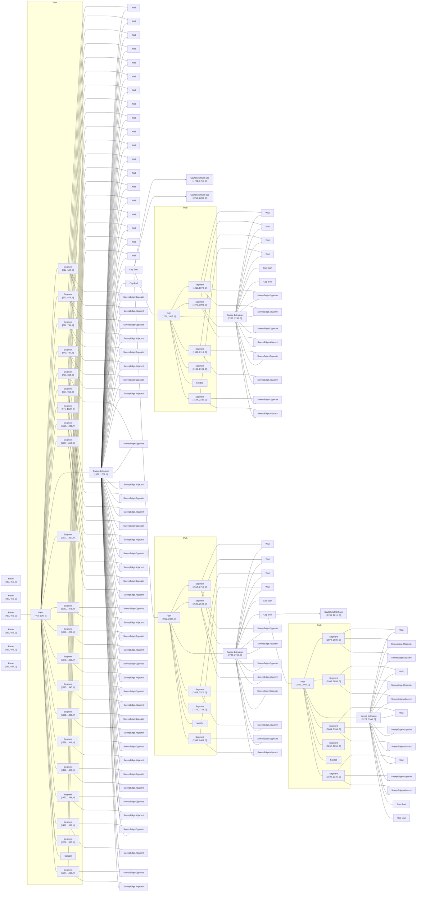

```mermaid
flowchart LR
  subgraph path7 [Path]
    7["Path<br>[462, 508, 0]"]
    8["Segment<br>[514, 567, 0]"]
    9["Segment<br>[573, 675, 0]"]
    10["Segment<br>[681, 734, 0]"]
    11["Segment<br>[740, 787, 0]"]
    12["Segment<br>[793, 888, 0]"]
    13["Segment<br>[894, 965, 0]"]
    14["Segment<br>[971, 1022, 0]"]
    15["Segment<br>[1028, 1081, 0]"]
    16["Segment<br>[1087, 1156, 0]"]
    17["Segment<br>[1162, 1201, 0]"]
    18["Segment<br>[1207, 1237, 0]"]
    19["Segment<br>[1243, 1273, 0]"]
    20["Segment<br>[1279, 1309, 0]"]
    21["Segment<br>[1315, 1345, 0]"]
    22["Segment<br>[1351, 1380, 0]"]
    23["Segment<br>[1386, 1416, 0]"]
    24["Segment<br>[1422, 1451, 0]"]
    25["Segment<br>[1457, 1486, 0]"]
    26["Segment<br>[1492, 1588, 0]"]
    27["Segment<br>[1594, 1650, 0]"]
    28["Segment<br>[1656, 1663, 0]"]
    29[Solid2d]
  end
  subgraph path90 [Path]
    90["Path<br>[1761, 1805, 0]"]
    91["Segment<br>[1811, 1873, 0]"]
    92["Segment<br>[1879, 1992, 0]"]
    93["Segment<br>[1998, 2118, 0]"]
    94["Segment<br>[2124, 2180, 0]"]
    95["Segment<br>[2186, 2193, 0]"]
    96[Solid2d]
  end
  subgraph path112 [Path]
    112["Path<br>[2292, 2337, 0]"]
    113["Segment<br>[2343, 2403, 0]"]
    114["Segment<br>[2409, 2522, 0]"]
    115["Segment<br>[2528, 2648, 0]"]
    116["Segment<br>[2654, 2710, 0]"]
    117["Segment<br>[2716, 2723, 0]"]
    118[Solid2d]
  end
  subgraph path134 [Path]
    134["Path<br>[2821, 2866, 0]"]
    135["Segment<br>[2872, 2939, 0]"]
    136["Segment<br>[2945, 3058, 0]"]
    137["Segment<br>[3064, 3184, 0]"]
    138["Segment<br>[3190, 3246, 0]"]
    139["Segment<br>[3252, 3259, 0]"]
    140[Solid2d]
  end
  1["Plane<br>[437, 456, 0]"]
  2["Plane<br>[437, 456, 0]"]
  3["Plane<br>[437, 456, 0]"]
  4["Plane<br>[437, 456, 0]"]
  5["Plane<br>[437, 456, 0]"]
  6["Plane<br>[437, 456, 0]"]
  30["Sweep Extrusion<br>[1677, 1707, 0]"]
  31[Wall]
  32[Wall]
  33[Wall]
  34[Wall]
  35[Wall]
  36[Wall]
  37[Wall]
  38[Wall]
  39[Wall]
  40[Wall]
  41[Wall]
  42[Wall]
  43[Wall]
  44[Wall]
  45[Wall]
  46[Wall]
  47[Wall]
  48[Wall]
  49[Wall]
  50["Cap Start"]
  51["Cap End"]
  52["SweepEdge Opposite"]
  53["SweepEdge Adjacent"]
  54["SweepEdge Opposite"]
  55["SweepEdge Adjacent"]
  56["SweepEdge Opposite"]
  57["SweepEdge Adjacent"]
  58["SweepEdge Opposite"]
  59["SweepEdge Adjacent"]
  60["SweepEdge Opposite"]
  61["SweepEdge Adjacent"]
  62["SweepEdge Opposite"]
  63["SweepEdge Adjacent"]
  64["SweepEdge Opposite"]
  65["SweepEdge Adjacent"]
  66["SweepEdge Opposite"]
  67["SweepEdge Adjacent"]
  68["SweepEdge Opposite"]
  69["SweepEdge Adjacent"]
  70["SweepEdge Opposite"]
  71["SweepEdge Adjacent"]
  72["SweepEdge Opposite"]
  73["SweepEdge Adjacent"]
  74["SweepEdge Opposite"]
  75["SweepEdge Adjacent"]
  76["SweepEdge Opposite"]
  77["SweepEdge Adjacent"]
  78["SweepEdge Opposite"]
  79["SweepEdge Adjacent"]
  80["SweepEdge Opposite"]
  81["SweepEdge Adjacent"]
  82["SweepEdge Opposite"]
  83["SweepEdge Adjacent"]
  84["SweepEdge Opposite"]
  85["SweepEdge Adjacent"]
  86["SweepEdge Opposite"]
  87["SweepEdge Adjacent"]
  88["SweepEdge Opposite"]
  89["SweepEdge Adjacent"]
  97["Sweep Extrusion<br>[2207, 2238, 0]"]
  98[Wall]
  99[Wall]
  100[Wall]
  101[Wall]
  102["Cap Start"]
  103["Cap End"]
  104["SweepEdge Opposite"]
  105["SweepEdge Adjacent"]
  106["SweepEdge Opposite"]
  107["SweepEdge Adjacent"]
  108["SweepEdge Opposite"]
  109["SweepEdge Adjacent"]
  110["SweepEdge Opposite"]
  111["SweepEdge Adjacent"]
  119["Sweep Extrusion<br>[2738, 2769, 0]"]
  120[Wall]
  121[Wall]
  122[Wall]
  123[Wall]
  124["Cap Start"]
  125["Cap End"]
  126["SweepEdge Opposite"]
  127["SweepEdge Adjacent"]
  128["SweepEdge Opposite"]
  129["SweepEdge Adjacent"]
  130["SweepEdge Opposite"]
  131["SweepEdge Adjacent"]
  132["SweepEdge Opposite"]
  133["SweepEdge Adjacent"]
  141["Sweep Extrusion<br>[3273, 3303, 0]"]
  142[Wall]
  143[Wall]
  144[Wall]
  145[Wall]
  146["Cap Start"]
  147["Cap End"]
  148["SweepEdge Opposite"]
  149["SweepEdge Adjacent"]
  150["SweepEdge Opposite"]
  151["SweepEdge Adjacent"]
  152["SweepEdge Opposite"]
  153["SweepEdge Adjacent"]
  154["SweepEdge Opposite"]
  155["SweepEdge Adjacent"]
  156["StartSketchOnFace<br>[1721, 1755, 0]"]
  157["StartSketchOnFace<br>[2252, 2286, 0]"]
  158["StartSketchOnFace<br>[2783, 2815, 0]"]
  3 --- 7
  7 --- 8
  7 --- 9
  7 --- 10
  7 --- 11
  7 --- 12
  7 --- 13
  7 --- 14
  7 --- 15
  7 --- 16
  7 --- 17
  7 --- 18
  7 --- 19
  7 --- 20
  7 --- 21
  7 --- 22
  7 --- 23
  7 --- 24
  7 --- 25
  7 --- 26
  7 --- 27
  7 --- 28
  7 ---- 30
  7 --- 29
  8 --- 31
  8 --- 52
  8 --- 53
  9 --- 32
  9 --- 54
  9 --- 55
  10 --- 33
  10 --- 56
  10 --- 57
  11 --- 34
  11 --- 58
  11 --- 59
  12 --- 35
  12 --- 60
  12 --- 61
  13 --- 36
  13 --- 62
  13 --- 63
  14 --- 37
  14 --- 64
  14 --- 65
  15 --- 38
  15 --- 66
  15 --- 67
  16 --- 39
  16 --- 68
  16 --- 69
  17 --- 40
  17 --- 70
  17 --- 71
  19 --- 41
  19 --- 72
  19 --- 73
  20 --- 42
  20 --- 74
  20 --- 75
  21 --- 43
  21 --- 76
  21 --- 77
  22 --- 44
  22 --- 78
  22 --- 79
  23 --- 45
  23 --- 80
  23 --- 81
  24 --- 46
  24 --- 82
  24 --- 83
  25 --- 47
  25 --- 84
  25 --- 85
  26 --- 48
  26 --- 86
  26 --- 87
  27 --- 49
  27 --- 88
  27 --- 89
  30 --- 31
  30 --- 32
  30 --- 33
  30 --- 34
  30 --- 35
  30 --- 36
  30 --- 37
  30 --- 38
  30 --- 39
  30 --- 40
  30 --- 41
  30 --- 42
  30 --- 43
  30 --- 44
  30 --- 45
  30 --- 46
  30 --- 47
  30 --- 48
  30 --- 49
  30 --- 50
  30 --- 51
  30 --- 52
  30 --- 53
  30 --- 54
  30 --- 55
  30 --- 56
  30 --- 57
  30 --- 58
  30 --- 59
  30 --- 60
  30 --- 61
  30 --- 62
  30 --- 63
  30 --- 64
  30 --- 65
  30 --- 66
  30 --- 67
  30 --- 68
  30 --- 69
  30 --- 70
  30 --- 71
  30 --- 72
  30 --- 73
  30 --- 74
  30 --- 75
  30 --- 76
  30 --- 77
  30 --- 78
  30 --- 79
  30 --- 80
  30 --- 81
  30 --- 82
  30 --- 83
  30 --- 84
  30 --- 85
  30 --- 86
  30 --- 87
  30 --- 88
  30 --- 89
  50 --- 90
  50 --- 112
  90 --- 91
  90 --- 92
  90 --- 93
  90 --- 94
  90 --- 95
  90 ---- 97
  90 --- 96
  91 --- 98
  91 --- 104
  91 --- 105
  92 --- 99
  92 --- 106
  92 --- 107
  93 --- 100
  93 --- 108
  93 --- 109
  94 --- 101
  94 --- 110
  94 --- 111
  97 --- 98
  97 --- 99
  97 --- 100
  97 --- 101
  97 --- 102
  97 --- 103
  97 --- 104
  97 --- 105
  97 --- 106
  97 --- 107
  97 --- 108
  97 --- 109
  97 --- 110
  97 --- 111
  112 --- 113
  112 --- 114
  112 --- 115
  112 --- 116
  112 --- 117
  112 ---- 119
  112 --- 118
  113 --- 123
  113 --- 132
  113 --- 133
  114 --- 122
  114 --- 130
  114 --- 131
  115 --- 121
  115 --- 128
  115 --- 129
  116 --- 120
  116 --- 126
  116 --- 127
  119 --- 120
  119 --- 121
  119 --- 122
  119 --- 123
  119 --- 124
  119 --- 125
  119 --- 126
  119 --- 127
  119 --- 128
  119 --- 129
  119 --- 130
  119 --- 131
  119 --- 132
  119 --- 133
  125 --- 134
  134 --- 135
  134 --- 136
  134 --- 137
  134 --- 138
  134 --- 139
  134 ---- 141
  134 --- 140
  135 --- 145
  135 --- 154
  135 --- 155
  136 --- 144
  136 --- 152
  136 --- 153
  137 --- 143
  137 --- 150
  137 --- 151
  138 --- 142
  138 --- 148
  138 --- 149
  141 --- 142
  141 --- 143
  141 --- 144
  141 --- 145
  141 --- 146
  141 --- 147
  141 --- 148
  141 --- 149
  141 --- 150
  141 --- 151
  141 --- 152
  141 --- 153
  141 --- 154
  141 --- 155
  50 <--x 156
  50 <--x 157
  125 <--x 158
```
