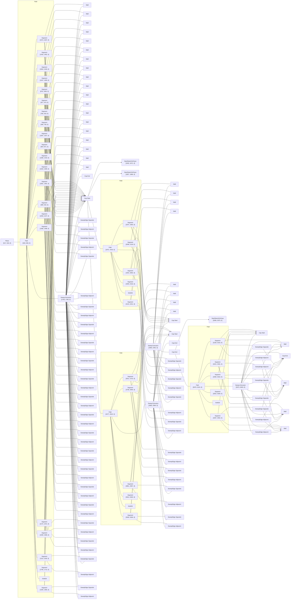

```mermaid
flowchart LR
  subgraph path5 [Path]
    5["Path<br>[540, 583, 0]"]
    9["Segment<br>[589, 642, 0]"]
    10["Segment<br>[648, 759, 0]"]
    11["Segment<br>[765, 818, 0]"]
    12["Segment<br>[824, 871, 0]"]
    13["Segment<br>[877, 973, 0]"]
    14["Segment<br>[979, 1050, 0]"]
    15["Segment<br>[1056, 1107, 0]"]
    16["Segment<br>[1113, 1166, 0]"]
    17["Segment<br>[1172, 1241, 0]"]
    18["Segment<br>[1247, 1283, 0]"]
    19["Segment<br>[1289, 1319, 0]"]
    20["Segment<br>[1325, 1355, 0]"]
    21["Segment<br>[1361, 1391, 0]"]
    22["Segment<br>[1397, 1427, 0]"]
    23["Segment<br>[1433, 1462, 0]"]
    24["Segment<br>[1468, 1498, 0]"]
    25["Segment<br>[1504, 1533, 0]"]
    26["Segment<br>[1539, 1568, 0]"]
    27["Segment<br>[1574, 1637, 0]"]
    28["Segment<br>[1643, 1699, 0]"]
    29["Segment<br>[1705, 1712, 0]"]
    47[Solid2d]
  end
  subgraph path6 [Path]
    6["Path<br>[1872, 1916, 0]"]
    30["Segment<br>[1922, 2002, 0]"]
    31["Segment<br>[2008, 2118, 0]"]
    32["Segment<br>[2124, 2241, 0]"]
    33["Segment<br>[2247, 2303, 0]"]
    34["Segment<br>[2309, 2316, 0]"]
    45[Solid2d]
  end
  subgraph path7 [Path]
    7["Path<br>[2477, 2522, 0]"]
    35["Segment<br>[2528, 2606, 0]"]
    36["Segment<br>[2612, 2722, 0]"]
    37["Segment<br>[2728, 2845, 0]"]
    38["Segment<br>[2851, 2907, 0]"]
    39["Segment<br>[2913, 2920, 0]"]
    46[Solid2d]
  end
  subgraph path8 [Path]
    8["Path<br>[3079, 3124, 0]"]
    40["Segment<br>[3130, 3215, 0]"]
    41["Segment<br>[3221, 3331, 0]"]
    42["Segment<br>[3337, 3454, 0]"]
    43["Segment<br>[3460, 3516, 0]"]
    44["Segment<br>[3522, 3529, 0]"]
    48[Solid2d]
  end
  1["Plane<br>[517, 534, 0]"]
  2["StartSketchOnFace<br>[2432, 2471, 0]"]
  3["StartSketchOnFace<br>[1827, 1866, 0]"]
  4["StartSketchOnFace<br>[3036, 3073, 0]"]
  49["Sweep Extrusion<br>[1755, 1785, 0]"]
  50["Sweep Extrusion<br>[2360, 2391, 0]"]
  51["Sweep Extrusion<br>[2963, 2994, 0]"]
  52["Sweep Extrusion<br>[3573, 3603, 0]"]
  53[Wall]
  54[Wall]
  55[Wall]
  56[Wall]
  57[Wall]
  58[Wall]
  59[Wall]
  60[Wall]
  61[Wall]
  62[Wall]
  63[Wall]
  64[Wall]
  65[Wall]
  66[Wall]
  67[Wall]
  68[Wall]
  69[Wall]
  70[Wall]
  71[Wall]
  72[Wall]
  73[Wall]
  74[Wall]
  75[Wall]
  76[Wall]
  77[Wall]
  78[Wall]
  79[Wall]
  80[Wall]
  81[Wall]
  82[Wall]
  83[Wall]
  84["Cap Start"]
  85["Cap Start"]
  86["Cap Start"]
  87["Cap End"]
  88["Cap End"]
  89["Cap End"]
  90["Cap Start"]
  91["Cap End"]
  92["SweepEdge Opposite"]
  93["SweepEdge Adjacent"]
  94["SweepEdge Opposite"]
  95["SweepEdge Adjacent"]
  96["SweepEdge Opposite"]
  97["SweepEdge Adjacent"]
  98["SweepEdge Opposite"]
  99["SweepEdge Adjacent"]
  100["SweepEdge Opposite"]
  101["SweepEdge Adjacent"]
  102["SweepEdge Opposite"]
  103["SweepEdge Adjacent"]
  104["SweepEdge Opposite"]
  105["SweepEdge Adjacent"]
  106["SweepEdge Opposite"]
  107["SweepEdge Adjacent"]
  108["SweepEdge Opposite"]
  109["SweepEdge Adjacent"]
  110["SweepEdge Opposite"]
  111["SweepEdge Adjacent"]
  112["SweepEdge Opposite"]
  113["SweepEdge Adjacent"]
  114["SweepEdge Opposite"]
  115["SweepEdge Adjacent"]
  116["SweepEdge Opposite"]
  117["SweepEdge Adjacent"]
  118["SweepEdge Opposite"]
  119["SweepEdge Adjacent"]
  120["SweepEdge Opposite"]
  121["SweepEdge Adjacent"]
  122["SweepEdge Opposite"]
  123["SweepEdge Adjacent"]
  124["SweepEdge Opposite"]
  125["SweepEdge Adjacent"]
  126["SweepEdge Opposite"]
  127["SweepEdge Adjacent"]
  128["SweepEdge Opposite"]
  129["SweepEdge Adjacent"]
  130["SweepEdge Opposite"]
  131["SweepEdge Adjacent"]
  132["SweepEdge Opposite"]
  133["SweepEdge Adjacent"]
  134["SweepEdge Opposite"]
  135["SweepEdge Adjacent"]
  136["SweepEdge Opposite"]
  137["SweepEdge Adjacent"]
  138["SweepEdge Opposite"]
  139["SweepEdge Adjacent"]
  140["SweepEdge Opposite"]
  141["SweepEdge Adjacent"]
  142["SweepEdge Opposite"]
  143["SweepEdge Adjacent"]
  144["SweepEdge Opposite"]
  145["SweepEdge Adjacent"]
  146["SweepEdge Opposite"]
  147["SweepEdge Adjacent"]
  148["SweepEdge Opposite"]
  149["SweepEdge Adjacent"]
  150["SweepEdge Opposite"]
  151["SweepEdge Adjacent"]
  152["SweepEdge Opposite"]
  153["SweepEdge Adjacent"]
  1 --- 5
  90 x--> 2
  90 x--> 3
  91 x--> 4
  5 --- 9
  5 --- 10
  5 --- 11
  5 --- 12
  5 --- 13
  5 --- 14
  5 --- 15
  5 --- 16
  5 --- 17
  5 --- 18
  5 --- 19
  5 --- 20
  5 --- 21
  5 --- 22
  5 --- 23
  5 --- 24
  5 --- 25
  5 --- 26
  5 --- 27
  5 --- 28
  5 --- 29
  5 --- 47
  5 ---- 49
  6 --- 30
  6 --- 31
  6 --- 32
  6 --- 33
  6 --- 34
  6 --- 45
  6 ---- 50
  90 --- 6
  7 --- 35
  7 --- 36
  7 --- 37
  7 --- 38
  7 --- 39
  7 --- 46
  7 ---- 51
  90 --- 7
  8 --- 40
  8 --- 41
  8 --- 42
  8 --- 43
  8 --- 44
  8 --- 48
  8 ---- 52
  91 --- 8
  9 --- 71
  9 x--> 90
  9 --- 128
  9 --- 129
  10 --- 65
  10 x--> 90
  10 --- 116
  10 --- 117
  11 --- 64
  11 x--> 90
  11 --- 114
  11 --- 115
  12 --- 67
  12 x--> 90
  12 --- 120
  12 --- 121
  13 --- 62
  13 x--> 90
  13 --- 110
  13 --- 111
  14 --- 61
  14 x--> 90
  14 --- 108
  14 --- 109
  15 --- 70
  15 x--> 90
  15 --- 126
  15 --- 127
  16 --- 74
  16 x--> 90
  16 --- 134
  16 --- 135
  17 --- 73
  17 x--> 90
  17 --- 132
  17 --- 133
  18 --- 60
  18 x--> 90
  18 --- 106
  18 --- 107
  20 --- 75
  20 x--> 90
  20 --- 136
  20 --- 137
  21 --- 68
  21 x--> 90
  21 --- 122
  21 --- 123
  22 --- 63
  22 x--> 90
  22 --- 112
  22 --- 113
  23 --- 58
  23 x--> 90
  23 --- 102
  23 --- 103
  24 --- 69
  24 x--> 90
  24 --- 124
  24 --- 125
  25 --- 59
  25 x--> 90
  25 --- 104
  25 --- 105
  26 --- 72
  26 x--> 90
  26 --- 130
  26 --- 131
  27 --- 57
  27 x--> 90
  27 --- 100
  27 --- 101
  28 --- 66
  28 x--> 90
  28 --- 118
  28 --- 119
  30 --- 78
  30 x--> 84
  30 --- 142
  30 --- 143
  31 --- 77
  31 x--> 84
  31 --- 140
  31 --- 141
  32 --- 79
  32 x--> 84
  32 --- 144
  32 --- 145
  33 --- 76
  33 x--> 84
  33 --- 138
  33 --- 139
  35 --- 83
  35 x--> 85
  35 --- 152
  35 --- 153
  36 --- 80
  36 x--> 85
  36 --- 146
  36 --- 147
  37 --- 81
  37 x--> 85
  37 --- 148
  37 --- 149
  38 --- 82
  38 x--> 85
  38 --- 150
  38 --- 151
  40 --- 54
  40 x--> 86
  40 --- 94
  40 --- 95
  41 --- 53
  41 x--> 86
  41 --- 92
  41 --- 93
  42 --- 56
  42 x--> 86
  42 --- 98
  42 --- 99
  43 --- 55
  43 x--> 86
  43 --- 96
  43 --- 97
  49 --- 57
  49 --- 58
  49 --- 59
  49 --- 60
  49 --- 61
  49 --- 62
  49 --- 63
  49 --- 64
  49 --- 65
  49 --- 66
  49 --- 67
  49 --- 68
  49 --- 69
  49 --- 70
  49 --- 71
  49 --- 72
  49 --- 73
  49 --- 74
  49 --- 75
  49 --- 87
  49 --- 90
  49 --- 100
  49 --- 101
  49 --- 102
  49 --- 103
  49 --- 104
  49 --- 105
  49 --- 106
  49 --- 107
  49 --- 108
  49 --- 109
  49 --- 110
  49 --- 111
  49 --- 112
  49 --- 113
  49 --- 114
  49 --- 115
  49 --- 116
  49 --- 117
  49 --- 118
  49 --- 119
  49 --- 120
  49 --- 121
  49 --- 122
  49 --- 123
  49 --- 124
  49 --- 125
  49 --- 126
  49 --- 127
  49 --- 128
  49 --- 129
  49 --- 130
  49 --- 131
  49 --- 132
  49 --- 133
  49 --- 134
  49 --- 135
  49 --- 136
  49 --- 137
  50 --- 76
  50 --- 77
  50 --- 78
  50 --- 79
  50 --- 84
  50 --- 91
  50 --- 138
  50 --- 139
  50 --- 140
  50 --- 141
  50 --- 142
  50 --- 143
  50 --- 144
  50 --- 145
  51 --- 80
  51 --- 81
  51 --- 82
  51 --- 83
  51 --- 85
  51 --- 88
  51 --- 146
  51 --- 147
  51 --- 148
  51 --- 149
  51 --- 150
  51 --- 151
  51 --- 152
  51 --- 153
  52 --- 53
  52 --- 54
  52 --- 55
  52 --- 56
  52 --- 86
  52 --- 89
  52 --- 92
  52 --- 93
  52 --- 94
  52 --- 95
  52 --- 96
  52 --- 97
  52 --- 98
  52 --- 99
  92 <--x 53
  93 <--x 53
  99 <--x 53
  93 <--x 54
  94 <--x 54
  95 <--x 54
  95 <--x 55
  96 <--x 55
  97 <--x 55
  97 <--x 56
  98 <--x 56
  99 <--x 56
  92 <--x 89
  94 <--x 89
  96 <--x 89
  98 <--x 89
```
