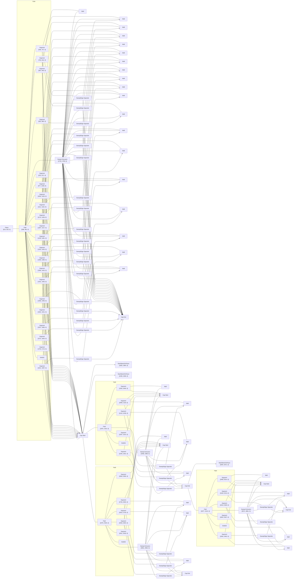

```mermaid
flowchart LR
  subgraph path2 [Path]
    2["Path<br>[538, 581, 0]"]
    3["Segment<br>[587, 640, 0]"]
    4["Segment<br>[646, 757, 0]"]
    5["Segment<br>[763, 816, 0]"]
    6["Segment<br>[822, 869, 0]"]
    7["Segment<br>[875, 971, 0]"]
    8["Segment<br>[977, 1048, 0]"]
    9["Segment<br>[1054, 1105, 0]"]
    10["Segment<br>[1111, 1164, 0]"]
    11["Segment<br>[1170, 1239, 0]"]
    12["Segment<br>[1245, 1281, 0]"]
    13["Segment<br>[1287, 1317, 0]"]
    14["Segment<br>[1323, 1353, 0]"]
    15["Segment<br>[1359, 1389, 0]"]
    16["Segment<br>[1395, 1425, 0]"]
    17["Segment<br>[1431, 1460, 0]"]
    18["Segment<br>[1466, 1496, 0]"]
    19["Segment<br>[1502, 1531, 0]"]
    20["Segment<br>[1537, 1566, 0]"]
    21["Segment<br>[1572, 1635, 0]"]
    22["Segment<br>[1641, 1697, 0]"]
    23["Segment<br>[1703, 1710, 0]"]
    24[Solid2d]
  end
  subgraph path65 [Path]
    65["Path<br>[1870, 1914, 0]"]
    66["Segment<br>[1920, 2000, 0]"]
    67["Segment<br>[2006, 2116, 0]"]
    68["Segment<br>[2122, 2239, 0]"]
    69["Segment<br>[2245, 2301, 0]"]
    70["Segment<br>[2307, 2314, 0]"]
    71[Solid2d]
  end
  subgraph path82 [Path]
    82["Path<br>[2475, 2520, 0]"]
    83["Segment<br>[2526, 2604, 0]"]
    84["Segment<br>[2610, 2720, 0]"]
    85["Segment<br>[2726, 2843, 0]"]
    86["Segment<br>[2849, 2905, 0]"]
    87["Segment<br>[2911, 2918, 0]"]
    88[Solid2d]
  end
  subgraph path99 [Path]
    99["Path<br>[3077, 3122, 0]"]
    100["Segment<br>[3128, 3213, 0]"]
    101["Segment<br>[3219, 3329, 0]"]
    102["Segment<br>[3335, 3452, 0]"]
    103["Segment<br>[3458, 3514, 0]"]
    104["Segment<br>[3520, 3527, 0]"]
    105[Solid2d]
  end
  1["Plane<br>[515, 532, 0]"]
  25["Sweep Extrusion<br>[1753, 1783, 0]"]
  26[Wall]
  27[Wall]
  28[Wall]
  29[Wall]
  30[Wall]
  31[Wall]
  32[Wall]
  33[Wall]
  34[Wall]
  35[Wall]
  36[Wall]
  37[Wall]
  38[Wall]
  39[Wall]
  40[Wall]
  41[Wall]
  42[Wall]
  43[Wall]
  44[Wall]
  45["Cap Start"]
  46["Cap End"]
  47["SweepEdge Opposite"]
  48["SweepEdge Opposite"]
  49["SweepEdge Opposite"]
  50["SweepEdge Opposite"]
  51["SweepEdge Opposite"]
  52["SweepEdge Opposite"]
  53["SweepEdge Opposite"]
  54["SweepEdge Opposite"]
  55["SweepEdge Opposite"]
  56["SweepEdge Opposite"]
  57["SweepEdge Opposite"]
  58["SweepEdge Opposite"]
  59["SweepEdge Opposite"]
  60["SweepEdge Opposite"]
  61["SweepEdge Opposite"]
  62["SweepEdge Opposite"]
  63["SweepEdge Opposite"]
  64["SweepEdge Opposite"]
  72["Sweep Extrusion<br>[2358, 2389, 0]"]
  73[Wall]
  74[Wall]
  75[Wall]
  76[Wall]
  77["Cap Start"]
  78["Cap End"]
  79["SweepEdge Opposite"]
  80["SweepEdge Opposite"]
  81["SweepEdge Opposite"]
  89["Sweep Extrusion<br>[2961, 2992, 0]"]
  90[Wall]
  91[Wall]
  92[Wall]
  93[Wall]
  94["Cap Start"]
  95["Cap End"]
  96["SweepEdge Opposite"]
  97["SweepEdge Opposite"]
  98["SweepEdge Opposite"]
  106["Sweep Extrusion<br>[3571, 3601, 0]"]
  107[Wall]
  108[Wall]
  109[Wall]
  110[Wall]
  111["Cap Start"]
  112["Cap End"]
  113["SweepEdge Opposite"]
  114["SweepEdge Opposite"]
  115["SweepEdge Opposite"]
  116["StartSketchOnFace<br>[1825, 1864, 0]"]
  117["StartSketchOnFace<br>[2430, 2469, 0]"]
  118["StartSketchOnFace<br>[3034, 3071, 0]"]
  1 --- 2
  2 --- 3
  2 --- 4
  2 --- 5
  2 --- 6
  2 --- 7
  2 --- 8
  2 --- 9
  2 --- 10
  2 --- 11
  2 --- 12
  2 --- 13
  2 --- 14
  2 --- 15
  2 --- 16
  2 --- 17
  2 --- 18
  2 --- 19
  2 --- 20
  2 --- 21
  2 --- 22
  2 --- 23
  2 ---- 25
  2 --- 24
  3 --- 26
  3 x--> 45
  4 --- 27
  4 --- 47
  4 x--> 45
  5 --- 28
  5 --- 48
  5 x--> 45
  6 --- 29
  6 --- 49
  6 x--> 45
  7 --- 30
  7 --- 50
  7 x--> 45
  8 --- 31
  8 --- 51
  8 x--> 45
  9 --- 32
  9 --- 52
  9 x--> 45
  10 --- 33
  10 --- 53
  10 x--> 45
  11 --- 34
  11 --- 54
  11 x--> 45
  12 --- 35
  12 --- 55
  12 x--> 45
  14 --- 36
  14 --- 56
  14 x--> 45
  15 --- 37
  15 --- 57
  15 x--> 45
  16 --- 38
  16 --- 58
  16 x--> 45
  17 --- 39
  17 --- 59
  17 x--> 45
  18 --- 40
  18 --- 60
  18 x--> 45
  19 --- 41
  19 --- 61
  19 x--> 45
  20 --- 42
  20 --- 62
  20 x--> 45
  21 --- 43
  21 --- 63
  21 x--> 45
  22 --- 44
  22 --- 64
  22 x--> 45
  25 --- 26
  25 --- 27
  25 --- 28
  25 --- 29
  25 --- 30
  25 --- 31
  25 --- 32
  25 --- 33
  25 --- 34
  25 --- 35
  25 --- 36
  25 --- 37
  25 --- 38
  25 --- 39
  25 --- 40
  25 --- 41
  25 --- 42
  25 --- 43
  25 --- 44
  25 --- 45
  25 --- 46
  25 --- 47
  25 --- 48
  25 --- 49
  25 --- 50
  25 --- 51
  25 --- 52
  25 --- 53
  25 --- 54
  25 --- 55
  25 --- 56
  25 --- 57
  25 --- 58
  25 --- 59
  25 --- 60
  25 --- 61
  25 --- 62
  25 --- 63
  25 --- 64
  45 --- 65
  45 --- 82
  47 <--x 27
  47 <--x 46
  48 <--x 28
  48 <--x 46
  49 <--x 29
  49 <--x 46
  50 <--x 30
  50 <--x 46
  51 <--x 31
  51 <--x 46
  52 <--x 32
  52 <--x 46
  53 <--x 33
  53 <--x 46
  54 <--x 34
  54 <--x 46
  55 <--x 35
  55 <--x 46
  56 <--x 36
  56 <--x 46
  57 <--x 37
  57 <--x 46
  58 <--x 38
  58 <--x 46
  59 <--x 39
  59 <--x 46
  60 <--x 40
  60 <--x 46
  61 <--x 41
  61 <--x 46
  62 <--x 42
  62 <--x 46
  63 <--x 43
  63 <--x 46
  64 <--x 44
  64 <--x 46
  65 --- 66
  65 --- 67
  65 --- 68
  65 --- 69
  65 --- 70
  65 ---- 72
  65 --- 71
  66 --- 73
  66 x--> 77
  67 --- 74
  67 --- 79
  67 x--> 77
  68 --- 75
  68 --- 80
  68 x--> 77
  69 --- 76
  69 --- 81
  69 x--> 77
  72 --- 73
  72 --- 74
  72 --- 75
  72 --- 76
  72 --- 77
  72 --- 78
  72 --- 79
  72 --- 80
  72 --- 81
  78 --- 99
  79 <--x 74
  79 <--x 78
  80 <--x 75
  80 <--x 78
  81 <--x 76
  81 <--x 78
  82 --- 83
  82 --- 84
  82 --- 85
  82 --- 86
  82 --- 87
  82 ---- 89
  82 --- 88
  83 --- 93
  83 --- 98
  83 x--> 94
  84 --- 92
  84 --- 97
  84 x--> 94
  85 --- 91
  85 --- 96
  85 x--> 94
  86 --- 90
  86 x--> 94
  89 --- 90
  89 --- 91
  89 --- 92
  89 --- 93
  89 --- 94
  89 --- 95
  89 --- 96
  89 --- 97
  89 --- 98
  96 <--x 91
  96 <--x 95
  97 <--x 92
  97 <--x 95
  98 <--x 93
  98 <--x 95
  99 --- 100
  99 --- 101
  99 --- 102
  99 --- 103
  99 --- 104
  99 ---- 106
  99 --- 105
  100 --- 110
  100 --- 115
  100 x--> 111
  101 --- 109
  101 --- 114
  101 x--> 111
  102 --- 108
  102 --- 113
  102 x--> 111
  103 --- 107
  103 x--> 111
  106 --- 107
  106 --- 108
  106 --- 109
  106 --- 110
  106 --- 111
  106 --- 112
  106 --- 113
  106 --- 114
  106 --- 115
  113 <--x 108
  113 <--x 112
  114 <--x 109
  114 <--x 112
  115 <--x 110
  115 <--x 112
  45 <--x 116
  45 <--x 117
  78 <--x 118
```
