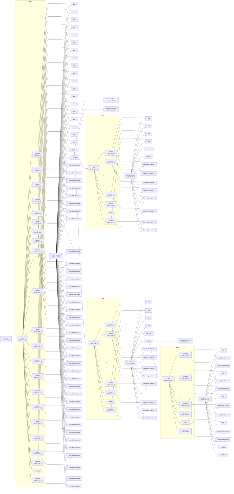

```mermaid
flowchart LR
  subgraph path2 [Path]
    2["Path<br>[460, 503, 0]"]
    3["Segment<br>[509, 562, 0]"]
    4["Segment<br>[568, 670, 0]"]
    5["Segment<br>[676, 729, 0]"]
    6["Segment<br>[735, 782, 0]"]
    7["Segment<br>[788, 883, 0]"]
    8["Segment<br>[889, 960, 0]"]
    9["Segment<br>[966, 1017, 0]"]
    10["Segment<br>[1023, 1076, 0]"]
    11["Segment<br>[1082, 1151, 0]"]
    12["Segment<br>[1157, 1193, 0]"]
    13["Segment<br>[1199, 1229, 0]"]
    14["Segment<br>[1235, 1265, 0]"]
    15["Segment<br>[1271, 1301, 0]"]
    16["Segment<br>[1307, 1337, 0]"]
    17["Segment<br>[1343, 1372, 0]"]
    18["Segment<br>[1378, 1408, 0]"]
    19["Segment<br>[1414, 1443, 0]"]
    20["Segment<br>[1449, 1478, 0]"]
    21["Segment<br>[1484, 1580, 0]"]
    22["Segment<br>[1586, 1642, 0]"]
    23["Segment<br>[1648, 1655, 0]"]
    24[Solid2d]
  end
  subgraph path85 [Path]
    85["Path<br>[1753, 1797, 0]"]
    86["Segment<br>[1803, 1865, 0]"]
    87["Segment<br>[1871, 1984, 0]"]
    88["Segment<br>[1990, 2110, 0]"]
    89["Segment<br>[2116, 2172, 0]"]
    90["Segment<br>[2178, 2185, 0]"]
    91[Solid2d]
  end
  subgraph path107 [Path]
    107["Path<br>[2284, 2329, 0]"]
    108["Segment<br>[2335, 2395, 0]"]
    109["Segment<br>[2401, 2514, 0]"]
    110["Segment<br>[2520, 2640, 0]"]
    111["Segment<br>[2646, 2702, 0]"]
    112["Segment<br>[2708, 2715, 0]"]
    113[Solid2d]
  end
  subgraph path129 [Path]
    129["Path<br>[2813, 2858, 0]"]
    130["Segment<br>[2864, 2931, 0]"]
    131["Segment<br>[2937, 3050, 0]"]
    132["Segment<br>[3056, 3176, 0]"]
    133["Segment<br>[3182, 3238, 0]"]
    134["Segment<br>[3244, 3251, 0]"]
    135[Solid2d]
  end
  1["Plane<br>[437, 454, 0]"]
  25["Sweep Extrusion<br>[1669, 1699, 0]"]
  26[Wall]
  27[Wall]
  28[Wall]
  29[Wall]
  30[Wall]
  31[Wall]
  32[Wall]
  33[Wall]
  34[Wall]
  35[Wall]
  36[Wall]
  37[Wall]
  38[Wall]
  39[Wall]
  40[Wall]
  41[Wall]
  42[Wall]
  43[Wall]
  44[Wall]
  45["Cap Start"]
  46["Cap End"]
  47["SweepEdge Opposite"]
  48["SweepEdge Adjacent"]
  49["SweepEdge Opposite"]
  50["SweepEdge Adjacent"]
  51["SweepEdge Opposite"]
  52["SweepEdge Adjacent"]
  53["SweepEdge Opposite"]
  54["SweepEdge Adjacent"]
  55["SweepEdge Opposite"]
  56["SweepEdge Adjacent"]
  57["SweepEdge Opposite"]
  58["SweepEdge Adjacent"]
  59["SweepEdge Opposite"]
  60["SweepEdge Adjacent"]
  61["SweepEdge Opposite"]
  62["SweepEdge Adjacent"]
  63["SweepEdge Opposite"]
  64["SweepEdge Adjacent"]
  65["SweepEdge Opposite"]
  66["SweepEdge Adjacent"]
  67["SweepEdge Opposite"]
  68["SweepEdge Adjacent"]
  69["SweepEdge Opposite"]
  70["SweepEdge Adjacent"]
  71["SweepEdge Opposite"]
  72["SweepEdge Adjacent"]
  73["SweepEdge Opposite"]
  74["SweepEdge Adjacent"]
  75["SweepEdge Opposite"]
  76["SweepEdge Adjacent"]
  77["SweepEdge Opposite"]
  78["SweepEdge Adjacent"]
  79["SweepEdge Opposite"]
  80["SweepEdge Adjacent"]
  81["SweepEdge Opposite"]
  82["SweepEdge Adjacent"]
  83["SweepEdge Opposite"]
  84["SweepEdge Adjacent"]
  92["Sweep Extrusion<br>[2199, 2230, 0]"]
  93[Wall]
  94[Wall]
  95[Wall]
  96[Wall]
  97["Cap Start"]
  98["Cap End"]
  99["SweepEdge Opposite"]
  100["SweepEdge Adjacent"]
  101["SweepEdge Opposite"]
  102["SweepEdge Adjacent"]
  103["SweepEdge Opposite"]
  104["SweepEdge Adjacent"]
  105["SweepEdge Opposite"]
  106["SweepEdge Adjacent"]
  114["Sweep Extrusion<br>[2730, 2761, 0]"]
  115[Wall]
  116[Wall]
  117[Wall]
  118[Wall]
  119["Cap Start"]
  120["Cap End"]
  121["SweepEdge Opposite"]
  122["SweepEdge Adjacent"]
  123["SweepEdge Opposite"]
  124["SweepEdge Adjacent"]
  125["SweepEdge Opposite"]
  126["SweepEdge Adjacent"]
  127["SweepEdge Opposite"]
  128["SweepEdge Adjacent"]
  136["Sweep Extrusion<br>[3265, 3295, 0]"]
  137[Wall]
  138[Wall]
  139[Wall]
  140[Wall]
  141["Cap Start"]
  142["Cap End"]
  143["SweepEdge Opposite"]
  144["SweepEdge Adjacent"]
  145["SweepEdge Opposite"]
  146["SweepEdge Adjacent"]
  147["SweepEdge Opposite"]
  148["SweepEdge Adjacent"]
  149["SweepEdge Opposite"]
  150["SweepEdge Adjacent"]
  151["StartSketchOnFace<br>[1713, 1747, 0]"]
  152["StartSketchOnFace<br>[2244, 2278, 0]"]
  153["StartSketchOnFace<br>[2775, 2807, 0]"]
  1 --- 2
  2 --- 3
  2 --- 4
  2 --- 5
  2 --- 6
  2 --- 7
  2 --- 8
  2 --- 9
  2 --- 10
  2 --- 11
  2 --- 12
  2 --- 13
  2 --- 14
  2 --- 15
  2 --- 16
  2 --- 17
  2 --- 18
  2 --- 19
  2 --- 20
  2 --- 21
  2 --- 22
  2 --- 23
  2 ---- 25
  2 --- 24
  3 --- 26
  3 --- 47
  3 --- 48
  4 --- 27
  4 --- 49
  4 --- 50
  5 --- 28
  5 --- 51
  5 --- 52
  6 --- 29
  6 --- 53
  6 --- 54
  7 --- 30
  7 --- 55
  7 --- 56
  8 --- 31
  8 --- 57
  8 --- 58
  9 --- 32
  9 --- 59
  9 --- 60
  10 --- 33
  10 --- 61
  10 --- 62
  11 --- 34
  11 --- 63
  11 --- 64
  12 --- 35
  12 --- 65
  12 --- 66
  14 --- 36
  14 --- 67
  14 --- 68
  15 --- 37
  15 --- 69
  15 --- 70
  16 --- 38
  16 --- 71
  16 --- 72
  17 --- 39
  17 --- 73
  17 --- 74
  18 --- 40
  18 --- 75
  18 --- 76
  19 --- 41
  19 --- 77
  19 --- 78
  20 --- 42
  20 --- 79
  20 --- 80
  21 --- 43
  21 --- 81
  21 --- 82
  22 --- 44
  22 --- 83
  22 --- 84
  25 --- 26
  25 --- 27
  25 --- 28
  25 --- 29
  25 --- 30
  25 --- 31
  25 --- 32
  25 --- 33
  25 --- 34
  25 --- 35
  25 --- 36
  25 --- 37
  25 --- 38
  25 --- 39
  25 --- 40
  25 --- 41
  25 --- 42
  25 --- 43
  25 --- 44
  25 --- 45
  25 --- 46
  25 --- 47
  25 --- 48
  25 --- 49
  25 --- 50
  25 --- 51
  25 --- 52
  25 --- 53
  25 --- 54
  25 --- 55
  25 --- 56
  25 --- 57
  25 --- 58
  25 --- 59
  25 --- 60
  25 --- 61
  25 --- 62
  25 --- 63
  25 --- 64
  25 --- 65
  25 --- 66
  25 --- 67
  25 --- 68
  25 --- 69
  25 --- 70
  25 --- 71
  25 --- 72
  25 --- 73
  25 --- 74
  25 --- 75
  25 --- 76
  25 --- 77
  25 --- 78
  25 --- 79
  25 --- 80
  25 --- 81
  25 --- 82
  25 --- 83
  25 --- 84
  45 --- 85
  45 --- 107
  85 --- 86
  85 --- 87
  85 --- 88
  85 --- 89
  85 --- 90
  85 ---- 92
  85 --- 91
  86 --- 93
  86 --- 99
  86 --- 100
  87 --- 94
  87 --- 101
  87 --- 102
  88 --- 95
  88 --- 103
  88 --- 104
  89 --- 96
  89 --- 105
  89 --- 106
  92 --- 93
  92 --- 94
  92 --- 95
  92 --- 96
  92 --- 97
  92 --- 98
  92 --- 99
  92 --- 100
  92 --- 101
  92 --- 102
  92 --- 103
  92 --- 104
  92 --- 105
  92 --- 106
  107 --- 108
  107 --- 109
  107 --- 110
  107 --- 111
  107 --- 112
  107 ---- 114
  107 --- 113
  108 --- 118
  108 --- 127
  108 --- 128
  109 --- 117
  109 --- 125
  109 --- 126
  110 --- 116
  110 --- 123
  110 --- 124
  111 --- 115
  111 --- 121
  111 --- 122
  114 --- 115
  114 --- 116
  114 --- 117
  114 --- 118
  114 --- 119
  114 --- 120
  114 --- 121
  114 --- 122
  114 --- 123
  114 --- 124
  114 --- 125
  114 --- 126
  114 --- 127
  114 --- 128
  120 --- 129
  129 --- 130
  129 --- 131
  129 --- 132
  129 --- 133
  129 --- 134
  129 ---- 136
  129 --- 135
  130 --- 140
  130 --- 149
  130 --- 150
  131 --- 139
  131 --- 147
  131 --- 148
  132 --- 138
  132 --- 145
  132 --- 146
  133 --- 137
  133 --- 143
  133 --- 144
  136 --- 137
  136 --- 138
  136 --- 139
  136 --- 140
  136 --- 141
  136 --- 142
  136 --- 143
  136 --- 144
  136 --- 145
  136 --- 146
  136 --- 147
  136 --- 148
  136 --- 149
  136 --- 150
  45 <--x 151
  45 <--x 152
  120 <--x 153
```
