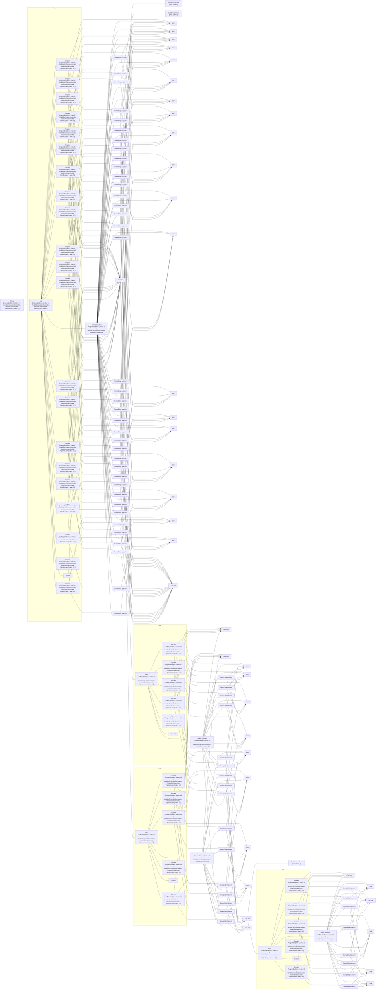

```mermaid
flowchart LR
  subgraph path5 [Path]
    5["Path<br>[ProgramBodyItem { index: 9 }, VariableDeclarationDeclaration, VariableDeclarationInit, PipeBodyItem { index: 1 }]"]
    9["Segment<br>[ProgramBodyItem { index: 9 }, VariableDeclarationDeclaration, VariableDeclarationInit, PipeBodyItem { index: 2 }]"]
    10["Segment<br>[ProgramBodyItem { index: 9 }, VariableDeclarationDeclaration, VariableDeclarationInit, PipeBodyItem { index: 3 }]"]
    11["Segment<br>[ProgramBodyItem { index: 9 }, VariableDeclarationDeclaration, VariableDeclarationInit, PipeBodyItem { index: 4 }]"]
    12["Segment<br>[ProgramBodyItem { index: 9 }, VariableDeclarationDeclaration, VariableDeclarationInit, PipeBodyItem { index: 5 }]"]
    13["Segment<br>[ProgramBodyItem { index: 9 }, VariableDeclarationDeclaration, VariableDeclarationInit, PipeBodyItem { index: 6 }]"]
    14["Segment<br>[ProgramBodyItem { index: 9 }, VariableDeclarationDeclaration, VariableDeclarationInit, PipeBodyItem { index: 7 }]"]
    15["Segment<br>[ProgramBodyItem { index: 9 }, VariableDeclarationDeclaration, VariableDeclarationInit, PipeBodyItem { index: 8 }]"]
    16["Segment<br>[ProgramBodyItem { index: 9 }, VariableDeclarationDeclaration, VariableDeclarationInit, PipeBodyItem { index: 9 }]"]
    17["Segment<br>[ProgramBodyItem { index: 9 }, VariableDeclarationDeclaration, VariableDeclarationInit, PipeBodyItem { index: 10 }]"]
    18["Segment<br>[ProgramBodyItem { index: 9 }, VariableDeclarationDeclaration, VariableDeclarationInit, PipeBodyItem { index: 11 }]"]
    19["Segment<br>[ProgramBodyItem { index: 9 }, VariableDeclarationDeclaration, VariableDeclarationInit, PipeBodyItem { index: 12 }]"]
    20["Segment<br>[ProgramBodyItem { index: 9 }, VariableDeclarationDeclaration, VariableDeclarationInit, PipeBodyItem { index: 13 }]"]
    21["Segment<br>[ProgramBodyItem { index: 9 }, VariableDeclarationDeclaration, VariableDeclarationInit, PipeBodyItem { index: 14 }]"]
    22["Segment<br>[ProgramBodyItem { index: 9 }, VariableDeclarationDeclaration, VariableDeclarationInit, PipeBodyItem { index: 15 }]"]
    23["Segment<br>[ProgramBodyItem { index: 9 }, VariableDeclarationDeclaration, VariableDeclarationInit, PipeBodyItem { index: 16 }]"]
    24["Segment<br>[ProgramBodyItem { index: 9 }, VariableDeclarationDeclaration, VariableDeclarationInit, PipeBodyItem { index: 17 }]"]
    25["Segment<br>[ProgramBodyItem { index: 9 }, VariableDeclarationDeclaration, VariableDeclarationInit, PipeBodyItem { index: 18 }]"]
    26["Segment<br>[ProgramBodyItem { index: 9 }, VariableDeclarationDeclaration, VariableDeclarationInit, PipeBodyItem { index: 19 }]"]
    27["Segment<br>[ProgramBodyItem { index: 9 }, VariableDeclarationDeclaration, VariableDeclarationInit, PipeBodyItem { index: 20 }]"]
    28["Segment<br>[ProgramBodyItem { index: 9 }, VariableDeclarationDeclaration, VariableDeclarationInit, PipeBodyItem { index: 21 }]"]
    29["Segment<br>[ProgramBodyItem { index: 9 }, VariableDeclarationDeclaration, VariableDeclarationInit, PipeBodyItem { index: 22 }]"]
    47[Solid2d]
  end
  subgraph path6 [Path]
    6["Path<br>[ProgramBodyItem { index: 11 }, VariableDeclarationDeclaration, VariableDeclarationInit, PipeBodyItem { index: 1 }]"]
    30["Segment<br>[ProgramBodyItem { index: 11 }, VariableDeclarationDeclaration, VariableDeclarationInit, PipeBodyItem { index: 2 }]"]
    31["Segment<br>[ProgramBodyItem { index: 11 }, VariableDeclarationDeclaration, VariableDeclarationInit, PipeBodyItem { index: 3 }]"]
    32["Segment<br>[ProgramBodyItem { index: 11 }, VariableDeclarationDeclaration, VariableDeclarationInit, PipeBodyItem { index: 4 }]"]
    33["Segment<br>[ProgramBodyItem { index: 11 }, VariableDeclarationDeclaration, VariableDeclarationInit, PipeBodyItem { index: 5 }]"]
    34["Segment<br>[ProgramBodyItem { index: 11 }, VariableDeclarationDeclaration, VariableDeclarationInit, PipeBodyItem { index: 6 }]"]
    45[Solid2d]
  end
  subgraph path7 [Path]
    7["Path<br>[ProgramBodyItem { index: 13 }, VariableDeclarationDeclaration, VariableDeclarationInit, PipeBodyItem { index: 1 }]"]
    35["Segment<br>[ProgramBodyItem { index: 13 }, VariableDeclarationDeclaration, VariableDeclarationInit, PipeBodyItem { index: 2 }]"]
    36["Segment<br>[ProgramBodyItem { index: 13 }, VariableDeclarationDeclaration, VariableDeclarationInit, PipeBodyItem { index: 3 }]"]
    37["Segment<br>[ProgramBodyItem { index: 13 }, VariableDeclarationDeclaration, VariableDeclarationInit, PipeBodyItem { index: 4 }]"]
    38["Segment<br>[ProgramBodyItem { index: 13 }, VariableDeclarationDeclaration, VariableDeclarationInit, PipeBodyItem { index: 5 }]"]
    39["Segment<br>[ProgramBodyItem { index: 13 }, VariableDeclarationDeclaration, VariableDeclarationInit, PipeBodyItem { index: 6 }]"]
    46[Solid2d]
  end
  subgraph path8 [Path]
    8["Path<br>[ProgramBodyItem { index: 15 }, VariableDeclarationDeclaration, VariableDeclarationInit, PipeBodyItem { index: 1 }]"]
    40["Segment<br>[ProgramBodyItem { index: 15 }, VariableDeclarationDeclaration, VariableDeclarationInit, PipeBodyItem { index: 2 }]"]
    41["Segment<br>[ProgramBodyItem { index: 15 }, VariableDeclarationDeclaration, VariableDeclarationInit, PipeBodyItem { index: 3 }]"]
    42["Segment<br>[ProgramBodyItem { index: 15 }, VariableDeclarationDeclaration, VariableDeclarationInit, PipeBodyItem { index: 4 }]"]
    43["Segment<br>[ProgramBodyItem { index: 15 }, VariableDeclarationDeclaration, VariableDeclarationInit, PipeBodyItem { index: 5 }]"]
    44["Segment<br>[ProgramBodyItem { index: 15 }, VariableDeclarationDeclaration, VariableDeclarationInit, PipeBodyItem { index: 6 }]"]
    48[Solid2d]
  end
  1["Plane<br>[ProgramBodyItem { index: 9 }, VariableDeclarationDeclaration, VariableDeclarationInit, PipeBodyItem { index: 0 }]"]
  2["StartSketchOnFace<br>[2450, 2489, 0]"]
  3["StartSketchOnFace<br>[1845, 1884, 0]"]
  4["StartSketchOnFace<br>[3054, 3091, 0]"]
  49["Sweep Extrusion<br>[ProgramBodyItem { index: 10 }, VariableDeclarationDeclaration, VariableDeclarationInit]"]
  50["Sweep Extrusion<br>[ProgramBodyItem { index: 12 }, VariableDeclarationDeclaration, VariableDeclarationInit]"]
  51["Sweep Extrusion<br>[ProgramBodyItem { index: 14 }, VariableDeclarationDeclaration, VariableDeclarationInit]"]
  52["Sweep Extrusion<br>[ProgramBodyItem { index: 16 }, VariableDeclarationDeclaration, VariableDeclarationInit]"]
  53[Wall]
  54[Wall]
  55[Wall]
  56[Wall]
  57[Wall]
  58[Wall]
  59[Wall]
  60[Wall]
  61[Wall]
  62[Wall]
  63[Wall]
  64[Wall]
  65[Wall]
  66[Wall]
  67[Wall]
  68[Wall]
  69[Wall]
  70[Wall]
  71[Wall]
  72[Wall]
  73[Wall]
  74[Wall]
  75[Wall]
  76[Wall]
  77[Wall]
  78[Wall]
  79[Wall]
  80[Wall]
  81[Wall]
  82[Wall]
  83[Wall]
  84["Cap Start"]
  85["Cap Start"]
  86["Cap Start"]
  87["Cap Start"]
  88["Cap End"]
  89["Cap End"]
  90["Cap End"]
  91["Cap End"]
  92["SweepEdge Opposite"]
  93["SweepEdge Opposite"]
  94["SweepEdge Opposite"]
  95["SweepEdge Opposite"]
  96["SweepEdge Opposite"]
  97["SweepEdge Opposite"]
  98["SweepEdge Opposite"]
  99["SweepEdge Opposite"]
  100["SweepEdge Opposite"]
  101["SweepEdge Opposite"]
  102["SweepEdge Opposite"]
  103["SweepEdge Opposite"]
  104["SweepEdge Opposite"]
  105["SweepEdge Opposite"]
  106["SweepEdge Opposite"]
  107["SweepEdge Opposite"]
  108["SweepEdge Opposite"]
  109["SweepEdge Opposite"]
  110["SweepEdge Opposite"]
  111["SweepEdge Opposite"]
  112["SweepEdge Opposite"]
  113["SweepEdge Opposite"]
  114["SweepEdge Opposite"]
  115["SweepEdge Opposite"]
  116["SweepEdge Opposite"]
  117["SweepEdge Opposite"]
  118["SweepEdge Opposite"]
  119["SweepEdge Opposite"]
  120["SweepEdge Opposite"]
  121["SweepEdge Opposite"]
  122["SweepEdge Opposite"]
  123["SweepEdge Adjacent"]
  124["SweepEdge Adjacent"]
  125["SweepEdge Adjacent"]
  126["SweepEdge Adjacent"]
  127["SweepEdge Adjacent"]
  128["SweepEdge Adjacent"]
  129["SweepEdge Adjacent"]
  130["SweepEdge Adjacent"]
  131["SweepEdge Adjacent"]
  132["SweepEdge Adjacent"]
  133["SweepEdge Adjacent"]
  134["SweepEdge Adjacent"]
  135["SweepEdge Adjacent"]
  136["SweepEdge Adjacent"]
  137["SweepEdge Adjacent"]
  138["SweepEdge Adjacent"]
  139["SweepEdge Adjacent"]
  140["SweepEdge Adjacent"]
  141["SweepEdge Adjacent"]
  142["SweepEdge Adjacent"]
  143["SweepEdge Adjacent"]
  144["SweepEdge Adjacent"]
  145["SweepEdge Adjacent"]
  146["SweepEdge Adjacent"]
  147["SweepEdge Adjacent"]
  148["SweepEdge Adjacent"]
  149["SweepEdge Adjacent"]
  150["SweepEdge Adjacent"]
  151["SweepEdge Adjacent"]
  152["SweepEdge Adjacent"]
  153["SweepEdge Adjacent"]
  1 --- 5
  85 x--> 2
  85 x--> 3
  88 x--> 4
  5 --- 9
  5 --- 10
  5 --- 11
  5 --- 12
  5 --- 13
  5 --- 14
  5 --- 15
  5 --- 16
  5 --- 17
  5 --- 18
  5 --- 19
  5 --- 20
  5 --- 21
  5 --- 22
  5 --- 23
  5 --- 24
  5 --- 25
  5 --- 26
  5 --- 27
  5 --- 28
  5 --- 29
  5 --- 47
  5 ---- 49
  6 --- 30
  6 --- 31
  6 --- 32
  6 --- 33
  6 --- 34
  6 --- 45
  6 ---- 50
  85 --- 6
  7 --- 35
  7 --- 36
  7 --- 37
  7 --- 38
  7 --- 39
  7 --- 46
  7 ---- 51
  85 --- 7
  8 --- 40
  8 --- 41
  8 --- 42
  8 --- 43
  8 --- 44
  8 --- 48
  8 ---- 52
  88 --- 8
  9 --- 71
  9 x--> 85
  9 --- 96
  9 --- 144
  10 --- 65
  10 x--> 85
  10 --- 104
  10 --- 139
  11 --- 64
  11 x--> 85
  11 --- 106
  11 --- 134
  12 --- 67
  12 x--> 85
  12 --- 100
  12 --- 143
  13 --- 62
  13 x--> 85
  13 --- 109
  13 --- 128
  14 --- 61
  14 x--> 85
  14 --- 105
  14 --- 142
  15 --- 70
  15 x--> 85
  15 --- 103
  15 --- 140
  16 --- 74
  16 x--> 85
  16 --- 108
  16 --- 141
  17 --- 73
  17 x--> 85
  17 --- 101
  17 --- 127
  18 --- 60
  18 x--> 85
  18 --- 110
  18 --- 145
  20 --- 75
  20 x--> 85
  20 --- 102
  20 --- 131
  21 --- 68
  21 x--> 85
  21 --- 99
  21 --- 135
  22 --- 63
  22 x--> 85
  22 --- 113
  22 --- 132
  23 --- 58
  23 x--> 85
  23 --- 97
  23 --- 129
  24 --- 69
  24 x--> 85
  24 --- 112
  24 --- 136
  25 --- 59
  25 x--> 85
  25 --- 98
  25 --- 133
  26 --- 72
  26 x--> 85
  26 --- 111
  26 --- 138
  27 --- 57
  27 x--> 85
  27 --- 107
  27 --- 137
  28 --- 66
  28 x--> 85
  28 --- 114
  28 --- 130
  30 --- 78
  30 x--> 84
  30 --- 118
  30 --- 146
  31 --- 77
  31 x--> 84
  31 --- 116
  31 --- 149
  32 --- 79
  32 x--> 84
  32 --- 115
  32 --- 147
  33 --- 76
  33 x--> 84
  33 --- 117
  33 --- 148
  35 --- 83
  35 x--> 86
  35 --- 121
  35 --- 153
  36 --- 80
  36 x--> 86
  36 --- 122
  36 --- 151
  37 --- 81
  37 x--> 86
  37 --- 119
  37 --- 150
  38 --- 82
  38 x--> 86
  38 --- 120
  38 --- 152
  40 --- 54
  40 x--> 87
  40 --- 92
  40 --- 123
  41 --- 53
  41 x--> 87
  41 --- 95
  41 --- 125
  42 --- 56
  42 x--> 87
  42 --- 93
  42 --- 126
  43 --- 55
  43 x--> 87
  43 --- 94
  43 --- 124
  49 --- 57
  49 --- 58
  49 --- 59
  49 --- 60
  49 --- 61
  49 --- 62
  49 --- 63
  49 --- 64
  49 --- 65
  49 --- 66
  49 --- 67
  49 --- 68
  49 --- 69
  49 --- 70
  49 --- 71
  49 --- 72
  49 --- 73
  49 --- 74
  49 --- 75
  49 --- 85
  49 --- 89
  49 --- 96
  49 --- 97
  49 --- 98
  49 --- 99
  49 --- 100
  49 --- 101
  49 --- 102
  49 --- 103
  49 --- 104
  49 --- 105
  49 --- 106
  49 --- 107
  49 --- 108
  49 --- 109
  49 --- 110
  49 --- 111
  49 --- 112
  49 --- 113
  49 --- 114
  49 --- 127
  49 --- 128
  49 --- 129
  49 --- 130
  49 --- 131
  49 --- 132
  49 --- 133
  49 --- 134
  49 --- 135
  49 --- 136
  49 --- 137
  49 --- 138
  49 --- 139
  49 --- 140
  49 --- 141
  49 --- 142
  49 --- 143
  49 --- 144
  49 --- 145
  50 --- 76
  50 --- 77
  50 --- 78
  50 --- 79
  50 --- 84
  50 --- 88
  50 --- 115
  50 --- 116
  50 --- 117
  50 --- 118
  50 --- 146
  50 --- 147
  50 --- 148
  50 --- 149
  51 --- 80
  51 --- 81
  51 --- 82
  51 --- 83
  51 --- 86
  51 --- 90
  51 --- 119
  51 --- 120
  51 --- 121
  51 --- 122
  51 --- 150
  51 --- 151
  51 --- 152
  51 --- 153
  52 --- 53
  52 --- 54
  52 --- 55
  52 --- 56
  52 --- 87
  52 --- 91
  52 --- 92
  52 --- 93
  52 --- 94
  52 --- 95
  52 --- 123
  52 --- 124
  52 --- 125
  52 --- 126
  95 <--x 53
  125 <--x 53
  126 <--x 53
  92 <--x 54
  123 <--x 54
  125 <--x 54
  94 <--x 55
  123 <--x 55
  124 <--x 55
  93 <--x 56
  124 <--x 56
  126 <--x 56
  107 <--x 57
  137 <--x 57
  138 <--x 57
  97 <--x 58
  129 <--x 58
  132 <--x 58
  98 <--x 59
  133 <--x 59
  136 <--x 59
  110 <--x 60
  127 <--x 60
  145 <--x 60
  105 <--x 61
  128 <--x 61
  142 <--x 61
  109 <--x 62
  128 <--x 62
  143 <--x 62
  113 <--x 63
  132 <--x 63
  135 <--x 63
  106 <--x 64
  134 <--x 64
  139 <--x 64
  104 <--x 65
  139 <--x 65
  144 <--x 65
  114 <--x 66
  130 <--x 66
  137 <--x 66
  100 <--x 67
  134 <--x 67
  143 <--x 67
  99 <--x 68
  131 <--x 68
  135 <--x 68
  112 <--x 69
  129 <--x 69
  136 <--x 69
  103 <--x 70
  140 <--x 70
  142 <--x 70
  96 <--x 71
  130 <--x 71
  144 <--x 71
  111 <--x 72
  133 <--x 72
  138 <--x 72
  101 <--x 73
  127 <--x 73
  141 <--x 73
  108 <--x 74
  140 <--x 74
  141 <--x 74
  102 <--x 75
  131 <--x 75
  145 <--x 75
  117 <--x 76
  147 <--x 76
  148 <--x 76
  116 <--x 77
  146 <--x 77
  149 <--x 77
  118 <--x 78
  146 <--x 78
  148 <--x 78
  115 <--x 79
  147 <--x 79
  149 <--x 79
  122 <--x 80
  150 <--x 80
  151 <--x 80
  119 <--x 81
  150 <--x 81
  152 <--x 81
  120 <--x 82
  152 <--x 82
  153 <--x 82
  121 <--x 83
  151 <--x 83
  153 <--x 83
  115 <--x 88
  116 <--x 88
  117 <--x 88
  118 <--x 88
  96 <--x 89
  97 <--x 89
  98 <--x 89
  99 <--x 89
  100 <--x 89
  101 <--x 89
  102 <--x 89
  103 <--x 89
  104 <--x 89
  105 <--x 89
  106 <--x 89
  107 <--x 89
  108 <--x 89
  109 <--x 89
  110 <--x 89
  111 <--x 89
  112 <--x 89
  113 <--x 89
  114 <--x 89
  119 <--x 90
  120 <--x 90
  121 <--x 90
  122 <--x 90
  92 <--x 91
  93 <--x 91
  94 <--x 91
  95 <--x 91
```
