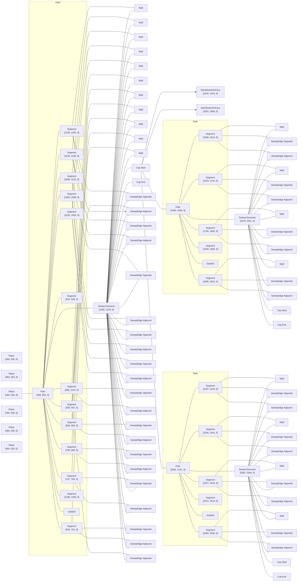

```mermaid
flowchart LR
  subgraph path7 [Path]
    7["Path<br>[509, 552, 0]"]
    8["Segment<br>[558, 597, 0]"]
    9["Segment<br>[603, 701, 0]"]
    10["Segment<br>[707, 783, 0]"]
    11["Segment<br>[789, 858, 0]"]
    12["Segment<br>[864, 904, 0]"]
    13["Segment<br>[910, 949, 0]"]
    14["Segment<br>[989, 1019, 0]"]
    15["Segment<br>[1025, 1054, 0]"]
    16["Segment<br>[1060, 1089, 0]"]
    17["Segment<br>[1095, 1124, 0]"]
    18["Segment<br>[1130, 1230, 0]"]
    19["Segment<br>[1236, 1292, 0]"]
    20["Segment<br>[1298, 1305, 0]"]
    21[Solid2d]
  end
  subgraph path57 [Path]
    57["Path<br>[1460, 1560, 0]"]
    58["Segment<br>[1566, 1613, 0]"]
    59["Segment<br>[1619, 1734, 0]"]
    60["Segment<br>[1740, 1860, 0]"]
    61["Segment<br>[1866, 1922, 0]"]
    62["Segment<br>[1928, 1935, 0]"]
    63[Solid2d]
  end
  subgraph path79 [Path]
    79["Path<br>[2092, 2191, 0]"]
    80["Segment<br>[2197, 2243, 0]"]
    81["Segment<br>[2249, 2341, 0]"]
    82["Segment<br>[2347, 2444, 0]"]
    83["Segment<br>[2450, 2506, 0]"]
    84["Segment<br>[2512, 2519, 0]"]
    85[Solid2d]
  end
  1["Plane<br>[484, 503, 0]"]
  2["Plane<br>[484, 503, 0]"]
  3["Plane<br>[484, 503, 0]"]
  4["Plane<br>[484, 503, 0]"]
  5["Plane<br>[484, 503, 0]"]
  6["Plane<br>[484, 503, 0]"]
  22["Sweep Extrusion<br>[1348, 1378, 0]"]
  23[Wall]
  24[Wall]
  25[Wall]
  26[Wall]
  27[Wall]
  28[Wall]
  29[Wall]
  30[Wall]
  31[Wall]
  32[Wall]
  33[Wall]
  34["Cap Start"]
  35["Cap End"]
  36["SweepEdge Opposite"]
  37["SweepEdge Adjacent"]
  38["SweepEdge Opposite"]
  39["SweepEdge Adjacent"]
  40["SweepEdge Opposite"]
  41["SweepEdge Adjacent"]
  42["SweepEdge Opposite"]
  43["SweepEdge Adjacent"]
  44["SweepEdge Opposite"]
  45["SweepEdge Adjacent"]
  46["SweepEdge Opposite"]
  47["SweepEdge Adjacent"]
  48["SweepEdge Opposite"]
  49["SweepEdge Adjacent"]
  50["SweepEdge Opposite"]
  51["SweepEdge Adjacent"]
  52["SweepEdge Opposite"]
  53["SweepEdge Adjacent"]
  54["SweepEdge Opposite"]
  55["SweepEdge Adjacent"]
  56["SweepEdge Opposite"]
  64["Sweep Extrusion<br>[1979, 2011, 0]"]
  65[Wall]
  66[Wall]
  67[Wall]
  68[Wall]
  69["Cap Start"]
  70["Cap End"]
  71["SweepEdge Opposite"]
  72["SweepEdge Adjacent"]
  73["SweepEdge Opposite"]
  74["SweepEdge Adjacent"]
  75["SweepEdge Opposite"]
  76["SweepEdge Adjacent"]
  77["SweepEdge Opposite"]
  78["SweepEdge Adjacent"]
  86["Sweep Extrusion<br>[2562, 2594, 0]"]
  87[Wall]
  88[Wall]
  89[Wall]
  90[Wall]
  91["Cap Start"]
  92["Cap End"]
  93["SweepEdge Opposite"]
  94["SweepEdge Adjacent"]
  95["SweepEdge Opposite"]
  96["SweepEdge Adjacent"]
  97["SweepEdge Opposite"]
  98["SweepEdge Adjacent"]
  99["SweepEdge Opposite"]
  100["SweepEdge Adjacent"]
  101["StartSketchOnFace<br>[1420, 1454, 0]"]
  102["StartSketchOnFace<br>[2052, 2086, 0]"]
  3 --- 7
  7 --- 8
  7 --- 9
  7 --- 10
  7 --- 11
  7 --- 12
  7 --- 13
  7 --- 14
  7 --- 15
  7 --- 16
  7 --- 17
  7 --- 18
  7 --- 19
  7 --- 20
  7 ---- 22
  7 --- 21
  8 --- 33
  8 --- 56
  8 --- 37
  9 --- 32
  9 --- 54
  9 --- 55
  10 --- 31
  10 --- 52
  10 --- 53
  11 --- 30
  11 --- 50
  11 --- 51
  12 --- 29
  12 --- 48
  12 --- 49
  14 --- 28
  14 --- 46
  14 --- 47
  15 --- 27
  15 --- 44
  15 --- 45
  16 --- 26
  16 --- 42
  16 --- 43
  17 --- 25
  17 --- 40
  17 --- 41
  18 --- 24
  18 --- 38
  18 --- 39
  19 --- 23
  19 --- 36
  19 x--> 37
  22 --- 23
  22 --- 24
  22 --- 25
  22 --- 26
  22 --- 27
  22 --- 28
  22 --- 29
  22 --- 30
  22 --- 31
  22 --- 32
  22 --- 33
  22 --- 34
  22 --- 35
  22 --- 36
  22 --- 37
  22 --- 38
  22 --- 39
  22 --- 40
  22 --- 41
  22 --- 42
  22 --- 43
  22 --- 44
  22 --- 45
  22 --- 46
  22 --- 47
  22 --- 48
  22 --- 49
  22 --- 50
  22 --- 51
  22 --- 52
  22 --- 53
  22 --- 54
  22 --- 55
  22 --- 56
  34 --- 57
  34 --- 79
  57 --- 58
  57 --- 59
  57 --- 60
  57 --- 61
  57 --- 62
  57 ---- 64
  57 --- 63
  58 --- 65
  58 --- 71
  58 --- 72
  59 --- 66
  59 --- 73
  59 --- 74
  60 --- 67
  60 --- 75
  60 --- 76
  61 --- 68
  61 --- 77
  61 --- 78
  64 --- 65
  64 --- 66
  64 --- 67
  64 --- 68
  64 --- 69
  64 --- 70
  64 --- 71
  64 --- 72
  64 --- 73
  64 --- 74
  64 --- 75
  64 --- 76
  64 --- 77
  64 --- 78
  79 --- 80
  79 --- 81
  79 --- 82
  79 --- 83
  79 --- 84
  79 ---- 86
  79 --- 85
  80 --- 90
  80 --- 99
  80 --- 100
  81 --- 89
  81 --- 97
  81 --- 98
  82 --- 88
  82 --- 95
  82 --- 96
  83 --- 87
  83 --- 93
  83 --- 94
  86 --- 87
  86 --- 88
  86 --- 89
  86 --- 90
  86 --- 91
  86 --- 92
  86 --- 93
  86 --- 94
  86 --- 95
  86 --- 96
  86 --- 97
  86 --- 98
  86 --- 99
  86 --- 100
  34 <--x 101
  34 <--x 102
```
