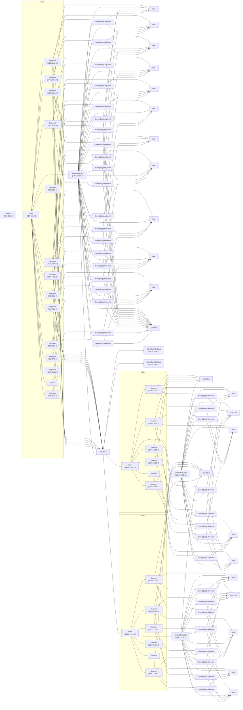

```mermaid
flowchart LR
  subgraph path2 [Path]
    2["Path<br>[537, 580, 0]"]
    3["Segment<br>[586, 625, 0]"]
    4["Segment<br>[631, 696, 0]"]
    5["Segment<br>[702, 778, 0]"]
    6["Segment<br>[784, 853, 0]"]
    7["Segment<br>[859, 899, 0]"]
    8["Segment<br>[905, 941, 0]"]
    9["Segment<br>[981, 1011, 0]"]
    10["Segment<br>[1017, 1046, 0]"]
    11["Segment<br>[1052, 1081, 0]"]
    12["Segment<br>[1087, 1116, 0]"]
    13["Segment<br>[1122, 1189, 0]"]
    14["Segment<br>[1195, 1251, 0]"]
    15["Segment<br>[1257, 1264, 0]"]
    16[Solid2d]
  end
  subgraph path52 [Path]
    52["Path<br>[1424, 1524, 0]"]
    53["Segment<br>[1530, 1577, 0]"]
    54["Segment<br>[1583, 1695, 0]"]
    55["Segment<br>[1701, 1818, 0]"]
    56["Segment<br>[1824, 1880, 0]"]
    57["Segment<br>[1886, 1893, 0]"]
    58[Solid2d]
  end
  subgraph path74 [Path]
    74["Path<br>[2055, 2154, 0]"]
    75["Segment<br>[2160, 2206, 0]"]
    76["Segment<br>[2212, 2295, 0]"]
    77["Segment<br>[2301, 2389, 0]"]
    78["Segment<br>[2395, 2451, 0]"]
    79["Segment<br>[2457, 2464, 0]"]
    80[Solid2d]
  end
  1["Plane<br>[514, 531, 0]"]
  17["Sweep Extrusion<br>[1307, 1337, 0]"]
  18[Wall]
  19[Wall]
  20[Wall]
  21[Wall]
  22[Wall]
  23[Wall]
  24[Wall]
  25[Wall]
  26[Wall]
  27[Wall]
  28[Wall]
  29["Cap Start"]
  30["Cap End"]
  31["SweepEdge Opposite"]
  32["SweepEdge Adjacent"]
  33["SweepEdge Opposite"]
  34["SweepEdge Adjacent"]
  35["SweepEdge Opposite"]
  36["SweepEdge Adjacent"]
  37["SweepEdge Opposite"]
  38["SweepEdge Adjacent"]
  39["SweepEdge Opposite"]
  40["SweepEdge Adjacent"]
  41["SweepEdge Opposite"]
  42["SweepEdge Adjacent"]
  43["SweepEdge Opposite"]
  44["SweepEdge Adjacent"]
  45["SweepEdge Opposite"]
  46["SweepEdge Adjacent"]
  47["SweepEdge Opposite"]
  48["SweepEdge Adjacent"]
  49["SweepEdge Opposite"]
  50["SweepEdge Adjacent"]
  51["SweepEdge Opposite"]
  59["Sweep Extrusion<br>[1937, 1969, 0]"]
  60[Wall]
  61[Wall]
  62[Wall]
  63[Wall]
  64["Cap Start"]
  65["Cap End"]
  66["SweepEdge Opposite"]
  67["SweepEdge Adjacent"]
  68["SweepEdge Opposite"]
  69["SweepEdge Adjacent"]
  70["SweepEdge Opposite"]
  71["SweepEdge Adjacent"]
  72["SweepEdge Opposite"]
  73["SweepEdge Adjacent"]
  81["Sweep Extrusion<br>[2507, 2539, 0]"]
  82[Wall]
  83[Wall]
  84[Wall]
  85[Wall]
  86["Cap Start"]
  87["Cap End"]
  88["SweepEdge Opposite"]
  89["SweepEdge Adjacent"]
  90["SweepEdge Opposite"]
  91["SweepEdge Adjacent"]
  92["SweepEdge Opposite"]
  93["SweepEdge Adjacent"]
  94["SweepEdge Opposite"]
  95["SweepEdge Adjacent"]
  96["StartSketchOnFace<br>[1379, 1418, 0]"]
  97["StartSketchOnFace<br>[2010, 2049, 0]"]
  1 --- 2
  2 --- 3
  2 --- 4
  2 --- 5
  2 --- 6
  2 --- 7
  2 --- 8
  2 --- 9
  2 --- 10
  2 --- 11
  2 --- 12
  2 --- 13
  2 --- 14
  2 --- 15
  2 ---- 17
  2 --- 16
  3 --- 28
  3 --- 51
  3 --- 32
  3 x--> 29
  4 --- 27
  4 --- 49
  4 --- 50
  4 x--> 29
  5 --- 26
  5 --- 47
  5 --- 48
  5 x--> 29
  6 --- 25
  6 --- 45
  6 --- 46
  6 x--> 29
  7 --- 24
  7 --- 43
  7 --- 44
  7 x--> 29
  9 --- 23
  9 --- 41
  9 --- 42
  9 x--> 29
  10 --- 22
  10 --- 39
  10 --- 40
  10 x--> 29
  11 --- 21
  11 --- 37
  11 --- 38
  11 x--> 29
  12 --- 20
  12 --- 35
  12 --- 36
  12 x--> 29
  13 --- 19
  13 --- 33
  13 --- 34
  13 x--> 29
  14 --- 18
  14 --- 31
  14 x--> 32
  14 x--> 29
  17 --- 18
  17 --- 19
  17 --- 20
  17 --- 21
  17 --- 22
  17 --- 23
  17 --- 24
  17 --- 25
  17 --- 26
  17 --- 27
  17 --- 28
  17 --- 29
  17 --- 30
  17 --- 31
  17 --- 32
  17 --- 33
  17 --- 34
  17 --- 35
  17 --- 36
  17 --- 37
  17 --- 38
  17 --- 39
  17 --- 40
  17 --- 41
  17 --- 42
  17 --- 43
  17 --- 44
  17 --- 45
  17 --- 46
  17 --- 47
  17 --- 48
  17 --- 49
  17 --- 50
  17 --- 51
  29 --- 52
  29 --- 74
  31 <--x 18
  31 <--x 30
  32 <--x 18
  32 <--x 28
  33 <--x 19
  33 <--x 30
  34 <--x 18
  34 <--x 19
  35 <--x 20
  35 <--x 30
  36 <--x 19
  36 <--x 20
  37 <--x 21
  37 <--x 30
  38 <--x 20
  38 <--x 21
  39 <--x 22
  39 <--x 30
  40 <--x 21
  40 <--x 22
  41 <--x 23
  41 <--x 30
  42 <--x 22
  42 <--x 23
  43 <--x 24
  43 <--x 30
  44 <--x 24
  44 <--x 25
  45 <--x 25
  45 <--x 30
  46 <--x 25
  46 <--x 26
  47 <--x 26
  47 <--x 30
  48 <--x 26
  48 <--x 27
  49 <--x 27
  49 <--x 30
  50 <--x 27
  50 <--x 28
  51 <--x 28
  51 <--x 30
  52 --- 53
  52 --- 54
  52 --- 55
  52 --- 56
  52 --- 57
  52 ---- 59
  52 --- 58
  53 --- 60
  53 --- 66
  53 --- 67
  53 x--> 64
  54 --- 61
  54 --- 68
  54 --- 69
  54 x--> 64
  55 --- 62
  55 --- 70
  55 --- 71
  55 x--> 64
  56 --- 63
  56 --- 72
  56 --- 73
  56 x--> 64
  59 --- 60
  59 --- 61
  59 --- 62
  59 --- 63
  59 --- 64
  59 --- 65
  59 --- 66
  59 --- 67
  59 --- 68
  59 --- 69
  59 --- 70
  59 --- 71
  59 --- 72
  59 --- 73
  66 <--x 60
  66 <--x 65
  67 <--x 60
  67 <--x 61
  68 <--x 61
  68 <--x 65
  69 <--x 61
  69 <--x 62
  70 <--x 62
  70 <--x 65
  71 <--x 62
  71 <--x 63
  72 <--x 63
  72 <--x 65
  73 <--x 60
  73 <--x 63
  74 --- 75
  74 --- 76
  74 --- 77
  74 --- 78
  74 --- 79
  74 ---- 81
  74 --- 80
  75 --- 85
  75 --- 94
  75 --- 95
  75 x--> 86
  76 --- 84
  76 --- 92
  76 --- 93
  76 x--> 86
  77 --- 83
  77 --- 90
  77 --- 91
  77 x--> 86
  78 --- 82
  78 --- 88
  78 --- 89
  78 x--> 86
  81 --- 82
  81 --- 83
  81 --- 84
  81 --- 85
  81 --- 86
  81 --- 87
  81 --- 88
  81 --- 89
  81 --- 90
  81 --- 91
  81 --- 92
  81 --- 93
  81 --- 94
  81 --- 95
  88 <--x 82
  88 <--x 87
  89 <--x 82
  89 <--x 83
  90 <--x 83
  90 <--x 87
  91 <--x 83
  91 <--x 84
  92 <--x 84
  92 <--x 87
  93 <--x 84
  93 <--x 85
  94 <--x 85
  94 <--x 87
  95 <--x 82
  95 <--x 85
  29 <--x 96
  29 <--x 97
```
