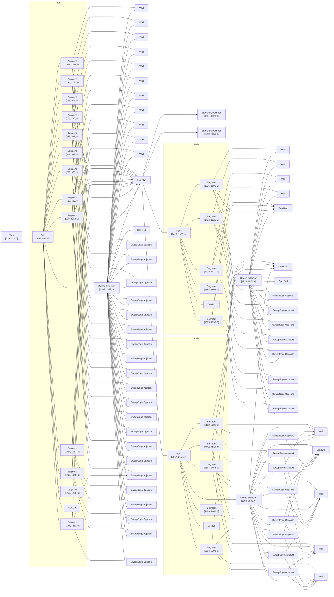

```mermaid
flowchart LR
  subgraph path4 [Path]
    4["Path<br>[539, 582, 0]"]
    7["Segment<br>[588, 627, 0]"]
    8["Segment<br>[633, 698, 0]"]
    9["Segment<br>[704, 780, 0]"]
    10["Segment<br>[786, 855, 0]"]
    11["Segment<br>[861, 901, 0]"]
    12["Segment<br>[907, 943, 0]"]
    13["Segment<br>[983, 1013, 0]"]
    14["Segment<br>[1019, 1048, 0]"]
    15["Segment<br>[1054, 1083, 0]"]
    16["Segment<br>[1089, 1118, 0]"]
    17["Segment<br>[1124, 1191, 0]"]
    18["Segment<br>[1197, 1253, 0]"]
    19["Segment<br>[1259, 1266, 0]"]
    31[Solid2d]
  end
  subgraph path5 [Path]
    5["Path<br>[1426, 1526, 0]"]
    20["Segment<br>[1532, 1579, 0]"]
    21["Segment<br>[1585, 1697, 0]"]
    22["Segment<br>[1703, 1820, 0]"]
    23["Segment<br>[1826, 1882, 0]"]
    24["Segment<br>[1888, 1895, 0]"]
    30[Solid2d]
  end
  subgraph path6 [Path]
    6["Path<br>[2057, 2156, 0]"]
    25["Segment<br>[2162, 2208, 0]"]
    26["Segment<br>[2214, 2297, 0]"]
    27["Segment<br>[2303, 2391, 0]"]
    28["Segment<br>[2397, 2453, 0]"]
    29["Segment<br>[2459, 2466, 0]"]
    32[Solid2d]
  end
  1["Plane<br>[516, 533, 0]"]
  2["StartSketchOnFace<br>[1381, 1420, 0]"]
  3["StartSketchOnFace<br>[2012, 2051, 0]"]
  33["Sweep Extrusion<br>[1309, 1339, 0]"]
  34["Sweep Extrusion<br>[1939, 1971, 0]"]
  35["Sweep Extrusion<br>[2509, 2541, 0]"]
  36[Wall]
  37[Wall]
  38[Wall]
  39[Wall]
  40[Wall]
  41[Wall]
  42[Wall]
  43[Wall]
  44[Wall]
  45[Wall]
  46[Wall]
  47[Wall]
  48[Wall]
  49[Wall]
  50[Wall]
  51[Wall]
  52[Wall]
  53[Wall]
  54[Wall]
  55["Cap Start"]
  56["Cap Start"]
  57["Cap Start"]
  58["Cap End"]
  59["Cap End"]
  60["Cap End"]
  61["SweepEdge Opposite"]
  62["SweepEdge Adjacent"]
  63["SweepEdge Opposite"]
  64["SweepEdge Adjacent"]
  65["SweepEdge Opposite"]
  66["SweepEdge Adjacent"]
  67["SweepEdge Opposite"]
  68["SweepEdge Adjacent"]
  69["SweepEdge Opposite"]
  70["SweepEdge Adjacent"]
  71["SweepEdge Opposite"]
  72["SweepEdge Adjacent"]
  73["SweepEdge Opposite"]
  74["SweepEdge Adjacent"]
  75["SweepEdge Opposite"]
  76["SweepEdge Adjacent"]
  77["SweepEdge Opposite"]
  78["SweepEdge Adjacent"]
  79["SweepEdge Opposite"]
  80["SweepEdge Adjacent"]
  81["SweepEdge Opposite"]
  82["SweepEdge Opposite"]
  83["SweepEdge Adjacent"]
  84["SweepEdge Opposite"]
  85["SweepEdge Adjacent"]
  86["SweepEdge Opposite"]
  87["SweepEdge Adjacent"]
  88["SweepEdge Opposite"]
  89["SweepEdge Adjacent"]
  90["SweepEdge Opposite"]
  91["SweepEdge Adjacent"]
  92["SweepEdge Opposite"]
  93["SweepEdge Adjacent"]
  94["SweepEdge Opposite"]
  95["SweepEdge Adjacent"]
  96["SweepEdge Opposite"]
  97["SweepEdge Adjacent"]
  1 --- 4
  55 x--> 2
  55 x--> 3
  4 --- 7
  4 --- 8
  4 --- 9
  4 --- 10
  4 --- 11
  4 --- 12
  4 --- 13
  4 --- 14
  4 --- 15
  4 --- 16
  4 --- 17
  4 --- 18
  4 --- 19
  4 --- 31
  4 ---- 33
  5 --- 20
  5 --- 21
  5 --- 22
  5 --- 23
  5 --- 24
  5 --- 30
  5 ---- 34
  55 --- 5
  6 --- 25
  6 --- 26
  6 --- 27
  6 --- 28
  6 --- 29
  6 --- 32
  6 ---- 35
  55 --- 6
  7 --- 43
  7 x--> 55
  7 --- 75
  7 --- 76
  8 --- 40
  8 x--> 55
  8 --- 69
  8 --- 70
  9 --- 39
  9 x--> 55
  9 --- 67
  9 --- 68
  10 --- 41
  10 x--> 55
  10 --- 71
  10 --- 72
  11 --- 38
  11 x--> 55
  11 --- 65
  11 --- 66
  13 --- 42
  13 x--> 55
  13 --- 73
  13 --- 74
  14 --- 45
  14 x--> 55
  14 --- 79
  14 --- 80
  15 --- 44
  15 x--> 55
  15 --- 77
  15 --- 78
  16 --- 36
  16 x--> 55
  16 --- 61
  16 --- 62
  17 --- 37
  17 x--> 55
  17 --- 63
  17 --- 64
  18 --- 46
  18 x--> 55
  18 x--> 76
  18 --- 81
  20 --- 49
  20 x--> 56
  20 --- 86
  20 --- 87
  21 --- 50
  21 x--> 56
  21 --- 88
  21 --- 89
  22 --- 48
  22 x--> 56
  22 --- 84
  22 --- 85
  23 --- 47
  23 x--> 56
  23 --- 82
  23 --- 83
  25 --- 52
  25 x--> 57
  25 --- 92
  25 --- 93
  26 --- 51
  26 x--> 57
  26 --- 90
  26 --- 91
  27 --- 53
  27 x--> 57
  27 --- 94
  27 --- 95
  28 --- 54
  28 x--> 57
  28 --- 96
  28 --- 97
  33 --- 36
  33 --- 37
  33 --- 38
  33 --- 39
  33 --- 40
  33 --- 41
  33 --- 42
  33 --- 43
  33 --- 44
  33 --- 45
  33 --- 46
  33 --- 55
  33 --- 58
  33 --- 61
  33 --- 62
  33 --- 63
  33 --- 64
  33 --- 65
  33 --- 66
  33 --- 67
  33 --- 68
  33 --- 69
  33 --- 70
  33 --- 71
  33 --- 72
  33 --- 73
  33 --- 74
  33 --- 75
  33 --- 76
  33 --- 77
  33 --- 78
  33 --- 79
  33 --- 80
  33 --- 81
  34 --- 47
  34 --- 48
  34 --- 49
  34 --- 50
  34 --- 56
  34 --- 59
  34 --- 82
  34 --- 83
  34 --- 84
  34 --- 85
  34 --- 86
  34 --- 87
  34 --- 88
  34 --- 89
  35 --- 51
  35 --- 52
  35 --- 53
  35 --- 54
  35 --- 57
  35 --- 60
  35 --- 90
  35 --- 91
  35 --- 92
  35 --- 93
  35 --- 94
  35 --- 95
  35 --- 96
  35 --- 97
  90 <--x 51
  91 <--x 51
  95 <--x 51
  91 <--x 52
  92 <--x 52
  93 <--x 52
  94 <--x 53
  95 <--x 53
  97 <--x 53
  93 <--x 54
  96 <--x 54
  97 <--x 54
  90 <--x 60
  92 <--x 60
  94 <--x 60
  96 <--x 60
```
