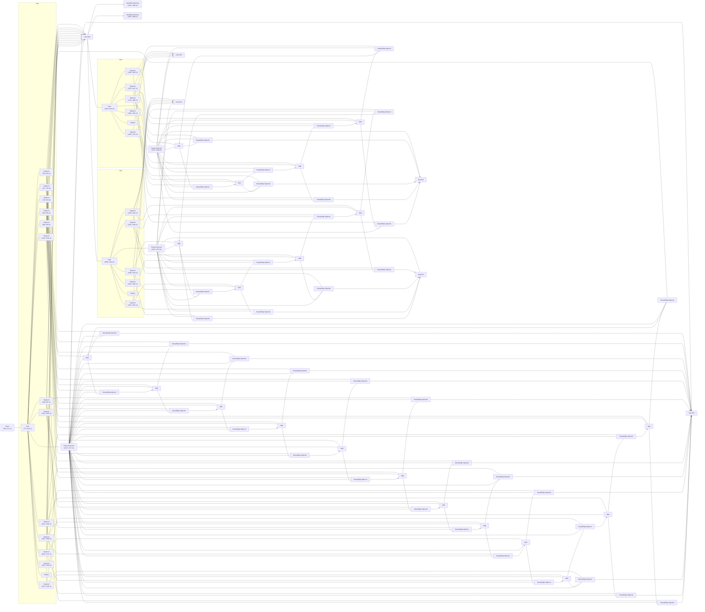

```mermaid
flowchart LR
  subgraph path2 [Path]
    2["Path<br>[577, 620, 0]"]
      %% [ProgramBodyItem { index: 10 }, VariableDeclarationDeclaration, VariableDeclarationInit, PipeBodyItem { index: 1 }]
    3["Segment<br>[626, 665, 0]"]
      %% [ProgramBodyItem { index: 10 }, VariableDeclarationDeclaration, VariableDeclarationInit, PipeBodyItem { index: 2 }]
    4["Segment<br>[671, 736, 0]"]
      %% [ProgramBodyItem { index: 10 }, VariableDeclarationDeclaration, VariableDeclarationInit, PipeBodyItem { index: 3 }]
    5["Segment<br>[742, 818, 0]"]
      %% [ProgramBodyItem { index: 10 }, VariableDeclarationDeclaration, VariableDeclarationInit, PipeBodyItem { index: 4 }]
    6["Segment<br>[824, 893, 0]"]
      %% [ProgramBodyItem { index: 10 }, VariableDeclarationDeclaration, VariableDeclarationInit, PipeBodyItem { index: 5 }]
    7["Segment<br>[899, 939, 0]"]
      %% [ProgramBodyItem { index: 10 }, VariableDeclarationDeclaration, VariableDeclarationInit, PipeBodyItem { index: 6 }]
    8["Segment<br>[945, 981, 0]"]
      %% [ProgramBodyItem { index: 10 }, VariableDeclarationDeclaration, VariableDeclarationInit, PipeBodyItem { index: 7 }]
    9["Segment<br>[1021, 1051, 0]"]
      %% [ProgramBodyItem { index: 10 }, VariableDeclarationDeclaration, VariableDeclarationInit, PipeBodyItem { index: 8 }]
    10["Segment<br>[1057, 1086, 0]"]
      %% [ProgramBodyItem { index: 10 }, VariableDeclarationDeclaration, VariableDeclarationInit, PipeBodyItem { index: 9 }]
    11["Segment<br>[1092, 1121, 0]"]
      %% [ProgramBodyItem { index: 10 }, VariableDeclarationDeclaration, VariableDeclarationInit, PipeBodyItem { index: 10 }]
    12["Segment<br>[1127, 1156, 0]"]
      %% [ProgramBodyItem { index: 10 }, VariableDeclarationDeclaration, VariableDeclarationInit, PipeBodyItem { index: 11 }]
    13["Segment<br>[1162, 1229, 0]"]
      %% [ProgramBodyItem { index: 10 }, VariableDeclarationDeclaration, VariableDeclarationInit, PipeBodyItem { index: 12 }]
    14["Segment<br>[1235, 1291, 0]"]
      %% [ProgramBodyItem { index: 10 }, VariableDeclarationDeclaration, VariableDeclarationInit, PipeBodyItem { index: 13 }]
    15["Segment<br>[1297, 1304, 0]"]
      %% [ProgramBodyItem { index: 10 }, VariableDeclarationDeclaration, VariableDeclarationInit, PipeBodyItem { index: 14 }]
    16[Solid2d]
  end
  subgraph path56 [Path]
    56["Path<br>[1464, 1564, 0]"]
      %% [ProgramBodyItem { index: 12 }, VariableDeclarationDeclaration, VariableDeclarationInit, PipeBodyItem { index: 1 }]
    57["Segment<br>[1570, 1617, 0]"]
      %% [ProgramBodyItem { index: 12 }, VariableDeclarationDeclaration, VariableDeclarationInit, PipeBodyItem { index: 2 }]
    58["Segment<br>[1623, 1735, 0]"]
      %% [ProgramBodyItem { index: 12 }, VariableDeclarationDeclaration, VariableDeclarationInit, PipeBodyItem { index: 3 }]
    59["Segment<br>[1741, 1858, 0]"]
      %% [ProgramBodyItem { index: 12 }, VariableDeclarationDeclaration, VariableDeclarationInit, PipeBodyItem { index: 4 }]
    60["Segment<br>[1864, 1920, 0]"]
      %% [ProgramBodyItem { index: 12 }, VariableDeclarationDeclaration, VariableDeclarationInit, PipeBodyItem { index: 5 }]
    61["Segment<br>[1926, 1933, 0]"]
      %% [ProgramBodyItem { index: 12 }, VariableDeclarationDeclaration, VariableDeclarationInit, PipeBodyItem { index: 6 }]
    62[Solid2d]
  end
  subgraph path78 [Path]
    78["Path<br>[2095, 2194, 0]"]
      %% [ProgramBodyItem { index: 14 }, VariableDeclarationDeclaration, VariableDeclarationInit, PipeBodyItem { index: 1 }]
    79["Segment<br>[2200, 2246, 0]"]
      %% [ProgramBodyItem { index: 14 }, VariableDeclarationDeclaration, VariableDeclarationInit, PipeBodyItem { index: 2 }]
    80["Segment<br>[2252, 2335, 0]"]
      %% [ProgramBodyItem { index: 14 }, VariableDeclarationDeclaration, VariableDeclarationInit, PipeBodyItem { index: 3 }]
    81["Segment<br>[2341, 2429, 0]"]
      %% [ProgramBodyItem { index: 14 }, VariableDeclarationDeclaration, VariableDeclarationInit, PipeBodyItem { index: 4 }]
    82["Segment<br>[2435, 2491, 0]"]
      %% [ProgramBodyItem { index: 14 }, VariableDeclarationDeclaration, VariableDeclarationInit, PipeBodyItem { index: 5 }]
    83["Segment<br>[2497, 2504, 0]"]
      %% [ProgramBodyItem { index: 14 }, VariableDeclarationDeclaration, VariableDeclarationInit, PipeBodyItem { index: 6 }]
    84[Solid2d]
  end
  1["Plane<br>[554, 571, 0]"]
    %% [ProgramBodyItem { index: 10 }, VariableDeclarationDeclaration, VariableDeclarationInit, PipeBodyItem { index: 0 }]
  17["Sweep Extrusion<br>[1347, 1377, 0]"]
    %% [ProgramBodyItem { index: 11 }, VariableDeclarationDeclaration, VariableDeclarationInit]
  18[Wall]
    %% face_code_ref=Missing NodePath
  19[Wall]
    %% face_code_ref=Missing NodePath
  20[Wall]
    %% face_code_ref=Missing NodePath
  21[Wall]
    %% face_code_ref=Missing NodePath
  22[Wall]
    %% face_code_ref=Missing NodePath
  23[Wall]
    %% face_code_ref=Missing NodePath
  24[Wall]
    %% face_code_ref=Missing NodePath
  25[Wall]
    %% face_code_ref=Missing NodePath
  26[Wall]
    %% face_code_ref=Missing NodePath
  27[Wall]
    %% face_code_ref=Missing NodePath
  28[Wall]
    %% face_code_ref=Missing NodePath
  29[Wall]
    %% face_code_ref=Missing NodePath
  30["Cap Start"]
    %% face_code_ref=[ProgramBodyItem { index: 12 }, VariableDeclarationDeclaration, VariableDeclarationInit, PipeBodyItem { index: 0 }]
  31["Cap End"]
    %% face_code_ref=Missing NodePath
  32["SweepEdge Opposite"]
  33["SweepEdge Adjacent"]
  34["SweepEdge Opposite"]
  35["SweepEdge Adjacent"]
  36["SweepEdge Opposite"]
  37["SweepEdge Adjacent"]
  38["SweepEdge Opposite"]
  39["SweepEdge Adjacent"]
  40["SweepEdge Opposite"]
  41["SweepEdge Adjacent"]
  42["SweepEdge Opposite"]
  43["SweepEdge Adjacent"]
  44["SweepEdge Opposite"]
  45["SweepEdge Adjacent"]
  46["SweepEdge Opposite"]
  47["SweepEdge Adjacent"]
  48["SweepEdge Opposite"]
  49["SweepEdge Adjacent"]
  50["SweepEdge Opposite"]
  51["SweepEdge Adjacent"]
  52["SweepEdge Opposite"]
  53["SweepEdge Adjacent"]
  54["SweepEdge Opposite"]
  55["SweepEdge Adjacent"]
  63["Sweep Extrusion<br>[1977, 2009, 0]"]
    %% [ProgramBodyItem { index: 13 }, VariableDeclarationDeclaration, VariableDeclarationInit]
  64[Wall]
    %% face_code_ref=Missing NodePath
  65[Wall]
    %% face_code_ref=Missing NodePath
  66[Wall]
    %% face_code_ref=Missing NodePath
  67[Wall]
    %% face_code_ref=Missing NodePath
  68["Cap Start"]
    %% face_code_ref=Missing NodePath
  69["Cap End"]
    %% face_code_ref=Missing NodePath
  70["SweepEdge Opposite"]
  71["SweepEdge Adjacent"]
  72["SweepEdge Opposite"]
  73["SweepEdge Adjacent"]
  74["SweepEdge Opposite"]
  75["SweepEdge Adjacent"]
  76["SweepEdge Opposite"]
  77["SweepEdge Adjacent"]
  85["Sweep Extrusion<br>[2547, 2579, 0]"]
    %% [ProgramBodyItem { index: 15 }, VariableDeclarationDeclaration, VariableDeclarationInit]
  86[Wall]
    %% face_code_ref=Missing NodePath
  87[Wall]
    %% face_code_ref=Missing NodePath
  88[Wall]
    %% face_code_ref=Missing NodePath
  89[Wall]
    %% face_code_ref=Missing NodePath
  90["Cap Start"]
    %% face_code_ref=Missing NodePath
  91["Cap End"]
    %% face_code_ref=Missing NodePath
  92["SweepEdge Opposite"]
  93["SweepEdge Adjacent"]
  94["SweepEdge Opposite"]
  95["SweepEdge Adjacent"]
  96["SweepEdge Opposite"]
  97["SweepEdge Adjacent"]
  98["SweepEdge Opposite"]
  99["SweepEdge Adjacent"]
  100["StartSketchOnFace<br>[1419, 1458, 0]"]
    %% [ProgramBodyItem { index: 12 }, VariableDeclarationDeclaration, VariableDeclarationInit, PipeBodyItem { index: 0 }]
  101["StartSketchOnFace<br>[2050, 2089, 0]"]
    %% [ProgramBodyItem { index: 14 }, VariableDeclarationDeclaration, VariableDeclarationInit, PipeBodyItem { index: 0 }]
  1 --- 2
  2 --- 3
  2 --- 4
  2 --- 5
  2 --- 6
  2 --- 7
  2 --- 8
  2 --- 9
  2 --- 10
  2 --- 11
  2 --- 12
  2 --- 13
  2 --- 14
  2 --- 15
  2 --- 16
  2 ---- 17
  3 --- 18
  3 x--> 30
  3 --- 32
  3 --- 33
  4 --- 19
  4 x--> 30
  4 --- 34
  4 --- 35
  5 --- 20
  5 x--> 30
  5 --- 36
  5 --- 37
  6 --- 21
  6 x--> 30
  6 --- 38
  6 --- 39
  7 --- 22
  7 x--> 30
  7 --- 40
  7 --- 41
  8 --- 23
  8 x--> 30
  8 --- 42
  8 --- 43
  9 --- 24
  9 x--> 30
  9 --- 44
  9 --- 45
  10 --- 25
  10 x--> 30
  10 --- 46
  10 --- 47
  11 --- 26
  11 x--> 30
  11 --- 48
  11 --- 49
  12 --- 27
  12 x--> 30
  12 --- 50
  12 --- 51
  13 --- 28
  13 x--> 30
  13 --- 52
  13 --- 53
  14 --- 29
  14 x--> 30
  14 --- 54
  14 --- 55
  17 --- 18
  17 --- 19
  17 --- 20
  17 --- 21
  17 --- 22
  17 --- 23
  17 --- 24
  17 --- 25
  17 --- 26
  17 --- 27
  17 --- 28
  17 --- 29
  17 --- 30
  17 --- 31
  17 --- 32
  17 --- 33
  17 --- 34
  17 --- 35
  17 --- 36
  17 --- 37
  17 --- 38
  17 --- 39
  17 --- 40
  17 --- 41
  17 --- 42
  17 --- 43
  17 --- 44
  17 --- 45
  17 --- 46
  17 --- 47
  17 --- 48
  17 --- 49
  17 --- 50
  17 --- 51
  17 --- 52
  17 --- 53
  17 --- 54
  17 --- 55
  18 --- 32
  18 --- 33
  55 <--x 18
  33 <--x 19
  19 --- 34
  19 --- 35
  35 <--x 20
  20 --- 36
  20 --- 37
  37 <--x 21
  21 --- 38
  21 --- 39
  39 <--x 22
  22 --- 40
  22 --- 41
  41 <--x 23
  23 --- 42
  23 --- 43
  43 <--x 24
  24 --- 44
  24 --- 45
  45 <--x 25
  25 --- 46
  25 --- 47
  47 <--x 26
  26 --- 48
  26 --- 49
  49 <--x 27
  27 --- 50
  27 --- 51
  51 <--x 28
  28 --- 52
  28 --- 53
  53 <--x 29
  29 --- 54
  29 --- 55
  30 --- 56
  30 --- 78
  30 <--x 100
  30 <--x 101
  32 <--x 31
  34 <--x 31
  36 <--x 31
  38 <--x 31
  40 <--x 31
  42 <--x 31
  44 <--x 31
  46 <--x 31
  48 <--x 31
  50 <--x 31
  52 <--x 31
  54 <--x 31
  56 --- 57
  56 --- 58
  56 --- 59
  56 --- 60
  56 --- 61
  56 --- 62
  56 ---- 63
  57 --- 64
  57 x--> 68
  57 --- 70
  57 --- 71
  58 --- 65
  58 x--> 68
  58 --- 72
  58 --- 73
  59 --- 66
  59 x--> 68
  59 --- 74
  59 --- 75
  60 --- 67
  60 x--> 68
  60 --- 76
  60 --- 77
  63 --- 64
  63 --- 65
  63 --- 66
  63 --- 67
  63 --- 68
  63 --- 69
  63 --- 70
  63 --- 71
  63 --- 72
  63 --- 73
  63 --- 74
  63 --- 75
  63 --- 76
  63 --- 77
  64 --- 70
  64 --- 71
  77 <--x 64
  71 <--x 65
  65 --- 72
  65 --- 73
  73 <--x 66
  66 --- 74
  66 --- 75
  75 <--x 67
  67 --- 76
  67 --- 77
  70 <--x 69
  72 <--x 69
  74 <--x 69
  76 <--x 69
  78 --- 79
  78 --- 80
  78 --- 81
  78 --- 82
  78 --- 83
  78 --- 84
  78 ---- 85
  79 --- 89
  79 x--> 90
  79 --- 98
  79 --- 99
  80 --- 88
  80 x--> 90
  80 --- 96
  80 --- 97
  81 --- 87
  81 x--> 90
  81 --- 94
  81 --- 95
  82 --- 86
  82 x--> 90
  82 --- 92
  82 --- 93
  85 --- 86
  85 --- 87
  85 --- 88
  85 --- 89
  85 --- 90
  85 --- 91
  85 --- 92
  85 --- 93
  85 --- 94
  85 --- 95
  85 --- 96
  85 --- 97
  85 --- 98
  85 --- 99
  86 --- 92
  86 --- 93
  95 <--x 86
  87 --- 94
  87 --- 95
  97 <--x 87
  88 --- 96
  88 --- 97
  99 <--x 88
  93 <--x 89
  89 --- 98
  89 --- 99
  92 <--x 91
  94 <--x 91
  96 <--x 91
  98 <--x 91
```
