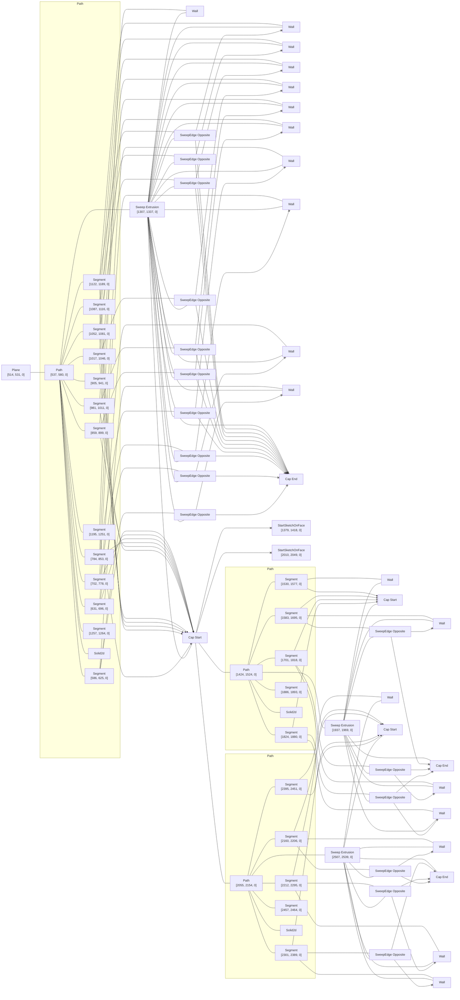

```mermaid
flowchart LR
  subgraph path2 [Path]
    2["Path<br>[537, 580, 0]"]
    3["Segment<br>[586, 625, 0]"]
    4["Segment<br>[631, 696, 0]"]
    5["Segment<br>[702, 778, 0]"]
    6["Segment<br>[784, 853, 0]"]
    7["Segment<br>[859, 899, 0]"]
    8["Segment<br>[905, 941, 0]"]
    9["Segment<br>[981, 1011, 0]"]
    10["Segment<br>[1017, 1046, 0]"]
    11["Segment<br>[1052, 1081, 0]"]
    12["Segment<br>[1087, 1116, 0]"]
    13["Segment<br>[1122, 1189, 0]"]
    14["Segment<br>[1195, 1251, 0]"]
    15["Segment<br>[1257, 1264, 0]"]
    16[Solid2d]
  end
  subgraph path41 [Path]
    41["Path<br>[1424, 1524, 0]"]
    42["Segment<br>[1530, 1577, 0]"]
    43["Segment<br>[1583, 1695, 0]"]
    44["Segment<br>[1701, 1818, 0]"]
    45["Segment<br>[1824, 1880, 0]"]
    46["Segment<br>[1886, 1893, 0]"]
    47[Solid2d]
  end
  subgraph path58 [Path]
    58["Path<br>[2055, 2154, 0]"]
    59["Segment<br>[2160, 2206, 0]"]
    60["Segment<br>[2212, 2295, 0]"]
    61["Segment<br>[2301, 2389, 0]"]
    62["Segment<br>[2395, 2451, 0]"]
    63["Segment<br>[2457, 2464, 0]"]
    64[Solid2d]
  end
  1["Plane<br>[514, 531, 0]"]
  17["Sweep Extrusion<br>[1307, 1337, 0]"]
  18[Wall]
  19[Wall]
  20[Wall]
  21[Wall]
  22[Wall]
  23[Wall]
  24[Wall]
  25[Wall]
  26[Wall]
  27[Wall]
  28[Wall]
  29["Cap Start"]
  30["Cap End"]
  31["SweepEdge Opposite"]
  32["SweepEdge Opposite"]
  33["SweepEdge Opposite"]
  34["SweepEdge Opposite"]
  35["SweepEdge Opposite"]
  36["SweepEdge Opposite"]
  37["SweepEdge Opposite"]
  38["SweepEdge Opposite"]
  39["SweepEdge Opposite"]
  40["SweepEdge Opposite"]
  48["Sweep Extrusion<br>[1937, 1969, 0]"]
  49[Wall]
  50[Wall]
  51[Wall]
  52[Wall]
  53["Cap Start"]
  54["Cap End"]
  55["SweepEdge Opposite"]
  56["SweepEdge Opposite"]
  57["SweepEdge Opposite"]
  65["Sweep Extrusion<br>[2507, 2539, 0]"]
  66[Wall]
  67[Wall]
  68[Wall]
  69[Wall]
  70["Cap Start"]
  71["Cap End"]
  72["SweepEdge Opposite"]
  73["SweepEdge Opposite"]
  74["SweepEdge Opposite"]
  75["StartSketchOnFace<br>[1379, 1418, 0]"]
  76["StartSketchOnFace<br>[2010, 2049, 0]"]
  1 --- 2
  2 --- 3
  2 --- 4
  2 --- 5
  2 --- 6
  2 --- 7
  2 --- 8
  2 --- 9
  2 --- 10
  2 --- 11
  2 --- 12
  2 --- 13
  2 --- 14
  2 --- 15
  2 ---- 17
  2 --- 16
  3 --- 28
  3 --- 40
  3 x--> 29
  4 --- 27
  4 --- 39
  4 x--> 29
  5 --- 26
  5 --- 38
  5 x--> 29
  6 --- 25
  6 --- 37
  6 x--> 29
  7 --- 24
  7 --- 36
  7 x--> 29
  9 --- 23
  9 --- 35
  9 x--> 29
  10 --- 22
  10 --- 34
  10 x--> 29
  11 --- 21
  11 --- 33
  11 x--> 29
  12 --- 20
  12 --- 32
  12 x--> 29
  13 --- 19
  13 --- 31
  13 x--> 29
  14 --- 18
  14 x--> 29
  17 --- 18
  17 --- 19
  17 --- 20
  17 --- 21
  17 --- 22
  17 --- 23
  17 --- 24
  17 --- 25
  17 --- 26
  17 --- 27
  17 --- 28
  17 --- 29
  17 --- 30
  17 --- 31
  17 --- 32
  17 --- 33
  17 --- 34
  17 --- 35
  17 --- 36
  17 --- 37
  17 --- 38
  17 --- 39
  17 --- 40
  29 --- 41
  29 --- 58
  31 <--x 19
  31 <--x 30
  32 <--x 20
  32 <--x 30
  33 <--x 21
  33 <--x 30
  34 <--x 22
  34 <--x 30
  35 <--x 23
  35 <--x 30
  36 <--x 24
  36 <--x 30
  37 <--x 25
  37 <--x 30
  38 <--x 26
  38 <--x 30
  39 <--x 27
  39 <--x 30
  40 <--x 28
  40 <--x 30
  41 --- 42
  41 --- 43
  41 --- 44
  41 --- 45
  41 --- 46
  41 ---- 48
  41 --- 47
  42 --- 49
  42 x--> 53
  43 --- 50
  43 --- 55
  43 x--> 53
  44 --- 51
  44 --- 56
  44 x--> 53
  45 --- 52
  45 --- 57
  45 x--> 53
  48 --- 49
  48 --- 50
  48 --- 51
  48 --- 52
  48 --- 53
  48 --- 54
  48 --- 55
  48 --- 56
  48 --- 57
  55 <--x 50
  55 <--x 54
  56 <--x 51
  56 <--x 54
  57 <--x 52
  57 <--x 54
  58 --- 59
  58 --- 60
  58 --- 61
  58 --- 62
  58 --- 63
  58 ---- 65
  58 --- 64
  59 --- 69
  59 --- 74
  59 x--> 70
  60 --- 68
  60 --- 73
  60 x--> 70
  61 --- 67
  61 --- 72
  61 x--> 70
  62 --- 66
  62 x--> 70
  65 --- 66
  65 --- 67
  65 --- 68
  65 --- 69
  65 --- 70
  65 --- 71
  65 --- 72
  65 --- 73
  65 --- 74
  72 <--x 67
  72 <--x 71
  73 <--x 68
  73 <--x 71
  74 <--x 69
  74 <--x 71
  29 <--x 75
  29 <--x 76
```
