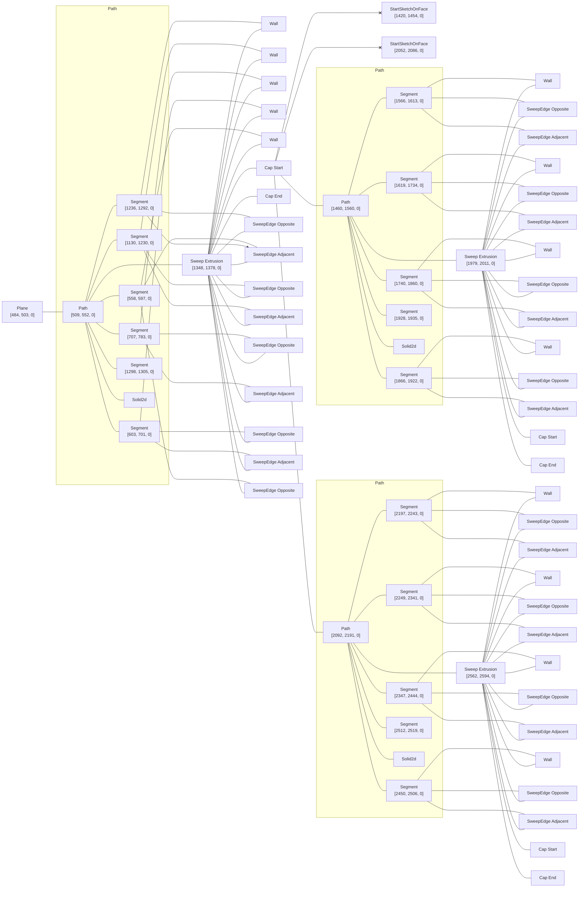

```mermaid
flowchart LR
  subgraph path2 [Path]
    2["Path<br>[509, 552, 0]"]
    3["Segment<br>[558, 597, 0]"]
    4["Segment<br>[603, 701, 0]"]
    5["Segment<br>[707, 783, 0]"]
    6["Segment<br>[1130, 1230, 0]"]
    7["Segment<br>[1236, 1292, 0]"]
    8["Segment<br>[1298, 1305, 0]"]
    9[Solid2d]
  end
  subgraph path27 [Path]
    27["Path<br>[1460, 1560, 0]"]
    28["Segment<br>[1566, 1613, 0]"]
    29["Segment<br>[1619, 1734, 0]"]
    30["Segment<br>[1740, 1860, 0]"]
    31["Segment<br>[1866, 1922, 0]"]
    32["Segment<br>[1928, 1935, 0]"]
    33[Solid2d]
  end
  subgraph path49 [Path]
    49["Path<br>[2092, 2191, 0]"]
    50["Segment<br>[2197, 2243, 0]"]
    51["Segment<br>[2249, 2341, 0]"]
    52["Segment<br>[2347, 2444, 0]"]
    53["Segment<br>[2450, 2506, 0]"]
    54["Segment<br>[2512, 2519, 0]"]
    55[Solid2d]
  end
  1["Plane<br>[484, 503, 0]"]
  10["Sweep Extrusion<br>[1348, 1378, 0]"]
  11[Wall]
  12[Wall]
  13[Wall]
  14[Wall]
  15[Wall]
  16["Cap Start"]
  17["Cap End"]
  18["SweepEdge Opposite"]
  19["SweepEdge Adjacent"]
  20["SweepEdge Opposite"]
  21["SweepEdge Adjacent"]
  22["SweepEdge Opposite"]
  23["SweepEdge Adjacent"]
  24["SweepEdge Opposite"]
  25["SweepEdge Adjacent"]
  26["SweepEdge Opposite"]
  34["Sweep Extrusion<br>[1979, 2011, 0]"]
  35[Wall]
  36[Wall]
  37[Wall]
  38[Wall]
  39["Cap Start"]
  40["Cap End"]
  41["SweepEdge Opposite"]
  42["SweepEdge Adjacent"]
  43["SweepEdge Opposite"]
  44["SweepEdge Adjacent"]
  45["SweepEdge Opposite"]
  46["SweepEdge Adjacent"]
  47["SweepEdge Opposite"]
  48["SweepEdge Adjacent"]
  56["Sweep Extrusion<br>[2562, 2594, 0]"]
  57[Wall]
  58[Wall]
  59[Wall]
  60[Wall]
  61["Cap Start"]
  62["Cap End"]
  63["SweepEdge Opposite"]
  64["SweepEdge Adjacent"]
  65["SweepEdge Opposite"]
  66["SweepEdge Adjacent"]
  67["SweepEdge Opposite"]
  68["SweepEdge Adjacent"]
  69["SweepEdge Opposite"]
  70["SweepEdge Adjacent"]
  71["StartSketchOnFace<br>[1420, 1454, 0]"]
  72["StartSketchOnFace<br>[2052, 2086, 0]"]
  1 --- 2
  2 --- 3
  2 --- 4
  2 --- 5
  2 --- 6
  2 --- 7
  2 --- 8
  2 ---- 10
  2 --- 9
  3 --- 15
  3 --- 26
  3 --- 19
  4 --- 14
  4 --- 24
  4 --- 25
  5 --- 13
  5 --- 22
  5 --- 23
  6 --- 12
  6 --- 20
  6 --- 21
  7 --- 11
  7 --- 18
  7 x--> 19
  10 --- 11
  10 --- 12
  10 --- 13
  10 --- 14
  10 --- 15
  10 --- 16
  10 --- 17
  10 --- 18
  10 --- 19
  10 --- 20
  10 --- 21
  10 --- 22
  10 --- 23
  10 --- 24
  10 --- 25
  10 --- 26
  16 --- 27
  16 --- 49
  27 --- 28
  27 --- 29
  27 --- 30
  27 --- 31
  27 --- 32
  27 ---- 34
  27 --- 33
  28 --- 35
  28 --- 41
  28 --- 42
  29 --- 36
  29 --- 43
  29 --- 44
  30 --- 37
  30 --- 45
  30 --- 46
  31 --- 38
  31 --- 47
  31 --- 48
  34 --- 35
  34 --- 36
  34 --- 37
  34 --- 38
  34 --- 39
  34 --- 40
  34 --- 41
  34 --- 42
  34 --- 43
  34 --- 44
  34 --- 45
  34 --- 46
  34 --- 47
  34 --- 48
  49 --- 50
  49 --- 51
  49 --- 52
  49 --- 53
  49 --- 54
  49 ---- 56
  49 --- 55
  50 --- 60
  50 --- 69
  50 --- 70
  51 --- 59
  51 --- 67
  51 --- 68
  52 --- 58
  52 --- 65
  52 --- 66
  53 --- 57
  53 --- 63
  53 --- 64
  56 --- 57
  56 --- 58
  56 --- 59
  56 --- 60
  56 --- 61
  56 --- 62
  56 --- 63
  56 --- 64
  56 --- 65
  56 --- 66
  56 --- 67
  56 --- 68
  56 --- 69
  56 --- 70
  16 <--x 71
  16 <--x 72
```
