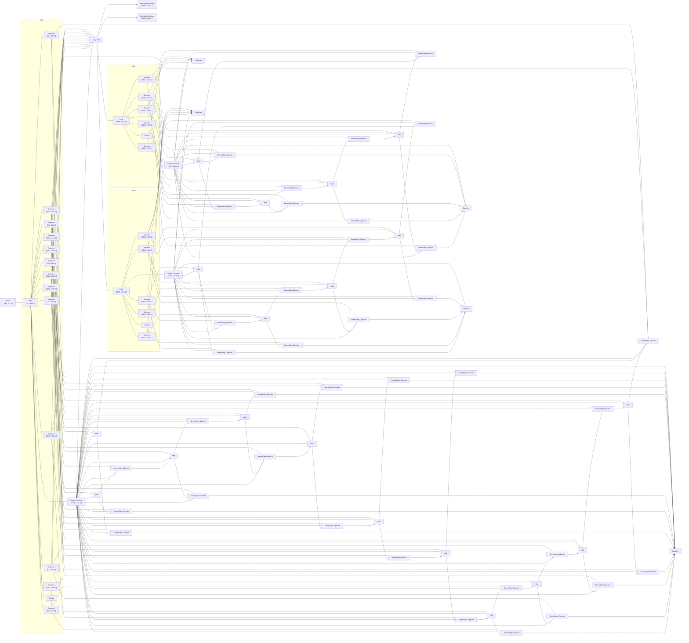

```mermaid
flowchart LR
  subgraph path2 [Path]
    2["Path<br>[577, 620, 0]"]
      %% [ProgramBodyItem { index: 10 }, VariableDeclarationDeclaration, VariableDeclarationInit, PipeBodyItem { index: 1 }]
    3["Segment<br>[626, 665, 0]"]
      %% [ProgramBodyItem { index: 10 }, VariableDeclarationDeclaration, VariableDeclarationInit, PipeBodyItem { index: 2 }]
    4["Segment<br>[671, 736, 0]"]
      %% [ProgramBodyItem { index: 10 }, VariableDeclarationDeclaration, VariableDeclarationInit, PipeBodyItem { index: 3 }]
    5["Segment<br>[742, 818, 0]"]
      %% [ProgramBodyItem { index: 10 }, VariableDeclarationDeclaration, VariableDeclarationInit, PipeBodyItem { index: 4 }]
    6["Segment<br>[824, 893, 0]"]
      %% [ProgramBodyItem { index: 10 }, VariableDeclarationDeclaration, VariableDeclarationInit, PipeBodyItem { index: 5 }]
    7["Segment<br>[899, 939, 0]"]
      %% [ProgramBodyItem { index: 10 }, VariableDeclarationDeclaration, VariableDeclarationInit, PipeBodyItem { index: 6 }]
    8["Segment<br>[945, 981, 0]"]
      %% [ProgramBodyItem { index: 10 }, VariableDeclarationDeclaration, VariableDeclarationInit, PipeBodyItem { index: 7 }]
    9["Segment<br>[1021, 1051, 0]"]
      %% [ProgramBodyItem { index: 10 }, VariableDeclarationDeclaration, VariableDeclarationInit, PipeBodyItem { index: 8 }]
    10["Segment<br>[1057, 1086, 0]"]
      %% [ProgramBodyItem { index: 10 }, VariableDeclarationDeclaration, VariableDeclarationInit, PipeBodyItem { index: 9 }]
    11["Segment<br>[1092, 1121, 0]"]
      %% [ProgramBodyItem { index: 10 }, VariableDeclarationDeclaration, VariableDeclarationInit, PipeBodyItem { index: 10 }]
    12["Segment<br>[1127, 1156, 0]"]
      %% [ProgramBodyItem { index: 10 }, VariableDeclarationDeclaration, VariableDeclarationInit, PipeBodyItem { index: 11 }]
    13["Segment<br>[1162, 1229, 0]"]
      %% [ProgramBodyItem { index: 10 }, VariableDeclarationDeclaration, VariableDeclarationInit, PipeBodyItem { index: 12 }]
    14["Segment<br>[1235, 1291, 0]"]
      %% [ProgramBodyItem { index: 10 }, VariableDeclarationDeclaration, VariableDeclarationInit, PipeBodyItem { index: 13 }]
    15["Segment<br>[1297, 1304, 0]"]
      %% [ProgramBodyItem { index: 10 }, VariableDeclarationDeclaration, VariableDeclarationInit, PipeBodyItem { index: 14 }]
    16[Solid2d]
  end
  subgraph path52 [Path]
    52["Path<br>[1464, 1564, 0]"]
      %% [ProgramBodyItem { index: 12 }, VariableDeclarationDeclaration, VariableDeclarationInit, PipeBodyItem { index: 1 }]
    53["Segment<br>[1570, 1617, 0]"]
      %% [ProgramBodyItem { index: 12 }, VariableDeclarationDeclaration, VariableDeclarationInit, PipeBodyItem { index: 2 }]
    54["Segment<br>[1623, 1735, 0]"]
      %% [ProgramBodyItem { index: 12 }, VariableDeclarationDeclaration, VariableDeclarationInit, PipeBodyItem { index: 3 }]
    55["Segment<br>[1741, 1858, 0]"]
      %% [ProgramBodyItem { index: 12 }, VariableDeclarationDeclaration, VariableDeclarationInit, PipeBodyItem { index: 4 }]
    56["Segment<br>[1864, 1920, 0]"]
      %% [ProgramBodyItem { index: 12 }, VariableDeclarationDeclaration, VariableDeclarationInit, PipeBodyItem { index: 5 }]
    57["Segment<br>[1926, 1933, 0]"]
      %% [ProgramBodyItem { index: 12 }, VariableDeclarationDeclaration, VariableDeclarationInit, PipeBodyItem { index: 6 }]
    58[Solid2d]
  end
  subgraph path74 [Path]
    74["Path<br>[2095, 2194, 0]"]
      %% [ProgramBodyItem { index: 14 }, VariableDeclarationDeclaration, VariableDeclarationInit, PipeBodyItem { index: 1 }]
    75["Segment<br>[2200, 2246, 0]"]
      %% [ProgramBodyItem { index: 14 }, VariableDeclarationDeclaration, VariableDeclarationInit, PipeBodyItem { index: 2 }]
    76["Segment<br>[2252, 2335, 0]"]
      %% [ProgramBodyItem { index: 14 }, VariableDeclarationDeclaration, VariableDeclarationInit, PipeBodyItem { index: 3 }]
    77["Segment<br>[2341, 2429, 0]"]
      %% [ProgramBodyItem { index: 14 }, VariableDeclarationDeclaration, VariableDeclarationInit, PipeBodyItem { index: 4 }]
    78["Segment<br>[2435, 2491, 0]"]
      %% [ProgramBodyItem { index: 14 }, VariableDeclarationDeclaration, VariableDeclarationInit, PipeBodyItem { index: 5 }]
    79["Segment<br>[2497, 2504, 0]"]
      %% [ProgramBodyItem { index: 14 }, VariableDeclarationDeclaration, VariableDeclarationInit, PipeBodyItem { index: 6 }]
    80[Solid2d]
  end
  1["Plane<br>[554, 571, 0]"]
    %% [ProgramBodyItem { index: 10 }, VariableDeclarationDeclaration, VariableDeclarationInit, PipeBodyItem { index: 0 }]
  17["Sweep Extrusion<br>[1347, 1377, 0]"]
    %% [ProgramBodyItem { index: 11 }, VariableDeclarationDeclaration, VariableDeclarationInit]
  18[Wall]
    %% face_code_ref=Missing NodePath
  19[Wall]
    %% face_code_ref=Missing NodePath
  20[Wall]
    %% face_code_ref=Missing NodePath
  21[Wall]
    %% face_code_ref=Missing NodePath
  22[Wall]
    %% face_code_ref=Missing NodePath
  23[Wall]
    %% face_code_ref=Missing NodePath
  24[Wall]
    %% face_code_ref=Missing NodePath
  25[Wall]
    %% face_code_ref=Missing NodePath
  26[Wall]
    %% face_code_ref=Missing NodePath
  27[Wall]
    %% face_code_ref=Missing NodePath
  28[Wall]
    %% face_code_ref=Missing NodePath
  29["Cap Start"]
    %% face_code_ref=[ProgramBodyItem { index: 12 }, VariableDeclarationDeclaration, VariableDeclarationInit, PipeBodyItem { index: 0 }]
  30["Cap End"]
    %% face_code_ref=Missing NodePath
  31["SweepEdge Opposite"]
  32["SweepEdge Adjacent"]
  33["SweepEdge Opposite"]
  34["SweepEdge Adjacent"]
  35["SweepEdge Opposite"]
  36["SweepEdge Adjacent"]
  37["SweepEdge Opposite"]
  38["SweepEdge Adjacent"]
  39["SweepEdge Opposite"]
  40["SweepEdge Adjacent"]
  41["SweepEdge Opposite"]
  42["SweepEdge Adjacent"]
  43["SweepEdge Opposite"]
  44["SweepEdge Adjacent"]
  45["SweepEdge Opposite"]
  46["SweepEdge Opposite"]
  47["SweepEdge Adjacent"]
  48["SweepEdge Opposite"]
  49["SweepEdge Adjacent"]
  50["SweepEdge Opposite"]
  51["SweepEdge Adjacent"]
  59["Sweep Extrusion<br>[1977, 2009, 0]"]
    %% [ProgramBodyItem { index: 13 }, VariableDeclarationDeclaration, VariableDeclarationInit]
  60[Wall]
    %% face_code_ref=Missing NodePath
  61[Wall]
    %% face_code_ref=Missing NodePath
  62[Wall]
    %% face_code_ref=Missing NodePath
  63[Wall]
    %% face_code_ref=Missing NodePath
  64["Cap Start"]
    %% face_code_ref=Missing NodePath
  65["Cap End"]
    %% face_code_ref=Missing NodePath
  66["SweepEdge Opposite"]
  67["SweepEdge Adjacent"]
  68["SweepEdge Opposite"]
  69["SweepEdge Adjacent"]
  70["SweepEdge Opposite"]
  71["SweepEdge Adjacent"]
  72["SweepEdge Opposite"]
  73["SweepEdge Adjacent"]
  81["Sweep Extrusion<br>[2547, 2579, 0]"]
    %% [ProgramBodyItem { index: 15 }, VariableDeclarationDeclaration, VariableDeclarationInit]
  82[Wall]
    %% face_code_ref=Missing NodePath
  83[Wall]
    %% face_code_ref=Missing NodePath
  84[Wall]
    %% face_code_ref=Missing NodePath
  85[Wall]
    %% face_code_ref=Missing NodePath
  86["Cap Start"]
    %% face_code_ref=Missing NodePath
  87["Cap End"]
    %% face_code_ref=Missing NodePath
  88["SweepEdge Opposite"]
  89["SweepEdge Adjacent"]
  90["SweepEdge Opposite"]
  91["SweepEdge Adjacent"]
  92["SweepEdge Opposite"]
  93["SweepEdge Adjacent"]
  94["SweepEdge Opposite"]
  95["SweepEdge Adjacent"]
  96["StartSketchOnFace<br>[1419, 1458, 0]"]
    %% [ProgramBodyItem { index: 12 }, VariableDeclarationDeclaration, VariableDeclarationInit, PipeBodyItem { index: 0 }]
  97["StartSketchOnFace<br>[2050, 2089, 0]"]
    %% [ProgramBodyItem { index: 14 }, VariableDeclarationDeclaration, VariableDeclarationInit, PipeBodyItem { index: 0 }]
  1 --- 2
  2 --- 3
  2 --- 4
  2 --- 5
  2 --- 6
  2 --- 7
  2 --- 8
  2 --- 9
  2 --- 10
  2 --- 11
  2 --- 12
  2 --- 13
  2 --- 14
  2 --- 15
  2 --- 16
  2 ---- 17
  3 --- 28
  3 x--> 29
  3 --- 50
  3 --- 51
  4 --- 27
  4 x--> 29
  4 --- 48
  4 --- 49
  5 --- 26
  5 x--> 29
  5 --- 46
  5 --- 47
  6 --- 25
  6 x--> 29
  6 --- 44
  6 --- 45
  7 --- 24
  7 x--> 29
  7 --- 43
  7 x--> 44
  9 --- 23
  9 x--> 29
  9 --- 41
  9 --- 42
  10 --- 22
  10 x--> 29
  10 --- 39
  10 --- 40
  11 --- 21
  11 x--> 29
  11 --- 37
  11 --- 38
  12 --- 20
  12 x--> 29
  12 --- 35
  12 --- 36
  13 --- 19
  13 x--> 29
  13 --- 33
  13 --- 34
  14 --- 18
  14 x--> 29
  14 --- 31
  14 --- 32
  17 --- 18
  17 --- 19
  17 --- 20
  17 --- 21
  17 --- 22
  17 --- 23
  17 --- 24
  17 --- 25
  17 --- 26
  17 --- 27
  17 --- 28
  17 --- 29
  17 --- 30
  17 --- 31
  17 --- 32
  17 --- 33
  17 --- 34
  17 --- 35
  17 --- 36
  17 --- 37
  17 --- 38
  17 --- 39
  17 --- 40
  17 --- 41
  17 --- 42
  17 --- 43
  17 --- 44
  17 --- 45
  17 --- 46
  17 --- 47
  17 --- 48
  17 --- 49
  17 --- 50
  17 --- 51
  18 --- 31
  18 --- 32
  34 <--x 18
  19 --- 33
  19 --- 34
  36 <--x 19
  20 --- 35
  20 --- 36
  38 <--x 20
  21 --- 37
  21 --- 38
  40 <--x 21
  22 --- 39
  22 --- 40
  42 <--x 22
  23 --- 41
  23 --- 42
  24 --- 43
  24 --- 44
  25 --- 44
  25 --- 45
  47 <--x 25
  26 --- 46
  26 --- 47
  49 <--x 26
  27 --- 48
  27 --- 49
  51 <--x 27
  32 <--x 28
  28 --- 50
  28 --- 51
  29 --- 52
  29 --- 74
  29 <--x 96
  29 <--x 97
  31 <--x 30
  33 <--x 30
  35 <--x 30
  37 <--x 30
  39 <--x 30
  41 <--x 30
  43 <--x 30
  45 <--x 30
  46 <--x 30
  48 <--x 30
  50 <--x 30
  52 --- 53
  52 --- 54
  52 --- 55
  52 --- 56
  52 --- 57
  52 --- 58
  52 ---- 59
  53 --- 60
  53 x--> 64
  53 --- 66
  53 --- 67
  54 --- 61
  54 x--> 64
  54 --- 68
  54 --- 69
  55 --- 62
  55 x--> 64
  55 --- 70
  55 --- 71
  56 --- 63
  56 x--> 64
  56 --- 72
  56 --- 73
  59 --- 60
  59 --- 61
  59 --- 62
  59 --- 63
  59 --- 64
  59 --- 65
  59 --- 66
  59 --- 67
  59 --- 68
  59 --- 69
  59 --- 70
  59 --- 71
  59 --- 72
  59 --- 73
  60 --- 66
  60 --- 67
  73 <--x 60
  67 <--x 61
  61 --- 68
  61 --- 69
  69 <--x 62
  62 --- 70
  62 --- 71
  71 <--x 63
  63 --- 72
  63 --- 73
  66 <--x 65
  68 <--x 65
  70 <--x 65
  72 <--x 65
  74 --- 75
  74 --- 76
  74 --- 77
  74 --- 78
  74 --- 79
  74 --- 80
  74 ---- 81
  75 --- 85
  75 x--> 86
  75 --- 94
  75 --- 95
  76 --- 84
  76 x--> 86
  76 --- 92
  76 --- 93
  77 --- 83
  77 x--> 86
  77 --- 90
  77 --- 91
  78 --- 82
  78 x--> 86
  78 --- 88
  78 --- 89
  81 --- 82
  81 --- 83
  81 --- 84
  81 --- 85
  81 --- 86
  81 --- 87
  81 --- 88
  81 --- 89
  81 --- 90
  81 --- 91
  81 --- 92
  81 --- 93
  81 --- 94
  81 --- 95
  82 --- 88
  82 --- 89
  91 <--x 82
  83 --- 90
  83 --- 91
  93 <--x 83
  84 --- 92
  84 --- 93
  95 <--x 84
  89 <--x 85
  85 --- 94
  85 --- 95
  88 <--x 87
  90 <--x 87
  92 <--x 87
  94 <--x 87
```
