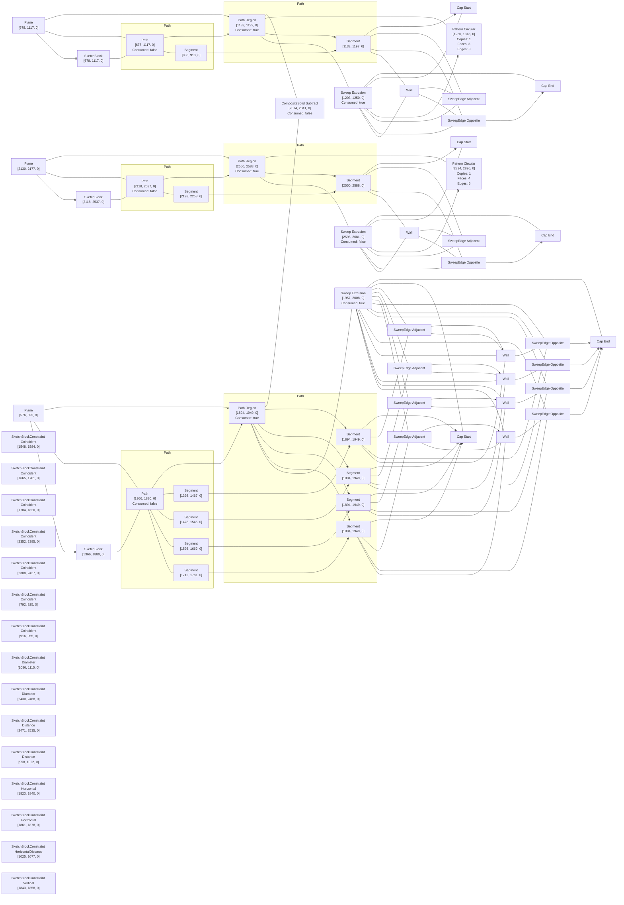

```mermaid
flowchart LR
  subgraph path13 [Path]
    13["Path<br>[678, 1117, 0]<br>Consumed: false"]
      %% [ProgramBodyItem { index: 7 }, VariableDeclarationDeclaration, VariableDeclarationInit]
    30["Segment<br>[838, 913, 0]"]
      %% [ProgramBodyItem { index: 7 }, VariableDeclarationDeclaration, VariableDeclarationInit, SketchBlockBody, SketchBlockBodyItem { index: 2 }, VariableDeclarationDeclaration, VariableDeclarationInit]
  end
  subgraph path8 [Path]
    8["Path Region<br>[1133, 1192, 0]<br>Consumed: true"]
      %% [ProgramBodyItem { index: 8 }, VariableDeclarationDeclaration, VariableDeclarationInit]
    19["Segment<br>[1133, 1192, 0]"]
      %% [ProgramBodyItem { index: 8 }, VariableDeclarationDeclaration, VariableDeclarationInit]
  end
  subgraph path11 [Path]
    11["Path<br>[1366, 1880, 0]<br>Consumed: false"]
      %% [ProgramBodyItem { index: 10 }, VariableDeclarationDeclaration, VariableDeclarationInit]
    20["Segment<br>[1398, 1467, 0]"]
      %% [ProgramBodyItem { index: 10 }, VariableDeclarationDeclaration, VariableDeclarationInit, SketchBlockBody, SketchBlockBodyItem { index: 0 }, VariableDeclarationDeclaration, VariableDeclarationInit]
    21["Segment<br>[1478, 1545, 0]"]
      %% [ProgramBodyItem { index: 10 }, VariableDeclarationDeclaration, VariableDeclarationInit, SketchBlockBody, SketchBlockBodyItem { index: 1 }, VariableDeclarationDeclaration, VariableDeclarationInit]
    22["Segment<br>[1595, 1662, 0]"]
      %% [ProgramBodyItem { index: 10 }, VariableDeclarationDeclaration, VariableDeclarationInit, SketchBlockBody, SketchBlockBodyItem { index: 3 }, VariableDeclarationDeclaration, VariableDeclarationInit]
    23["Segment<br>[1712, 1781, 0]"]
      %% [ProgramBodyItem { index: 10 }, VariableDeclarationDeclaration, VariableDeclarationInit, SketchBlockBody, SketchBlockBodyItem { index: 5 }, VariableDeclarationDeclaration, VariableDeclarationInit]
  end
  subgraph path9 [Path]
    9["Path Region<br>[1894, 1949, 0]<br>Consumed: true"]
      %% [ProgramBodyItem { index: 11 }, VariableDeclarationDeclaration, VariableDeclarationInit]
    24["Segment<br>[1894, 1949, 0]"]
      %% [ProgramBodyItem { index: 11 }, VariableDeclarationDeclaration, VariableDeclarationInit]
    25["Segment<br>[1894, 1949, 0]"]
      %% [ProgramBodyItem { index: 11 }, VariableDeclarationDeclaration, VariableDeclarationInit]
    26["Segment<br>[1894, 1949, 0]"]
      %% [ProgramBodyItem { index: 11 }, VariableDeclarationDeclaration, VariableDeclarationInit]
    27["Segment<br>[1894, 1949, 0]"]
      %% [ProgramBodyItem { index: 11 }, VariableDeclarationDeclaration, VariableDeclarationInit]
  end
  subgraph path12 [Path]
    12["Path<br>[2118, 2537, 0]<br>Consumed: false"]
      %% [ProgramBodyItem { index: 13 }, VariableDeclarationDeclaration, VariableDeclarationInit]
    28["Segment<br>[2193, 2258, 0]"]
      %% [ProgramBodyItem { index: 13 }, VariableDeclarationDeclaration, VariableDeclarationInit, SketchBlockBody, SketchBlockBodyItem { index: 0 }, VariableDeclarationDeclaration, VariableDeclarationInit]
  end
  subgraph path10 [Path]
    10["Path Region<br>[2550, 2588, 0]<br>Consumed: true"]
      %% [ProgramBodyItem { index: 14 }, VariableDeclarationDeclaration, VariableDeclarationInit]
    29["Segment<br>[2550, 2588, 0]"]
      %% [ProgramBodyItem { index: 14 }, VariableDeclarationDeclaration, VariableDeclarationInit]
  end
  17["Plane<br>[576, 593, 0]"]
    %% [ProgramBodyItem { index: 6 }, VariableDeclarationDeclaration, VariableDeclarationInit]
  18["Plane<br>[678, 1117, 0]"]
    %% [ProgramBodyItem { index: 7 }, VariableDeclarationDeclaration, VariableDeclarationInit]
  49["Sweep Extrusion<br>[1203, 1250, 0]<br>Consumed: true"]
    %% [ProgramBodyItem { index: 9 }, VariableDeclarationDeclaration, VariableDeclarationInit, PipeBodyItem { index: 0 }]
  64[Wall]
    %% face_code_ref=Missing NodePath
  4["Cap Start"]
    %% face_code_ref=Missing NodePath
  1["Cap End"]
    %% face_code_ref=Missing NodePath
  58["SweepEdge Opposite"]
  52["SweepEdge Adjacent"]
  14["Pattern Circular<br>[1256, 1318, 0]<br>Copies: 1<br>Faces: 3<br>Edges: 3"]
    %% [ProgramBodyItem { index: 9 }, VariableDeclarationDeclaration, VariableDeclarationInit, PipeBodyItem { index: 1 }]
  50["Sweep Extrusion<br>[1957, 2008, 0]<br>Consumed: true"]
    %% [ProgramBodyItem { index: 12 }, VariableDeclarationDeclaration, VariableDeclarationInit, PipeBodyItem { index: 0 }]
  65[Wall]
    %% face_code_ref=Missing NodePath
  66[Wall]
    %% face_code_ref=Missing NodePath
  67[Wall]
    %% face_code_ref=Missing NodePath
  68[Wall]
    %% face_code_ref=Missing NodePath
  5["Cap Start"]
    %% face_code_ref=Missing NodePath
  2["Cap End"]
    %% face_code_ref=Missing NodePath
  59["SweepEdge Opposite"]
  53["SweepEdge Adjacent"]
  60["SweepEdge Opposite"]
  54["SweepEdge Adjacent"]
  61["SweepEdge Opposite"]
  55["SweepEdge Adjacent"]
  62["SweepEdge Opposite"]
  56["SweepEdge Adjacent"]
  7["CompositeSolid Subtract<br>[2014, 2041, 0]<br>Consumed: false"]
    %% [ProgramBodyItem { index: 12 }, VariableDeclarationDeclaration, VariableDeclarationInit, PipeBodyItem { index: 1 }]
  16["Plane<br>[2130, 2177, 0]"]
    %% [ProgramBodyItem { index: 13 }, VariableDeclarationDeclaration, VariableDeclarationInit, SketchBlockArgs]
  51["Sweep Extrusion<br>[2598, 2681, 0]<br>Consumed: false"]
    %% [ProgramBodyItem { index: 15 }, VariableDeclarationDeclaration, VariableDeclarationInit, PipeBodyItem { index: 0 }]
  69[Wall]
    %% face_code_ref=Missing NodePath
  6["Cap Start"]
    %% face_code_ref=Missing NodePath
  3["Cap End"]
    %% face_code_ref=Missing NodePath
  63["SweepEdge Opposite"]
  57["SweepEdge Adjacent"]
  15["Pattern Circular<br>[2834, 2896, 0]<br>Copies: 1<br>Faces: 4<br>Edges: 5"]
    %% [ProgramBodyItem { index: 15 }, VariableDeclarationDeclaration, VariableDeclarationInit, PipeBodyItem { index: 2 }]
  33["SketchBlock<br>[678, 1117, 0]"]
    %% [ProgramBodyItem { index: 7 }, VariableDeclarationDeclaration, VariableDeclarationInit]
  39["SketchBlockConstraint Coincident<br>[792, 825, 0]"]
    %% [ProgramBodyItem { index: 7 }, VariableDeclarationDeclaration, VariableDeclarationInit, SketchBlockBody, SketchBlockBodyItem { index: 1 }, ExpressionStatementExpr]
  40["SketchBlockConstraint Coincident<br>[916, 955, 0]"]
    %% [ProgramBodyItem { index: 7 }, VariableDeclarationDeclaration, VariableDeclarationInit, SketchBlockBody, SketchBlockBodyItem { index: 3 }, ExpressionStatementExpr]
  44["SketchBlockConstraint Distance<br>[958, 1022, 0]"]
    %% [ProgramBodyItem { index: 7 }, VariableDeclarationDeclaration, VariableDeclarationInit, SketchBlockBody, SketchBlockBodyItem { index: 4 }, ExpressionStatementExpr]
  47["SketchBlockConstraint HorizontalDistance<br>[1025, 1077, 0]"]
    %% [ProgramBodyItem { index: 7 }, VariableDeclarationDeclaration, VariableDeclarationInit, SketchBlockBody, SketchBlockBodyItem { index: 5 }, ExpressionStatementExpr]
  41["SketchBlockConstraint Diameter<br>[1080, 1115, 0]"]
    %% [ProgramBodyItem { index: 7 }, VariableDeclarationDeclaration, VariableDeclarationInit, SketchBlockBody, SketchBlockBodyItem { index: 6 }, ExpressionStatementExpr]
  31["SketchBlock<br>[1366, 1880, 0]"]
    %% [ProgramBodyItem { index: 10 }, VariableDeclarationDeclaration, VariableDeclarationInit]
  34["SketchBlockConstraint Coincident<br>[1548, 1584, 0]"]
    %% [ProgramBodyItem { index: 10 }, VariableDeclarationDeclaration, VariableDeclarationInit, SketchBlockBody, SketchBlockBodyItem { index: 2 }, ExpressionStatementExpr]
  35["SketchBlockConstraint Coincident<br>[1665, 1701, 0]"]
    %% [ProgramBodyItem { index: 10 }, VariableDeclarationDeclaration, VariableDeclarationInit, SketchBlockBody, SketchBlockBodyItem { index: 4 }, ExpressionStatementExpr]
  36["SketchBlockConstraint Coincident<br>[1784, 1820, 0]"]
    %% [ProgramBodyItem { index: 10 }, VariableDeclarationDeclaration, VariableDeclarationInit, SketchBlockBody, SketchBlockBodyItem { index: 6 }, ExpressionStatementExpr]
  45["SketchBlockConstraint Horizontal<br>[1823, 1840, 0]"]
    %% [ProgramBodyItem { index: 10 }, VariableDeclarationDeclaration, VariableDeclarationInit, SketchBlockBody, SketchBlockBodyItem { index: 7 }, ExpressionStatementExpr]
  48["SketchBlockConstraint Vertical<br>[1843, 1858, 0]"]
    %% [ProgramBodyItem { index: 10 }, VariableDeclarationDeclaration, VariableDeclarationInit, SketchBlockBody, SketchBlockBodyItem { index: 8 }, ExpressionStatementExpr]
  46["SketchBlockConstraint Horizontal<br>[1861, 1878, 0]"]
    %% [ProgramBodyItem { index: 10 }, VariableDeclarationDeclaration, VariableDeclarationInit, SketchBlockBody, SketchBlockBodyItem { index: 9 }, ExpressionStatementExpr]
  32["SketchBlock<br>[2118, 2537, 0]"]
    %% [ProgramBodyItem { index: 13 }, VariableDeclarationDeclaration, VariableDeclarationInit]
  37["SketchBlockConstraint Coincident<br>[2352, 2385, 0]"]
    %% [ProgramBodyItem { index: 13 }, VariableDeclarationDeclaration, VariableDeclarationInit, SketchBlockBody, SketchBlockBodyItem { index: 2 }, ExpressionStatementExpr]
  38["SketchBlockConstraint Coincident<br>[2388, 2427, 0]"]
    %% [ProgramBodyItem { index: 13 }, VariableDeclarationDeclaration, VariableDeclarationInit, SketchBlockBody, SketchBlockBodyItem { index: 3 }, ExpressionStatementExpr]
  42["SketchBlockConstraint Diameter<br>[2430, 2468, 0]"]
    %% [ProgramBodyItem { index: 13 }, VariableDeclarationDeclaration, VariableDeclarationInit, SketchBlockBody, SketchBlockBodyItem { index: 4 }, ExpressionStatementExpr]
  43["SketchBlockConstraint Distance<br>[2471, 2535, 0]"]
    %% [ProgramBodyItem { index: 13 }, VariableDeclarationDeclaration, VariableDeclarationInit, SketchBlockBody, SketchBlockBodyItem { index: 5 }, ExpressionStatementExpr]
  49 --- 1
  58 <--x 1
  50 --- 2
  59 <--x 2
  60 <--x 2
  61 <--x 2
  62 <--x 2
  51 --- 3
  63 <--x 3
  19 <--x 4
  49 --- 4
  24 <--x 5
  25 <--x 5
  26 <--x 5
  27 <--x 5
  50 --- 5
  29 <--x 6
  51 --- 6
  8 --- 7
  9 --- 7
  13 x--> 8
  8 --- 14
  18 x--> 8
  8 <--x 19
  8 ---- 49
  11 x--> 9
  17 x--> 9
  9 <--x 24
  9 <--x 25
  9 <--x 26
  9 <--x 27
  9 ---- 50
  12 x--> 10
  10 --- 15
  16 x--> 10
  10 <--x 29
  10 ---- 51
  17 --- 11
  11 --- 20
  11 --- 21
  11 --- 22
  11 --- 23
  31 --- 11
  16 --- 12
  12 --- 28
  32 --- 12
  18 --- 13
  13 --- 30
  33 --- 13
  49 <--x 14
  51 <--x 15
  16 <--x 32
  17 <--x 31
  18 <--x 33
  30 x--> 19
  19 --- 52
  19 --- 58
  19 --- 64
  20 <--x 24
  21 <--x 25
  22 <--x 26
  23 <--x 27
  24 --- 53
  24 --- 59
  24 --- 65
  25 --- 54
  25 --- 60
  25 --- 66
  26 --- 55
  26 --- 61
  26 --- 67
  27 --- 56
  27 --- 62
  27 --- 68
  28 <--x 29
  29 --- 57
  29 --- 63
  29 --- 69
  49 --- 52
  49 --- 58
  49 --- 64
  50 --- 53
  50 --- 54
  50 --- 55
  50 --- 56
  50 --- 59
  50 --- 60
  50 --- 61
  50 --- 62
  50 --- 65
  50 --- 66
  50 --- 67
  50 --- 68
  51 --- 57
  51 --- 63
  51 --- 69
  64 --- 52
  65 --- 53
  53 x--> 65
  66 --- 54
  54 x--> 66
  67 --- 55
  55 x--> 67
  68 --- 56
  56 x--> 68
  69 --- 57
  64 --- 58
  65 --- 59
  66 --- 60
  67 --- 61
  68 --- 62
  69 --- 63
```
