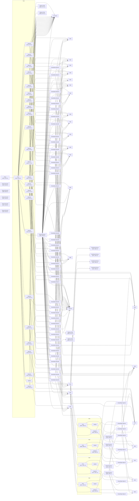

```mermaid
flowchart LR
  subgraph path6 [Path]
    6["Path<br>[1228, 1309, 0]"]
    11["Segment<br>[1315, 1343, 0]"]
    12["Segment<br>[1349, 1410, 0]"]
    13["Segment<br>[1416, 1497, 0]"]
    14["Segment<br>[1503, 1565, 0]"]
    15["Segment<br>[1571, 1607, 0]"]
    16["Segment<br>[1613, 1642, 0]"]
    17["Segment<br>[1648, 1710, 0]"]
    18["Segment<br>[1716, 1770, 0]"]
    19["Segment<br>[1776, 1837, 0]"]
    20["Segment<br>[1843, 1871, 0]"]
    21["Segment<br>[1877, 1916, 0]"]
    22["Segment<br>[1922, 1965, 0]"]
    23["Segment<br>[1971, 2033, 0]"]
    24["Segment<br>[2039, 2098, 0]"]
    25["Segment<br>[2104, 2165, 0]"]
    26["Segment<br>[2171, 2207, 0]"]
    27["Segment<br>[2213, 2243, 0]"]
    28["Segment<br>[2249, 2310, 0]"]
    29["Segment<br>[2316, 2375, 0]"]
    30["Segment<br>[2381, 2443, 0]"]
    31["Segment<br>[2449, 2492, 0]"]
    32["Segment<br>[2498, 2568, 0]"]
    33["Segment<br>[2574, 2581, 0]"]
    40[Solid2d]
  end
  subgraph path7 [Path]
    7["Path<br>[2920, 3009, 0]"]
    34["Segment<br>[2920, 3009, 0]"]
    42[Solid2d]
  end
  subgraph path8 [Path]
    8["Path<br>[3291, 3379, 0]"]
    35["Segment<br>[3291, 3379, 0]"]
    39[Solid2d]
  end
  subgraph path9 [Path]
    9["Path<br>[3668, 3848, 0]"]
    36["Segment<br>[3668, 3848, 0]"]
    38[Solid2d]
  end
  subgraph path10 [Path]
    10["Path<br>[4271, 4327, 0]"]
    37["Segment<br>[4271, 4327, 0]"]
    41[Solid2d]
  end
  1["Plane<br>[1205, 1222, 0]"]
  2["StartSketchOnFace<br>[3619, 3662, 0]"]
  3["StartSketchOnFace<br>[2871, 2914, 0]"]
  4["StartSketchOnFace<br>[4222, 4265, 0]"]
  5["StartSketchOnFace<br>[3242, 3285, 0]"]
  43["Sweep Extrusion<br>[2587, 2620, 0]"]
  44["Sweep Extrusion<br>[3138, 3166, 0]"]
  45["Sweep Extrusion<br>[3138, 3166, 0]"]
  46["Sweep Extrusion<br>[3508, 3536, 0]"]
  47["Sweep Extrusion<br>[3508, 3536, 0]"]
  48["Sweep Extrusion<br>[4102, 4130, 0]"]
  49["Sweep Extrusion<br>[4102, 4130, 0]"]
  50["Sweep Extrusion<br>[4102, 4130, 0]"]
  51["Sweep Extrusion<br>[4102, 4130, 0]"]
  52["Sweep Extrusion<br>[4333, 4361, 0]"]
  53[Wall]
  54[Wall]
  55[Wall]
  56[Wall]
  57[Wall]
  58[Wall]
  59[Wall]
  60[Wall]
  61[Wall]
  62[Wall]
  63[Wall]
  64[Wall]
  65[Wall]
  66[Wall]
  67[Wall]
  68[Wall]
  69[Wall]
  70[Wall]
  71[Wall]
  72[Wall]
  73[Wall]
  74[Wall]
  75[Wall]
  76[Wall]
  77["Cap Start"]
  78["Cap End"]
  79["SweepEdge Opposite"]
  80["SweepEdge Adjacent"]
  81["SweepEdge Opposite"]
  82["SweepEdge Adjacent"]
  83["SweepEdge Opposite"]
  84["SweepEdge Adjacent"]
  85["SweepEdge Opposite"]
  86["SweepEdge Adjacent"]
  87["SweepEdge Opposite"]
  88["SweepEdge Adjacent"]
  89["SweepEdge Opposite"]
  90["SweepEdge Adjacent"]
  91["SweepEdge Opposite"]
  92["SweepEdge Adjacent"]
  93["SweepEdge Opposite"]
  94["SweepEdge Adjacent"]
  95["SweepEdge Opposite"]
  96["SweepEdge Adjacent"]
  97["SweepEdge Opposite"]
  98["SweepEdge Adjacent"]
  99["SweepEdge Opposite"]
  100["SweepEdge Adjacent"]
  101["SweepEdge Opposite"]
  102["SweepEdge Adjacent"]
  103["SweepEdge Opposite"]
  104["SweepEdge Adjacent"]
  105["SweepEdge Opposite"]
  106["SweepEdge Adjacent"]
  107["SweepEdge Opposite"]
  108["SweepEdge Adjacent"]
  109["SweepEdge Opposite"]
  110["SweepEdge Adjacent"]
  111["SweepEdge Opposite"]
  112["SweepEdge Adjacent"]
  113["SweepEdge Opposite"]
  114["SweepEdge Adjacent"]
  115["SweepEdge Opposite"]
  116["SweepEdge Adjacent"]
  117["SweepEdge Opposite"]
  118["SweepEdge Adjacent"]
  119["SweepEdge Opposite"]
  120["SweepEdge Adjacent"]
  121["SweepEdge Opposite"]
  122["SweepEdge Adjacent"]
  123["SweepEdge Opposite"]
  124["SweepEdge Adjacent"]
  125["SweepEdge Opposite"]
  126["SweepEdge Adjacent"]
  127["EdgeCut Fillet<br>[2626, 2797, 0]"]
  128["EdgeCut Fillet<br>[2626, 2797, 0]"]
  129["EdgeCut Fillet<br>[2626, 2797, 0]"]
  130["EdgeCut Fillet<br>[2626, 2797, 0]"]
  1 --- 6
  76 x--> 2
  74 x--> 3
  76 x--> 4
  75 x--> 5
  6 --- 11
  6 --- 12
  6 --- 13
  6 --- 14
  6 --- 15
  6 --- 16
  6 --- 17
  6 --- 18
  6 --- 19
  6 --- 20
  6 --- 21
  6 --- 22
  6 --- 23
  6 --- 24
  6 --- 25
  6 --- 26
  6 --- 27
  6 --- 28
  6 --- 29
  6 --- 30
  6 --- 31
  6 --- 32
  6 --- 33
  6 --- 40
  6 ---- 43
  7 --- 34
  7 --- 42
  7 ---- 44
  74 --- 7
  8 --- 35
  8 --- 39
  8 ---- 47
  75 --- 8
  9 --- 36
  9 --- 38
  9 ---- 48
  76 --- 9
  10 --- 37
  10 --- 41
  10 ---- 52
  76 --- 10
  11 --- 70
  11 x--> 77
  11 --- 117
  11 --- 118
  12 --- 65
  12 x--> 77
  12 --- 103
  12 --- 104
  13 --- 64
  13 x--> 77
  13 --- 101
  13 --- 102
  14 --- 67
  14 x--> 77
  14 --- 109
  14 --- 110
  15 --- 61
  15 x--> 77
  15 --- 95
  15 --- 96
  17 --- 69
  17 x--> 77
  17 --- 115
  17 --- 116
  18 --- 73
  18 x--> 77
  18 --- 123
  18 --- 124
  19 --- 72
  19 x--> 77
  19 --- 121
  19 --- 122
  20 --- 59
  20 x--> 77
  20 --- 91
  20 --- 92
  21 --- 60
  21 x--> 77
  21 --- 93
  21 --- 94
  21 --- 127
  22 --- 74
  22 x--> 77
  22 --- 125
  22 --- 126
  23 --- 68
  23 x--> 77
  23 --- 111
  23 --- 112
  24 --- 62
  24 x--> 77
  24 --- 97
  24 --- 98
  25 --- 58
  25 x--> 77
  25 --- 89
  25 --- 90
  26 --- 76
  26 x--> 77
  26 --- 113
  26 --- 114
  28 --- 71
  28 x--> 77
  28 --- 119
  28 --- 120
  29 --- 57
  29 x--> 77
  29 --- 87
  29 --- 88
  30 --- 66
  30 x--> 77
  30 --- 105
  30 --- 106
  31 --- 75
  31 x--> 77
  31 --- 107
  31 --- 108
  32 --- 63
  32 x--> 77
  32 --- 99
  32 --- 100
  32 --- 129
  34 --- 56
  34 x--> 74
  34 --- 85
  34 --- 86
  35 --- 53
  35 x--> 75
  35 --- 79
  35 --- 80
  36 --- 55
  36 x--> 76
  36 --- 83
  36 --- 84
  37 --- 54
  37 x--> 76
  37 --- 81
  37 --- 82
  43 --- 57
  43 --- 58
  43 --- 59
  43 --- 60
  43 --- 61
  43 --- 62
  43 --- 63
  43 --- 64
  43 --- 65
  43 --- 66
  43 --- 67
  43 --- 68
  43 --- 69
  43 --- 70
  43 --- 71
  43 --- 72
  43 --- 73
  43 --- 74
  43 --- 75
  43 --- 76
  43 --- 77
  43 --- 78
  43 --- 87
  43 --- 88
  43 --- 89
  43 --- 90
  43 --- 91
  43 --- 92
  43 --- 93
  43 --- 94
  43 --- 95
  43 --- 96
  43 --- 97
  43 --- 98
  43 --- 99
  43 --- 100
  43 --- 101
  43 --- 102
  43 --- 103
  43 --- 104
  43 --- 105
  43 --- 106
  43 --- 107
  43 --- 108
  43 --- 109
  43 --- 110
  43 --- 111
  43 --- 112
  43 --- 113
  43 --- 114
  43 --- 115
  43 --- 116
  43 --- 117
  43 --- 118
  43 --- 119
  43 --- 120
  43 --- 121
  43 --- 122
  43 --- 123
  43 --- 124
  43 --- 125
  43 --- 126
  44 --- 56
  44 --- 85
  44 --- 86
  47 --- 53
  47 --- 79
  47 --- 80
  48 --- 55
  48 --- 83
  48 --- 84
  52 --- 54
  52 --- 81
  52 --- 82
  79 <--x 53
  80 <--x 53
  81 <--x 54
  82 <--x 54
  83 <--x 55
  84 <--x 55
  85 <--x 56
  86 <--x 56
  87 <--x 57
  88 <--x 57
  120 <--x 57
  89 <--x 58
  90 <--x 58
  98 <--x 58
  85 <--x 59
  91 <--x 59
  92 <--x 59
  122 <--x 59
  92 <--x 60
  93 <--x 60
  94 <--x 60
  81 <--x 61
  83 <--x 61
  95 <--x 61
  96 <--x 61
  110 <--x 61
  97 <--x 62
  98 <--x 62
  112 <--x 62
  100 <--x 63
  108 <--x 63
  101 <--x 64
  102 <--x 64
  104 <--x 64
  103 <--x 65
  104 <--x 65
  118 <--x 65
  88 <--x 66
  105 <--x 66
  106 <--x 66
  102 <--x 67
  109 <--x 67
  110 <--x 67
  111 <--x 68
  112 <--x 68
  126 <--x 68
  96 <--x 69
  115 <--x 69
  116 <--x 69
  79 <--x 70
  100 <--x 70
  117 <--x 70
  118 <--x 70
  114 <--x 71
  119 <--x 71
  120 <--x 71
  121 <--x 72
  122 <--x 72
  124 <--x 72
  116 <--x 73
  123 <--x 73
  124 <--x 73
  94 <--x 74
  125 <--x 74
  126 <--x 74
  106 <--x 75
  107 <--x 75
  108 <--x 75
  90 <--x 76
  113 <--x 76
  114 <--x 76
  87 <--x 78
  89 <--x 78
  91 <--x 78
  93 <--x 78
  95 <--x 78
  97 <--x 78
  101 <--x 78
  103 <--x 78
  105 <--x 78
  107 <--x 78
  109 <--x 78
  111 <--x 78
  113 <--x 78
  115 <--x 78
  117 <--x 78
  119 <--x 78
  121 <--x 78
  123 <--x 78
  125 <--x 78
  93 <--x 128
  99 <--x 130
```
