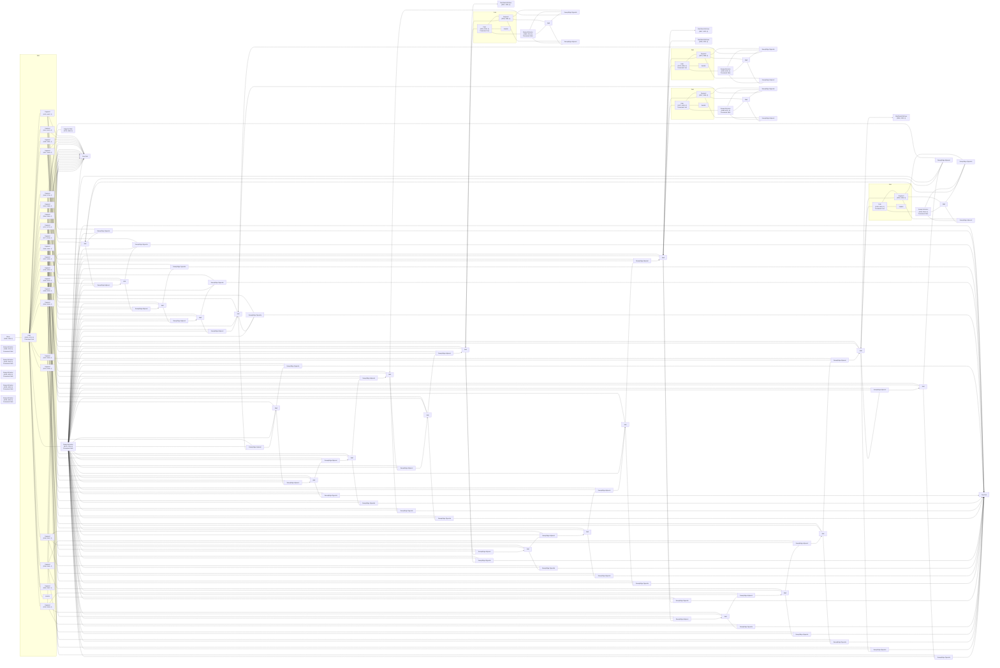

```mermaid
flowchart LR
  subgraph path2 [Path]
    2["Path<br>[1292, 1373, 0]<br>Consumed: true"]
      %% [ProgramBodyItem { index: 14 }, VariableDeclarationDeclaration, VariableDeclarationInit, PipeBodyItem { index: 1 }]
    3["Segment<br>[1379, 1407, 0]"]
      %% [ProgramBodyItem { index: 14 }, VariableDeclarationDeclaration, VariableDeclarationInit, PipeBodyItem { index: 2 }]
    4["Segment<br>[1413, 1474, 0]"]
      %% [ProgramBodyItem { index: 14 }, VariableDeclarationDeclaration, VariableDeclarationInit, PipeBodyItem { index: 3 }]
    5["Segment<br>[1480, 1561, 0]"]
      %% [ProgramBodyItem { index: 14 }, VariableDeclarationDeclaration, VariableDeclarationInit, PipeBodyItem { index: 4 }]
    6["Segment<br>[1567, 1643, 0]"]
      %% [ProgramBodyItem { index: 14 }, VariableDeclarationDeclaration, VariableDeclarationInit, PipeBodyItem { index: 5 }]
    7["Segment<br>[1649, 1706, 0]"]
      %% [ProgramBodyItem { index: 14 }, VariableDeclarationDeclaration, VariableDeclarationInit, PipeBodyItem { index: 6 }]
    8["Segment<br>[1712, 1774, 0]"]
      %% [ProgramBodyItem { index: 14 }, VariableDeclarationDeclaration, VariableDeclarationInit, PipeBodyItem { index: 7 }]
    9["Segment<br>[1780, 1834, 0]"]
      %% [ProgramBodyItem { index: 14 }, VariableDeclarationDeclaration, VariableDeclarationInit, PipeBodyItem { index: 8 }]
    10["Segment<br>[1840, 1901, 0]"]
      %% [ProgramBodyItem { index: 14 }, VariableDeclarationDeclaration, VariableDeclarationInit, PipeBodyItem { index: 9 }]
    11["Segment<br>[1907, 1935, 0]"]
      %% [ProgramBodyItem { index: 14 }, VariableDeclarationDeclaration, VariableDeclarationInit, PipeBodyItem { index: 10 }]
    12["Segment<br>[1941, 1980, 0]"]
      %% [ProgramBodyItem { index: 14 }, VariableDeclarationDeclaration, VariableDeclarationInit, PipeBodyItem { index: 11 }]
    13["Segment<br>[1986, 2029, 0]"]
      %% [ProgramBodyItem { index: 14 }, VariableDeclarationDeclaration, VariableDeclarationInit, PipeBodyItem { index: 12 }]
    14["Segment<br>[2035, 2097, 0]"]
      %% [ProgramBodyItem { index: 14 }, VariableDeclarationDeclaration, VariableDeclarationInit, PipeBodyItem { index: 13 }]
    15["Segment<br>[2103, 2165, 0]"]
      %% [ProgramBodyItem { index: 14 }, VariableDeclarationDeclaration, VariableDeclarationInit, PipeBodyItem { index: 14 }]
    16["Segment<br>[2171, 2246, 0]"]
      %% [ProgramBodyItem { index: 14 }, VariableDeclarationDeclaration, VariableDeclarationInit, PipeBodyItem { index: 15 }]
    17["Segment<br>[2252, 2326, 0]"]
      %% [ProgramBodyItem { index: 14 }, VariableDeclarationDeclaration, VariableDeclarationInit, PipeBodyItem { index: 16 }]
    18["Segment<br>[2332, 2393, 0]"]
      %% [ProgramBodyItem { index: 14 }, VariableDeclarationDeclaration, VariableDeclarationInit, PipeBodyItem { index: 17 }]
    19["Segment<br>[2399, 2461, 0]"]
      %% [ProgramBodyItem { index: 14 }, VariableDeclarationDeclaration, VariableDeclarationInit, PipeBodyItem { index: 18 }]
    20["Segment<br>[2467, 2529, 0]"]
      %% [ProgramBodyItem { index: 14 }, VariableDeclarationDeclaration, VariableDeclarationInit, PipeBodyItem { index: 19 }]
    21["Segment<br>[2535, 2578, 0]"]
      %% [ProgramBodyItem { index: 14 }, VariableDeclarationDeclaration, VariableDeclarationInit, PipeBodyItem { index: 20 }]
    22["Segment<br>[2584, 2654, 0]"]
      %% [ProgramBodyItem { index: 14 }, VariableDeclarationDeclaration, VariableDeclarationInit, PipeBodyItem { index: 21 }]
    23["Segment<br>[2660, 2667, 0]"]
      %% [ProgramBodyItem { index: 14 }, VariableDeclarationDeclaration, VariableDeclarationInit, PipeBodyItem { index: 22 }]
    24[Solid2d]
  end
  subgraph path89 [Path]
    89["Path<br>[3006, 3095, 0]<br>Consumed: true"]
      %% [ProgramBodyItem { index: 15 }, VariableDeclarationDeclaration, VariableDeclarationInit, PipeBodyItem { index: 1 }]
    90["Segment<br>[3006, 3095, 0]"]
      %% [ProgramBodyItem { index: 15 }, VariableDeclarationDeclaration, VariableDeclarationInit, PipeBodyItem { index: 1 }]
    91[Solid2d]
  end
  subgraph path97 [Path]
    97["Path<br>[3338, 3426, 0]<br>Consumed: true"]
      %% [ProgramBodyItem { index: 16 }, VariableDeclarationDeclaration, VariableDeclarationInit, PipeBodyItem { index: 1 }]
    98["Segment<br>[3338, 3426, 0]"]
      %% [ProgramBodyItem { index: 16 }, VariableDeclarationDeclaration, VariableDeclarationInit, PipeBodyItem { index: 1 }]
    99[Solid2d]
  end
  subgraph path105 [Path]
    105["Path<br>[3679, 3859, 0]<br>Consumed: true"]
      %% [ProgramBodyItem { index: 17 }, VariableDeclarationDeclaration, VariableDeclarationInit, PipeBodyItem { index: 1 }]
    106["Segment<br>[3679, 3859, 0]"]
      %% [ProgramBodyItem { index: 17 }, VariableDeclarationDeclaration, VariableDeclarationInit, PipeBodyItem { index: 1 }]
    107[Solid2d]
  end
  subgraph path115 [Path]
    115["Path<br>[4207, 4263, 0]<br>Consumed: true"]
      %% [ProgramBodyItem { index: 18 }, VariableDeclarationDeclaration, VariableDeclarationInit, PipeBodyItem { index: 1 }]
    116["Segment<br>[4207, 4263, 0]"]
      %% [ProgramBodyItem { index: 18 }, VariableDeclarationDeclaration, VariableDeclarationInit, PipeBodyItem { index: 1 }]
    117[Solid2d]
  end
  1["Plane<br>[1269, 1286, 0]"]
    %% [ProgramBodyItem { index: 14 }, VariableDeclarationDeclaration, VariableDeclarationInit, PipeBodyItem { index: 0 }]
  25["Sweep Extrusion<br>[2673, 2706, 0]<br>Consumed: false"]
    %% [ProgramBodyItem { index: 14 }, VariableDeclarationDeclaration, VariableDeclarationInit, PipeBodyItem { index: 23 }]
  26[Wall]
    %% face_code_ref=Missing NodePath
  27[Wall]
    %% face_code_ref=Missing NodePath
  28[Wall]
    %% face_code_ref=Missing NodePath
  29[Wall]
    %% face_code_ref=Missing NodePath
  30[Wall]
    %% face_code_ref=Missing NodePath
  31[Wall]
    %% face_code_ref=Missing NodePath
  32[Wall]
    %% face_code_ref=Missing NodePath
  33[Wall]
    %% face_code_ref=Missing NodePath
  34[Wall]
    %% face_code_ref=Missing NodePath
  35[Wall]
    %% face_code_ref=Missing NodePath
  36[Wall]
    %% face_code_ref=[ProgramBodyItem { index: 15 }, VariableDeclarationDeclaration, VariableDeclarationInit, PipeBodyItem { index: 0 }]
  37[Wall]
    %% face_code_ref=Missing NodePath
  38[Wall]
    %% face_code_ref=Missing NodePath
  39[Wall]
    %% face_code_ref=Missing NodePath
  40[Wall]
    %% face_code_ref=[ProgramBodyItem { index: 17 }, VariableDeclarationDeclaration, VariableDeclarationInit, PipeBodyItem { index: 0 }]
  41[Wall]
    %% face_code_ref=Missing NodePath
  42[Wall]
    %% face_code_ref=Missing NodePath
  43[Wall]
    %% face_code_ref=Missing NodePath
  44[Wall]
    %% face_code_ref=[ProgramBodyItem { index: 16 }, VariableDeclarationDeclaration, VariableDeclarationInit, PipeBodyItem { index: 0 }]
  45[Wall]
    %% face_code_ref=Missing NodePath
  46["Cap Start"]
    %% face_code_ref=Missing NodePath
  47["Cap End"]
    %% face_code_ref=Missing NodePath
  48["SweepEdge Opposite"]
  49["SweepEdge Adjacent"]
  50["SweepEdge Opposite"]
  51["SweepEdge Adjacent"]
  52["SweepEdge Opposite"]
  53["SweepEdge Adjacent"]
  54["SweepEdge Opposite"]
  55["SweepEdge Adjacent"]
  56["SweepEdge Opposite"]
  57["SweepEdge Adjacent"]
  58["SweepEdge Opposite"]
  59["SweepEdge Adjacent"]
  60["SweepEdge Opposite"]
  61["SweepEdge Adjacent"]
  62["SweepEdge Opposite"]
  63["SweepEdge Adjacent"]
  64["SweepEdge Opposite"]
  65["SweepEdge Adjacent"]
  66["SweepEdge Opposite"]
  67["SweepEdge Adjacent"]
  68["SweepEdge Opposite"]
  69["SweepEdge Adjacent"]
  70["SweepEdge Opposite"]
  71["SweepEdge Adjacent"]
  72["SweepEdge Opposite"]
  73["SweepEdge Adjacent"]
  74["SweepEdge Opposite"]
  75["SweepEdge Adjacent"]
  76["SweepEdge Opposite"]
  77["SweepEdge Adjacent"]
  78["SweepEdge Opposite"]
  79["SweepEdge Adjacent"]
  80["SweepEdge Opposite"]
  81["SweepEdge Adjacent"]
  82["SweepEdge Opposite"]
  83["SweepEdge Adjacent"]
  84["SweepEdge Opposite"]
  85["SweepEdge Adjacent"]
  86["SweepEdge Opposite"]
  87["SweepEdge Adjacent"]
  88["EdgeCut Fillet<br>[2712, 2883, 0]"]
    %% [ProgramBodyItem { index: 14 }, VariableDeclarationDeclaration, VariableDeclarationInit, PipeBodyItem { index: 24 }]
  92["Sweep Extrusion<br>[3185, 3213, 0]<br>Consumed: false"]
    %% [ProgramBodyItem { index: 15 }, VariableDeclarationDeclaration, VariableDeclarationInit, PipeBodyItem { index: 3 }]
  93[Wall]
    %% face_code_ref=Missing NodePath
  94["SweepEdge Opposite"]
  95["SweepEdge Adjacent"]
  96["Sweep Extrusion<br>[3185, 3213, 0]<br>Consumed: false"]
    %% [ProgramBodyItem { index: 15 }, VariableDeclarationDeclaration, VariableDeclarationInit, PipeBodyItem { index: 3 }]
  100["Sweep Extrusion<br>[3516, 3544, 0]<br>Consumed: false"]
    %% [ProgramBodyItem { index: 16 }, VariableDeclarationDeclaration, VariableDeclarationInit, PipeBodyItem { index: 3 }]
  101[Wall]
    %% face_code_ref=Missing NodePath
  102["SweepEdge Opposite"]
  103["SweepEdge Adjacent"]
  104["Sweep Extrusion<br>[3516, 3544, 0]<br>Consumed: false"]
    %% [ProgramBodyItem { index: 16 }, VariableDeclarationDeclaration, VariableDeclarationInit, PipeBodyItem { index: 3 }]
  108["Sweep Extrusion<br>[4035, 4063, 0]<br>Consumed: false"]
    %% [ProgramBodyItem { index: 17 }, VariableDeclarationDeclaration, VariableDeclarationInit, PipeBodyItem { index: 4 }]
  109[Wall]
    %% face_code_ref=Missing NodePath
  110["SweepEdge Opposite"]
  111["SweepEdge Adjacent"]
  112["Sweep Extrusion<br>[4035, 4063, 0]<br>Consumed: false"]
    %% [ProgramBodyItem { index: 17 }, VariableDeclarationDeclaration, VariableDeclarationInit, PipeBodyItem { index: 4 }]
  113["Sweep Extrusion<br>[4035, 4063, 0]<br>Consumed: false"]
    %% [ProgramBodyItem { index: 17 }, VariableDeclarationDeclaration, VariableDeclarationInit, PipeBodyItem { index: 4 }]
  114["Sweep Extrusion<br>[4035, 4063, 0]<br>Consumed: false"]
    %% [ProgramBodyItem { index: 17 }, VariableDeclarationDeclaration, VariableDeclarationInit, PipeBodyItem { index: 4 }]
  118["Sweep Extrusion<br>[4269, 4297, 0]<br>Consumed: false"]
    %% [ProgramBodyItem { index: 18 }, VariableDeclarationDeclaration, VariableDeclarationInit, PipeBodyItem { index: 2 }]
  119[Wall]
    %% face_code_ref=Missing NodePath
  120["SweepEdge Opposite"]
  121["SweepEdge Adjacent"]
  122["StartSketchOnFace<br>[2957, 3000, 0]"]
    %% [ProgramBodyItem { index: 15 }, VariableDeclarationDeclaration, VariableDeclarationInit, PipeBodyItem { index: 0 }]
  123["StartSketchOnFace<br>[3289, 3332, 0]"]
    %% [ProgramBodyItem { index: 16 }, VariableDeclarationDeclaration, VariableDeclarationInit, PipeBodyItem { index: 0 }]
  124["StartSketchOnFace<br>[3627, 3673, 0]"]
    %% [ProgramBodyItem { index: 17 }, VariableDeclarationDeclaration, VariableDeclarationInit, PipeBodyItem { index: 0 }]
  125["StartSketchOnFace<br>[4155, 4201, 0]"]
    %% [ProgramBodyItem { index: 18 }, VariableDeclarationDeclaration, VariableDeclarationInit, PipeBodyItem { index: 0 }]
  1 --- 2
  2 --- 3
  2 --- 4
  2 --- 5
  2 --- 6
  2 --- 7
  2 --- 8
  2 --- 9
  2 --- 10
  2 --- 11
  2 --- 12
  2 --- 13
  2 --- 14
  2 --- 15
  2 --- 16
  2 --- 17
  2 --- 18
  2 --- 19
  2 --- 20
  2 --- 21
  2 --- 22
  2 --- 23
  2 --- 24
  2 ---- 25
  3 --- 26
  3 x--> 46
  3 --- 48
  3 --- 49
  4 --- 27
  4 x--> 46
  4 --- 50
  4 --- 51
  5 --- 28
  5 x--> 46
  5 --- 52
  5 --- 53
  6 --- 29
  6 x--> 46
  6 --- 54
  6 --- 55
  7 --- 30
  7 x--> 46
  7 --- 56
  7 --- 57
  8 --- 31
  8 x--> 46
  8 --- 58
  8 --- 59
  9 --- 32
  9 x--> 46
  9 --- 60
  9 --- 61
  10 --- 33
  10 x--> 46
  10 --- 62
  10 --- 63
  11 --- 34
  11 x--> 46
  11 --- 64
  11 --- 65
  12 --- 35
  12 x--> 46
  12 --- 66
  12 --- 67
  12 --- 88
  13 --- 36
  13 x--> 46
  13 --- 68
  13 --- 69
  14 --- 37
  14 x--> 46
  14 --- 70
  14 --- 71
  15 --- 38
  15 x--> 46
  15 --- 72
  15 --- 73
  16 --- 39
  16 x--> 46
  16 --- 74
  16 --- 75
  17 --- 40
  17 x--> 46
  17 --- 76
  17 --- 77
  18 --- 41
  18 x--> 46
  18 --- 78
  18 --- 79
  19 --- 42
  19 x--> 46
  19 --- 80
  19 --- 81
  20 --- 43
  20 x--> 46
  20 --- 82
  20 --- 83
  21 --- 44
  21 x--> 46
  21 --- 84
  21 --- 85
  22 --- 45
  22 x--> 46
  22 --- 86
  22 --- 87
  25 --- 26
  25 --- 27
  25 --- 28
  25 --- 29
  25 --- 30
  25 --- 31
  25 --- 32
  25 --- 33
  25 --- 34
  25 --- 35
  25 --- 36
  25 --- 37
  25 --- 38
  25 --- 39
  25 --- 40
  25 --- 41
  25 --- 42
  25 --- 43
  25 --- 44
  25 --- 45
  25 --- 46
  25 --- 47
  25 --- 48
  25 --- 49
  25 --- 50
  25 --- 51
  25 --- 52
  25 --- 53
  25 --- 54
  25 --- 55
  25 --- 56
  25 --- 57
  25 --- 58
  25 --- 59
  25 --- 60
  25 --- 61
  25 --- 62
  25 --- 63
  25 --- 64
  25 --- 65
  25 --- 66
  25 --- 67
  25 --- 68
  25 --- 69
  25 --- 70
  25 --- 71
  25 --- 72
  25 --- 73
  25 --- 74
  25 --- 75
  25 --- 76
  25 --- 77
  25 --- 78
  25 --- 79
  25 --- 80
  25 --- 81
  25 --- 82
  25 --- 83
  25 --- 84
  25 --- 85
  25 --- 86
  25 --- 87
  26 --- 48
  26 --- 49
  87 <--x 26
  102 <--x 26
  49 <--x 27
  27 --- 50
  27 --- 51
  51 <--x 28
  28 --- 52
  28 --- 53
  53 <--x 29
  29 --- 54
  29 --- 55
  55 <--x 30
  30 --- 56
  30 --- 57
  110 <--x 30
  120 <--x 30
  57 <--x 31
  31 --- 58
  31 --- 59
  59 <--x 32
  32 --- 60
  32 --- 61
  61 <--x 33
  33 --- 62
  33 --- 63
  63 <--x 34
  34 --- 64
  34 --- 65
  94 <--x 34
  65 <--x 35
  35 --- 66
  35 --- 67
  67 <--x 36
  36 --- 68
  36 --- 69
  36 --- 89
  90 <--x 36
  36 <--x 122
  69 <--x 37
  37 --- 70
  37 --- 71
  71 <--x 38
  38 --- 72
  38 --- 73
  73 <--x 39
  39 --- 74
  39 --- 75
  75 <--x 40
  40 --- 76
  40 --- 77
  40 --- 105
  106 <--x 40
  40 --- 115
  116 <--x 40
  40 <--x 124
  40 <--x 125
  77 <--x 41
  41 --- 78
  41 --- 79
  79 <--x 42
  42 --- 80
  42 --- 81
  81 <--x 43
  43 --- 82
  43 --- 83
  83 <--x 44
  44 --- 84
  44 --- 85
  44 --- 97
  98 <--x 44
  44 <--x 123
  85 <--x 45
  45 --- 86
  45 --- 87
  48 <--x 47
  50 <--x 47
  52 <--x 47
  54 <--x 47
  56 <--x 47
  58 <--x 47
  60 <--x 47
  62 <--x 47
  64 <--x 47
  66 <--x 47
  68 <--x 47
  70 <--x 47
  72 <--x 47
  74 <--x 47
  76 <--x 47
  78 <--x 47
  80 <--x 47
  82 <--x 47
  84 <--x 47
  86 <--x 47
  89 --- 90
  89 --- 91
  89 ---- 92
  90 --- 93
  90 --- 94
  90 --- 95
  92 --- 93
  92 --- 94
  92 --- 95
  93 --- 94
  93 --- 95
  97 --- 98
  97 --- 99
  97 ---- 100
  98 --- 101
  98 --- 102
  98 --- 103
  100 --- 101
  100 --- 102
  100 --- 103
  101 --- 102
  101 --- 103
  105 --- 106
  105 --- 107
  105 ---- 108
  106 --- 109
  106 --- 110
  106 --- 111
  108 --- 109
  108 --- 110
  108 --- 111
  109 --- 110
  109 --- 111
  115 --- 116
  115 --- 117
  115 ---- 118
  116 --- 119
  116 --- 120
  116 --- 121
  118 --- 119
  118 --- 120
  118 --- 121
  119 --- 120
  119 --- 121
```
