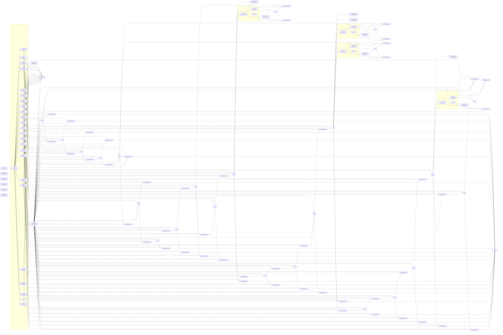

```mermaid
flowchart LR
  subgraph path2 [Path]
    2["Path<br>[1249, 1330, 0]"]
      %% [ProgramBodyItem { index: 14 }, VariableDeclarationDeclaration, VariableDeclarationInit, PipeBodyItem { index: 1 }]
    3["Segment<br>[1336, 1364, 0]"]
      %% [ProgramBodyItem { index: 14 }, VariableDeclarationDeclaration, VariableDeclarationInit, PipeBodyItem { index: 2 }]
    4["Segment<br>[1370, 1431, 0]"]
      %% [ProgramBodyItem { index: 14 }, VariableDeclarationDeclaration, VariableDeclarationInit, PipeBodyItem { index: 3 }]
    5["Segment<br>[1437, 1518, 0]"]
      %% [ProgramBodyItem { index: 14 }, VariableDeclarationDeclaration, VariableDeclarationInit, PipeBodyItem { index: 4 }]
    6["Segment<br>[1524, 1586, 0]"]
      %% [ProgramBodyItem { index: 14 }, VariableDeclarationDeclaration, VariableDeclarationInit, PipeBodyItem { index: 5 }]
    7["Segment<br>[1592, 1628, 0]"]
      %% [ProgramBodyItem { index: 14 }, VariableDeclarationDeclaration, VariableDeclarationInit, PipeBodyItem { index: 6 }]
    8["Segment<br>[1634, 1663, 0]"]
      %% [ProgramBodyItem { index: 14 }, VariableDeclarationDeclaration, VariableDeclarationInit, PipeBodyItem { index: 7 }]
    9["Segment<br>[1669, 1731, 0]"]
      %% [ProgramBodyItem { index: 14 }, VariableDeclarationDeclaration, VariableDeclarationInit, PipeBodyItem { index: 8 }]
    10["Segment<br>[1737, 1791, 0]"]
      %% [ProgramBodyItem { index: 14 }, VariableDeclarationDeclaration, VariableDeclarationInit, PipeBodyItem { index: 9 }]
    11["Segment<br>[1797, 1858, 0]"]
      %% [ProgramBodyItem { index: 14 }, VariableDeclarationDeclaration, VariableDeclarationInit, PipeBodyItem { index: 10 }]
    12["Segment<br>[1864, 1892, 0]"]
      %% [ProgramBodyItem { index: 14 }, VariableDeclarationDeclaration, VariableDeclarationInit, PipeBodyItem { index: 11 }]
    13["Segment<br>[1898, 1937, 0]"]
      %% [ProgramBodyItem { index: 14 }, VariableDeclarationDeclaration, VariableDeclarationInit, PipeBodyItem { index: 12 }]
    14["Segment<br>[1943, 1986, 0]"]
      %% [ProgramBodyItem { index: 14 }, VariableDeclarationDeclaration, VariableDeclarationInit, PipeBodyItem { index: 13 }]
    15["Segment<br>[1992, 2054, 0]"]
      %% [ProgramBodyItem { index: 14 }, VariableDeclarationDeclaration, VariableDeclarationInit, PipeBodyItem { index: 14 }]
    16["Segment<br>[2060, 2122, 0]"]
      %% [ProgramBodyItem { index: 14 }, VariableDeclarationDeclaration, VariableDeclarationInit, PipeBodyItem { index: 15 }]
    17["Segment<br>[2128, 2189, 0]"]
      %% [ProgramBodyItem { index: 14 }, VariableDeclarationDeclaration, VariableDeclarationInit, PipeBodyItem { index: 16 }]
    18["Segment<br>[2195, 2231, 0]"]
      %% [ProgramBodyItem { index: 14 }, VariableDeclarationDeclaration, VariableDeclarationInit, PipeBodyItem { index: 17 }]
    19["Segment<br>[2237, 2267, 0]"]
      %% [ProgramBodyItem { index: 14 }, VariableDeclarationDeclaration, VariableDeclarationInit, PipeBodyItem { index: 18 }]
    20["Segment<br>[2273, 2334, 0]"]
      %% [ProgramBodyItem { index: 14 }, VariableDeclarationDeclaration, VariableDeclarationInit, PipeBodyItem { index: 19 }]
    21["Segment<br>[2340, 2402, 0]"]
      %% [ProgramBodyItem { index: 14 }, VariableDeclarationDeclaration, VariableDeclarationInit, PipeBodyItem { index: 20 }]
    22["Segment<br>[2408, 2470, 0]"]
      %% [ProgramBodyItem { index: 14 }, VariableDeclarationDeclaration, VariableDeclarationInit, PipeBodyItem { index: 21 }]
    23["Segment<br>[2476, 2519, 0]"]
      %% [ProgramBodyItem { index: 14 }, VariableDeclarationDeclaration, VariableDeclarationInit, PipeBodyItem { index: 22 }]
    24["Segment<br>[2525, 2595, 0]"]
      %% [ProgramBodyItem { index: 14 }, VariableDeclarationDeclaration, VariableDeclarationInit, PipeBodyItem { index: 23 }]
    25["Segment<br>[2601, 2608, 0]"]
      %% [ProgramBodyItem { index: 14 }, VariableDeclarationDeclaration, VariableDeclarationInit, PipeBodyItem { index: 24 }]
    26[Solid2d]
  end
  subgraph path91 [Path]
    91["Path<br>[2947, 3036, 0]"]
      %% [ProgramBodyItem { index: 15 }, VariableDeclarationDeclaration, VariableDeclarationInit, PipeBodyItem { index: 1 }]
    92["Segment<br>[2947, 3036, 0]"]
      %% [ProgramBodyItem { index: 15 }, VariableDeclarationDeclaration, VariableDeclarationInit, PipeBodyItem { index: 1 }]
    93[Solid2d]
  end
  subgraph path99 [Path]
    99["Path<br>[3279, 3367, 0]"]
      %% [ProgramBodyItem { index: 16 }, VariableDeclarationDeclaration, VariableDeclarationInit, PipeBodyItem { index: 1 }]
    100["Segment<br>[3279, 3367, 0]"]
      %% [ProgramBodyItem { index: 16 }, VariableDeclarationDeclaration, VariableDeclarationInit, PipeBodyItem { index: 1 }]
    101[Solid2d]
  end
  subgraph path107 [Path]
    107["Path<br>[3617, 3797, 0]"]
      %% [ProgramBodyItem { index: 17 }, VariableDeclarationDeclaration, VariableDeclarationInit, PipeBodyItem { index: 1 }]
    108["Segment<br>[3617, 3797, 0]"]
      %% [ProgramBodyItem { index: 17 }, VariableDeclarationDeclaration, VariableDeclarationInit, PipeBodyItem { index: 1 }]
    109[Solid2d]
  end
  subgraph path117 [Path]
    117["Path<br>[4142, 4198, 0]"]
      %% [ProgramBodyItem { index: 18 }, VariableDeclarationDeclaration, VariableDeclarationInit, PipeBodyItem { index: 1 }]
    118["Segment<br>[4142, 4198, 0]"]
      %% [ProgramBodyItem { index: 18 }, VariableDeclarationDeclaration, VariableDeclarationInit, PipeBodyItem { index: 1 }]
    119[Solid2d]
  end
  1["Plane<br>[1226, 1243, 0]"]
    %% [ProgramBodyItem { index: 14 }, VariableDeclarationDeclaration, VariableDeclarationInit, PipeBodyItem { index: 0 }]
  27["Sweep Extrusion<br>[2614, 2647, 0]"]
    %% [ProgramBodyItem { index: 14 }, VariableDeclarationDeclaration, VariableDeclarationInit, PipeBodyItem { index: 25 }]
  28[Wall]
    %% face_code_ref=Missing NodePath
  29[Wall]
    %% face_code_ref=Missing NodePath
  30[Wall]
    %% face_code_ref=Missing NodePath
  31[Wall]
    %% face_code_ref=Missing NodePath
  32[Wall]
    %% face_code_ref=Missing NodePath
  33[Wall]
    %% face_code_ref=Missing NodePath
  34[Wall]
    %% face_code_ref=Missing NodePath
  35[Wall]
    %% face_code_ref=Missing NodePath
  36[Wall]
    %% face_code_ref=Missing NodePath
  37[Wall]
    %% face_code_ref=Missing NodePath
  38[Wall]
    %% face_code_ref=[ProgramBodyItem { index: 15 }, VariableDeclarationDeclaration, VariableDeclarationInit, PipeBodyItem { index: 0 }]
  39[Wall]
    %% face_code_ref=Missing NodePath
  40[Wall]
    %% face_code_ref=Missing NodePath
  41[Wall]
    %% face_code_ref=Missing NodePath
  42[Wall]
    %% face_code_ref=[ProgramBodyItem { index: 17 }, VariableDeclarationDeclaration, VariableDeclarationInit, PipeBodyItem { index: 0 }]
  43[Wall]
    %% face_code_ref=Missing NodePath
  44[Wall]
    %% face_code_ref=Missing NodePath
  45[Wall]
    %% face_code_ref=Missing NodePath
  46[Wall]
    %% face_code_ref=[ProgramBodyItem { index: 16 }, VariableDeclarationDeclaration, VariableDeclarationInit, PipeBodyItem { index: 0 }]
  47[Wall]
    %% face_code_ref=Missing NodePath
  48["Cap Start"]
    %% face_code_ref=Missing NodePath
  49["Cap End"]
    %% face_code_ref=Missing NodePath
  50["SweepEdge Opposite"]
  51["SweepEdge Adjacent"]
  52["SweepEdge Opposite"]
  53["SweepEdge Adjacent"]
  54["SweepEdge Opposite"]
  55["SweepEdge Adjacent"]
  56["SweepEdge Opposite"]
  57["SweepEdge Adjacent"]
  58["SweepEdge Opposite"]
  59["SweepEdge Adjacent"]
  60["SweepEdge Opposite"]
  61["SweepEdge Adjacent"]
  62["SweepEdge Opposite"]
  63["SweepEdge Adjacent"]
  64["SweepEdge Opposite"]
  65["SweepEdge Adjacent"]
  66["SweepEdge Opposite"]
  67["SweepEdge Adjacent"]
  68["SweepEdge Opposite"]
  69["SweepEdge Adjacent"]
  70["SweepEdge Opposite"]
  71["SweepEdge Adjacent"]
  72["SweepEdge Opposite"]
  73["SweepEdge Adjacent"]
  74["SweepEdge Opposite"]
  75["SweepEdge Adjacent"]
  76["SweepEdge Opposite"]
  77["SweepEdge Adjacent"]
  78["SweepEdge Opposite"]
  79["SweepEdge Adjacent"]
  80["SweepEdge Opposite"]
  81["SweepEdge Adjacent"]
  82["SweepEdge Opposite"]
  83["SweepEdge Adjacent"]
  84["SweepEdge Opposite"]
  85["SweepEdge Adjacent"]
  86["SweepEdge Opposite"]
  87["SweepEdge Adjacent"]
  88["SweepEdge Opposite"]
  89["SweepEdge Adjacent"]
  90["EdgeCut Fillet<br>[2653, 2824, 0]"]
    %% [ProgramBodyItem { index: 14 }, VariableDeclarationDeclaration, VariableDeclarationInit, PipeBodyItem { index: 26 }]
  94["Sweep Extrusion<br>[3126, 3154, 0]"]
    %% [ProgramBodyItem { index: 15 }, VariableDeclarationDeclaration, VariableDeclarationInit, PipeBodyItem { index: 3 }]
  95[Wall]
    %% face_code_ref=Missing NodePath
  96["SweepEdge Opposite"]
  97["SweepEdge Adjacent"]
  98["Sweep Extrusion<br>[3126, 3154, 0]"]
    %% [ProgramBodyItem { index: 15 }, VariableDeclarationDeclaration, VariableDeclarationInit, PipeBodyItem { index: 3 }]
  102["Sweep Extrusion<br>[3457, 3485, 0]"]
    %% [ProgramBodyItem { index: 16 }, VariableDeclarationDeclaration, VariableDeclarationInit, PipeBodyItem { index: 3 }]
  103[Wall]
    %% face_code_ref=Missing NodePath
  104["SweepEdge Opposite"]
  105["SweepEdge Adjacent"]
  106["Sweep Extrusion<br>[3457, 3485, 0]"]
    %% [ProgramBodyItem { index: 16 }, VariableDeclarationDeclaration, VariableDeclarationInit, PipeBodyItem { index: 3 }]
  110["Sweep Extrusion<br>[3973, 4001, 0]"]
    %% [ProgramBodyItem { index: 17 }, VariableDeclarationDeclaration, VariableDeclarationInit, PipeBodyItem { index: 4 }]
  111[Wall]
    %% face_code_ref=Missing NodePath
  112["SweepEdge Opposite"]
  113["SweepEdge Adjacent"]
  114["Sweep Extrusion<br>[3973, 4001, 0]"]
    %% [ProgramBodyItem { index: 17 }, VariableDeclarationDeclaration, VariableDeclarationInit, PipeBodyItem { index: 4 }]
  115["Sweep Extrusion<br>[3973, 4001, 0]"]
    %% [ProgramBodyItem { index: 17 }, VariableDeclarationDeclaration, VariableDeclarationInit, PipeBodyItem { index: 4 }]
  116["Sweep Extrusion<br>[3973, 4001, 0]"]
    %% [ProgramBodyItem { index: 17 }, VariableDeclarationDeclaration, VariableDeclarationInit, PipeBodyItem { index: 4 }]
  120["Sweep Extrusion<br>[4204, 4232, 0]"]
    %% [ProgramBodyItem { index: 18 }, VariableDeclarationDeclaration, VariableDeclarationInit, PipeBodyItem { index: 2 }]
  121[Wall]
    %% face_code_ref=Missing NodePath
  122["SweepEdge Opposite"]
  123["SweepEdge Adjacent"]
  124["StartSketchOnFace<br>[2898, 2941, 0]"]
    %% [ProgramBodyItem { index: 15 }, VariableDeclarationDeclaration, VariableDeclarationInit, PipeBodyItem { index: 0 }]
  125["StartSketchOnFace<br>[3230, 3273, 0]"]
    %% [ProgramBodyItem { index: 16 }, VariableDeclarationDeclaration, VariableDeclarationInit, PipeBodyItem { index: 0 }]
  126["StartSketchOnFace<br>[3568, 3611, 0]"]
    %% [ProgramBodyItem { index: 17 }, VariableDeclarationDeclaration, VariableDeclarationInit, PipeBodyItem { index: 0 }]
  127["StartSketchOnFace<br>[4093, 4136, 0]"]
    %% [ProgramBodyItem { index: 18 }, VariableDeclarationDeclaration, VariableDeclarationInit, PipeBodyItem { index: 0 }]
  1 --- 2
  2 --- 3
  2 --- 4
  2 --- 5
  2 --- 6
  2 --- 7
  2 --- 8
  2 --- 9
  2 --- 10
  2 --- 11
  2 --- 12
  2 --- 13
  2 --- 14
  2 --- 15
  2 --- 16
  2 --- 17
  2 --- 18
  2 --- 19
  2 --- 20
  2 --- 21
  2 --- 22
  2 --- 23
  2 --- 24
  2 --- 25
  2 --- 26
  2 ---- 27
  3 --- 28
  3 x--> 48
  3 --- 50
  3 --- 51
  4 --- 29
  4 x--> 48
  4 --- 52
  4 --- 53
  5 --- 30
  5 x--> 48
  5 --- 54
  5 --- 55
  6 --- 31
  6 x--> 48
  6 --- 56
  6 --- 57
  7 --- 32
  7 x--> 48
  7 --- 58
  7 --- 59
  9 --- 33
  9 x--> 48
  9 --- 60
  9 --- 61
  10 --- 34
  10 x--> 48
  10 --- 62
  10 --- 63
  11 --- 35
  11 x--> 48
  11 --- 64
  11 --- 65
  12 --- 36
  12 x--> 48
  12 --- 66
  12 --- 67
  13 --- 37
  13 x--> 48
  13 --- 68
  13 --- 69
  13 --- 90
  14 --- 38
  14 x--> 48
  14 --- 70
  14 --- 71
  15 --- 39
  15 x--> 48
  15 --- 72
  15 --- 73
  16 --- 40
  16 x--> 48
  16 --- 74
  16 --- 75
  17 --- 41
  17 x--> 48
  17 --- 76
  17 --- 77
  18 --- 42
  18 x--> 48
  18 --- 78
  18 --- 79
  20 --- 43
  20 x--> 48
  20 --- 80
  20 --- 81
  21 --- 44
  21 x--> 48
  21 --- 82
  21 --- 83
  22 --- 45
  22 x--> 48
  22 --- 84
  22 --- 85
  23 --- 46
  23 x--> 48
  23 --- 86
  23 --- 87
  24 --- 47
  24 x--> 48
  24 --- 88
  24 --- 89
  27 --- 28
  27 --- 29
  27 --- 30
  27 --- 31
  27 --- 32
  27 --- 33
  27 --- 34
  27 --- 35
  27 --- 36
  27 --- 37
  27 --- 38
  27 --- 39
  27 --- 40
  27 --- 41
  27 --- 42
  27 --- 43
  27 --- 44
  27 --- 45
  27 --- 46
  27 --- 47
  27 --- 48
  27 --- 49
  27 --- 50
  27 --- 51
  27 --- 52
  27 --- 53
  27 --- 54
  27 --- 55
  27 --- 56
  27 --- 57
  27 --- 58
  27 --- 59
  27 --- 60
  27 --- 61
  27 --- 62
  27 --- 63
  27 --- 64
  27 --- 65
  27 --- 66
  27 --- 67
  27 --- 68
  27 --- 69
  27 --- 70
  27 --- 71
  27 --- 72
  27 --- 73
  27 --- 74
  27 --- 75
  27 --- 76
  27 --- 77
  27 --- 78
  27 --- 79
  27 --- 80
  27 --- 81
  27 --- 82
  27 --- 83
  27 --- 84
  27 --- 85
  27 --- 86
  27 --- 87
  27 --- 88
  27 --- 89
  28 --- 50
  28 --- 51
  89 <--x 28
  104 <--x 28
  51 <--x 29
  29 --- 52
  29 --- 53
  53 <--x 30
  30 --- 54
  30 --- 55
  55 <--x 31
  31 --- 56
  31 --- 57
  57 <--x 32
  32 --- 58
  32 --- 59
  112 <--x 32
  122 <--x 32
  59 <--x 33
  33 --- 60
  33 --- 61
  61 <--x 34
  34 --- 62
  34 --- 63
  63 <--x 35
  35 --- 64
  35 --- 65
  65 <--x 36
  36 --- 66
  36 --- 67
  96 <--x 36
  67 <--x 37
  37 --- 68
  37 --- 69
  69 <--x 38
  38 --- 70
  38 --- 71
  38 --- 91
  92 <--x 38
  38 <--x 124
  71 <--x 39
  39 --- 72
  39 --- 73
  73 <--x 40
  40 --- 74
  40 --- 75
  75 <--x 41
  41 --- 76
  41 --- 77
  77 <--x 42
  42 --- 78
  42 --- 79
  42 --- 107
  108 <--x 42
  42 --- 117
  118 <--x 42
  42 <--x 126
  42 <--x 127
  79 <--x 43
  43 --- 80
  43 --- 81
  81 <--x 44
  44 --- 82
  44 --- 83
  83 <--x 45
  45 --- 84
  45 --- 85
  85 <--x 46
  46 --- 86
  46 --- 87
  46 --- 99
  100 <--x 46
  46 <--x 125
  87 <--x 47
  47 --- 88
  47 --- 89
  50 <--x 49
  52 <--x 49
  54 <--x 49
  56 <--x 49
  58 <--x 49
  60 <--x 49
  62 <--x 49
  64 <--x 49
  66 <--x 49
  68 <--x 49
  70 <--x 49
  72 <--x 49
  74 <--x 49
  76 <--x 49
  78 <--x 49
  80 <--x 49
  82 <--x 49
  84 <--x 49
  86 <--x 49
  88 <--x 49
  91 --- 92
  91 --- 93
  91 ---- 94
  92 --- 95
  92 --- 96
  92 --- 97
  94 --- 95
  94 --- 96
  94 --- 97
  95 --- 96
  95 --- 97
  99 --- 100
  99 --- 101
  99 ---- 102
  100 --- 103
  100 --- 104
  100 --- 105
  102 --- 103
  102 --- 104
  102 --- 105
  103 --- 104
  103 --- 105
  107 --- 108
  107 --- 109
  107 ---- 110
  108 --- 111
  108 --- 112
  108 --- 113
  110 --- 111
  110 --- 112
  110 --- 113
  111 --- 112
  111 --- 113
  117 --- 118
  117 --- 119
  117 ---- 120
  118 --- 121
  118 --- 122
  118 --- 123
  120 --- 121
  120 --- 122
  120 --- 123
  121 --- 122
  121 --- 123
```
