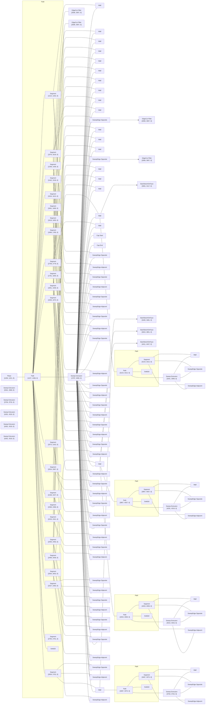

```mermaid
flowchart LR
  subgraph path2 [Path]
    2["Path<br>[1227, 1308, 0]"]
    3["Segment<br>[1314, 1342, 0]"]
    4["Segment<br>[1348, 1436, 0]"]
    5["Segment<br>[1442, 1518, 0]"]
    6["Segment<br>[1524, 1613, 0]"]
    7["Segment<br>[1619, 1655, 0]"]
    8["Segment<br>[1661, 1690, 0]"]
    9["Segment<br>[1696, 1785, 0]"]
    10["Segment<br>[1791, 1845, 0]"]
    11["Segment<br>[1851, 1939, 0]"]
    12["Segment<br>[1945, 1973, 0]"]
    13["Segment<br>[1979, 2018, 0]"]
    14["Segment<br>[2024, 2067, 0]"]
    15["Segment<br>[2073, 2162, 0]"]
    16["Segment<br>[2168, 2227, 0]"]
    17["Segment<br>[2233, 2321, 0]"]
    18["Segment<br>[2327, 2363, 0]"]
    19["Segment<br>[2369, 2399, 0]"]
    20["Segment<br>[2405, 2493, 0]"]
    21["Segment<br>[2499, 2558, 0]"]
    22["Segment<br>[2564, 2653, 0]"]
    23["Segment<br>[2659, 2702, 0]"]
    24["Segment<br>[2708, 2778, 0]"]
    25["Segment<br>[2784, 2791, 0]"]
    26[Solid2d]
  end
  subgraph path94 [Path]
    94["Path<br>[3123, 3212, 0]"]
    95["Segment<br>[3123, 3212, 0]"]
    96[Solid2d]
  end
  subgraph path102 [Path]
    102["Path<br>[3487, 3575, 0]"]
    103["Segment<br>[3487, 3575, 0]"]
    104[Solid2d]
  end
  subgraph path110 [Path]
    110["Path<br>[3857, 4037, 0]"]
    111["Segment<br>[3857, 4037, 0]"]
    112[Solid2d]
  end
  subgraph path120 [Path]
    120["Path<br>[4453, 4509, 0]"]
    121["Segment<br>[4453, 4509, 0]"]
    122[Solid2d]
  end
  1["Plane<br>[1204, 1221, 0]"]
  27["Sweep Extrusion<br>[2797, 2830, 0]"]
  28[Wall]
  29[Wall]
  30[Wall]
  31[Wall]
  32[Wall]
  33[Wall]
  34[Wall]
  35[Wall]
  36[Wall]
  37[Wall]
  38[Wall]
  39[Wall]
  40[Wall]
  41[Wall]
  42[Wall]
  43[Wall]
  44[Wall]
  45[Wall]
  46[Wall]
  47[Wall]
  48["Cap Start"]
  49["Cap End"]
  50["SweepEdge Opposite"]
  51["SweepEdge Adjacent"]
  52["SweepEdge Opposite"]
  53["SweepEdge Adjacent"]
  54["SweepEdge Opposite"]
  55["SweepEdge Adjacent"]
  56["SweepEdge Opposite"]
  57["SweepEdge Adjacent"]
  58["SweepEdge Opposite"]
  59["SweepEdge Adjacent"]
  60["SweepEdge Opposite"]
  61["SweepEdge Adjacent"]
  62["SweepEdge Opposite"]
  63["SweepEdge Adjacent"]
  64["SweepEdge Opposite"]
  65["SweepEdge Adjacent"]
  66["SweepEdge Opposite"]
  67["SweepEdge Adjacent"]
  68["SweepEdge Opposite"]
  69["SweepEdge Adjacent"]
  70["SweepEdge Opposite"]
  71["SweepEdge Adjacent"]
  72["SweepEdge Opposite"]
  73["SweepEdge Adjacent"]
  74["SweepEdge Opposite"]
  75["SweepEdge Adjacent"]
  76["SweepEdge Opposite"]
  77["SweepEdge Adjacent"]
  78["SweepEdge Opposite"]
  79["SweepEdge Adjacent"]
  80["SweepEdge Opposite"]
  81["SweepEdge Adjacent"]
  82["SweepEdge Opposite"]
  83["SweepEdge Adjacent"]
  84["SweepEdge Opposite"]
  85["SweepEdge Adjacent"]
  86["SweepEdge Opposite"]
  87["SweepEdge Adjacent"]
  88["SweepEdge Opposite"]
  89["SweepEdge Adjacent"]
  90["EdgeCut Fillet<br>[2836, 3007, 0]"]
  91["EdgeCut Fillet<br>[2836, 3007, 0]"]
  92["EdgeCut Fillet<br>[2836, 3007, 0]"]
  93["EdgeCut Fillet<br>[2836, 3007, 0]"]
  97["Sweep Extrusion<br>[3341, 3369, 0]"]
  98[Wall]
  99["SweepEdge Opposite"]
  100["SweepEdge Adjacent"]
  101["Sweep Extrusion<br>[3341, 3369, 0]"]
  105["Sweep Extrusion<br>[3704, 3732, 0]"]
  106[Wall]
  107["SweepEdge Opposite"]
  108["SweepEdge Adjacent"]
  109["Sweep Extrusion<br>[3704, 3732, 0]"]
  113["Sweep Extrusion<br>[4291, 4319, 0]"]
  114[Wall]
  115["SweepEdge Opposite"]
  116["SweepEdge Adjacent"]
  117["Sweep Extrusion<br>[4291, 4319, 0]"]
  118["Sweep Extrusion<br>[4291, 4319, 0]"]
  119["Sweep Extrusion<br>[4291, 4319, 0]"]
  123["Sweep Extrusion<br>[4515, 4543, 0]"]
  124[Wall]
  125["SweepEdge Opposite"]
  126["SweepEdge Adjacent"]
  127["StartSketchOnFace<br>[3081, 3117, 0]"]
  128["StartSketchOnFace<br>[3445, 3481, 0]"]
  129["StartSketchOnFace<br>[3815, 3851, 0]"]
  130["StartSketchOnFace<br>[4411, 4447, 0]"]
  1 --- 2
  2 --- 3
  2 --- 4
  2 --- 5
  2 --- 6
  2 --- 7
  2 --- 8
  2 --- 9
  2 --- 10
  2 --- 11
  2 --- 12
  2 --- 13
  2 --- 14
  2 --- 15
  2 --- 16
  2 --- 17
  2 --- 18
  2 --- 19
  2 --- 20
  2 --- 21
  2 --- 22
  2 --- 23
  2 --- 24
  2 --- 25
  2 ---- 27
  2 --- 26
  3 --- 28
  3 --- 50
  3 --- 51
  4 --- 29
  4 --- 52
  4 --- 53
  5 --- 30
  5 --- 54
  5 --- 55
  6 --- 31
  6 --- 56
  6 --- 57
  7 --- 32
  7 --- 58
  7 --- 59
  9 --- 33
  9 --- 60
  9 --- 61
  10 --- 34
  10 --- 62
  10 --- 63
  11 --- 35
  11 --- 64
  11 --- 65
  12 --- 36
  12 --- 66
  12 --- 67
  13 --- 37
  13 --- 68
  13 --- 69
  13 --- 90
  14 --- 38
  14 --- 70
  14 --- 71
  15 --- 39
  15 --- 72
  15 --- 73
  16 --- 40
  16 --- 74
  16 --- 75
  17 --- 41
  17 --- 76
  17 --- 77
  18 --- 42
  18 --- 78
  18 --- 79
  20 --- 43
  20 --- 80
  20 --- 81
  21 --- 44
  21 --- 82
  21 --- 83
  22 --- 45
  22 --- 84
  22 --- 85
  23 --- 46
  23 --- 86
  23 --- 87
  24 --- 47
  24 --- 88
  24 --- 89
  24 --- 92
  27 --- 28
  27 --- 29
  27 --- 30
  27 --- 31
  27 --- 32
  27 --- 33
  27 --- 34
  27 --- 35
  27 --- 36
  27 --- 37
  27 --- 38
  27 --- 39
  27 --- 40
  27 --- 41
  27 --- 42
  27 --- 43
  27 --- 44
  27 --- 45
  27 --- 46
  27 --- 47
  27 --- 48
  27 --- 49
  27 --- 50
  27 --- 51
  27 --- 52
  27 --- 53
  27 --- 54
  27 --- 55
  27 --- 56
  27 --- 57
  27 --- 58
  27 --- 59
  27 --- 60
  27 --- 61
  27 --- 62
  27 --- 63
  27 --- 64
  27 --- 65
  27 --- 66
  27 --- 67
  27 --- 68
  27 --- 69
  27 --- 70
  27 --- 71
  27 --- 72
  27 --- 73
  27 --- 74
  27 --- 75
  27 --- 76
  27 --- 77
  27 --- 78
  27 --- 79
  27 --- 80
  27 --- 81
  27 --- 82
  27 --- 83
  27 --- 84
  27 --- 85
  27 --- 86
  27 --- 87
  27 --- 88
  27 --- 89
  38 --- 94
  42 --- 110
  42 --- 120
  46 --- 102
  68 <--x 91
  88 <--x 93
  94 --- 95
  94 ---- 97
  94 --- 96
  95 --- 98
  95 --- 99
  95 --- 100
  97 --- 98
  97 --- 99
  97 --- 100
  102 --- 103
  102 ---- 105
  102 --- 104
  103 --- 106
  103 --- 107
  103 --- 108
  105 --- 106
  105 --- 107
  105 --- 108
  110 --- 111
  110 ---- 113
  110 --- 112
  111 --- 114
  111 --- 115
  111 --- 116
  113 --- 114
  113 --- 115
  113 --- 116
  120 --- 121
  120 ---- 123
  120 --- 122
  121 --- 124
  121 --- 125
  121 --- 126
  123 --- 124
  123 --- 125
  123 --- 126
  38 <--x 127
  46 <--x 128
  42 <--x 129
  42 <--x 130
```
