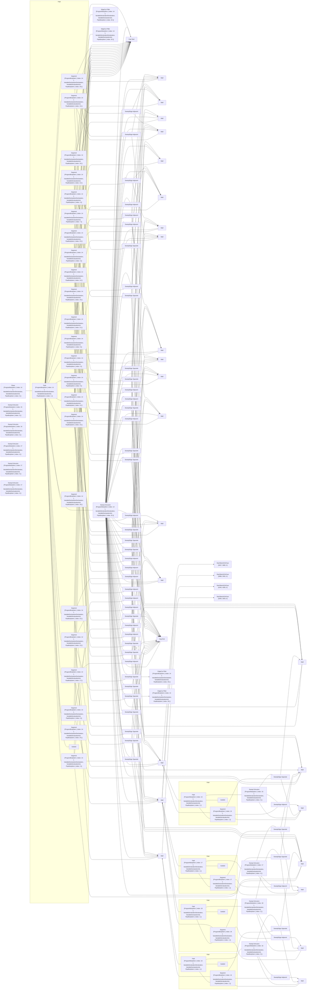

```mermaid
flowchart LR
  subgraph path6 [Path]
    6["Path<br>[ProgramBodyItem { index: 14 }, VariableDeclarationDeclaration, VariableDeclarationInit, PipeBodyItem { index: 1 }]"]
    11["Segment<br>[ProgramBodyItem { index: 14 }, VariableDeclarationDeclaration, VariableDeclarationInit, PipeBodyItem { index: 2 }]"]
    12["Segment<br>[ProgramBodyItem { index: 14 }, VariableDeclarationDeclaration, VariableDeclarationInit, PipeBodyItem { index: 3 }]"]
    13["Segment<br>[ProgramBodyItem { index: 14 }, VariableDeclarationDeclaration, VariableDeclarationInit, PipeBodyItem { index: 4 }]"]
    14["Segment<br>[ProgramBodyItem { index: 14 }, VariableDeclarationDeclaration, VariableDeclarationInit, PipeBodyItem { index: 5 }]"]
    15["Segment<br>[ProgramBodyItem { index: 14 }, VariableDeclarationDeclaration, VariableDeclarationInit, PipeBodyItem { index: 6 }]"]
    16["Segment<br>[ProgramBodyItem { index: 14 }, VariableDeclarationDeclaration, VariableDeclarationInit, PipeBodyItem { index: 7 }]"]
    17["Segment<br>[ProgramBodyItem { index: 14 }, VariableDeclarationDeclaration, VariableDeclarationInit, PipeBodyItem { index: 8 }]"]
    18["Segment<br>[ProgramBodyItem { index: 14 }, VariableDeclarationDeclaration, VariableDeclarationInit, PipeBodyItem { index: 9 }]"]
    19["Segment<br>[ProgramBodyItem { index: 14 }, VariableDeclarationDeclaration, VariableDeclarationInit, PipeBodyItem { index: 10 }]"]
    20["Segment<br>[ProgramBodyItem { index: 14 }, VariableDeclarationDeclaration, VariableDeclarationInit, PipeBodyItem { index: 11 }]"]
    21["Segment<br>[ProgramBodyItem { index: 14 }, VariableDeclarationDeclaration, VariableDeclarationInit, PipeBodyItem { index: 12 }]"]
    22["Segment<br>[ProgramBodyItem { index: 14 }, VariableDeclarationDeclaration, VariableDeclarationInit, PipeBodyItem { index: 13 }]"]
    23["Segment<br>[ProgramBodyItem { index: 14 }, VariableDeclarationDeclaration, VariableDeclarationInit, PipeBodyItem { index: 14 }]"]
    24["Segment<br>[ProgramBodyItem { index: 14 }, VariableDeclarationDeclaration, VariableDeclarationInit, PipeBodyItem { index: 15 }]"]
    25["Segment<br>[ProgramBodyItem { index: 14 }, VariableDeclarationDeclaration, VariableDeclarationInit, PipeBodyItem { index: 16 }]"]
    26["Segment<br>[ProgramBodyItem { index: 14 }, VariableDeclarationDeclaration, VariableDeclarationInit, PipeBodyItem { index: 17 }]"]
    27["Segment<br>[ProgramBodyItem { index: 14 }, VariableDeclarationDeclaration, VariableDeclarationInit, PipeBodyItem { index: 18 }]"]
    28["Segment<br>[ProgramBodyItem { index: 14 }, VariableDeclarationDeclaration, VariableDeclarationInit, PipeBodyItem { index: 19 }]"]
    29["Segment<br>[ProgramBodyItem { index: 14 }, VariableDeclarationDeclaration, VariableDeclarationInit, PipeBodyItem { index: 20 }]"]
    30["Segment<br>[ProgramBodyItem { index: 14 }, VariableDeclarationDeclaration, VariableDeclarationInit, PipeBodyItem { index: 21 }]"]
    31["Segment<br>[ProgramBodyItem { index: 14 }, VariableDeclarationDeclaration, VariableDeclarationInit, PipeBodyItem { index: 22 }]"]
    32["Segment<br>[ProgramBodyItem { index: 14 }, VariableDeclarationDeclaration, VariableDeclarationInit, PipeBodyItem { index: 23 }]"]
    33["Segment<br>[ProgramBodyItem { index: 14 }, VariableDeclarationDeclaration, VariableDeclarationInit, PipeBodyItem { index: 24 }]"]
    40[Solid2d]
  end
  subgraph path7 [Path]
    7["Path<br>[ProgramBodyItem { index: 15 }, VariableDeclarationDeclaration, VariableDeclarationInit, PipeBodyItem { index: 1 }]"]
    34["Segment<br>[ProgramBodyItem { index: 15 }, VariableDeclarationDeclaration, VariableDeclarationInit, PipeBodyItem { index: 1 }]"]
    42[Solid2d]
  end
  subgraph path8 [Path]
    8["Path<br>[ProgramBodyItem { index: 16 }, VariableDeclarationDeclaration, VariableDeclarationInit, PipeBodyItem { index: 1 }]"]
    35["Segment<br>[ProgramBodyItem { index: 16 }, VariableDeclarationDeclaration, VariableDeclarationInit, PipeBodyItem { index: 1 }]"]
    39[Solid2d]
  end
  subgraph path9 [Path]
    9["Path<br>[ProgramBodyItem { index: 17 }, VariableDeclarationDeclaration, VariableDeclarationInit, PipeBodyItem { index: 1 }]"]
    36["Segment<br>[ProgramBodyItem { index: 17 }, VariableDeclarationDeclaration, VariableDeclarationInit, PipeBodyItem { index: 1 }]"]
    38[Solid2d]
  end
  subgraph path10 [Path]
    10["Path<br>[ProgramBodyItem { index: 18 }, VariableDeclarationDeclaration, VariableDeclarationInit, PipeBodyItem { index: 1 }]"]
    37["Segment<br>[ProgramBodyItem { index: 18 }, VariableDeclarationDeclaration, VariableDeclarationInit, PipeBodyItem { index: 1 }]"]
    41[Solid2d]
  end
  1["Plane<br>[ProgramBodyItem { index: 14 }, VariableDeclarationDeclaration, VariableDeclarationInit, PipeBodyItem { index: 0 }]"]
  2["StartSketchOnFace<br>[3637, 3680, 0]"]
  3["StartSketchOnFace<br>[2889, 2932, 0]"]
  4["StartSketchOnFace<br>[4240, 4283, 0]"]
  5["StartSketchOnFace<br>[3260, 3303, 0]"]
  43["Sweep Extrusion<br>[ProgramBodyItem { index: 14 }, VariableDeclarationDeclaration, VariableDeclarationInit, PipeBodyItem { index: 25 }]"]
  44["Sweep Extrusion<br>[ProgramBodyItem { index: 15 }, VariableDeclarationDeclaration, VariableDeclarationInit, PipeBodyItem { index: 3 }]"]
  45["Sweep Extrusion<br>[ProgramBodyItem { index: 15 }, VariableDeclarationDeclaration, VariableDeclarationInit, PipeBodyItem { index: 3 }]"]
  46["Sweep Extrusion<br>[ProgramBodyItem { index: 16 }, VariableDeclarationDeclaration, VariableDeclarationInit, PipeBodyItem { index: 3 }]"]
  47["Sweep Extrusion<br>[ProgramBodyItem { index: 16 }, VariableDeclarationDeclaration, VariableDeclarationInit, PipeBodyItem { index: 3 }]"]
  48["Sweep Extrusion<br>[ProgramBodyItem { index: 17 }, VariableDeclarationDeclaration, VariableDeclarationInit, PipeBodyItem { index: 4 }]"]
  49["Sweep Extrusion<br>[ProgramBodyItem { index: 17 }, VariableDeclarationDeclaration, VariableDeclarationInit, PipeBodyItem { index: 4 }]"]
  50["Sweep Extrusion<br>[ProgramBodyItem { index: 17 }, VariableDeclarationDeclaration, VariableDeclarationInit, PipeBodyItem { index: 4 }]"]
  51["Sweep Extrusion<br>[ProgramBodyItem { index: 17 }, VariableDeclarationDeclaration, VariableDeclarationInit, PipeBodyItem { index: 4 }]"]
  52["Sweep Extrusion<br>[ProgramBodyItem { index: 18 }, VariableDeclarationDeclaration, VariableDeclarationInit, PipeBodyItem { index: 2 }]"]
  53[Wall]
  54[Wall]
  55[Wall]
  56[Wall]
  57[Wall]
  58[Wall]
  59[Wall]
  60[Wall]
  61[Wall]
  62[Wall]
  63[Wall]
  64[Wall]
  65[Wall]
  66[Wall]
  67[Wall]
  68[Wall]
  69[Wall]
  70[Wall]
  71[Wall]
  72[Wall]
  73[Wall]
  74[Wall]
  75[Wall]
  76[Wall]
  77["Cap Start"]
  78["Cap End"]
  79["SweepEdge Opposite"]
  80["SweepEdge Opposite"]
  81["SweepEdge Opposite"]
  82["SweepEdge Opposite"]
  83["SweepEdge Opposite"]
  84["SweepEdge Opposite"]
  85["SweepEdge Opposite"]
  86["SweepEdge Opposite"]
  87["SweepEdge Opposite"]
  88["SweepEdge Opposite"]
  89["SweepEdge Opposite"]
  90["SweepEdge Opposite"]
  91["SweepEdge Opposite"]
  92["SweepEdge Opposite"]
  93["SweepEdge Opposite"]
  94["SweepEdge Opposite"]
  95["SweepEdge Opposite"]
  96["SweepEdge Opposite"]
  97["SweepEdge Opposite"]
  98["SweepEdge Opposite"]
  99["SweepEdge Opposite"]
  100["SweepEdge Opposite"]
  101["SweepEdge Opposite"]
  102["SweepEdge Opposite"]
  103["SweepEdge Adjacent"]
  104["SweepEdge Adjacent"]
  105["SweepEdge Adjacent"]
  106["SweepEdge Adjacent"]
  107["SweepEdge Adjacent"]
  108["SweepEdge Adjacent"]
  109["SweepEdge Adjacent"]
  110["SweepEdge Adjacent"]
  111["SweepEdge Adjacent"]
  112["SweepEdge Adjacent"]
  113["SweepEdge Adjacent"]
  114["SweepEdge Adjacent"]
  115["SweepEdge Adjacent"]
  116["SweepEdge Adjacent"]
  117["SweepEdge Adjacent"]
  118["SweepEdge Adjacent"]
  119["SweepEdge Adjacent"]
  120["SweepEdge Adjacent"]
  121["SweepEdge Adjacent"]
  122["SweepEdge Adjacent"]
  123["SweepEdge Adjacent"]
  124["SweepEdge Adjacent"]
  125["SweepEdge Adjacent"]
  126["SweepEdge Adjacent"]
  127["EdgeCut Fillet<br>[ProgramBodyItem { index: 14 }, VariableDeclarationDeclaration, VariableDeclarationInit, PipeBodyItem { index: 26 }]"]
  128["EdgeCut Fillet<br>[ProgramBodyItem { index: 14 }, VariableDeclarationDeclaration, VariableDeclarationInit, PipeBodyItem { index: 26 }]"]
  129["EdgeCut Fillet<br>[ProgramBodyItem { index: 14 }, VariableDeclarationDeclaration, VariableDeclarationInit, PipeBodyItem { index: 26 }]"]
  130["EdgeCut Fillet<br>[ProgramBodyItem { index: 14 }, VariableDeclarationDeclaration, VariableDeclarationInit, PipeBodyItem { index: 26 }]"]
  1 --- 6
  76 x--> 2
  74 x--> 3
  76 x--> 4
  75 x--> 5
  6 --- 11
  6 --- 12
  6 --- 13
  6 --- 14
  6 --- 15
  6 --- 16
  6 --- 17
  6 --- 18
  6 --- 19
  6 --- 20
  6 --- 21
  6 --- 22
  6 --- 23
  6 --- 24
  6 --- 25
  6 --- 26
  6 --- 27
  6 --- 28
  6 --- 29
  6 --- 30
  6 --- 31
  6 --- 32
  6 --- 33
  6 --- 40
  6 ---- 43
  7 --- 34
  7 --- 42
  7 ---- 44
  74 --- 7
  8 --- 35
  8 --- 39
  8 ---- 47
  75 --- 8
  9 --- 36
  9 --- 38
  9 ---- 48
  76 --- 9
  10 --- 37
  10 --- 41
  10 ---- 52
  76 --- 10
  11 --- 70
  11 x--> 77
  11 --- 85
  11 --- 123
  12 --- 65
  12 x--> 77
  12 --- 87
  12 --- 124
  13 --- 64
  13 x--> 77
  13 --- 94
  13 --- 125
  14 --- 67
  14 x--> 77
  14 --- 92
  14 --- 117
  15 --- 61
  15 x--> 77
  15 --- 89
  15 --- 121
  17 --- 69
  17 x--> 77
  17 --- 101
  17 --- 118
  18 --- 73
  18 x--> 77
  18 --- 99
  18 --- 122
  19 --- 72
  19 x--> 77
  19 --- 83
  19 --- 111
  20 --- 59
  20 x--> 77
  20 --- 91
  20 --- 120
  21 --- 60
  21 x--> 77
  21 --- 98
  21 --- 107
  21 --- 130
  22 --- 74
  22 x--> 77
  22 --- 88
  22 --- 113
  23 --- 68
  23 x--> 77
  23 --- 93
  23 --- 109
  24 --- 62
  24 x--> 77
  24 --- 90
  24 --- 115
  25 --- 58
  25 x--> 77
  25 --- 100
  25 --- 112
  26 --- 76
  26 x--> 77
  26 --- 84
  26 --- 114
  28 --- 71
  28 x--> 77
  28 --- 102
  28 --- 126
  29 --- 57
  29 x--> 77
  29 --- 97
  29 --- 108
  30 --- 66
  30 x--> 77
  30 --- 96
  30 --- 116
  31 --- 75
  31 x--> 77
  31 --- 95
  31 --- 119
  32 --- 63
  32 x--> 77
  32 --- 86
  32 --- 110
  32 --- 127
  34 --- 56
  34 x--> 74
  34 --- 82
  34 --- 106
  35 --- 53
  35 x--> 75
  35 --- 79
  35 --- 103
  36 --- 55
  36 x--> 76
  36 --- 81
  36 --- 105
  37 --- 54
  37 x--> 76
  37 --- 80
  37 --- 104
  43 --- 57
  43 --- 58
  43 --- 59
  43 --- 60
  43 --- 61
  43 --- 62
  43 --- 63
  43 --- 64
  43 --- 65
  43 --- 66
  43 --- 67
  43 --- 68
  43 --- 69
  43 --- 70
  43 --- 71
  43 --- 72
  43 --- 73
  43 --- 74
  43 --- 75
  43 --- 76
  43 --- 77
  43 --- 78
  43 --- 83
  43 --- 84
  43 --- 85
  43 --- 86
  43 --- 87
  43 --- 88
  43 --- 89
  43 --- 90
  43 --- 91
  43 --- 92
  43 --- 93
  43 --- 94
  43 --- 95
  43 --- 96
  43 --- 97
  43 --- 98
  43 --- 99
  43 --- 100
  43 --- 101
  43 --- 102
  43 --- 107
  43 --- 108
  43 --- 109
  43 --- 110
  43 --- 111
  43 --- 112
  43 --- 113
  43 --- 114
  43 --- 115
  43 --- 116
  43 --- 117
  43 --- 118
  43 --- 119
  43 --- 120
  43 --- 121
  43 --- 122
  43 --- 123
  43 --- 124
  43 --- 125
  43 --- 126
  44 --- 56
  44 --- 82
  44 --- 106
  47 --- 53
  47 --- 79
  47 --- 103
  48 --- 55
  48 --- 81
  48 --- 105
  52 --- 54
  52 --- 80
  52 --- 104
  79 <--x 53
  103 <--x 53
  80 <--x 54
  104 <--x 54
  81 <--x 55
  105 <--x 55
  82 <--x 56
  106 <--x 56
  97 <--x 57
  108 <--x 57
  126 <--x 57
  100 <--x 58
  112 <--x 58
  115 <--x 58
  82 <--x 59
  91 <--x 59
  111 <--x 59
  120 <--x 59
  107 <--x 60
  120 <--x 60
  80 <--x 61
  81 <--x 61
  89 <--x 61
  117 <--x 61
  121 <--x 61
  90 <--x 62
  109 <--x 62
  115 <--x 62
  110 <--x 63
  119 <--x 63
  94 <--x 64
  124 <--x 64
  125 <--x 64
  87 <--x 65
  123 <--x 65
  124 <--x 65
  96 <--x 66
  108 <--x 66
  116 <--x 66
  92 <--x 67
  117 <--x 67
  125 <--x 67
  93 <--x 68
  109 <--x 68
  113 <--x 68
  101 <--x 69
  118 <--x 69
  121 <--x 69
  79 <--x 70
  85 <--x 70
  110 <--x 70
  123 <--x 70
  102 <--x 71
  114 <--x 71
  126 <--x 71
  83 <--x 72
  111 <--x 72
  122 <--x 72
  99 <--x 73
  118 <--x 73
  122 <--x 73
  88 <--x 74
  107 <--x 74
  113 <--x 74
  95 <--x 75
  116 <--x 75
  119 <--x 75
  84 <--x 76
  112 <--x 76
  114 <--x 76
  83 <--x 78
  84 <--x 78
  85 <--x 78
  87 <--x 78
  88 <--x 78
  89 <--x 78
  90 <--x 78
  91 <--x 78
  92 <--x 78
  93 <--x 78
  94 <--x 78
  95 <--x 78
  96 <--x 78
  97 <--x 78
  99 <--x 78
  100 <--x 78
  101 <--x 78
  102 <--x 78
  86 <--x 129
  98 <--x 128
```
