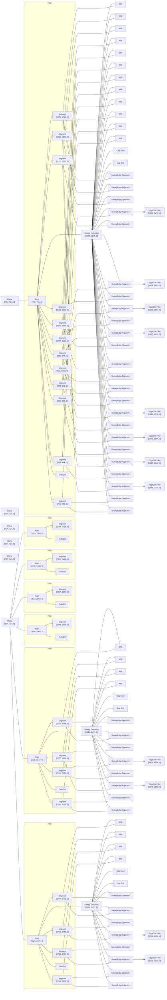

```mermaid
flowchart LR
  subgraph path7 [Path]
    7["Path<br>[730, 755, 0]"]
    8["Segment<br>[761, 798, 0]"]
    9["Segment<br>[804, 844, 0]"]
    10["Segment<br>[850, 887, 0]"]
    11["Segment<br>[893, 929, 0]"]
    12["Segment<br>[935, 973, 0]"]
    13["Segment<br>[979, 1019, 0]"]
    14["Segment<br>[1025, 1063, 0]"]
    15["Segment<br>[1069, 1122, 0]"]
    16["Segment<br>[1128, 1165, 0]"]
    17["Segment<br>[1171, 1225, 0]"]
    18["Segment<br>[1231, 1270, 0]"]
    19["Segment<br>[1276, 1293, 0]"]
    20[Solid2d]
  end
  subgraph path60 [Path]
    60["Path<br>[2119, 2144, 0]"]
    61["Segment<br>[2150, 2175, 0]"]
    62["Segment<br>[2181, 2221, 0]"]
    63["Segment<br>[2227, 2265, 0]"]
    64["Segment<br>[2271, 2278, 0]"]
    65[Solid2d]
  end
  subgraph path66 [Path]
    66["Path<br>[2289, 2355, 0]"]
    67["Segment<br>[2289, 2355, 0]"]
    68[Solid2d]
  end
  subgraph path69 [Path]
    69["Path<br>[2370, 2436, 0]"]
    70["Segment<br>[2370, 2436, 0]"]
    71[Solid2d]
  end
  subgraph path87 [Path]
    87["Path<br>[2645, 2671, 0]"]
    88["Segment<br>[2677, 2702, 0]"]
    89["Segment<br>[2708, 2749, 0]"]
    90["Segment<br>[2755, 2793, 0]"]
    91["Segment<br>[2799, 2806, 0]"]
    92[Solid2d]
  end
  subgraph path93 [Path]
    93["Path<br>[2817, 2884, 0]"]
    94["Segment<br>[2817, 2884, 0]"]
    95[Solid2d]
  end
  subgraph path96 [Path]
    96["Path<br>[2899, 2966, 0]"]
    97["Segment<br>[2899, 2966, 0]"]
    98[Solid2d]
  end
  1["Plane<br>[704, 724, 0]"]
  2["Plane<br>[704, 724, 0]"]
  3["Plane<br>[704, 724, 0]"]
  4["Plane<br>[704, 724, 0]"]
  5["Plane<br>[704, 724, 0]"]
  6["Plane<br>[704, 724, 0]"]
  21["Sweep Extrusion<br>[1299, 1325, 0]"]
  22[Wall]
  23[Wall]
  24[Wall]
  25[Wall]
  26[Wall]
  27[Wall]
  28[Wall]
  29[Wall]
  30[Wall]
  31[Wall]
  32[Wall]
  33[Wall]
  34["Cap Start"]
  35["Cap End"]
  36["SweepEdge Opposite"]
  37["SweepEdge Adjacent"]
  38["SweepEdge Opposite"]
  39["SweepEdge Adjacent"]
  40["SweepEdge Opposite"]
  41["SweepEdge Adjacent"]
  42["SweepEdge Opposite"]
  43["SweepEdge Adjacent"]
  44["SweepEdge Opposite"]
  45["SweepEdge Adjacent"]
  46["SweepEdge Opposite"]
  47["SweepEdge Adjacent"]
  48["SweepEdge Opposite"]
  49["SweepEdge Adjacent"]
  50["SweepEdge Opposite"]
  51["SweepEdge Adjacent"]
  52["SweepEdge Opposite"]
  53["SweepEdge Adjacent"]
  54["SweepEdge Opposite"]
  55["SweepEdge Adjacent"]
  56["SweepEdge Opposite"]
  57["SweepEdge Adjacent"]
  58["SweepEdge Opposite"]
  59["SweepEdge Adjacent"]
  72["Sweep Extrusion<br>[2446, 2473, 0]"]
  73[Wall]
  74[Wall]
  75[Wall]
  76[Wall]
  77["Cap Start"]
  78["Cap End"]
  79["SweepEdge Opposite"]
  80["SweepEdge Adjacent"]
  81["SweepEdge Opposite"]
  82["SweepEdge Adjacent"]
  83["SweepEdge Opposite"]
  84["SweepEdge Adjacent"]
  85["SweepEdge Opposite"]
  86["SweepEdge Adjacent"]
  99["Sweep Extrusion<br>[2976, 3003, 0]"]
  100[Wall]
  101[Wall]
  102[Wall]
  103[Wall]
  104["Cap Start"]
  105["Cap End"]
  106["SweepEdge Opposite"]
  107["SweepEdge Adjacent"]
  108["SweepEdge Opposite"]
  109["SweepEdge Adjacent"]
  110["SweepEdge Opposite"]
  111["SweepEdge Adjacent"]
  112["SweepEdge Opposite"]
  113["SweepEdge Adjacent"]
  114["EdgeCut Fillet<br>[1331, 1410, 0]"]
  115["EdgeCut Fillet<br>[1416, 1502, 0]"]
  116["EdgeCut Fillet<br>[1508, 1594, 0]"]
  117["EdgeCut Fillet<br>[1600, 1679, 0]"]
  118["EdgeCut Fillet<br>[1685, 1771, 0]"]
  119["EdgeCut Fillet<br>[1777, 1856, 0]"]
  120["EdgeCut Fillet<br>[1862, 1942, 0]"]
  121["EdgeCut Fillet<br>[1948, 2035, 0]"]
  122["EdgeCut Fillet<br>[2479, 2608, 0]"]
  123["EdgeCut Fillet<br>[2479, 2608, 0]"]
  124["EdgeCut Fillet<br>[3009, 3139, 0]"]
  125["EdgeCut Fillet<br>[3009, 3139, 0]"]
  1 --- 60
  1 --- 66
  1 --- 69
  1 --- 87
  1 --- 93
  1 --- 96
  6 --- 7
  7 --- 8
  7 --- 9
  7 --- 10
  7 --- 11
  7 --- 12
  7 --- 13
  7 --- 14
  7 --- 15
  7 --- 16
  7 --- 17
  7 --- 18
  7 --- 19
  7 ---- 21
  7 --- 20
  8 --- 33
  8 --- 58
  8 --- 59
  9 --- 32
  9 --- 56
  9 --- 57
  10 --- 31
  10 --- 54
  10 --- 55
  11 --- 30
  11 --- 52
  11 --- 53
  12 --- 29
  12 --- 50
  12 --- 51
  13 --- 28
  13 --- 48
  13 --- 49
  14 --- 27
  14 --- 46
  14 --- 47
  15 --- 26
  15 --- 44
  15 --- 45
  16 --- 25
  16 --- 42
  16 --- 43
  17 --- 24
  17 --- 40
  17 --- 41
  18 --- 23
  18 --- 38
  18 --- 39
  19 --- 22
  19 --- 36
  19 --- 37
  21 --- 22
  21 --- 23
  21 --- 24
  21 --- 25
  21 --- 26
  21 --- 27
  21 --- 28
  21 --- 29
  21 --- 30
  21 --- 31
  21 --- 32
  21 --- 33
  21 --- 34
  21 --- 35
  21 --- 36
  21 --- 37
  21 --- 38
  21 --- 39
  21 --- 40
  21 --- 41
  21 --- 42
  21 --- 43
  21 --- 44
  21 --- 45
  21 --- 46
  21 --- 47
  21 --- 48
  21 --- 49
  21 --- 50
  21 --- 51
  21 --- 52
  21 --- 53
  21 --- 54
  21 --- 55
  21 --- 56
  21 --- 57
  21 --- 58
  21 --- 59
  60 --- 61
  60 --- 62
  60 --- 63
  60 --- 64
  60 ---- 72
  60 --- 65
  61 --- 76
  61 --- 85
  61 --- 86
  62 --- 75
  62 --- 83
  62 --- 84
  63 --- 74
  63 --- 81
  63 --- 82
  64 --- 73
  64 --- 79
  64 --- 80
  66 --- 67
  66 --- 68
  69 --- 70
  69 --- 71
  72 --- 73
  72 --- 74
  72 --- 75
  72 --- 76
  72 --- 77
  72 --- 78
  72 --- 79
  72 --- 80
  72 --- 81
  72 --- 82
  72 --- 83
  72 --- 84
  72 --- 85
  72 --- 86
  87 --- 88
  87 --- 89
  87 --- 90
  87 --- 91
  87 ---- 99
  87 --- 92
  88 --- 100
  88 --- 106
  88 --- 107
  89 --- 101
  89 --- 108
  89 --- 109
  90 --- 102
  90 --- 110
  90 --- 111
  91 --- 103
  91 --- 112
  91 --- 113
  93 --- 94
  93 --- 95
  96 --- 97
  96 --- 98
  99 --- 100
  99 --- 101
  99 --- 102
  99 --- 103
  99 --- 104
  99 --- 105
  99 --- 106
  99 --- 107
  99 --- 108
  99 --- 109
  99 --- 110
  99 --- 111
  99 --- 112
  99 --- 113
  57 <--x 114
  55 <--x 115
  53 <--x 116
  51 <--x 117
  45 <--x 118
  43 <--x 119
  41 <--x 120
  39 <--x 121
  84 <--x 122
  82 <--x 123
  109 <--x 124
  111 <--x 125
```
