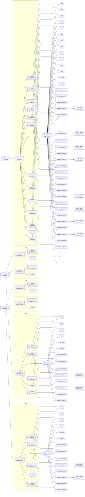

```mermaid
flowchart LR
  subgraph path2 [Path]
    2["Path<br>[728, 753, 0]"]
    3["Segment<br>[759, 796, 0]"]
    4["Segment<br>[802, 842, 0]"]
    5["Segment<br>[848, 885, 0]"]
    6["Segment<br>[891, 927, 0]"]
    7["Segment<br>[933, 971, 0]"]
    8["Segment<br>[977, 1017, 0]"]
    9["Segment<br>[1023, 1061, 0]"]
    10["Segment<br>[1067, 1120, 0]"]
    11["Segment<br>[1126, 1163, 0]"]
    12["Segment<br>[1169, 1223, 0]"]
    13["Segment<br>[1229, 1268, 0]"]
    14["Segment<br>[1274, 1291, 0]"]
    15[Solid2d]
  end
  subgraph path56 [Path]
    56["Path<br>[1947, 1972, 0]"]
    57["Segment<br>[1978, 2003, 0]"]
    58["Segment<br>[2009, 2049, 0]"]
    59["Segment<br>[2055, 2093, 0]"]
    60["Segment<br>[2099, 2106, 0]"]
    61[Solid2d]
  end
  subgraph path62 [Path]
    62["Path<br>[2117, 2162, 0]"]
    63["Segment<br>[2117, 2162, 0]"]
    64[Solid2d]
  end
  subgraph path65 [Path]
    65["Path<br>[2177, 2222, 0]"]
    66["Segment<br>[2177, 2222, 0]"]
    67[Solid2d]
  end
  subgraph path84 [Path]
    84["Path<br>[2430, 2456, 0]"]
    85["Segment<br>[2462, 2487, 0]"]
    86["Segment<br>[2493, 2534, 0]"]
    87["Segment<br>[2540, 2578, 0]"]
    88["Segment<br>[2584, 2591, 0]"]
    89[Solid2d]
  end
  subgraph path90 [Path]
    90["Path<br>[2602, 2648, 0]"]
    91["Segment<br>[2602, 2648, 0]"]
    92[Solid2d]
  end
  subgraph path93 [Path]
    93["Path<br>[2663, 2709, 0]"]
    94["Segment<br>[2663, 2709, 0]"]
    95[Solid2d]
  end
  1["Plane<br>[704, 722, 0]"]
  16["Sweep Extrusion<br>[1297, 1323, 0]"]
  17[Wall]
  18[Wall]
  19[Wall]
  20[Wall]
  21[Wall]
  22[Wall]
  23[Wall]
  24[Wall]
  25[Wall]
  26[Wall]
  27[Wall]
  28[Wall]
  29["Cap Start"]
  30["Cap End"]
  31["SweepEdge Opposite"]
  32["SweepEdge Adjacent"]
  33["SweepEdge Opposite"]
  34["SweepEdge Adjacent"]
  35["SweepEdge Opposite"]
  36["SweepEdge Adjacent"]
  37["SweepEdge Opposite"]
  38["SweepEdge Adjacent"]
  39["SweepEdge Opposite"]
  40["SweepEdge Adjacent"]
  41["SweepEdge Opposite"]
  42["SweepEdge Adjacent"]
  43["SweepEdge Opposite"]
  44["SweepEdge Adjacent"]
  45["SweepEdge Opposite"]
  46["SweepEdge Adjacent"]
  47["SweepEdge Opposite"]
  48["SweepEdge Adjacent"]
  49["SweepEdge Opposite"]
  50["SweepEdge Adjacent"]
  51["SweepEdge Opposite"]
  52["SweepEdge Adjacent"]
  53["SweepEdge Opposite"]
  54["SweepEdge Adjacent"]
  55["Plane<br>[1924, 1941, 0]"]
  68["Sweep Extrusion<br>[2232, 2259, 0]"]
  69[Wall]
  70[Wall]
  71[Wall]
  72[Wall]
  73["Cap Start"]
  74["Cap End"]
  75["SweepEdge Opposite"]
  76["SweepEdge Adjacent"]
  77["SweepEdge Opposite"]
  78["SweepEdge Adjacent"]
  79["SweepEdge Opposite"]
  80["SweepEdge Adjacent"]
  81["SweepEdge Opposite"]
  82["SweepEdge Adjacent"]
  83["Plane<br>[2407, 2424, 0]"]
  96["Sweep Extrusion<br>[2719, 2746, 0]"]
  97[Wall]
  98[Wall]
  99[Wall]
  100[Wall]
  101["Cap Start"]
  102["Cap End"]
  103["SweepEdge Opposite"]
  104["SweepEdge Adjacent"]
  105["SweepEdge Opposite"]
  106["SweepEdge Adjacent"]
  107["SweepEdge Opposite"]
  108["SweepEdge Adjacent"]
  109["SweepEdge Opposite"]
  110["SweepEdge Adjacent"]
  111["EdgeCut Fillet<br>[1329, 1387, 0]"]
  112["EdgeCut Fillet<br>[1393, 1458, 0]"]
  113["EdgeCut Fillet<br>[1464, 1529, 0]"]
  114["EdgeCut Fillet<br>[1535, 1593, 0]"]
  115["EdgeCut Fillet<br>[1599, 1664, 0]"]
  116["EdgeCut Fillet<br>[1670, 1728, 0]"]
  117["EdgeCut Fillet<br>[1734, 1793, 0]"]
  118["EdgeCut Fillet<br>[1799, 1865, 0]"]
  119["EdgeCut Fillet<br>[2265, 2395, 0]"]
  120["EdgeCut Fillet<br>[2265, 2395, 0]"]
  121["EdgeCut Fillet<br>[2752, 2883, 0]"]
  122["EdgeCut Fillet<br>[2752, 2883, 0]"]
  1 --- 2
  2 --- 3
  2 --- 4
  2 --- 5
  2 --- 6
  2 --- 7
  2 --- 8
  2 --- 9
  2 --- 10
  2 --- 11
  2 --- 12
  2 --- 13
  2 --- 14
  2 ---- 16
  2 --- 15
  3 --- 28
  3 --- 53
  3 --- 54
  4 --- 27
  4 --- 51
  4 --- 52
  5 --- 26
  5 --- 49
  5 --- 50
  6 --- 25
  6 --- 47
  6 --- 48
  7 --- 24
  7 --- 45
  7 --- 46
  8 --- 23
  8 --- 43
  8 --- 44
  9 --- 22
  9 --- 41
  9 --- 42
  10 --- 21
  10 --- 39
  10 --- 40
  11 --- 20
  11 --- 37
  11 --- 38
  12 --- 19
  12 --- 35
  12 --- 36
  13 --- 18
  13 --- 33
  13 --- 34
  14 --- 17
  14 --- 31
  14 --- 32
  16 --- 17
  16 --- 18
  16 --- 19
  16 --- 20
  16 --- 21
  16 --- 22
  16 --- 23
  16 --- 24
  16 --- 25
  16 --- 26
  16 --- 27
  16 --- 28
  16 --- 29
  16 --- 30
  16 --- 31
  16 --- 32
  16 --- 33
  16 --- 34
  16 --- 35
  16 --- 36
  16 --- 37
  16 --- 38
  16 --- 39
  16 --- 40
  16 --- 41
  16 --- 42
  16 --- 43
  16 --- 44
  16 --- 45
  16 --- 46
  16 --- 47
  16 --- 48
  16 --- 49
  16 --- 50
  16 --- 51
  16 --- 52
  16 --- 53
  16 --- 54
  55 --- 56
  55 --- 62
  55 --- 65
  56 --- 57
  56 --- 58
  56 --- 59
  56 --- 60
  56 ---- 68
  56 --- 61
  57 --- 72
  57 --- 81
  57 --- 82
  58 --- 71
  58 --- 79
  58 --- 80
  59 --- 70
  59 --- 77
  59 --- 78
  60 --- 69
  60 --- 75
  60 --- 76
  62 --- 63
  62 --- 64
  65 --- 66
  65 --- 67
  68 --- 69
  68 --- 70
  68 --- 71
  68 --- 72
  68 --- 73
  68 --- 74
  68 --- 75
  68 --- 76
  68 --- 77
  68 --- 78
  68 --- 79
  68 --- 80
  68 --- 81
  68 --- 82
  83 --- 84
  83 --- 90
  83 --- 93
  84 --- 85
  84 --- 86
  84 --- 87
  84 --- 88
  84 ---- 96
  84 --- 89
  85 --- 97
  85 --- 103
  85 --- 104
  86 --- 98
  86 --- 105
  86 --- 106
  87 --- 99
  87 --- 107
  87 --- 108
  88 --- 100
  88 --- 109
  88 --- 110
  90 --- 91
  90 --- 92
  93 --- 94
  93 --- 95
  96 --- 97
  96 --- 98
  96 --- 99
  96 --- 100
  96 --- 101
  96 --- 102
  96 --- 103
  96 --- 104
  96 --- 105
  96 --- 106
  96 --- 107
  96 --- 108
  96 --- 109
  96 --- 110
  52 <--x 111
  50 <--x 112
  48 <--x 113
  46 <--x 114
  40 <--x 115
  38 <--x 116
  36 <--x 117
  34 <--x 118
  80 <--x 119
  78 <--x 120
  106 <--x 121
  108 <--x 122
```
