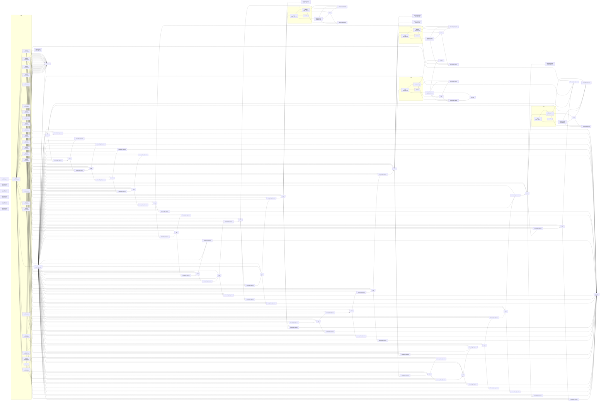

```mermaid
flowchart LR
  subgraph path2 [Path]
    2["Path<br>[1292, 1373, 0]"]
      %% [ProgramBodyItem { index: 14 }, VariableDeclarationDeclaration, VariableDeclarationInit, PipeBodyItem { index: 1 }]
    3["Segment<br>[1379, 1407, 0]"]
      %% [ProgramBodyItem { index: 14 }, VariableDeclarationDeclaration, VariableDeclarationInit, PipeBodyItem { index: 2 }]
    4["Segment<br>[1413, 1474, 0]"]
      %% [ProgramBodyItem { index: 14 }, VariableDeclarationDeclaration, VariableDeclarationInit, PipeBodyItem { index: 3 }]
    5["Segment<br>[1480, 1561, 0]"]
      %% [ProgramBodyItem { index: 14 }, VariableDeclarationDeclaration, VariableDeclarationInit, PipeBodyItem { index: 4 }]
    6["Segment<br>[1567, 1629, 0]"]
      %% [ProgramBodyItem { index: 14 }, VariableDeclarationDeclaration, VariableDeclarationInit, PipeBodyItem { index: 5 }]
    7["Segment<br>[1635, 1671, 0]"]
      %% [ProgramBodyItem { index: 14 }, VariableDeclarationDeclaration, VariableDeclarationInit, PipeBodyItem { index: 6 }]
    8["Segment<br>[1677, 1706, 0]"]
      %% [ProgramBodyItem { index: 14 }, VariableDeclarationDeclaration, VariableDeclarationInit, PipeBodyItem { index: 7 }]
    9["Segment<br>[1712, 1774, 0]"]
      %% [ProgramBodyItem { index: 14 }, VariableDeclarationDeclaration, VariableDeclarationInit, PipeBodyItem { index: 8 }]
    10["Segment<br>[1780, 1834, 0]"]
      %% [ProgramBodyItem { index: 14 }, VariableDeclarationDeclaration, VariableDeclarationInit, PipeBodyItem { index: 9 }]
    11["Segment<br>[1840, 1901, 0]"]
      %% [ProgramBodyItem { index: 14 }, VariableDeclarationDeclaration, VariableDeclarationInit, PipeBodyItem { index: 10 }]
    12["Segment<br>[1907, 1935, 0]"]
      %% [ProgramBodyItem { index: 14 }, VariableDeclarationDeclaration, VariableDeclarationInit, PipeBodyItem { index: 11 }]
    13["Segment<br>[1941, 1980, 0]"]
      %% [ProgramBodyItem { index: 14 }, VariableDeclarationDeclaration, VariableDeclarationInit, PipeBodyItem { index: 12 }]
    14["Segment<br>[1986, 2029, 0]"]
      %% [ProgramBodyItem { index: 14 }, VariableDeclarationDeclaration, VariableDeclarationInit, PipeBodyItem { index: 13 }]
    15["Segment<br>[2035, 2097, 0]"]
      %% [ProgramBodyItem { index: 14 }, VariableDeclarationDeclaration, VariableDeclarationInit, PipeBodyItem { index: 14 }]
    16["Segment<br>[2103, 2165, 0]"]
      %% [ProgramBodyItem { index: 14 }, VariableDeclarationDeclaration, VariableDeclarationInit, PipeBodyItem { index: 15 }]
    17["Segment<br>[2171, 2232, 0]"]
      %% [ProgramBodyItem { index: 14 }, VariableDeclarationDeclaration, VariableDeclarationInit, PipeBodyItem { index: 16 }]
    18["Segment<br>[2238, 2274, 0]"]
      %% [ProgramBodyItem { index: 14 }, VariableDeclarationDeclaration, VariableDeclarationInit, PipeBodyItem { index: 17 }]
    19["Segment<br>[2280, 2310, 0]"]
      %% [ProgramBodyItem { index: 14 }, VariableDeclarationDeclaration, VariableDeclarationInit, PipeBodyItem { index: 18 }]
    20["Segment<br>[2316, 2377, 0]"]
      %% [ProgramBodyItem { index: 14 }, VariableDeclarationDeclaration, VariableDeclarationInit, PipeBodyItem { index: 19 }]
    21["Segment<br>[2383, 2445, 0]"]
      %% [ProgramBodyItem { index: 14 }, VariableDeclarationDeclaration, VariableDeclarationInit, PipeBodyItem { index: 20 }]
    22["Segment<br>[2451, 2513, 0]"]
      %% [ProgramBodyItem { index: 14 }, VariableDeclarationDeclaration, VariableDeclarationInit, PipeBodyItem { index: 21 }]
    23["Segment<br>[2519, 2562, 0]"]
      %% [ProgramBodyItem { index: 14 }, VariableDeclarationDeclaration, VariableDeclarationInit, PipeBodyItem { index: 22 }]
    24["Segment<br>[2568, 2638, 0]"]
      %% [ProgramBodyItem { index: 14 }, VariableDeclarationDeclaration, VariableDeclarationInit, PipeBodyItem { index: 23 }]
    25["Segment<br>[2644, 2651, 0]"]
      %% [ProgramBodyItem { index: 14 }, VariableDeclarationDeclaration, VariableDeclarationInit, PipeBodyItem { index: 24 }]
    26[Solid2d]
  end
  subgraph path97 [Path]
    97["Path<br>[2990, 3079, 0]"]
      %% [ProgramBodyItem { index: 15 }, VariableDeclarationDeclaration, VariableDeclarationInit, PipeBodyItem { index: 1 }]
    98["Segment<br>[2990, 3079, 0]"]
      %% [ProgramBodyItem { index: 15 }, VariableDeclarationDeclaration, VariableDeclarationInit, PipeBodyItem { index: 1 }]
    99[Solid2d]
  end
  subgraph path105 [Path]
    105["Path<br>[3322, 3410, 0]"]
      %% [ProgramBodyItem { index: 16 }, VariableDeclarationDeclaration, VariableDeclarationInit, PipeBodyItem { index: 1 }]
    106["Segment<br>[3322, 3410, 0]"]
      %% [ProgramBodyItem { index: 16 }, VariableDeclarationDeclaration, VariableDeclarationInit, PipeBodyItem { index: 1 }]
    107[Solid2d]
  end
  subgraph path113 [Path]
    113["Path<br>[3660, 3840, 0]"]
      %% [ProgramBodyItem { index: 17 }, VariableDeclarationDeclaration, VariableDeclarationInit, PipeBodyItem { index: 1 }]
    114["Segment<br>[3660, 3840, 0]"]
      %% [ProgramBodyItem { index: 17 }, VariableDeclarationDeclaration, VariableDeclarationInit, PipeBodyItem { index: 1 }]
    115[Solid2d]
  end
  subgraph path123 [Path]
    123["Path<br>[4185, 4241, 0]"]
      %% [ProgramBodyItem { index: 18 }, VariableDeclarationDeclaration, VariableDeclarationInit, PipeBodyItem { index: 1 }]
    124["Segment<br>[4185, 4241, 0]"]
      %% [ProgramBodyItem { index: 18 }, VariableDeclarationDeclaration, VariableDeclarationInit, PipeBodyItem { index: 1 }]
    125[Solid2d]
  end
  1["Plane<br>[1269, 1286, 0]"]
    %% [ProgramBodyItem { index: 14 }, VariableDeclarationDeclaration, VariableDeclarationInit, PipeBodyItem { index: 0 }]
  27["Sweep Extrusion<br>[2657, 2690, 0]"]
    %% [ProgramBodyItem { index: 14 }, VariableDeclarationDeclaration, VariableDeclarationInit, PipeBodyItem { index: 25 }]
  28[Wall]
    %% face_code_ref=Missing NodePath
  29[Wall]
    %% face_code_ref=Missing NodePath
  30[Wall]
    %% face_code_ref=Missing NodePath
  31[Wall]
    %% face_code_ref=Missing NodePath
  32[Wall]
    %% face_code_ref=Missing NodePath
  33[Wall]
    %% face_code_ref=Missing NodePath
  34[Wall]
    %% face_code_ref=Missing NodePath
  35[Wall]
    %% face_code_ref=Missing NodePath
  36[Wall]
    %% face_code_ref=Missing NodePath
  37[Wall]
    %% face_code_ref=Missing NodePath
  38[Wall]
    %% face_code_ref=Missing NodePath
  39[Wall]
    %% face_code_ref=[ProgramBodyItem { index: 15 }, VariableDeclarationDeclaration, VariableDeclarationInit, PipeBodyItem { index: 0 }]
  40[Wall]
    %% face_code_ref=Missing NodePath
  41[Wall]
    %% face_code_ref=Missing NodePath
  42[Wall]
    %% face_code_ref=Missing NodePath
  43[Wall]
    %% face_code_ref=[ProgramBodyItem { index: 17 }, VariableDeclarationDeclaration, VariableDeclarationInit, PipeBodyItem { index: 0 }]
  44[Wall]
    %% face_code_ref=Missing NodePath
  45[Wall]
    %% face_code_ref=Missing NodePath
  46[Wall]
    %% face_code_ref=Missing NodePath
  47[Wall]
    %% face_code_ref=Missing NodePath
  48[Wall]
    %% face_code_ref=[ProgramBodyItem { index: 16 }, VariableDeclarationDeclaration, VariableDeclarationInit, PipeBodyItem { index: 0 }]
  49[Wall]
    %% face_code_ref=Missing NodePath
  50["Cap Start"]
    %% face_code_ref=Missing NodePath
  51["Cap End"]
    %% face_code_ref=Missing NodePath
  52["SweepEdge Opposite"]
  53["SweepEdge Adjacent"]
  54["SweepEdge Opposite"]
  55["SweepEdge Adjacent"]
  56["SweepEdge Opposite"]
  57["SweepEdge Adjacent"]
  58["SweepEdge Opposite"]
  59["SweepEdge Adjacent"]
  60["SweepEdge Opposite"]
  61["SweepEdge Adjacent"]
  62["SweepEdge Opposite"]
  63["SweepEdge Adjacent"]
  64["SweepEdge Opposite"]
  65["SweepEdge Adjacent"]
  66["SweepEdge Opposite"]
  67["SweepEdge Adjacent"]
  68["SweepEdge Opposite"]
  69["SweepEdge Adjacent"]
  70["SweepEdge Opposite"]
  71["SweepEdge Adjacent"]
  72["SweepEdge Opposite"]
  73["SweepEdge Adjacent"]
  74["SweepEdge Opposite"]
  75["SweepEdge Adjacent"]
  76["SweepEdge Opposite"]
  77["SweepEdge Adjacent"]
  78["SweepEdge Opposite"]
  79["SweepEdge Adjacent"]
  80["SweepEdge Opposite"]
  81["SweepEdge Adjacent"]
  82["SweepEdge Opposite"]
  83["SweepEdge Adjacent"]
  84["SweepEdge Opposite"]
  85["SweepEdge Adjacent"]
  86["SweepEdge Opposite"]
  87["SweepEdge Adjacent"]
  88["SweepEdge Opposite"]
  89["SweepEdge Adjacent"]
  90["SweepEdge Opposite"]
  91["SweepEdge Adjacent"]
  92["SweepEdge Opposite"]
  93["SweepEdge Adjacent"]
  94["SweepEdge Opposite"]
  95["SweepEdge Adjacent"]
  96["EdgeCut Fillet<br>[2696, 2867, 0]"]
    %% [ProgramBodyItem { index: 14 }, VariableDeclarationDeclaration, VariableDeclarationInit, PipeBodyItem { index: 26 }]
  100["Sweep Extrusion<br>[3169, 3197, 0]"]
    %% [ProgramBodyItem { index: 15 }, VariableDeclarationDeclaration, VariableDeclarationInit, PipeBodyItem { index: 3 }]
  101[Wall]
    %% face_code_ref=Missing NodePath
  102["SweepEdge Opposite"]
  103["SweepEdge Adjacent"]
  104["Sweep Extrusion<br>[3169, 3197, 0]"]
    %% [ProgramBodyItem { index: 15 }, VariableDeclarationDeclaration, VariableDeclarationInit, PipeBodyItem { index: 3 }]
  108["Sweep Extrusion<br>[3500, 3528, 0]"]
    %% [ProgramBodyItem { index: 16 }, VariableDeclarationDeclaration, VariableDeclarationInit, PipeBodyItem { index: 3 }]
  109[Wall]
    %% face_code_ref=Missing NodePath
  110["SweepEdge Opposite"]
  111["SweepEdge Adjacent"]
  112["Sweep Extrusion<br>[3500, 3528, 0]"]
    %% [ProgramBodyItem { index: 16 }, VariableDeclarationDeclaration, VariableDeclarationInit, PipeBodyItem { index: 3 }]
  116["Sweep Extrusion<br>[4016, 4044, 0]"]
    %% [ProgramBodyItem { index: 17 }, VariableDeclarationDeclaration, VariableDeclarationInit, PipeBodyItem { index: 4 }]
  117[Wall]
    %% face_code_ref=Missing NodePath
  118["SweepEdge Opposite"]
  119["SweepEdge Adjacent"]
  120["Sweep Extrusion<br>[4016, 4044, 0]"]
    %% [ProgramBodyItem { index: 17 }, VariableDeclarationDeclaration, VariableDeclarationInit, PipeBodyItem { index: 4 }]
  121["Sweep Extrusion<br>[4016, 4044, 0]"]
    %% [ProgramBodyItem { index: 17 }, VariableDeclarationDeclaration, VariableDeclarationInit, PipeBodyItem { index: 4 }]
  122["Sweep Extrusion<br>[4016, 4044, 0]"]
    %% [ProgramBodyItem { index: 17 }, VariableDeclarationDeclaration, VariableDeclarationInit, PipeBodyItem { index: 4 }]
  126["Sweep Extrusion<br>[4247, 4275, 0]"]
    %% [ProgramBodyItem { index: 18 }, VariableDeclarationDeclaration, VariableDeclarationInit, PipeBodyItem { index: 2 }]
  127[Wall]
    %% face_code_ref=Missing NodePath
  128["Cap Start"]
    %% face_code_ref=Missing NodePath
  129["Cap End"]
    %% face_code_ref=Missing NodePath
  130["SweepEdge Opposite"]
  131["SweepEdge Adjacent"]
  132["StartSketchOnFace<br>[2941, 2984, 0]"]
    %% [ProgramBodyItem { index: 15 }, VariableDeclarationDeclaration, VariableDeclarationInit, PipeBodyItem { index: 0 }]
  133["StartSketchOnFace<br>[3273, 3316, 0]"]
    %% [ProgramBodyItem { index: 16 }, VariableDeclarationDeclaration, VariableDeclarationInit, PipeBodyItem { index: 0 }]
  134["StartSketchOnFace<br>[3611, 3654, 0]"]
    %% [ProgramBodyItem { index: 17 }, VariableDeclarationDeclaration, VariableDeclarationInit, PipeBodyItem { index: 0 }]
  135["StartSketchOnFace<br>[4136, 4179, 0]"]
    %% [ProgramBodyItem { index: 18 }, VariableDeclarationDeclaration, VariableDeclarationInit, PipeBodyItem { index: 0 }]
  1 --- 2
  2 --- 3
  2 --- 4
  2 --- 5
  2 --- 6
  2 --- 7
  2 --- 8
  2 --- 9
  2 --- 10
  2 --- 11
  2 --- 12
  2 --- 13
  2 --- 14
  2 --- 15
  2 --- 16
  2 --- 17
  2 --- 18
  2 --- 19
  2 --- 20
  2 --- 21
  2 --- 22
  2 --- 23
  2 --- 24
  2 --- 25
  2 --- 26
  2 ---- 27
  3 --- 28
  3 x--> 50
  3 --- 52
  3 --- 53
  4 --- 29
  4 x--> 50
  4 --- 54
  4 --- 55
  5 --- 30
  5 x--> 50
  5 --- 56
  5 --- 57
  6 --- 31
  6 x--> 50
  6 --- 58
  6 --- 59
  7 --- 32
  7 x--> 50
  7 --- 60
  7 --- 61
  8 --- 33
  8 x--> 50
  8 --- 62
  8 --- 63
  9 --- 34
  9 x--> 50
  9 --- 64
  9 --- 65
  10 --- 35
  10 x--> 50
  10 --- 66
  10 --- 67
  11 --- 36
  11 x--> 50
  11 --- 68
  11 --- 69
  12 --- 37
  12 x--> 50
  12 --- 70
  12 --- 71
  13 --- 38
  13 x--> 50
  13 --- 72
  13 --- 73
  13 --- 96
  14 --- 39
  14 x--> 50
  14 --- 74
  14 --- 75
  15 --- 40
  15 x--> 50
  15 --- 76
  15 --- 77
  16 --- 41
  16 x--> 50
  16 --- 78
  16 --- 79
  17 --- 42
  17 x--> 50
  17 --- 80
  17 --- 81
  18 --- 43
  18 x--> 50
  18 --- 82
  18 --- 83
  19 --- 44
  19 x--> 50
  19 --- 84
  19 --- 85
  20 --- 45
  20 x--> 50
  20 --- 86
  20 --- 87
  21 --- 46
  21 x--> 50
  21 --- 88
  21 --- 89
  22 --- 47
  22 x--> 50
  22 --- 90
  22 --- 91
  23 --- 48
  23 x--> 50
  23 --- 92
  23 --- 93
  24 --- 49
  24 x--> 50
  24 --- 94
  24 --- 95
  27 --- 28
  27 --- 29
  27 --- 30
  27 --- 31
  27 --- 32
  27 --- 33
  27 --- 34
  27 --- 35
  27 --- 36
  27 --- 37
  27 --- 38
  27 --- 39
  27 --- 40
  27 --- 41
  27 --- 42
  27 --- 43
  27 --- 44
  27 --- 45
  27 --- 46
  27 --- 47
  27 --- 48
  27 --- 49
  27 --- 50
  27 --- 51
  27 --- 52
  27 --- 53
  27 --- 54
  27 --- 55
  27 --- 56
  27 --- 57
  27 --- 58
  27 --- 59
  27 --- 60
  27 --- 61
  27 --- 62
  27 --- 63
  27 --- 64
  27 --- 65
  27 --- 66
  27 --- 67
  27 --- 68
  27 --- 69
  27 --- 70
  27 --- 71
  27 --- 72
  27 --- 73
  27 --- 74
  27 --- 75
  27 --- 76
  27 --- 77
  27 --- 78
  27 --- 79
  27 --- 80
  27 --- 81
  27 --- 82
  27 --- 83
  27 --- 84
  27 --- 85
  27 --- 86
  27 --- 87
  27 --- 88
  27 --- 89
  27 --- 90
  27 --- 91
  27 --- 92
  27 --- 93
  27 --- 94
  27 --- 95
  28 --- 52
  28 --- 53
  95 <--x 28
  110 <--x 28
  53 <--x 29
  29 --- 54
  29 --- 55
  55 <--x 30
  30 --- 56
  30 --- 57
  57 <--x 31
  31 --- 58
  31 --- 59
  59 <--x 32
  32 --- 60
  32 --- 61
  61 <--x 33
  33 --- 62
  33 --- 63
  118 <--x 33
  63 <--x 34
  34 --- 64
  34 --- 65
  65 <--x 35
  35 --- 66
  35 --- 67
  67 <--x 36
  36 --- 68
  36 --- 69
  69 <--x 37
  37 --- 70
  37 --- 71
  102 <--x 37
  71 <--x 38
  38 --- 72
  38 --- 73
  73 <--x 39
  39 --- 74
  39 --- 75
  39 --- 97
  98 <--x 39
  39 <--x 132
  75 <--x 40
  40 --- 76
  40 --- 77
  77 <--x 41
  41 --- 78
  41 --- 79
  79 <--x 42
  42 --- 80
  42 --- 81
  81 <--x 43
  43 --- 82
  43 --- 83
  43 --- 113
  114 <--x 43
  43 --- 123
  43 <--x 134
  43 <--x 135
  83 <--x 44
  44 --- 84
  44 --- 85
  85 <--x 45
  45 --- 86
  45 --- 87
  87 <--x 46
  46 --- 88
  46 --- 89
  89 <--x 47
  47 --- 90
  47 --- 91
  91 <--x 48
  48 --- 92
  48 --- 93
  48 --- 105
  106 <--x 48
  48 <--x 133
  93 <--x 49
  49 --- 94
  49 --- 95
  52 <--x 51
  54 <--x 51
  56 <--x 51
  58 <--x 51
  60 <--x 51
  62 <--x 51
  64 <--x 51
  66 <--x 51
  68 <--x 51
  70 <--x 51
  72 <--x 51
  74 <--x 51
  76 <--x 51
  78 <--x 51
  80 <--x 51
  82 <--x 51
  84 <--x 51
  86 <--x 51
  88 <--x 51
  90 <--x 51
  92 <--x 51
  94 <--x 51
  97 --- 98
  97 --- 99
  97 ---- 100
  98 --- 101
  98 --- 102
  98 --- 103
  100 --- 101
  100 --- 102
  100 --- 103
  101 --- 102
  101 --- 103
  105 --- 106
  105 --- 107
  105 ---- 108
  106 --- 109
  106 --- 110
  106 --- 111
  108 --- 109
  108 --- 110
  108 --- 111
  109 --- 110
  109 --- 111
  113 --- 114
  113 --- 115
  113 ---- 116
  114 --- 117
  114 --- 118
  114 --- 119
  116 --- 117
  116 --- 118
  116 --- 119
  117 --- 118
  117 --- 119
  123 --- 124
  123 --- 125
  123 ---- 126
  124 --- 127
  124 x--> 129
  124 --- 130
  124 --- 131
  126 --- 127
  126 --- 128
  126 --- 129
  126 --- 130
  126 --- 131
  127 --- 130
  127 --- 131
  130 <--x 128
```
